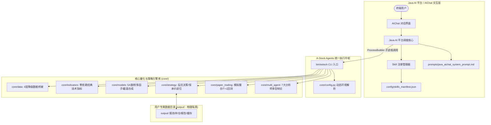

# A-Stock Agents — A股全流程量化投研智能体

[](#)
[](#)
[](#)
[](#)
[](#)

**A-Stock Agents** 是一套高内聚、自包含、生产就绪的 **A股全流程量化投研、多智能体协同研判与实战反应决策系统**。
专为独立服务器部署、量化实战交易以及**自建 Java AI 平台（基于 Spring AI / LangChain4j / 自定义 Agent 框架）**提供开箱即用的量化分析、风控执行与自然语言 AIChat 交互能力。

---

## 📑 目录
- [一、架构全景图](#一架构全景图)
- [二、核心功能与 16 大智能体技能体系](#二核心功能与-16-大智能体技能体系)
- [三、部署安装说明 (含 AI 平台专属接入指南)](#三部署安装说明-含-ai-平台专属接入指南)
- [四、使用说明与 CLI 指令速查](#四使用说明与-cli-指令速查)
- [五、用户专属数据隔离 (output/) 与安全更新](#五用户专属数据隔离-output-与安全更新)
- [六、开源协议评估与选型建议](#六开源协议评估与选型建议)
- [七、免责声明](#七免责声明)

---

## 一、架构全景图



---

## 二、核心功能与 16 大智能体技能体系

### 1. 六大量化与投研核心子系统
1. **4 级自动降级数据桥接 (`core/data`)**：
   - **L1 腾讯直连**：`qt.gtimg.cn` 毫秒级原生行情与日K线，零外部复杂库依赖。
   - **L2/L3 东财与新浪财经**：提供资金流向、行业板块分布、个股事件与历史复权数据。
   - **L4 本地离线缓存**：断网或源站故障时自动切换至本地缓存，确保服务高可用。
2. **零编译经典技术指标引擎 (`core/indicators`)**：
   - 纯 Python/NumPy 实现全套技术指标：MA（5/10/20/60/120/250）、MACD、KDJ、RSI、BOLL、ATR、跳空缺口分析、水下二次金叉底背离形态识别。
3. **5A 多维共振旋转选股与多因子模型 (`core/models`)**：
   - 结合动量、估值、质量、量价结构、主线轮动 5 个维度进行 100 分制综合打分。
   - 包含舆情因子指数半衰期衰减、MAD 去极值与 Z-Score 截面 Rank 因子合成流水线。
4. **实战交易反应动作与保本价进位引擎 (`core/strategy`)**：
   - **精确最低保本卖出价**：严格计入卖出印花税（0.05%）、券商佣金（万2.5且最低5元起收）、过户费，并**强制向上精确进位至分位（`math.ceil`）**，杜绝四舍五入导致的隐性亏损。
   - **三级风控止损线**：T0 警戒线（-3%）、T1 减仓线（-5%）、T2 绝杀线（-8%）。
   - **三场景即时动作单**：开盘冲高、盘中窄幅震荡、盘中急跌跳水场景化指令。
5. **7 大 AI 分析师多智能体协同辩论 (`core/multi_agent`)**：
   - 包含基本面、量价、消息舆情、宏观政策、游资情绪、筹码分布、首席风控官 7 大角色。
   - 展开多轮多空对抗辩论并生成决议报告。
6. **模拟盘撮合交易与事件驱动回测 (`core/paper_trading`)**：
   - 多账户独立资金管理、限价单/市价单撮合、撤单、A股 T+1 交易规则与涨跌停限制撮合。

---

### 2. 16 个标准化 Agent 技能清单

| 技能 ID | 技能名称 | 分类 | 核心能力描述 | CLI 快速入口 |
| :--- | :--- | :---: | :--- | :--- |
| **`a-share-data`** | A股全链路行情数据引擎 | 数据 | 实时行情快照、历史K线、全套技术指标、筹码分布与板块资金流 | `astock data quote <代码>` |
| **`a-stocks`** | 统一A股全流程投研平台 | 平台 | 4层降级、100分制综合评分、被套解套策略诊断、大盘健康度评估 | `astock evaluate <代码>` |
| **`5a-stock-rotation`** | 5A多维共振旋转选股 | 选股 | 动量/价值/质量/主线旋转多维评分模型与滚动样本外回测检验 | `astock screen 5a` |
| **`a-share-dashboard`** | 投研面板与股池管理 | 面板 | 关注池/自选池/持仓池生命周期管理、通达信公式同步、盘中预警 | `astock pool list` |
| **`a-share-paper-trading`** | 模拟盘与撮合系统 | 交易 | 多账户模拟仓、限价单/市价单撮合、撤单、持仓资金查询与回测 | `astock trade balance` |
| **`a-share-strategy-mainboard`** | 主板流动性池多波段防御 | 策略 | 主板流动性池趋势回踩（trend_pullback）与波段防守反击决策 | `astock strategy swing` |
| **`ashare-quant-engine`** | 工业级量化工程引擎 | 量化 | 截面因子提取、舆情半衰期衰减、MAD去极值、凯利仓位与ATR止损 | `astock quant pipeline` |
| **`ta-multi-agent-analysis`** | 7大AI分析师多空辩论 | 智能体 | 基本面/量价/消息/政策/游资/筹码/风控 7 大智能体辩论与研报 | `astock debate <代码>` |
| **`tuige-shortline-trading`** | 退哥短线交易规则体系 | 策略 | 涨停回调、连板接力、洗盘突破、失效卖点与仓位纪律规则库 | `astock shortline check` |
| **`macd-second-golden-cross`** | 水下二次金叉与底背离 | 策略 | 水下二次金叉、双底回踩验底、MACD底背离形态识别与决策清单 | `astock pattern macd <代码>` |
| **`execution-action-engine`** | 实战反应动作与保本价 | 策略 | 最低保本卖出价精确进位、T0/T1/T2三级止损与三场景即时反应指令 | `astock action plan` |
| **`a-share-pool-audit`** | 三大股池统一审查 | 股池 | 统一审查股池、重算均线支撑阻力位、清洗过期失效标的 | `astock pool audit` |
| **`a-stock-reporting`** | 报告持久化规范 | 报告 | 多股联合报告输出路径规范与数据持久化存储结构标准 | `astock report generate` |
| **`stock-report-html`** | 标准HTML交互报告规范 | 报告 | 亚光白背景、红涨绿跌、1344px居中单文件自包含 HTML 报告样式 | `astock report html` |
| **`a-stock-session-tips`** | 避坑指南与实战技巧 | 知识 | 早盘竞价复盘、接口被封应对、数据源降级策略与历史经验技巧库 | `astock tips` |
| **`a-share-model-validation`** | 时序AI模型实证检验 | 验证 | 外部时序 AI 基础模型（如 Kronos/TimesFM）滚动样本外回测规范 | `astock validate-model` |

---

## 三、部署安装说明 (含 AI 平台专属接入指南)

### 1. 人工常规安装部署

#### Linux / macOS
```bash
# 1. 进入项目目录
cd a_stock_agents

# 2. 赋予脚本执行权限并一键安装
chmod +x install.sh update.sh bin/astock
./install.sh

# 3. 运行就绪性自检
python verify.py
```

#### Windows (PowerShell)
```powershell
cd a_stock_agents
.\install.ps1
python verify.py
```

---

### 2. 自建 Java AI 平台 / Agent 接入安装指南 (给 AI 使用)

Java AI 平台（如基于 Spring AI、LangChain4j 或自定义 Agent 框架）通常具有 Skill 管理器与 Tool Function Calling 能力。以下为专为 AI 平台设计的标准化接入流程：

```
+-------------------------------------------------------------------------+
|                  Java AI 平台接入 A-Stock Agents 三步法                   |
+-------------------------------------------------------------------------+
|  步骤 1: 扫描并导入 config/skills_manifest.json 注册 Tool 元数据         |
|  步骤 2: Java 后端通过 ProcessBuilder 执行 ./bin/astock <cmd> --json   |
|  步骤 3: 注入 prompts/java_aichat_system_prompt.md 作为 AIChat 系统提示词 |
+-------------------------------------------------------------------------+
```

#### 步骤 1：技能注册清单解析
Java 平台启动时，读取 `config/skills_manifest.json`。该清单声明了 16 个技能的 ID、名称、触发词、推荐模型及调用指令格式：

```json
{
  "platform": "Java-AI-Platform-Compatible",
  "version": "v2",
  "total_skills": 16,
  "skills": [
    {
      "id": "a-share-data",
      "name": "a-share-data",
      "title": "A股全链路行情与技术指标数据引擎",
      "triggers": ["行情", "查股票", "现价", "K线", "技术指标", "MACD", "KDJ"],
      "cli_command": "astock data quote {code}",
      "skill_doc": "skills/a-share-data/SKILL.md"
    },
    ...
  ]
}
```

#### 步骤 2：Java ProcessBuilder 工具执行器实现
Java 平台将 `astock` 封装为一个通用工具，以 JSON 格式通信：

```java
package com.ai.platform.tools;

import java.io.File;
import java.nio.charset.StandardCharsets;
import java.util.ArrayList;
import java.util.List;

public class AStockTool {
    private final String projectRoot;

    public AStockTool(String projectRoot) {
        this.projectRoot = projectRoot;
    }

    /**
     * 执行 A-Stock Agents CLI 命令并返回 JSON 字符串
     * @param subCommands 子命令数组，例如 ["data", "quote", "600519"]
     * @return 标准 JSON 格式字符串
     */
    public String execute(List<String> subCommands) throws Exception {
        String cliPath = projectRoot + (isWindows() ? "/bin/astock.cmd" : "/bin/astock");
        
        List<String> fullCmd = new ArrayList<>();
        fullCmd.add(cliPath);
        fullCmd.addAll(subCommands);
        fullCmd.add("--json"); // 强制 JSON 输出

        ProcessBuilder pb = new ProcessBuilder(fullCmd);
        pb.directory(new File(projectRoot));
        pb.environment().put("A_STOCK_AGENTS_ROOT", projectRoot);
        pb.redirectErrorStream(false);

        Process process = pb.start();
        String jsonOutput = new String(process.getInputStream().readAllBytes(), StandardCharsets.UTF_8);
        int exitCode = process.waitFor();

        if (exitCode != 0) {
            String errorOutput = new String(process.getErrorStream().readAllBytes(), StandardCharsets.UTF_8);
            throw new RuntimeException("CLI execution failed: " + errorOutput);
        }
        return jsonOutput.trim();
    }

    private boolean isWindows() {
        return System.getProperty("os.name").toLowerCase().contains("win");
    }
}
```

#### 步骤 3：AIChat 系统提示词接入
直接将 [`prompts/java_aichat_system_prompt.md`](file:///c:/Users/cvdnn/coding/a_stock_agents/prompts/java_aichat_system_prompt.md) 设置为 AIChat 对话的 System Message，大模型即可具备：
1. **意图自动路由**：将用户的自然语言问题（如“帮我看下贵州茅台现在多少钱”、“分析一下这只股票能不能买”）自动识别并调用对应 CLI 工具。
2. **强制实战风控输出**：输出时自动计算保本价、三级止损线（-3% / -5% / -8%）与三场景即时反应动作。

---

## 四、使用说明与 CLI 指令速查

所有 CLI 命令均原生支持 `--json` 参数，便于程序解析。

### 1. 实时行情快照 (Quote)
```bash
# 查询单只股票
./bin/astock data quote 600519

# 批量查询股票 (输出 JSON)
./bin/astock data quote 600519 000858 sz002594 --json
```

### 2. 技术指标计算 (Technical Indicators)
```bash
# 计算均线、MACD、KDJ、RSI、BOLL、ATR及水下二次金叉信号
./bin/astock data tech 600519 --count 120 --json
```

### 3. 多因子量化评分与个股诊断 (Evaluate)
```bash
# 100 分制多维度综合打分诊断
./bin/astock evaluate 600519 --json
```

### 4. 反应动作单与最低保本卖出价计算 (Action Plan)
```bash
# 计算买入成本 1250 元、100 股的精确最低保本卖出价与盘中三场景动作
./bin/astock action plan --code 600519 --cost 1250.00 --shares 100 --json
```

### 5. 查看所有已注册技能 (Skills List)
```bash
./bin/astock skill list --json
```

---

## 五、用户专属数据隔离 (output/) 与安全更新

### 1. 专属数据目录规范 (`output/`)
为了防止个人持仓、交易记录和私人报告在项目版本打包或共享时发生数据泄露，系统设计了 **`output/` 专属目录隔离机制**：

```
output/
├── pools/             # 个人自选池、关注池、持仓池 CSV (含 .example 模板)
├── positions/         # 个人持仓档案与实盘交易明细记录
├── reports/           # 个股研报、多股联合报告与复盘 HTML
├── cache/             # 个人运算与盘中监控缓存
└── backtest/          # 个人策略回测日志
```

#### 外部磁盘挂载配置
在 [`config/config.yaml`](file:///c:/Users/cvdnn/coding/a_stock_agents/config/config.yaml) 中直接修改：
```yaml
paths:
  output_dir: "/var/data/astock_output" # Linux 独立数据盘
  # output_dir: "D:/astock_output"     # Windows 独立存储盘
```
或直接设置环境变量：`export A_STOCK_OUTPUT_DIR=/custom/data/path`。

---

### 2. 安全打包发布 (`bin/pack.py`)
执行打包时，打包工具**强制排除 `output/` 目录、实盘数据、`.venv` 与日志缓存**：
```bash
# 自动生成排除个人数据的纯净包 a_stock_agents_v2.zip (版本规则: v2, v3, v4...)
python bin/pack.py --tag v2
```

---

### 3. 安全热更新与防损回滚 (`bin/update.py`)
升级新版本时，自动保障用户已有数据 100% 完好：
```bash
# Linux / macOS 安全升级
./update.sh -from-zip a_stock_agents_v3.zip

# Windows PowerShell 安全升级
.\update.ps1 -from-zip a_stock_agents_v3.zip

# 手动备份当前数据快照
python bin/update.py --backup-only

# 异常时一键回滚
python bin/update.py --rollback backup_20260902_174003
```

---

## 六、开源协议评估与选型建议

针对 **A-Stock Agents** 涉及量化金融算法、交易策略、Agent 技能及自建 AI 平台集成的特性，对主流开源协议评估如下：

| 协议类型 | 商业友好度 | 衍生品闭源许可 | 专利授权保护 | 传染性 | 适用定位评估 |
| :--- | :---: | :---: | :---: | :---: | :--- |
| **Apache 2.0 (推荐)** | **极高** | **允许** | **包含明确专利授权** | 无 | **最适合企业与自建平台**：明确包含商业使用与专利保护条款，允许在商业 AI 平台中封装，防范专利纠纷。 |
| **MIT** | **极高** | **允许** | 简单说明 | 无 | **最轻量级**：权限极度宽松，适合极简开源，但缺乏细化专利授权保护。 |
| **AGPL v3** | 较低 | **严禁闭源** | 包含 | **极强 (网络传染)** | **强传染性**：只要在云端提供网络服务，就必须强制开源全部修改后的后端代码，对自建商业平台限制较大。 |
| **BSL / 商业双许可** | 适中 | 商业需授权 | 包含 | 可控 | **商业化收费**：非商业用途免费，企业级生产集成需购买商业授权。 |

### 📌 最终推荐结论：采用 **Apache License 2.0**
- **核心优势**：
  1. **专利保护完备**：具备完善的**专利授权与防御条款**，防止代码贡献者事后发起专利侵权诉讼。
  2. **企业商用友好**：允许自建 Java AI 平台将其作为私有基础设施进行二次开发与封装，**无强制开源后端业务代码的传染性风险**。
  3. **责任免除明确（No Warranty）**：对量化算法和交易决策提供标准免责保护，规避实盘投资引发的法律纠纷。

---

## 七、免责声明

1. 本项目所提供的所有量化算法、技术指标、5A 选股模型、实战决策建议及多智能体研判结论，**仅供金融投研学习、量化策略研究与技术验证使用，不构成任何实质性投资建议或交易推荐**。
2. 证券市场有风险，投资决策需建立在独立思考与专业判断之上。用户依据本项目提供的数据、策略或模型进行的任何实盘交易操作，其盈亏风险由使用者自行完全承担。
