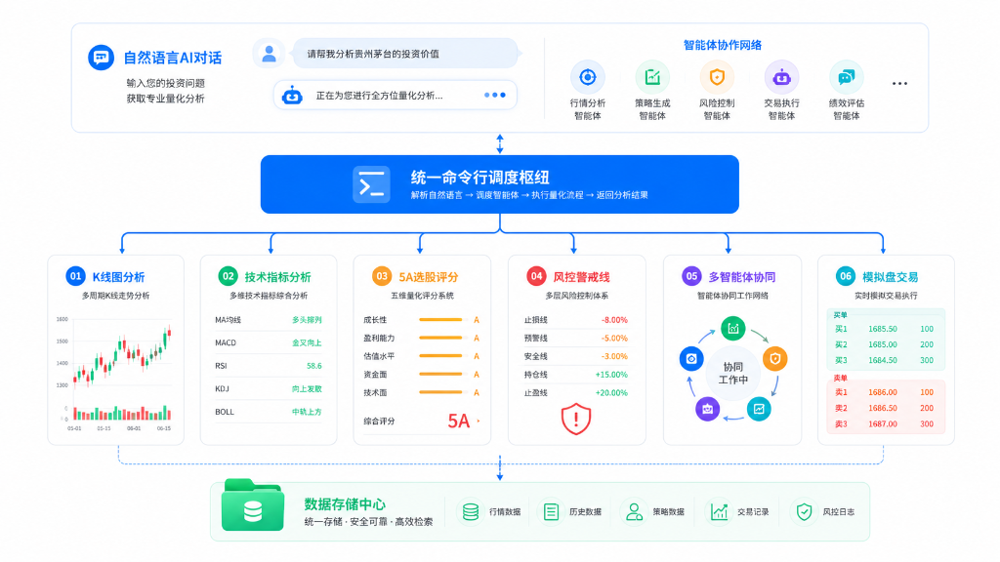

# A-Stock Agents — A股全流程量化投研智能体

[](#)
[](#)
[](#)
[](#)
[](#)

**A-Stock Agents** 是一套高内聚、自包含、生产就绪的 **A股全流程量化投研、多智能体协同研判与实战反应决策系统**。
专为独立服务器部署、量化实战交易以及**主流 AI Agent 平台（Google Antigravity、Hermes Agent、OpenAI Codex、Claude Code 等）**提供开箱即用的量化分析、风控执行与自然语言 AIChat 交互能力。

---

## 📑 目录
- [一、架构全景图](#一架构全景图)
- [二、核心功能与 17 大智能体技能体系（6+1 分层架构）](#二核心功能与-17-大智能体技能体系61-分层架构)
- [三、环境准备与常规安装](#三环境准备与常规安装)
- [四、第三方 AI 平台与工具使用指南 (Antigravity / Hermes / Codex 等)](#四第三方-ai-平台与工具使用指南-antigravity--hermes--codex-等)
- [五、CLI 实战命令速查与使用说明](#五cli-实战命令速查与使用说明)
- [六、用户专属数据隔离 (output/)、安全打包与热更新](#六用户专属数据隔离-output-安全打包与热更新)
- [七、项目技术文档体系](#七项目技术文档体系)
- [八、免责声明](#八免责声明)

---

## 一、架构全景图

<div align="center">
  
</div>

---

## 二、核心功能与 17 大智能体技能体系（6+1 分层架构）

### 1. 七大量化与投研核心子系统
1. **4 级自动降级数据桥接 (`core/data`)**：
   - **L1 腾讯直连**：`qt.gtimg.cn` 毫秒级原生行情与日K线，零外部复杂库依赖。
   - **L2/L3 东财与新浪财经**：提供资金流向、行业板块分布、个股事件与历史复权数据。
   - **L4 本地离线缓存**：断网或源站故障时自动切换至本地缓存，确保服务高可用。
2. **零编译经典技术指标引擎 (`core/indicators`)**：
   - 纯 Python/NumPy 实现全套技术指标：MA（5/10/20/60/120/250）、MACD、KDJ、RSI、BOLL、ATR、跳空缺口分析。
   - **波段级 MACD 底背离与水下二次金叉识别**：增加波段最小间隔过滤与波谷极值（Local Minima）对比，剔除震荡毛刺。
   - **换手率沉淀筹码模型 (Volume-by-Price)**：基于真实/估算换手率迭代衰减计算存量筹码分布加权成本与获利盘比例。
3. **5A 多维共振旋转选股与多因子模型 (`core/models`)**：
   - 结合动量、估值、质量、量价结构、主线轮动 5 个维度进行 100 分制综合打分。
   - 包含舆情因子指数半衰期衰减、MAD 去极值与 Z-Score 截面 Rank 因子合成流水线。
   - **市场机制自适应加权**：支持牛市（BULL）、震荡轮动（OSCILLATION）、熊市超跌（BEAR）专属权重模式及基于滚动 IC 的动态自适应加权。
4. **实战交易反应动作与保本价进位引擎 (`core/strategy`)**：
   - **精确最低保本卖出价**：严格计入卖出印花税（0.05%）、券商佣金（万2.5且最低5元起收）、过户费，并**强制向上精确进位至分位（`math.ceil`）**，杜绝四舍五入导致的隐性亏损。
   - **三级风控止损线**：T0 警戒线（-3%）、T1 减仓线（-5%）、T2 绝杀线（-8%）。
   - **三场景即时动作单**：开盘冲高、盘中窄幅震荡、盘中急跌跳水场景化指令。
5. **7 大 AI 分析师多智能体协同辩论 (`core/multi_agent`)**：
   - 包含基本面、量价、消息舆情、宏观政策、游资情绪、筹码分布、首席风控官 7 大角色。
   - 展开多轮多空对抗辩论并生成决议报告。
6. **模拟盘撮合交易与事件驱动回测 (`core/paper_trading`)**：
   - 多账户独立资金管理、限价单/市价单撮合、撤单、A股 T+1 交易规则与涨跌停限制撮合。
   - **平方根市场冲击滑点模型**：集成 Almgren-Chriss 理论，依据订单规模占日成交量比例自适应计算大额冲击滑点。
7. **统一算法注册中心与全生命周期治理体系 (`core/models` · `AlgoRegistry 2.0` / ALCM)**：
   - **40+ 项算法资产全量纳管**：涵盖基础指标、形态因子、多维评分模型、交易策略、仓位风控、撮合与绩效度量 7 大族群，双轨支持函数直接调用与类工厂实例化，100% 完全向下兼容。
   - **四道全生命周期质量门禁 (`AlgorithmQualityGate`)**：
     - **G1 研发合规门禁**：静态 AST 扫描 + 动态时序扰动探针（`LookaheadGuard`，彻底排查未来函数泄漏）；A股 T+1 规则、一字板涨跌停封死买卖违规与停牌撮合硬约束审计（`AShareComplianceGuard`）。
     - **G2 效能防过拟合门禁**：样本外表现衰减率检验（OOS Decay $\le 35\%$）与 Marcos López de Prado 经典的 Deflated Sharpe Ratio (DSR) 虚假夏普校准（`OverfittingGuard`）。
   - **生产监控与智能自适应调度**：
     - **`AlphaDecayTracker`**：横截面 Spearman Rank IC 滚动跟踪、IC_IR 与 Alpha 衰减预警。
     - **`RegimeAdaptiveDispatcher`**：联动大盘牛/熊/震荡机制，自适应切换因子合成权重、主力策略路由与组合仓位上限（85% / 50% / 20%）。
     - **`AlgorithmLifecycleManager`**：全生命周期状态流转机与实盘最大回撤超预期自动退市熔断器。

---

### 2. 17 个标准化 Agent 技能清单 (6+1 现代分层架构)

| 技能 ID | 技能名称 | 分层 | 核心能力描述 | CLI 快速入口 |
| :--- | :--- | :---: | :--- | :--- |
| **`astock-data-feed`** | A股全链路行情数据引擎 | L1 数据 | 实时行情快照、历史K线、全套技术指标、筹码分布与板块资金流 | `astock data quote <代码>` |
| **`astock-platform-evaluate`** | 统一A股全流程投研平台 | L1 平台 | 4层降级、100分制综合评分、被套解套策略诊断、大盘健康度评估 | `astock evaluate <代码>` |
| **`astock-screener-5a`** | 5A多维共振旋转选股 | L2 选股 | 动量/价值/质量/主线旋转多维评分模型与滚动样本外回测检验 | `astock screen 5a` |
| **`astock-quant-engine`** | 工业级量化工程引擎 | L2 量化 | 截面因子提取、换手沉淀筹码模型、牛熊自适应加权、MAD去极值、凯利仓位与ATR止损 | `astock quant pipeline` |
| **`astock-model-validation`** | 时序AI模型实证检验 | L2 验证 | 外部时序 AI 基础模型（如 Kronos/TimesFM）滚动样本外回测规范 | `astock validate-model` |
| **`astock-action-execution`** | 实战反应动作与保本价 | L3 执行 | 最低保本卖出价精确进位、T0/T1/T2三级止损与三场景即时反应指令 | `astock action plan` |
| **`astock-strategy-mainboard`** | 主板流动性池多波段防御 | L3 策略 | 主板流动性池趋势回踩（trend_pullback）与波段防守反击决策 | `astock strategy swing` |
| **`astock-strategy-tuige`** | 退哥短线交易规则体系 | L3 策略 | 涨停回调、连板接力、洗盘突破、失效卖点与仓位纪律规则库 | `astock shortline check` |
| **`astock-strategy-macd`** | 水下二次金叉与底背离 | L3 策略 | 波谷极值对比、波段间距过滤、水下二次金叉、双底回踩、MACD底背离形态识别 | `astock pattern macd <代码>` |
| **`astock-pool-dashboard`** | 投研面板与股池管理 | L4 面板 | 关注池/自选池/持仓池生命周期管理、通达信公式同步、盘中预警 | `astock pool list` |
| **`astock-pool-audit`** | 三大股池统一审查 | L4 股池 | 统一审查股池、重算均线支撑阻力位、清洗过期失效标的 | `astock pool audit` |
| **`astock-trade-paper`** | 模拟盘与撮合系统 | L4 交易 | 多账户模拟仓、平方根市场冲击滑点、限价/市价单撮合、撤单与回测 | `astock trade balance` |
| **`astock-agent-debate`** | 7大AI分析师多空辩论 | L5 协同 | 基本面/量价/消息/政策/游资/筹码/风控 7 大智能体辩论与研报 | `astock debate <代码>` |
| **`astock-report-html`** | 标准HTML交互报告规范 | L6 展现 | 亚光白背景、红涨绿跌、1344px居中单文件自包含 HTML 报告样式 | `astock report html` |
| **`astock-report-archive`** | 报告持久化与归档规范 | L6 报告 | 多股联合报告输出路径规范与数据持久化存储结构标准 | `astock report generate` |
| **`astock-meta-routing`** | 股票任务模型路由规则 | L0 元系统 | flash纯分析 vs flash+execute_code编程/脚本执行路由规约 | `astock tips` |
| **`astock-knowledge-tips`** | 避坑指南与实战技巧 | L0 知识 | 早盘竞价复盘、接口被封应对、数据源降级策略与历史经验技巧库 | `astock tips` |

---

## 三、环境准备与常规安装

### 1. Linux / macOS
```bash
# 进入项目目录
cd a_stock_agents

# 赋予执行权限并一键安装
chmod +x install.sh update.sh bin/astock
./install.sh

# 运行自检
python verify.py
```

### 2. Windows (PowerShell)
```powershell
cd a_stock_agents
.\install.ps1
python verify.py
```

---

## 四、第三方 AI 平台与工具使用指南 (Antigravity / Hermes / Codex 等)

本项目原生支持 **项目级就地按需调用（In-Place Project Skills）**，**无需将技能文件复制或软链接至系统全局目录**，即可在主流 AI Agent 平台中开箱即用：

### 1. 核心使用模式：项目内就地按需调用（推荐 · 零污染）
- **工作区就地检索 (Workspace In-Place Discovery)**：
  - 当 AI Agent（如 Google Antigravity、Claude Code、OpenAI Codex、Cursor）在当前工作区中工作时，可直接就地读取项目内的 [`skills/<skill_id>/SKILL.md`](skills/) 获取专业领域策略指引。
  - AI 代理直接执行项目内的 CLI 工具：`./bin/astock <subcommand> --json` 完成量化运算与策略决策。
- **单一真理来源 (Single Source of Truth)**：
  - 所有技能代码、提示词与量化引擎均在项目内由 Git 统筹管理，任何修改即时生效，杜绝了多处复制带来的版本冲突。

---

### 2. 各主流 AI 平台接入指南

#### A. Google Antigravity / Gemini CLI
- **项目级使用模式**：
  - 将 `a_stock_agents` 作为工作区打开，Antigravity 可直接就地索引 `skills/*/SKILL.md`。
  - 对话中通过 `run_command` 直接调用 `./bin/astock <subcommand> --json` 获取结构化量化数据。
- **跨目录环境变量引用**（可选）：
  - 若在外部项目会话中调用，设置环境变量 `A_STOCK_AGENTS_ROOT=/path/to/a_stock_agents` 即可远程执行 `astock`。

#### B. Hermes Agent
- **路径直接挂载（免复制）**：
  - 在 Hermes 配置或启动会话时，直接将技能检索路径指向本项目的 `skills/` 目录（或配置环境变量 `A_STOCK_AGENTS_ROOT`）。
  - Hermes Agent 将自动按需读取对应技能的系统提示词（如 `macd-second-golden-cross`、`tuige-shortline-trading`），并通过子进程执行量化脚本。

#### C. OpenAI Codex / Copilot CLI / Claude Code
- **CLI 工具黑盒执行**：
  - 在大模型上下文或 Function Calling 工具定义中，直接将 `astock` 注册为量化分析工具：
  - **Tool Name**：`astock_quant_tool`
  - **Description**：`A-Stock quantitative CLI for market data, indicators, 5A rotation screener, and execution action engine.`
  - **Command**：`/path/to/a_stock_agents/bin/astock <command> --json`
- **Sub-Agent 协同派发**：
  - 主 Agent 可派发 `ta-multi-agent-analysis` 等子任务，直接复用项目内的 7 大分析师辩论框架。

#### D. AIChat 对话系统提示词 (通用)
- 将 [`prompts/aichat_system_prompt.md`](prompts/aichat_system_prompt.md) 设置为 AIChat 对话的 System Message，大模型即可具备：
  1. **自然语言自动意图路由**：根据用户输入自动提取股票代码并映射到对应技能。
  2. **强制实战风控输出**：输出建议时自动核算保本价、三级止损线（-3% / -5% / -8%）与三场景即时反应动作。

---

## 五、CLI 实战命令速查与使用说明

所有 CLI 命令均原生支持 `--json` 参数，便于程序解析。

### 1. 实时行情快照 (Quote)
```bash
# 查询单只股票
./bin/astock data quote 600519

# 批量查询股票 (输出 JSON)
./bin/astock data quote 600519 000858 sz002594 --json
```

### 2. 技术指标计算 (Technical Indicators)
```bash
# 计算均线、MACD、KDJ、RSI、BOLL、ATR及水下二次金叉信号
./bin/astock data tech 600519 --count 120 --json
```

### 3. 多因子量化评分与个股诊断 (Evaluate)
```bash
# 100 分制多维度综合打分诊断
./bin/astock evaluate 600519 --json
```

### 4. 反应动作单与最低保本卖出价计算 (Action Plan)
```bash
# 计算买入成本 1250 元、100 股的精确最低保本卖出价与盘中三场景动作
./bin/astock action plan --code 600519 --cost 1250.00 --shares 100 --json
```

### 5. 查看所有已注册技能 (Skills List)
```bash
./bin/astock skill list --json
```

### 6. Python 算法库与全生命周期治理 SDK 快速上手 (Python API)
项目提供现代化的 Python 算法治理与调度接口：
```python
from core.models import (
    AlgoRegistry,
    AlgorithmQualityGate,
    RegimeAdaptiveDispatcher,
    AlphaDecayTracker,
    get_algo,
    run_algo,
    list_algos,
)

# 1. 算法查询与工厂执行 (涵盖 40+ 项算法资产)
indicators = list_algos(category="indicator")
macd_fn = AlgoRegistry.get("macd")
strategy = AlgoRegistry.get("volatility_breakout")

# 2. 一键执行全生命周期质量门禁审计 (G1 合规 + G2 防过拟合)
report = AlgorithmQualityGate.audit_algorithm(
    name_or_func=strategy,
    sample_klines=sample_klines,
    trade_log=trade_records,
    in_sample_metrics=is_metrics,
    out_sample_metrics=oos_metrics,
    daily_returns=daily_returns_series,
)
print(f"门禁判定: {report.status.value}, 质控得分: {report.score}")
if not report.is_passed():
    print(f"阻断原因: {report.violations}")

# 3. 市场机制自适应调度 (牛市进攻/震荡轮动/熊市防御)
plan = RegimeAdaptiveDispatcher.dispatch("BULL")
print(f"建议总仓位: {plan.max_portfolio_weight*100}%, 主力策略: {plan.primary_strategies}")
```

---

## 六、用户专属数据隔离 (output/)、安全打包与热更新

### 1. 专属数据目录规范 (`output/`)
为了防止个人持仓、交易记录和私人报告在项目版本打包或共享时发生数据泄露，系统设计了 **`output/` 专属目录隔离机制**：

```
output/
├── pools/             # 个人自选池、关注池、持仓池 CSV (含 .example 模板)
├── positions/         # 个人持仓档案与实盘交易明细记录
├── reports/           # 个股研报、多股联合报告与复盘 HTML
├── cache/             # 个人运算与盘中监控缓存
└── backtest/          # 个人策略回测日志
```

#### 外部磁盘挂载配置
在 [`config/config.yaml`](config/config.yaml) 中直接修改：
```yaml
paths:
  output_dir: "/var/data/astock_output" # Linux 独立数据盘
  # output_dir: "D:/astock_output"     # Windows 独立存储盘
```
或直接设置环境变量：`export A_STOCK_OUTPUT_DIR=/custom/data/path`。

---

### 2. 安全打包发布 (`bin/pack.py`)
执行打包时，打包工具**强制排除 `output/` 目录、实盘数据、`.venv` 与日志缓存**：
```bash
# 自动生成排除个人数据的纯净包 a_stock_agents_v3.zip (版本规则: v2, v3, v4...)
python bin/pack.py --tag v3
```

---

### 3. 安全热更新与防损回滚 (`bin/update.py`)
升级新版本时，自动保障用户已有数据 100% 完好：
```bash
# Linux / macOS 安全升级
./update.sh -from-zip a_stock_agents_v3.zip

# Windows PowerShell 安全升级
.\update.ps1 -from-zip a_stock_agents_v3.zip

# 手动备份当前数据快照
python bin/update.py --backup-only

# 异常时一键回滚
python bin/update.py --rollback backup_20260902_174003
```

---

## 七、项目技术文档体系

本项目全量文档统一遵循**领域分层**与 **`kebab-case` 小写短横线**标准化命名规范：

| 领域分类 | 入口文件 | 核心说明 |
|---|---|---|
| **知识速查全景** | [`docs/index.md`](docs/index.md) | 系统导图、6大引擎与 17 技能架构速查 |
| **快速上手向导** | [`docs/quickstart.md`](docs/quickstart.md) | 环境安装、依赖配置、自检与核心命令演示 |
| **代码审查规范** | [`docs/guidelines/code-review.md`](docs/guidelines/code-review.md) | 代码质量基准、安全红线与审查报告 |
| **回归测试指南** | [`docs/guidelines/testing-guide.md`](docs/guidelines/testing-guide.md) | TDD 测试先行与临时用例即测即删铁律 |
| **命名与设计范式** | [`docs/guidelines/naming-conventions.md`](docs/guidelines/naming-conventions.md) | 源码/文档规范与模型演进四大范式 (SSOT) |
| **网关架构设计** | [`docs/design/token-gateway.md`](docs/design/token-gateway.md) | Token 链路安全网关与本地审计 Agent 架构 |
| **实战交易反应动作** | [`docs/trading/execution-manual.md`](docs/trading/execution-manual.md) | 六大实战反应动作与三场景即时动作单 |
| **最低保本价精算** | [`docs/trading/breakeven-rules.md`](docs/trading/breakeven-rules.md) | 覆盖印花税/佣金/过户费并向上进位至分位 |
| **算法全生命周期治理** | [`docs/guidelines/algorithm-governance.md`](docs/guidelines/algorithm-governance.md) | 44项算法全景清单、四道质量门禁规范与ALCM治理方案 |

---

## 八、免责声明

1. 本项目所提供的所有量化算法、技术指标、5A 选股模型、实战决策建议及多智能体研判结论，**仅供金融投研学习、量化策略研究与技术验证使用，不构成任何实质性投资建议或交易推荐**。
2. 证券市场有风险，投资决策需建立在独立思考与专业判断之上。用户依据本项目提供的数据、策略或模型进行的任何实盘交易操作，其盈亏风险由使用者自行完全承担。
