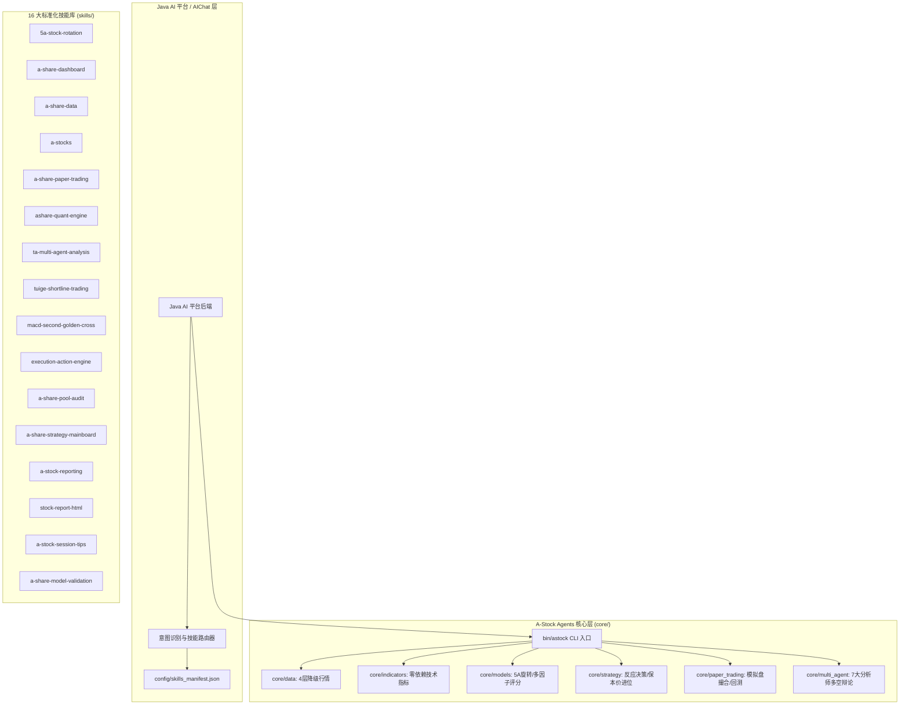

# A-Stock Agents (a_stock_agents) — A股全流程量化投研与多智能体系统

[](#)
[](#)
[](#)

本项目是一个高内聚、自包含、零复杂外部依赖的 **A股全流程量化投研、多智能体协同研判与实战反应决策体系**。
专为在独立服务器及**自建 Java AI 平台（Spring AI / LangChain4j / Custom Agent）**中一键部署与调用设计。

---

## 🌟 核心特性与架构



---

## 📁 项目目录结构

```
a_stock_agents/
├── README.md                          # 项目全景说明与集成文档
├── requirements.txt                   # 精简无冲突依赖清单
├── pyproject.toml                     # 项目元数据与打包配置
├── install.sh                         # Linux/Unix 一键自动部署安装脚本
├── install.ps1                        # Windows 一键自动部署安装脚本
├── verify.py                          # 全模块自动化自检套件
├── bin/                               # CLI 快速启动器
│   ├── astock                         # Linux/macOS CLI 执行器
│   ├── astock.cmd                     # Windows CLI 执行器
│   └── run_skill.py                   # 技能执行器
├── config/                            # 全局配置与技能注册表
│   ├── config.yaml                    # 全局量化与市场参数配置
│   ├── skills_manifest.json           # 供 Java 平台导入的 16 个技能元数据
│   └── skills_manifest.yaml           # YAML 格式技能元数据
├── core/                              # 核心通用量化与策略引擎库
│   ├── cli.py                         # 统一 CLI 核心命令行入口
│   ├── config.py                      # 动态路径解析与配置管理
│   ├── data/                          # 4级降级数据桥接 (腾讯直连/东财/新浪/缓存)
│   ├── indicators/                    # 零依赖技术指标 (MA/MACD/KDJ/RSI/BOLL/ATR)
│   ├── models/                        # 5A旋转/多因子/截面合成评分模型
│   ├── strategy/                      # 实战反应动作引擎/最低保本价精确进位
│   ├── paper_trading/                 # 模拟盘开户/撮合/回测引擎
│   ├── reporting/                     # HTML/Markdown 报告生成器
│   └── multi_agent/                   # 7大AI分析师多智能体研判系统
├── skills/                            # 16 个标准 Agent 技能目录
├── prompts/                           # 提示词库与 Java AIChat 系统提示词
│   ├── java_aichat_system_prompt.md   # Java AI平台主对话系统提示词
│   ├── multi_agent_analysts/          # 7大分析师专属提示词
│   ├── trapped_diagnostic_prompts.md  # 持仓诊断与被套解套提示词
│   └── trading_action_prompts.md      # 盘中反应与买卖执行提示词
├── docs/                              # 实战手册与规范
│   ├── A股实战交易反应动作与量化决策手册.md
│   ├── 最低保本价精确进位规则.md
│   ├── java_ai_platform_integration.md # Java平台技能集成与接口调用规范
│   └── quickstart_guide.md            # 快速上手指南
└── tests/                             # 自动化单元测试套件
```

---

## 🚀 快速开始与一键安装

### 1. 一键部署

#### Linux / macOS
```bash
cd a_stock_agents
chmod +x install.sh bin/astock
./install.sh
```

#### Windows (PowerShell)
```powershell
cd a_stock_agents
.\install.ps1
```

### 2. 运行自检
```bash
python verify.py
```
全部 6 项核心能力测试通过即表示系统完全就绪。

---

## 💻 CLI 常用命令

所有命令均支持追加 `--json` 参数以输出标准 JSON 格式：

```bash
# 1. 批量查询实时行情
./bin/astock data quote 600519 000858 --json

# 2. 计算股票经典技术指标 (MA/MACD/KDJ/RSI/BOLL/水下二次金叉)
./bin/astock data tech 600519 --json

# 3. 对个股进行 100 分制多维度综合量化打分
./bin/astock evaluate 600519

# 4. 生成持仓精确最低保本卖出价与盘中三场景动作单
./bin/astock action plan --code 600519 --cost 1250 --shares 100

# 5. 查看已注册的 16 个 A股 技能清单
./bin/astock skill list
```

---

## ☕ 自建 Java AI 平台集成方案

1. **自动注册 Skill**：Java 平台启动时读取 `config/skills_manifest.json`，将 16 个技能自动注册到 Tool 库或 Agent 调度器中。
2. **命令执行**：Java 后端通过 `ProcessBuilder` 调用 `./bin/astock <command> --json` 获取 JSON 结果。
3. **AIChat 系统提示词**：将 `prompts/java_aichat_system_prompt.md` 注入大模型上下文，实现自然语言智能意图识别与操作建议。

---

## 📜 许可证与免责声明
本项目仅供投研与量化学习交流使用，不构成任何直接投资建议。入市有风险，投资需谨慎。
