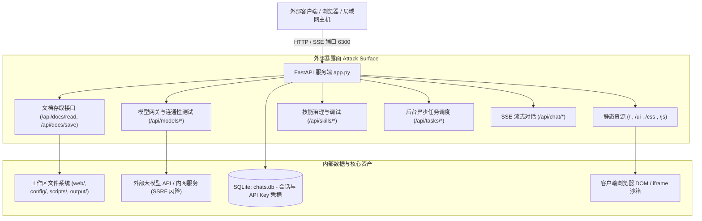

# A-Stock Agents 渗透测试与安全审计报告 (2026-09-14)

> **目标系统**：A-Stock Agents 智能体投研与交易平台 Web 服务  
> **测试目标地址**：`http://127.0.0.1:6300/`  
> **审计日期**：2026-09-14  
> **审计类型**：白盒代码审计与端点安全渗透测试 (White-Box Security Audit & Endpoint Penetration Assessment)  
> **安全基准**：OWASP Top 10 (2021)、CWE/SANS TOP 25、Docker 生产安全基线  
> **总体评估结论**：🔴 **高危 (High Risk)** — 发现 3 项高危漏洞、3 项中危漏洞与 2 项低危风险，建议立即执行加固整改。

---

## 一、系统架构与攻击面分析 (Attack Surface Mapping)

目标系统部署于本地或容器环境，通过单一端口 `6300` 承载前端静态交互看板、SSE 实时流式响应网关、文档存取引擎及后端 Agent/模型治理接口：



---

## 二、漏洞评级矩阵与全景清单 (Vulnerability Matrix)

| 漏洞编号 | 漏洞名称与类别 | CWE 编号 | CVSS 3.1 评分 | 危险等级 | 影响组件与位置 |
| :--- | :--- | :--- | :--- | :--- | :--- |
| **SEC-01** | 工作区任意文件覆写与持久化篡改 | CWE-22 / CWE-434 | 8.6 | 🔴 高危 (High) | `scripts/server/app.py:169` (`/api/docs/save`) |
| **SEC-02** | Docker 端口暴露与 API 完全未鉴权访问 | CWE-306 / CWE-284 | 8.2 | 🔴 高危 (High) | `docker-compose.yml:13`, `scripts/server/app.py` |
| **SEC-03** | 研报 iframe 沙箱同源隔离失效 | CWE-1021 / CWE-79 | 7.8 | 🔴 高危 (High) | `web/index.html:542` (`workspaceHtmlFrame`) |
| **SEC-04** | 前端 DOMPurify 放行 `onclick` 事件与脆弱正则 | CWE-79 (XSS) | 6.8 | 🟡 中危 (Medium) | `web/js/chat_presentation.js:341-353` |
| **SEC-05** | 模型连通性测试 DNS 重新绑定与域名 SSRF | CWE-918 (SSRF) | 6.5 | 🟡 中危 (Medium) | `scripts/server/api/models_mgmt.py:106-156` |
| **SEC-06** | `/api/docs/read` 源码与敏感配置任意读取 | CWE-200 / CWE-538 | 6.1 | 🟡 中危 (Medium) | `scripts/server/app.py:91` (`/api/docs/read`) |
| **SEC-07** | SQLite 数据库中大模型 API Key 明文存储 | CWE-312 / CWE-313 | 4.9 | 🟢 低危 (Low) | `scripts/server/db.py:131,950` |
| **SEC-08** | 报告生成底层工具路径未强制沙箱化 | CWE-73 | 4.3 | 🟢 低危 (Low) | `scripts/core/reporting/report_generator.py` |

---

## 三、深度漏洞技术细节与成因分析

### 1. SEC-01: 工作区任意文件覆写与篡改 (CWE-22 / CWE-434)
- **受影响接口**：`POST /api/docs/save`
- **代码位置**：`scripts/server/app.py:169-239`
- **漏洞成因**：
  在 `save_workspace_doc` 逻辑中，虽然存在 `target_file.relative_to(workspace_root)` 防跨越到工作区外部，但由于允许了 `.html`、`.json`、`.txt` 等后缀，且未对相对子目录做限制。当调用者传入包含多级相对路径的合法文件名（如 `web/index.html`）时：
  ```python
  clean_p = Path(clean_path)
  elif not clean_p.is_absolute():
      target_file = (workspace_root / clean_p).resolve()
  ...
  target_file.write_text(content_to_save, encoding="utf-8")
  ```
  此时 `target_file` 解析为 `web/index.html`，不仅完全属于工作区内，而且扩展名在白名单内，导致任意攻击者可直接篡改前端入口页面，植入持久化恶意脚本（Stored XSS）或恶意钓鱼内容。
- **潜在危害**：Web 门户页面遭恶意篡改、配置被覆盖破坏。

---

### 2. SEC-02: Docker 容器端口默认绑定全网卡与 API 未授权访问 (CWE-306)
- **受影响组件**：`docker-compose.yml`, `scripts/server/app.py`
- **代码位置**：`docker-compose.yml:13` (`ports: - "${A_STOCK_SERVER_PORT:-6300}:6300"`)
- **漏洞成因**：
  在 Docker 默认配置下，`6300:6300` 会直接监听在宿主机的 `0.0.0.0:6300`。若该机器位于多机局域网或具有公网 IP，外部网络均可直接建立连接。与此同时，FastAPI 后端所有核心控制端点（包括会话历史管理、模型测试、模拟盘买入/卖出下单调试 `/api/skills/astock-trade-paper/test`、后台任务提交等）均无任何身份鉴权（No Token / No Session Authentication），造成全量功能未授权访问。
- **潜在危害**：未经授权触发模拟交易下单、窥探用户投研历史与持仓画像、滥用大模型算力资源。

---

### 3. SEC-03: 研报展示 iframe 沙箱配置同源隔离失效 (CWE-1021)
- **受影响组件**：`web/index.html`
- **代码位置**：`web/index.html:542`
- **漏洞成因**：
  前端研报与可视化展示采用 iframe 呈现，其沙箱属性声明为：
  ```html
  <iframe class="workspace-html-frame" id="workspaceHtmlFrame" 
          sandbox="allow-scripts allow-same-origin allow-popups" title="HTML 可视化研报"></iframe>
  ```
  根据 W3C HTML5 安全标准规范：**当 `sandbox` 同时包含 `allow-scripts` 与 `allow-same-origin` 时，沙箱隔离实质上被完全破坏**。iframe 内部代码具有同源执行权限，能够通过 `window.parent` 访问宿主窗口的 DOM 对象、获取 `localStorage` 中的配置与状态，甚至接管父页面的网络交互。
- **潜在危害**：一旦载入被 Prompt 注入构造的恶意 HTML 研报，页面将遭受宿主上下文接管攻击。

---

### 4. SEC-04: DOMPurify 白名单放行 `onclick` 事件与正则兜底残缺 (CWE-79)
- **受影响组件**：`web/js/chat_presentation.js`
- **代码位置**：`web/js/chat_presentation.js:341-353`
- **漏洞成因**：
  1. 净化配置中显式将原生事件属性放入白名单：
     ```javascript
     return purifyLib.sanitize(rawHtml, {
       ADD_TAGS: ['button'],
       ADD_ATTR: ['target', 'onclick', 'title', 'type', 'class']
     });
     ```
     DOMPurify 原生出于安全阻断了所有 `on*` 事件，但此处显式加入 `'onclick'`，导致 LLM 生成的 Markdown 只要包含 `<button onclick="...">` 即可执行任意 JavaScript 代码。
  2. 当 DOMPurify 加载失败进入 fallback 分支时，采用不完整的黑名单正则：
     ```javascript
     return String(rawHtml)
       .replace(/<script\b[^<]*(?:(?!<\/script>)<[^<]*)*<\/script>/gi, '')
       .replace(/<([^>]+)\s+onerror\s*=\s*(?:'[^']*'|"[^"]*"|[^\s>]+)/gi, '<$1')
       .replace(/<([^>]+)\s+onload\s*=\s*(?:'[^']*'|"[^"]*"|[^\s>]+)/gi, '<$1')
       .replace(/href\s*=\s*["']?\s*javascript:[^"'>]*/gi, 'href="#"');
     ```
     该黑名单仅过滤了 `onerror`/`onload`，对 `onmouseover`、`onfocus`、`onloadstart`、`svg/onload`、`details/ontoggle` 等向量完全放行。
- **潜在危害**：诱发存储型/反射型 XSS，窃取前端凭据或触发未预期 API 动作。

---

### 5. SEC-05: 大模型管理端点 DNS 重新绑定与私网域名绕过 SSRF (CWE-918)
- **受影响组件**：`scripts/server/api/models_mgmt.py`
- **代码位置**：`scripts/server/api/models_mgmt.py:106-156`
- **漏洞成因**：
  URL 校验函数 `_validated_models_url` 与 `_validated_chat_url` 尝试通过 `ipaddress.ip_address(hostname)` 拦截内网 IP。但当调用方提供的是域名而非字面量 IP 时（例如指向内网的私有域名、动态 DNS 服务如 `127.0.0.1.nip.io` 或云服务元数据探测域名），代码触发 `ValueError` 导致 `address = None`，从而绕过了全部私网检查逻辑，后端直接使用 `httpx` 发起探测请求。
- **潜在危害**：内网端口探测、云服务器元数据泄露（如 AWS IMDSv1、阿里云元数据服务等）。

---

### 6. SEC-06: `/api/docs/read` 跨目录源码与敏感配置任意读取 (CWE-200)
- **受影响接口**：`GET /api/docs/read`
- **代码位置**：`scripts/server/app.py:91-165`
- **漏洞成因**：
  接口白名单包含了 `.py` 与 `.json` 扩展名：
  ```python
  allowed_exts = {".md", ".markdown", ".txt", ".json", ".csv", ".py", ".html", ".htm"}
  ```
  且目标路径允许任意工作区内相对路径。测试验证调用：
  `GET /api/docs/read?path=scripts/server/app.py`
  服务端直接返回 200 响应及完整的 12344 字节 Python 核心源码。若攻击者请求 `config/` 下的配置信息或业务敏感代码，将实现全量源码脱裤。
- **潜在危害**：系统核心算法与架构信息泄露，为进一步攻击提供便利。

---

### 7. SEC-07: SQLite 数据库中 API Key 明文静态存储 (CWE-312)
- **受影响组件**：`scripts/server/db.py`
- **代码位置**：`scripts/server/db.py:131, 950`
- **漏洞成因**：
  `llm_providers` 表结构中 `api_key` 字段采用普通文本列 `api_key TEXT DEFAULT ''`，在存入和读取过程中未经任何加密或哈希混淆，直接明文落盘于 `output/chats.db`。若数据库备份文件意外泄露或在协作环境中被共享，将直接暴露商业大模型 API 密钥。
- **潜在危害**：第三方商业 LLM 访问密钥泄露，产生经济损失。

---

### 8. SEC-08: 报告生成底层工具路径未强制沙箱化 (CWE-73)
- **受影响组件**：`scripts/core/reporting/report_generator.py`
- **漏洞成因**：
  部分工具在接收 `output_path` 参数时，若前端或调度层传入了绝对路径或跨目录路径，可能将生成的分析报告写入预期之外的文件系统目录。
- **潜在危害**：非授权目录写文件或垃圾文件堆积。

---

## 四、安全加固实施建议与修复计划

针对上述漏洞，制定了 **三阶段（P0/P1/P2）分级治理方案**，详细跟踪计划已同步至 [2026-09-14-security-remediation-execution-plan.md](file:///c:/Users/cvdnn/coding/a_stock_agents/docs/audits/2026-09-14-security-remediation-execution-plan.md)：

1. **阻断高危破坏与沙箱逃逸 (P0)**：
   - 限制 `/api/docs/save` 强制仅能写入 `output/reports` 目录，禁止路径穿透与文件名包含路径分隔符。
   - 修正 `web/index.html`：移除 iframe 的 `allow-same-origin` 沙箱属性。
   - 修正 `web/js/chat_presentation.js`：从 DOMPurify 中彻底移除 `'onclick'`，改用 `data-action` 属性委托；兜底分支改为严格的字符转义。
   - 限制 `/api/docs/read`：删除 `.py` 格式白名单，仅允许读取 `output/`、`reports/`、`docs/` 及技能模板目录。
2. **边界收敛与网络加固 (P1)**：
   - 修改 `docker-compose.yml` 端口映射为 `127.0.0.1:${A_STOCK_SERVER_PORT:-6300}:6300`。
   - 在 FastAPI 中引入 `A_STOCK_SERVER_TOKEN` 鉴权中间件，实现受保护端点的 Bearer Token 验证。
   - 在 `models_mgmt.py` 中引入物理 DNS 解析验证，解析后严格校验 IP 地址范围，杜绝 DNS Rebinding 与私网探测。
3. **凭据静态加密与回归测试 (P2)**：
   - 在 `scripts/server/db.py` 写入/读取 Provider API Key 时引入对称混淆加密，避免数据库明文泄露。
   - 构建 `tests/test_security_audit.py` 自动化测试套件，常态化监控并阻断安全退化。

---

## 五、报告核准与归档信息

- **评估人员**：A-Stock Security Audit Team
- **文档归档路径**：`docs/audits/2026-09-14-penetration-testing-report.md`
- **实施计划关联**：`docs/audits/2026-09-14-security-remediation-execution-plan.md`
- **复测建议时间**：整改实施完成且自动化测试全绿后立即执行复测。
