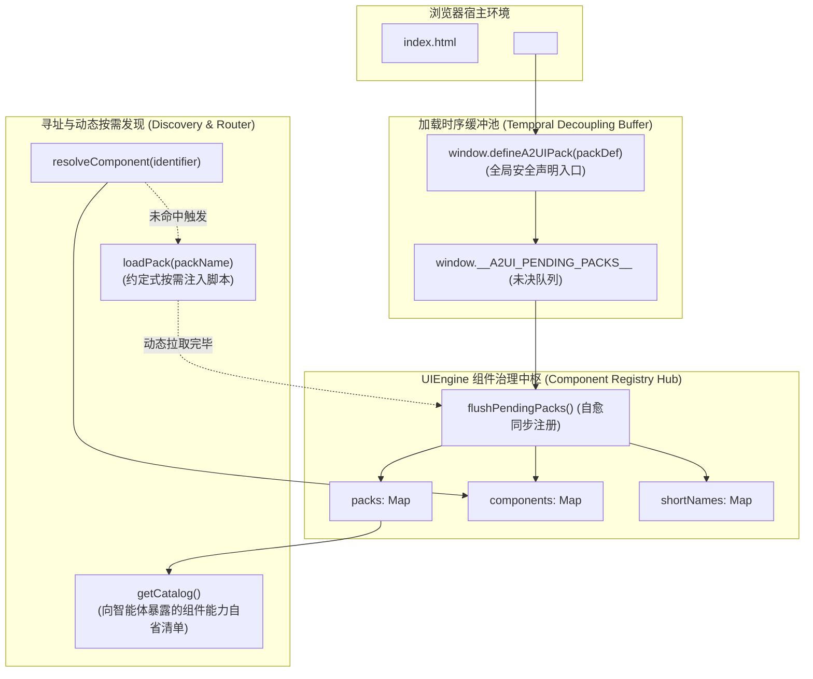

# Agent2UI (A2UI) 组件库拆解与模块化注册发现机制规范 (Component Registry & Discovery Specification)

> **文档类别**：技术规范 (Specification)  
> **适用范围**：A-Stock Agents 独立 Web 前端、Agent2UI (A2UI) 渲染引擎、跨端组件库生态  
> **实施进度看板**：[`docs/specs/a2ui/a2ui-component-registry-specification.md`](../specs/a2ui/a2ui-component-registry-specification.md) (`SPEC-A2UI-002`)

---

## 一、 背景与模块化演进动因 (Context & Motivation)

### 1. 历史痛点
在早期前端实现中，股票领域的卡片与看板组件最初平铺在单一文件 `web/js/components_astock.js` 中，并在 `web/js/ui_engine.js` 内通过简易键值字典进行注册：
1. **缺乏命名空间隔离 (Namespace Collision)**：扁平字典无法防止多业务包组件命名冲突；
2. **强脚本加载时序绑定 (Temporal Coupling)**：组件脚本必须严格在 `ui_engine.js` 之后载入，一旦采用 `async`/`defer` 极易出现 `UIEngine is undefined` 竞态异常；
3. **缺乏组件元数据清单与自省机制 (Missing Introspection)**：无法动态查询当前客户端已加载的组件能力集；
4. **不支持按需动态发现 (No Dynamic Discovery)**：未在首屏声明的扩展组件无法动态拉取水合。

### 2. 规范目标
确立 `web/js/components/` 领域组件目录体系，模块化拆解 `components_astock.js` 为领域包 `web/js/components/astock.js`（`@a2ui/pack-astock`），并在 `UIEngine` 中确立**时序解耦、命名空间隔离、约定式动态发现与自省清单**的高扩展治理标准。

---

## 二、 目录规范与文件组织架构 (Directory Conventions)

### 1. 目录分层拓扑
`web/js/` 目录实行“引擎内核”与“领域组件包”两级物理分离：
```text
web/js/
├── app.js                       # 业务主控制器与交互状态机
├── charts.js                    # 金融级 Canvas 底座 (FinancialCharts)
├── ui_engine.js                 # A2UI 通用渲染调度、骨架编排与组件治理中枢 (Registry Hub)
└── components/                  # 【标准】A2UI 领域组件包专有目录 (Packs Root)
    ├── astock.js                # A股量化投研领域包 (@a2ui/pack-astock)
    ├── bi.js                    # [规划] 商业智能与多维报表领域包 (@a2ui/pack-bi)
    ├── crypto.js                # [规划] 加密资产与衍生品领域包 (@a2ui/pack-crypto)
    └── common.js                # [规划] 通用基础卡片与富文本包 (@a2ui/pack-common)
```

### 2. 兼容性保证
- **零额外构建依赖**：原生浏览器下通过标准的相对路径 `<script src="js/components/astock.js"></script>` 即可直接运行；
- **全平台静态容器兼容**：本地 `file:///` 协议、Python `http.server`、FastAPI 静态路由及桌面端（Tauri/Electron）原生兼容；
- **现代工程演进兼容**：未来引入 Rollup/Vite 或 ES 模块时，该拓扑天然符合现代前端分包标准。

---

## 三、 架构拓扑与核心机制 (Registry Architecture)



### 1. 时序解耦与未决缓冲队列 (Temporal Decoupling)
为了打破脚本载入先后依赖，定义全局安全注册函数：
```javascript
// 全局前置安全声明：无论 UIEngine 是否已经实例化均可无痛调用
window.defineA2UIPack = function(packDef) {
    if (window.UIEngine && typeof window.UIEngine.registerPack === 'function') {
        window.UIEngine.registerPack(packDef);
    } else {
        window.__A2UI_PENDING_PACKS__ = window.__A2UI_PENDING_PACKS__ || [];
        window.__A2UI_PENDING_PACKS__.push(packDef);
    }
};
```
当 `UIEngine` 启动初始化时，自动执行 `flushPendingPacks()` 消费清空缓冲队列，彻底消除初始化竞态。

### 2. 命名空间隔离与双重寻址
- 每个包拥有独立命名空间（如 `@a2ui/pack-astock`）；
- 全名格式：`@a2ui/pack-astock/MarketRadar`；
- 双重寻址策略：调度器优先匹配全局短名称（如 `MarketRadar`）；若遇到同名短名称冲突，则强制降级使用完整全名寻址。

### 3. 组件能力自省契约 (`getCatalog()`)
向后端智能体与前端调试终端暴露当前的组件全景能力清单：
```json
[
  {
    "pack": "@a2ui/pack-astock",
    "component": "BreakevenCalcCard",
    "fullName": "@a2ui/pack-astock/BreakevenCalcCard",
    "defaultTarget": "chat",
    "description": "最低保本卖出价向上进位精算卡片",
    "propsSchema": {
      "code": "string",
      "cost": "number",
      "shares": "number"
    }
  }
]
```
