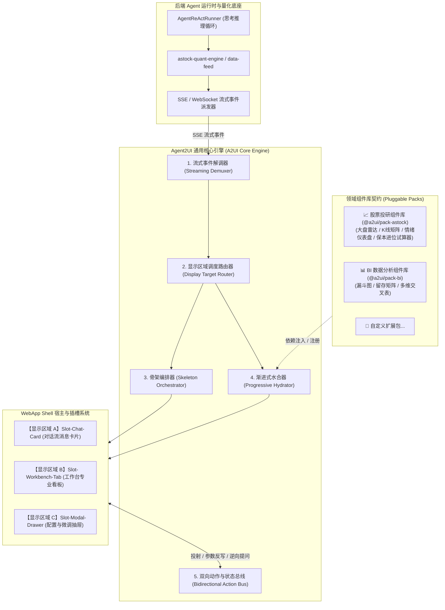
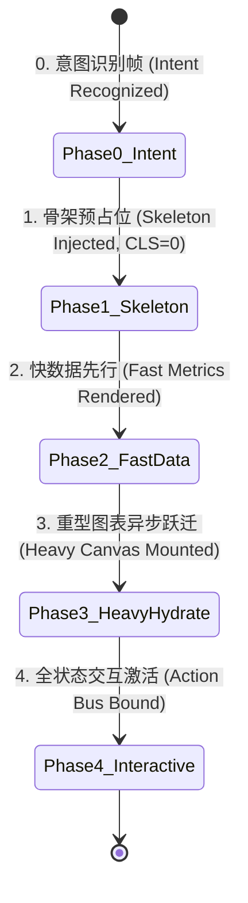

# Agent2UI (A2UI) 前端渲染引擎框架架构设计 (Agent-to-UI Engine Architecture)

> **文档类别**：系统架构 (Architecture)  
> **适用范围**：A-Stock Agents 独立 Web 投研前端、Desktop 客户端（Tauri/Electron）及跨端通用的 AI 动态驱动 UI 渲染中枢  
> **实施进度看板**：[`docs/specs/a2ui/a2ui-framework-engine-specification.md`](../specs/a2ui/a2ui-framework-engine-specification.md) (`SPEC-A2UI-001`)

---

## 一、 概述与核心设计基石 (The Trinity of UX)

在量化投研与大模型深度融合的交互系统中，传统的“纯文本对话”或“粗糙代码块”已无法满足专业金融交易场景对高精度、多维度、多媒体可视化的严苛要求。

**Agent2UI (A2UI) 前端引擎**是一套**面向 AI 智能体驱动的前端界面编排与动态渲染引擎框架**。它致力于将 AI 的复杂链式推理（COT）与量化数据资产，毫秒级转化为直观、结构化、可深度交互的金融级界面（图表、雷达图、K线量价矩阵、保本试算器等），并实现对【AIChatUI 卡片】与【工作台大屏】的双模自适应调度。

### 三位一体核心设计基石
1. **WebApp Shell (应用静态外壳)**：视口高度硬锁定为 `calc(100vh - 50px)`，杜绝整页滚动与结构崩塌；
2. **骨架屏 (Skeleton Screen)**：意图识别瞬间进行 1:1 结构级空间预占位，实现**零页面跳动 (Cumulative Layout Shift, CLS = 0)**；
3. **渐进式渲染 (Progressive Hydration)**：多阶段流水线水合，快数据先行上屏，重型图表平滑跃迁，解决大模型吐字慢与重型可视化渲染卡顿的矛盾。

---

## 二、 总体架构拓扑 (System Topology)

A2UI 引擎采用严格的分层解耦与控制反转（IoC）架构，核心引擎保持纯粹的“业务无关调度”，具体的业务图表通过“领域组件包（Component Pack）”即插即用挂载：

---

## 三、 五阶段渐进式水合流水线 (Progressive Hydration Pipeline)

为了消除大模型多轮推理与图表大数据渲染带来的页面卡顿感，A2UI 划分了五个毫秒级连续流转阶段：

1. **阶段 0：意图识别帧 (Intent Recognized)**：
   - 后端 Agent 识别出投研意图，发送 `a2ui_render` 声明指令（如 `{component: "MarketRadar", target: "workbench"}`）；
2. **阶段 1：骨架预占位 (Skeleton Injected, CLS=0)**：
   - 前端接收到声明后，立即在目标插槽挂载相同宽高比例的灰色骨架占位 DOM，防止任何内容推挤跳动；
3. **阶段 2：快数据先行 (Fast Metrics Rendered)**：
   - 现价、涨跌幅、代码名称等基础轻量文本数据直接填入骨架槽位，毫秒级呈现；
4. **阶段 3：重型图表异步跃迁 (Heavy Canvas Mounted)**：
   - Canvas K 线、资金流分布、5A 雷达图在 `requestAnimationFrame` 调度下异步渲染挂载；
5. **阶段 4：全状态交互激活 (Action Bus Bound)**：
   - 绑定缩放拖拽、悬停十字光标、穿透提问与快捷动作触发器，组件进入完全活跃状态。
