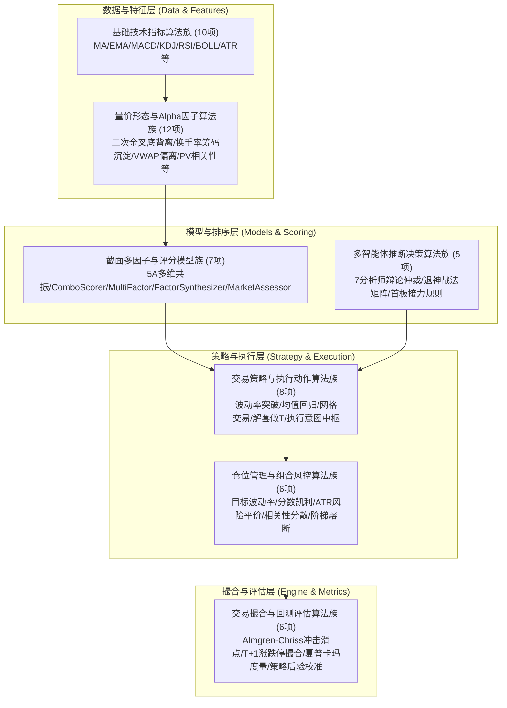
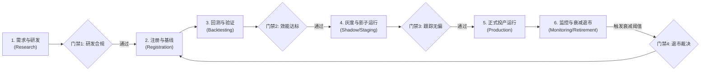

# aStocks 算法审查、算法库架构评估与全生命周期治理规范
*(Algorithm Review, Library Architecture Evaluation & Full Lifecycle Governance)*

---

## Executive Summary (执行摘要)

经过对本项目全量代码库（涵盖 `core/indicators/`、`core/models/`、`core/strategy/`、`core/paper_trading/`、`core/multi_agent/` 及 `skills/`）的深度代码级审计，本项目在量化金融、技术分析与多智能体结合方面已积累了极其深厚的技术底蕴，拥有 **40+ 项专业量化算法与金融模型**。

然而，目前算法资产处于**“底蕴深厚但组织割裂”**的状态：
1. **算法分布离散**：散落在不同子包和函数中，缺乏统一算法库入口。
2. **接口规范不一**：输入输出缺乏强类型约束与统一基类，难以实现多算法无缝串联流水线。
3. **注册机制狭窄**：既有的 `ModelRegistry` 仅纳管了 7 个综合选股模型，排斥了大量核心指标、因子、策略与撮合算法。
4. **生命周期治理缺失**：缺少算法从“研发 -> 注册 -> 离线回测 -> 灰度/影子模拟 -> 生产监控 -> 衰退退市”的闭环机制，缺乏防过拟合与 Alpha 衰减预警。

本方案针对上述痛点，全面审查项目算法内容，评估并提出**统一算法库（Unified Algorithm Library & Registry）**架构，设计贴合 A 股特性的**算法全生命周期管理（ALCM）治理框架**，并输出详尽的**算法全景目录清单**。

---

## 一、 项目算法内容全面审查 (Comprehensive Algorithm Audit)

### 1.1 算法族群架构全景
项目的算法体系可解构为 7 大族群：



### 1.2 现状优缺点评估 (Pros & Cons)

#### 优势 (Strengths)
1. **数学建模严谨且专业**：
   - 筹码成本采用真实换手率递归沉淀加权模型（$w_i = Turnover_i \times \prod (1 - Turnover)$），摆脱传统固定常数衰减失真；
   - 撮合滑点采用经典 Almgren-Chriss 平方根市场冲击理论（$\sqrt{Order/ADV}$），贴近真实大单撮合；
   - 形态识别具备波段间距与波谷极值检验，有效过滤毛刺伪信号。
2. **零外部重依赖**：基础指标与因子完全基于 Python 标准库（`math` / `statistics`），摆脱了对 C 编译依赖或黑盒库的捆绑，执行轻量可控。
3. **已具备初步的模型注册表雏形**：`core.models.registry.ModelRegistry` 提供了别名映射与版本管理思想，具备向全局算法库扩展的基础。

#### 不足与治理痛点 (Gaps & Weaknesses)
1. **纳管覆盖度仅约 15%**：目前仅 7 个模型类注册在 `ModelRegistry`，而 30 多个指标、因子、策略与风控算法处于裸奔或离散调用状态。
2. **数据契约异构**：
   - 指标层输入为原生列表 `List[List]`（腾讯K线格式）；
   - 因子层部分输入为字典列表 `List[Dict]`；
   - 撮合与评估层输入为包含 `equity` 的字典或 DataFrame；
   - 缺乏全局强类型的 `AlgorithmInput` 与 `AlgorithmOutput`。
3. **缺乏因子与策略健康度跟踪**：
   - 因子未建立滚动 IC (Information Coefficient)、IR (Information Ratio) 与单调性衰减追踪；
   - 策略回测缺乏防过拟合检验（如 Deflated Sharpe Ratio / White's Reality Check）；
   - 缺少应对市场风格漂移（Concept Drift）的退市熔断机制。

---

## 二、 构建统一算法库架构评估 (Algo Library Evaluation & Architecture)

### 2.1 构建算法库的必要性与可行性评估
- **必要性 (Necessity)**：★★★★★
  - 支撑算法资产沉淀、策略多因子热插拔、统一风控挂载与自动化回测流水线，是项目迈向量化投研工业化平台的必经之路。
- **技术可行性 (Feasibility)**：★★★★★
  - 代码库原生解耦度良好，底层算法多为无副作用纯函数或清晰类结构，重构改造成本低、风险极小。
- **向下兼容性 (Compatibility)**：★★★★★
  - 可沿用 `ModelRegistry` 的别名映射与平滑过渡方案，保证现有 99+ 个测试用例与 CLI 命令 100% 兼容。

### 2.2 统一算法库（Algo Registry 2.0）架构设计

统一算法库应覆盖四大基类抽象，形成标准基元：

```python
# 核心基类体系架构 (Core Abstract Hierarchy)
from abc import ABC, abstractmethod
from dataclasses import dataclass
from typing import Any, Dict, List, Optional
from enum import Enum

class AlgorithmCategory(str, Enum):
    INDICATOR = "indicator"          # 技术指标
    ALPHA_FACTOR = "alpha_factor"    # 量价/衍生因子
    SCORING_MODEL = "scoring_model"  # 选股/评分模型
    STRATEGY = "strategy"            # 择时/交易策略
    RISK_SIZING = "risk_sizing"      # 仓位与风控算法
    EXECUTION = "execution"          # 撮合/执行算法
    EVALUATOR = "evaluator"          # 绩效度量/策略评估

class AlgorithmLifecycleStage(str, Enum):
    RESEARCH = "research"            # 研发试验中
    BACKTESTED = "backtested"        # 已通过离线回测验证
    STAGING = "staging"              # 模拟盘/影子测试中
    PRODUCTION = "production"        # 实盘正式生效
    DEPRECATED = "deprecated"        # 已废弃预警
    RETIRED = "retired"              # 已退市归档

@dataclass
class AlgorithmMetadata:
    algo_id: str                      # 算法唯一ID
    name: str                         # 算法名称
    category: AlgorithmCategory       # 分类
    version: str                      # SemVer 版本号
    description: str                  # 算法功能描述
    author: str                       # 研发负责人
    stage: AlgorithmLifecycleStage    # 当前生命周期阶段
    entry_module: str                 # 模块路径
    entry_class_or_fn: str            # 入口类或入口函数
    regime_suitability: List[str]     # 适用市场状态: BULL / BEAR / OSCILLATION
    input_schema: Dict[str, Any]      # 输入参数定义
    output_schema: Dict[str, Any]     # 输出指标定义
    benchmark_metrics: Dict[str, Any] # 基线效能 (IC/夏普/回撤等)
    aliases: List[str]                # 兼容别名
```

---

## 三、 算法全生命周期管理 (ALCM) 治理体系设计

建立包含 **6 个阶段** 与 **4 道质量门禁** 的量化算法全生命周期治理流程：



### 3.1 六大生命周期阶段详述

#### 阶段一：需求与研发阶段 (Research & Modeling)
- **研发规范**：
  1. 严格禁止引入未来数据（Lookahead Bias），数据必须采用截面截止时点可用数据；
  2. 严格遵循 A 股交易制度约束（T+1 规则、±10%/±20% 涨跌停无法买卖、停牌标的流动性缺失）；
  3. 参数禁止暴力网格过度拟合，须保证逻辑在金融经济学与行为金融学上有合理合理解释。

#### 阶段二：注册与版本管理 (Registration & Versioning)
- **注册规范**：
  1. 任何算法入库必须在 `AlgoRegistry` 中显式登记元数据；
  2. 必须声明 SemVer 版本号（如 `1.2.0`）及所兼容的历史别名；
  3. 必须提供明确的输入/输出 Schema 与默认参数配置。

#### 阶段三：回测与离线验证 (Backtesting & Validation)
- **回测规范**：
  1. 采用全周期历史数据回测（至少覆盖 2024.12 至今的震荡、主升等完整周期）；
  2. 撮合必须计入交易规费（万2.5佣金、万0.5印花税、过户费）及平方根市场冲击成本；
  3. 实施过拟合检验：计算**样本外表现衰减率（OOS Decay Ratio）**与**夏普比率折扣（Deflated Sharpe Ratio）**。

#### 阶段四：灰度与影子测试 (Shadow Trading & Staging)
- **灰度规范**：
  1. 经过回测达标的算法，在实盘前必须进入模拟盘（Paper Trading）进行至少 20 个交易日的影子跟踪；
  2. 校验实盘信号生成时间点（盘中/盘后）、滑点承受力与委托成功率。

#### 阶段五：正式投产监控 (Production & Online Monitoring)
- **监控规范**：
  1. **因子 IC/IR 跟踪**：每日盘后计算因子 Rank IC 与 20 日均值，当 IC 均值由正转负且持续 5 日时触发预警；
  2. **市场机制失配检测**：实时监控大盘环境（BULL/BEAR/OSCILLATION），当策略运行在非适宜机制时自动降低头寸；
  3. **策略净值跟踪**：对比实盘跟踪收益与回测期望收益的偏离度。

#### 阶段六：退市、废弃与归档 (Deprecation & Retirement)
- **退市触发机制**：
  1. 策略近 30 个交易日最大回撤超过回测期最大回撤的 1.5 倍；
  2. 连续 5 次交易亏损触发风控熔断；
  3. 算法被标记为 `DEPRECATED`，通过 `warnings.warn` 指引平滑迁移，在下一个大版本正式归档 (`RETIRED`)。

### 3.2 四道核心准入质量门禁 (Quality Gates)

| 门禁环节 | 审查要点 | 硬性卡点指标 | 违规处置 |
| :--- | :--- | :--- | :--- |
| **G1: 研发合规门禁** | 无未来函数、A股规则兼容、代码测试覆盖 | 单元测试通过率 100%、参数有默认值与边界保护 | 拒绝合并代码 |
| **G2: 效能达标门禁** | 回测夏普、卡玛比率、样本外泛化 | 年化夏普 $\ge 1.2$、最大回撤 $\le 18\%$、OOS衰减率 $\le 35\%$ | 退回继续调优 |
| **G3: 灰度实盘门禁** | 模拟盘撮合成交率、实际滑点偏差 | 模拟盘成交率 $100\%$、实际滑点与模型预期偏差 $\le 20\%$ | 延长灰度期 |
| **G4: 运行退市门禁** | Alpha衰减、连续回撤破位、模型失效 | 因子IC连续两周为负、策略累计回撤超过回测最大回撤 $1.5\times$ | 强制下线/归档 |

---

## 四、 项目算法全景目录清单 (Comprehensive Algorithm Catalog)

以下清单详尽盘点项目当前已实现的 **44 项** 核心算法与模型：

### 目录 1：基础技术指标算法族 (10 项)

| 算法编号 | 算法名称 | 所在文件 | 核心数学原理/实现逻辑 | 输入参数 | 输出特征 |
| :--- | :--- | :--- | :--- | :--- | :--- |
| **IND-01** | **简单移动平均 (MA)** | [technical_indicators.py](file:///Users/handy/workon/a_stock_agents/core/indicators/technical_indicators.py) | 滑动窗口均值：$MA_t = \frac{1}{n}\sum_{i=0}^{n-1} C_{t-i}$ | `data`, `n` | `List[float]` |
| **IND-02** | **指数移动平均 (EMA)** | [technical_indicators.py](file:///Users/handy/workon/a_stock_agents/core/indicators/technical_indicators.py) | 递推平滑：$EMA_t = \alpha C_t + (1-\alpha) EMA_{t-1}, \alpha=\frac{2}{n+1}$ | `data`, `n` | `List[float]` |
| **IND-03** | **平滑移动平均 (SMA)** | [technical_indicators.py](file:///Users/handy/workon/a_stock_agents/core/indicators/technical_indicators.py) | 权重递推：$SMA_t = \frac{C_t \cdot m + SMA_{t-1} \cdot (n-m)}{n}$ | `data`, `n`, `m=1` | `List[float]` |
| **IND-04** | **指数平滑异同移动平均线 (MACD)** | [technical_indicators.py](file:///Users/handy/workon/a_stock_agents/core/indicators/technical_indicators.py) | $DIF = EMA_{12}-EMA_{26}, DEA=EMA_9(DIF), Bar=2(DIF-DEA)$ | `closes`, `fast=12`, `slow=26`, `signal=9` | `dif`, `dea`, `bar` |
| **IND-05** | **随机指标 (KDJ)** | [technical_indicators.py](file:///Users/handy/workon/a_stock_agents/core/indicators/technical_indicators.py) | $RSV = \frac{C-L_n}{H_n-L_n}\times 100$, SMA平滑生成 K、D，并求 $J=3K-2D$ | `klines`, `n=9`, `k_n=3`, `d_n=3` | `k`, `d`, `j` |
| **IND-06** | **相对强弱指标 (RSI)** | [technical_indicators.py](file:///Users/handy/workon/a_stock_agents/core/indicators/technical_indicators.py) | 上涨与下跌均幅比：$RSI = 100 - \frac{100}{1 + AvgGain/AvgLoss}$ | `closes`, `n=14` | `List[float]` |
| **IND-07** | **布林带 (BOLL)** | [technical_indicators.py](file:///Users/handy/workon/a_stock_agents/core/indicators/technical_indicators.py) | $Mid=MA_{20}, Upper=Mid+k\cdot\sigma, Lower=Mid-k\cdot\sigma, Bandwidth=\frac{U-L}{M}$ | `closes`, `n=20`, `k=2.0` | `mid`, `upper`, `lower`, `bandwidth` |
| **IND-08** | **平均真实波幅 (ATR)** | [technical_indicators.py](file:///Users/handy/workon/a_stock_agents/core/indicators/technical_indicators.py) | $TR = \max(H-L, \|H-C_{prev}\|, \|L-C_{prev}\|)$，再求平滑平均 | `klines`, `n=14` | `List[float]` |
| **IND-09** | **全指标综合计算器 (calc_all)** | [technical_indicators.py](file:///Users/handy/workon/a_stock_agents/core/indicators/technical_indicators.py) | 批处理单股 K 线并提取最新截面指标快照 | `klines`, `ma_periods` | `Dict[str, Any]` |
| **IND-10** | **跳空缺口分析 (gap_analysis)** | [technical_indicators.py](file:///Users/handy/workon/a_stock_agents/core/indicators/technical_indicators.py) | 检测开盘跳空幅度和当日是否回补缺口（`filled`）及连续方向 | `klines` | `gaps`, `consecutive_same` |

---

### 目录 2：量价形态与高级 Alpha 因子算法族 (12 项)

| 算法编号 | 算法名称 | 所在文件 | 核心数学原理/实现逻辑 | 输入参数 | 输出特征 |
| :--- | :--- | :--- | :--- | :--- | :--- |
| **FAC-01** | **MACD水下二次金叉识别** | [technical_indicators.py](file:///Users/handy/workon/a_stock_agents/core/indicators/technical_indicators.py) | 零轴下两脚金叉，带最小波段跨度过滤（$\ge 4$ 周期且中间有死叉） | `klines`, `min_interval=4` | `verdict`, `checklist`, `is_divergence` |
| **FAC-02** | **MACD波谷底背离严谨检验** | [technical_indicators.py](file:///Users/handy/workon/a_stock_agents/core/indicators/technical_indicators.py) | 局部波谷双重极小值对比：$Price_{low2} \le Price_{low1} \times 1.03$ 且 $DIF_{low2} > DIF_{low1}$ | 包含在 `second_golden_cross` 中 | `is_divergence (bool)` |
| **FAC-03** | **真实换手率沉淀筹码成本 (calculate_chip_cost)** | [pv_factors.py](file:///Users/handy/workon/a_stock_agents/core/indicators/pv_factors.py) | 换手率迭代沉淀加权：$w_i = Turnover_i \prod_{j=i+1}^T(1-Turnover_j)$，结合典型价格求和 | `klines`, `lookback=120` | `weighted_cost (float)` |
| **FAC-04** | **筹码获利盘比例 (profit_ratio)** | [pv_factors.py](file:///Users/handy/workon/a_stock_agents/core/indicators/pv_factors.py) | 现价相对于换手沉淀筹码成本的偏离率：$\frac{Close - Cost}{Cost}\times 100\%$ | `klines` | `profit_ratio (%)` |
| **FAC-05** | **动量收益率因子 (ret_5d / ret_20d / ret_60d)** | [pv_factors.py](file:///Users/handy/workon/a_stock_agents/core/indicators/pv_factors.py) | 5日、20日、60日对数或百分比动量收益率 | `closes` | `ret_5d`, `ret_20d`, `ret_60d` |
| **FAC-06** | **均线乖离率因子 (bias_5d / bias_20d)** | [pv_factors.py](file:///Users/handy/workon/a_stock_agents/core/indicators/pv_factors.py) | 股价偏离短期均线百分比：$\frac{C - MA}{MA}\times 100\%$ | `closes` | `bias_5d`, `bias_20d` |
| **FAC-07** | **成交量放量比率 (vol_surge_5_20)** | [pv_factors.py](file:///Users/handy/workon/a_stock_agents/core/indicators/pv_factors.py) | 近5日均量相对于近20日均量的放大倍数：$\frac{Vol_{5}}{Vol_{20}}$ | `volumes` | `vol_surge_5_20` |
| **FAC-08** | **5日VWAP偏离度 (vwap_bias_5)** | [pv_factors.py](file:///Users/handy/workon/a_stock_agents/core/indicators/pv_factors.py) | 成交量加权平均价偏离：$\frac{C - VWAP_5}{VWAP_5}\times 100\%$ | `amounts`, `volumes` | `vwap_bias_5` |
| **FAC-09** | **价量相关系数因子 (pv_corr_20)** | [pv_factors.py](file:///Users/handy/workon/a_stock_agents/core/indicators/pv_factors.py) | 20日收盘价与成交量序列的皮尔逊相关系数：$Corr(C, Vol)$ | `closes`, `volumes` | `pv_corr_20` |
| **FAC-10** | **归一化波动率因子 (norm_atr)** | [pv_factors.py](file:///Users/handy/workon/a_stock_agents/core/indicators/pv_factors.py) | 价格无量纲波幅比率：$\frac{ATR_{14}}{Close}$ | `klines` | `norm_atr` |
| **FAC-11** | **历史年化波动率 (hist_vol_20)** | [pv_factors.py](file:///Users/handy/workon/a_stock_agents/core/indicators/pv_factors.py) | 20日对数收益率标准差年化：$\sigma_{daily}\times\sqrt{250}\times 100\%$ | `closes` | `hist_vol_20 (%)` |
| **FAC-12** | **全量价Alpha特征抽取器 (extract_factors)** | [pv_factors.py](file:///Users/handy/workon/a_stock_agents/core/indicators/pv_factors.py) | 一站式生成 15 维量价技术 Alpha 因子集 | `klines` | 15维因子字典 |

---

### 目录 3：多维评分与截面多因子合成模型算法族 (7 项)

| 算法编号 | 算法名称 | 所在文件 | 核心数学原理/实现逻辑 | 输入参数 | 输出特征 |
| :--- | :--- | :--- | :--- | :--- | :--- |
| **MOD-01** | **5A多维共振选股模型 (StockSelectionModel)** | [multi_dim_model.py](file:///Users/handy/workon/a_stock_agents/core/models/multi_dim_model.py) | 结构(25)+资金(22)+动量(18)+筹码(15)+形态(20)五维共振门禁评估 | 股票池、K线、市场门控 | 综合评级 (A/B/C/D)、共振维数 |
| **MOD-02** | **三合一组合策略评分器 (ComboScorer)** | [combo_scorer.py](file:///Users/handy/workon/a_stock_agents/core/models/combo_scorer.py) | 100分制：均线(25)+MACD(20)+量价(15)+筹码(15)+资金(15)+板块(5)+估值(5) | `klines`, `latest` | 0-100总分、分项明细 |
| **MOD-03** | **截面多因子排序评分器 (MultiFactorScorer)** | [multi_factor_scorer.py](file:///Users/handy/workon/a_stock_agents/core/models/multi_factor_scorer.py) | 动量(25%)+价值(15%)+质量(10%)+低波动(10%)+Combo评分(40%) | `klines`, `pe`, `pb`, `roe` | 多因子评分与分位数排名 |
| **MOD-04** | **因子合成器 (FactorSynthesizer)** | [factor_synthesizer.py](file:///Users/handy/workon/a_stock_agents/core/models/factor_synthesizer.py) | MAD去极值 + Z-Score标准化 + 方向修正 + 市场机制动态IC自适应合成 | 全市场/候选池截面因子集 | 最终合成得分、Percentile Rank |
| **MOD-05** | **五维大盘健康度门控模型 (MarketAssessor)** | [market_assessor.py](file:///Users/handy/workon/a_stock_agents/core/models/market_assessor.py) | 趋势(30%)+情绪(20%)+量能(20%)+结构(15%)+资金(15%)健康度测评 | 指数行情、全市场涨跌统计 | 0-100健康分、市场状态评估 |
| **MOD-06** | **非结构化舆情因子分析器 (UnstructuredFactors)** | [unstructured_factors.py](file:///Users/handy/workon/a_stock_agents/core/models/unstructured_factors.py) | 新闻标题/研报情绪提取、事件驱动权重计算与衰减模型 | 股票资讯、公告文本 | 0-100舆情情绪分 |
| **MOD-07** | **三层漏斗选股器 (StockScreener)** | [stock_screener.py](file:///Users/handy/workon/a_stock_agents/core/models/stock_screener.py) | 基础流动性过滤 -> 多因子初筛 -> 核心模型精选三级逐层过滤 | 全市场标的池 | 精选标的列表与准入标签 |

---

### 目录 4：交易策略与执行动作算法族 (8 项)

| 算法编号 | 算法名称 | 所在文件 | 核心数学原理/实现逻辑 | 输入参数 | 输出特征 |
| :--- | :--- | :--- | :--- | :--- | :--- |
| **STR-01** | **波动率突破策略 (VolatilityBreakoutStrategy)** | [volatility_breakout_strategy.py](file:///Users/handy/workon/a_stock_agents/core/strategy/volatility_breakout_strategy.py) | BOLL带宽处近60日最低20%收缩 + 放量突破上轨入场，触及+2ATR止盈 | `klines`, `squeeze_lookback=60` | 买入/卖出/观望信号、ATR止损价 |
| **STR-02** | **均值回归策略 (MeanReversionStrategy)** | [mean_reversion_strategy.py](file:///Users/handy/workon/a_stock_agents/core/strategy/mean_reversion_strategy.py) | $RSI < 30$ 且触及 BOLL 下轨买入，$RSI > 70$ 触及上轨卖出 | `klines`, `rsi_oversold`, `rsi_overbought` | 交易动作与触发理由 |
| **STR-03** | **ATR锚定网格交易策略 (GridTradingStrategy)** | [grid_trading_strategy.py](file:///Users/handy/workon/a_stock_agents/core/strategy/grid_trading_strategy.py) | 依据 BOLL 上下轨与 1倍ATR 动态构建 4~8 格分档挂单撮合 | `klines`, `total_cash` | 网格档位列表、挂单数量与价位 |
| **STR-04** | **被困持仓四维量化解套策略 (TrappedPositionAnalyzer)** | [trapped_position.py](file:///Users/handy/workon/a_stock_agents/core/strategy/trapped_position.py) | 诊断画像 + 阶梯减仓(ATR4档)+网格做T+等额补仓门禁+波动率换股 | 成本价、持仓数、`klines` | 诊断报告、战术解套推荐 |
| **STR-05** | **动态宇宙与主线推断引擎 (DynamicUniverseEngine)** | [dynamic_universe.py](file:///Users/handy/workon/a_stock_agents/core/strategy/dynamic_universe.py) | 实时领涨行业、成交额集中度、动量爆发自适应推断每日候选池 | 全市场实时行情、板块数据 | 当日主线板块、动态股票池 |
| **STR-06** | **基本面硬门禁过滤算法 (FundamentalFilter)** | [fundamental_filter.py](file:///Users/handy/workon/a_stock_agents/core/strategy/fundamental_filter.py) | ST/退市摘除、商誉占比过高、扣非净利巨亏、PE极值异常硬性剔除 | 财务指标与股票基本信息 | 是否合规准入、风险告警项 |
| **STR-07** | **交易执行意图解析中枢 (IntentEvaluator)** | [execution_action_engine.py](file:///Users/handy/workon/a_stock_agents/core/strategy/execution_action_engine.py) | 自然语言分词与正则语义识别，路由 5 大核心交易意图 | 用户提问大白话文本 | 意图标签、标的代码、盈亏感知 |
| **STR-08** | **下跌应对战术应对矩阵 (DownsideReactionMatrix)** | [execution_action_engine.py](file:///Users/handy/workon/a_stock_agents/core/strategy/execution_action_engine.py) | 区分高位补跌、急跌假摔、破位阴跌、主力洗盘、全线崩塌5类场景应对 | 价格跌幅、量比、均线支撑 | 战术动作（卧倒/减半/清仓/加仓） |

---

### 目录 5：仓位管理与投资组合风控算法族 (6 项)

| 算法编号 | 算法名称 | 所在文件 | 核心数学原理/实现逻辑 | 输入参数 | 输出特征 |
| :--- | :--- | :--- | :--- | :--- | :--- |
| **RSK-01** | **目标波动率总仓位管理 (calculate_portfolio_target_weight)** | [risk_position_manager.py](file:///Users/handy/workon/a_stock_agents/core/strategy/risk_position_manager.py) | 目标波动率缩放：$Weight = \min(0.95, \max(0.20, \frac{\sigma_{target}}{\sigma_{market}}))$ | 年化市场波动率、目标波幅 (15%) | 组合总仓位比例 (0.2~0.95) |
| **RSK-02** | **分数凯利头寸分配算法 (calculate_stock_allocation)** | [risk_position_manager.py](file:///Users/handy/workon/a_stock_agents/core/strategy/risk_position_manager.py) | 1/3 分数凯利公式：$f^* = \frac{pb - q}{b} \times 0.333$，结合板块硬上限约束 | 胜率、盈亏比、总资产、股价 | 目标仓位金额、持仓股数 |
| **RSK-03** | **ATR风险平价权重修正算法** | [risk_position_manager.py](file:///Users/handy/workon/a_stock_agents/core/strategy/risk_position_manager.py) | 标的归一化波幅反比缩放：$Scalar = \frac{\sigma_{base}}{ATR/Close}$ | 标的 ATR、当前收盘价 | 波动率平价修正系数 |
| **RSK-04** | **持仓相关性矩阵分散化算法** | [portfolio_risk_manager.py](file:///Users/handy/workon/a_stock_agents/core/strategy/portfolio_risk_manager.py) | 计算持仓收益率协方差与相关系数矩阵，两两 $Corr > 0.7$ 触发减仓 | 各持仓近期收益率序列 | 冗余暴露标的、减仓建议 |
| **RSK-05** | **阶梯组合回撤熔断控制算法** | [portfolio_risk_manager.py](file:///Users/handy/workon/a_stock_agents/core/strategy/portfolio_risk_manager.py) | 动态回撤多级防御：浮亏>5%整体减半，>10%仅留A级标的，>15%强制清仓冷冻 | 组合净值、历史最高水位 | 熔断等级与强制风控动作 |
| **RSK-06** | **行业与板块敞口硬约束算法** | [portfolio_risk_manager.py](file:///Users/handy/workon/a_stock_agents/core/strategy/portfolio_risk_manager.py) | 单行业 $\le 30\%$、单板块 $\le 25\%$、单股 $\le 15\%$（20cm板块 $\le 8\%$）多重硬拦截 | 持仓资产分布 | 超限拦截与调仓指令 |

---

### 目录 6：交易撮合、回测与效能度量算法族 (6 项)

| 算法编号 | 算法名称 | 所在文件 | 核心数学原理/实现逻辑 | 输入参数 | 输出特征 |
| :--- | :--- | :--- | :--- | :--- | :--- |
| **ENG-01** | **Almgren-Chriss 平方根冲击滑点模型** | [engine.py](file:///Users/handy/workon/a_stock_agents/core/paper_trading/engine.py) | $Impact = Base + \gamma \cdot \sigma_{daily} \cdot \sqrt{\frac{OrderShares}{DayVolume}} \times 10000$ | 委托量、当日成交量、波动率 | 成交价格与滑点基点 (bps) |
| **ENG-02** | **A股交易规则撮合状态机** | [engine.py](file:///Users/handy/workon/a_stock_agents/core/paper_trading/engine.py) | T+1持仓冻结与次日自动解冻、涨跌停无法买卖、停牌拦截撮合 | 委托单、行情快照、交易时段 | 撮合成交回报、订单状态 |
| **ENG-03** | **量化绩效评估套件 (calc_metrics)** | [backtest_metrics.py](file:///Users/handy/workon/a_stock_agents/core/paper_trading/backtest_metrics.py) | 计算夏普比率、索提诺比率、卡玛比率、年化收益、年化波动、盈亏比等 16 项指标 | 净值曲线、交易明细流水 | 风险调整收益与统计全景字典 |
| **ENG-04** | **水下回撤持续期度量算法 (Max Drawdown Duration)** | [backtest_metrics.py](file:///Users/handy/workon/a_stock_agents/core/paper_trading/backtest_metrics.py) | 计算净值脱离历史最高峰的最长连续水下交易日天数 | 净值曲线 | 最大回撤天数 (Days) |
| **ENG-05** | **持股策略后验评级校准器 (StrategyEvaluator)** | [strategy_evaluator.py](file:///Users/handy/workon/a_stock_agents/core/models/strategy_evaluator.py) | 检验历史评级（A/B/C/D）与前向收益单调性梯度，统计 A/B 胜率与方向正确率 | 推荐历史记录、后续股价走势 | 方向准确率、校准评分 |
| **ENG-06** | **多股轮动回测引擎 (RotationBacktest)** | [multi_dim_model.py](file:///Users/handy/workon/a_stock_agents/core/models/multi_dim_model.py) | 521日长周期多股池动态轮动，结合 MA15 离场线、门控过滤与复利撮合 | 历史行情库、轮动阈值 | 轮动收益率、方向超额、资金利用率 |

---

### 目录 7：多智能体与专家规则算法族 (5 项)

| 算法编号 | 算法名称 | 所在文件 | 核心数学原理/实现逻辑 | 输入参数 | 输出特征 |
| :--- | :--- | :--- | :--- | :--- | :--- |
| **AGT-01** | **7分析师多Agent辩论与决策仲裁算法** | [ta_analyze.py](file:///Users/handy/workon/a_stock_agents/core/multi_agent/ta_analyze.py) | 技术面/基本面/消息面/资金面等多视角 Agent 交叉辩论，由仲裁 Agent 决策 | 标的代码、全维分析数据 | 多智能体综合评级与策略报告 |
| **AGT-02** | **退神短线场景化规则矩阵引擎** | [skills/astock-strategy-tuige](file:///Users/handy/workon/a_stock_agents/skills/astock-strategy-tuige) | 趋势延续、首板涨停回调、连板接力、黄金坑假摔 4 大短线场景规则匹配 | 市场情绪、涨停封单、分时结构 | 场景类型、触发条件、失效条件 |
| **AGT-03** | **主板趋势跟踪战法引擎** | [skills/astock-strategy-mainboard](file:///Users/handy/workon/a_stock_agents/skills/astock-strategy-mainboard) | 主板大市值标的均线多头趋势锁定与回踩低吸策略 | 行业龙头、MA20/MA60均线 | 趋势买点评分、止盈位 |
| **AGT-04** | **五步选股漏斗规则流 (5A Screener)** | [skills/astock-screener-5a](file:///Users/handy/workon/a_stock_agents/skills/astock-screener-5a) | 宏观门控 -> 行业轮动 -> 财务排雷 -> 量价共振 -> 筹码集中的 5 步筛选漏斗 | 全市场数据源 | 5A 优质标的池 |
| **AGT-05** | **智能体路由与调度引擎 (TA Orchestrator)** | [ta_orchestrator.py](file:///Users/handy/workon/a_stock_agents/core/multi_agent/ta_orchestrator.py) | 意图识别后分发至数据抓取、量化预筛、Agent分析、模拟盘与通知管道 | 用户指令、定时任务 | 全链路分析与执行状态反馈 |

---

## 五、 算法库构建与治理实施路线图 (Implementation Roadmap)

为了系统性落地算法库与全生命周期治理体系，建议按三步走路线推进：

### Phase 1: 算法注册体系升级与标准接口抽象 (基础设施层)
1. **统一 Registry 2.0 (`core.models.registry`)**：
   - 将注册范围从原有的 `ModelRegistry` 扩展为支持 7 大类别的 `UnifiedAlgoRegistry`；
   - 纳入全部 44 项算法的元数据（名称、版本、作者、适用市场机制、基类契约）；
   - 保留原有函数别名与调用入口，做到 100% 向下兼容。
2. **定义统一算法基类规范 (`core.models.base_algorithm`)**：
   - 制定 `BaseIndicator`、`BaseFactor`、`BaseStrategy`、`BaseRiskManager` 统一抽象契约；
   - 统一输入格式为类型友好的 TypedDict / Pydantic 模型。

### Phase 2: 全生命周期质量门禁与测试体系建立 (治理质控层)
1. **建立算法合规审查与自动化门禁**：
   - 编写无未来函数审查器（Lookahead Checker）；
   - 编写 A 股制度合规测试用例集（T+1、涨跌停、停牌熔断）。
2. **完善单调性与防过拟合检验工具**：
   - 在 `core.models.strategy_evaluator` 中集成样本外衰减检验（OOS Decay）与夏普折损计算。

### Phase 3: 算法监控、Alpha 衰减与智能调度平台 (生产运行层)
1. **动态 IC 监控与 Alpha 衰减警报**：
   - 在每日盘后自动化任务中，增加已上线因子有效性（Rank IC、IC_IR、单调性）日志记录；
2. **市场状态与策略路由联动**：
   - `MarketAssessor` 评估当前大盘处于 BULL / BEAR / OSCILLATION 时，自动在 `FactorSynthesizer` 与各个交易策略中动态加载适配权重，实现真正智能自适应的量化闭环。
