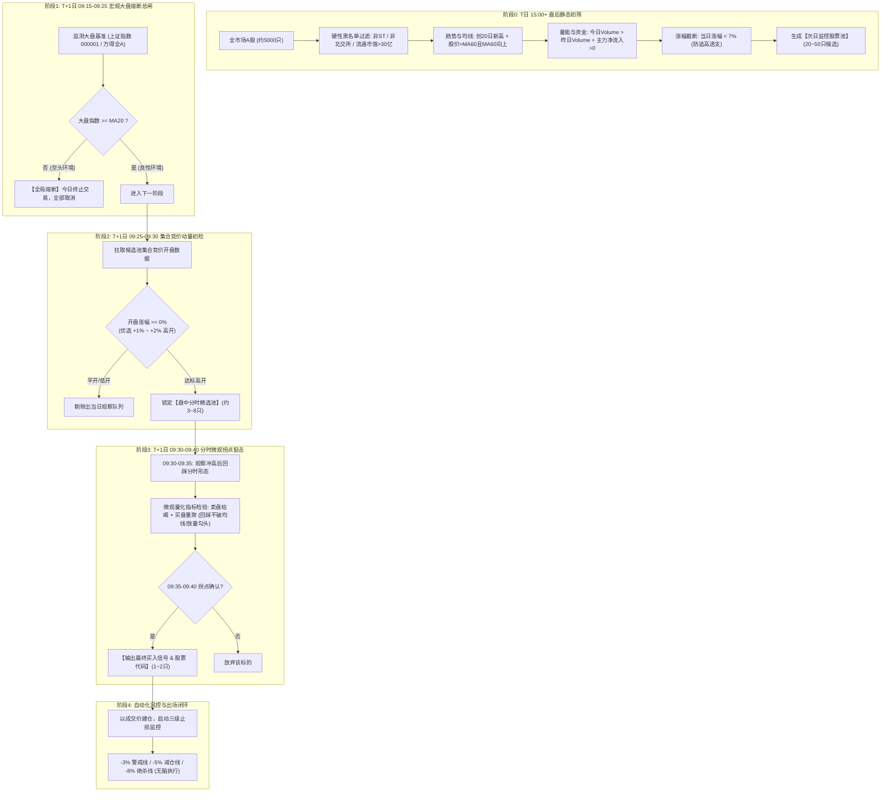

# 选股设计

> 适用范围：定义「右侧趋势底仓 + 宏观大盘总闸 + 开盘动量确认 + 早盘分时微观回踩拐点狙击 + 刚性止损出场」五阶段时序量化交易系统的阶段规则、量化数学定义、参数默认值、时点契约与数据流规范，供工程化落地与参数迭代。
> 核心目标：消除单点决策与盘中现算全市场两类工程陷阱，把该系统抽象为通用的时序状态机与量化过滤体系，统一每一阶段的运行时间、输入输出、规则阈值与配置口径。

这是一套非常经典且契合A股实战博弈的**“右侧趋势底仓 + 宏观大盘总闸 + 开盘动量确认 + 早盘分时微观回踩拐点狙击 + 刚性止损出场”**的五阶段时序量化交易系统。

为了便于系统工程化开发与后续参数迭代，我们将该选股条件整理并抽象为通用的**时序状态机与量化过滤体系**。

---

## 一、 全流程时序闭环架构（系统架构图）

系统的核心逻辑不是在单一时间点做决策，而是**以时间切片为导向的多级漏斗状态机**：



---

## 二、 各阶段详细设计与工程量化定义

### 阶段 0：T日 15:00+ 盘后静态多维初筛（池化储备）

* **运行时间**：每日收盘后（15:05 ~ 15:30）
* **输入**：全 A 股历史日线行情、资金流向数据、基础资料
* **输出**：`CandidatePool_YYYYMMDD`（通常 20 ~ 50 只）

#### 1. 规则矩阵与参数化配置表

| 维度 | 业务规则 | 量化数学定义 / 字段逻辑 | 参数默认值 |
| :--- | :--- | :--- | :--- |
| **基础准入** | 剔除垃圾与低流动性 | `is_st == False` 且 `market not in ['BSE', 'BJ']` 且 `circ_mv >= min_mv` | 流通市值 $\ge 30$ 亿 |
| **中期趋势** | 处于中长期上升通道 | $Close > MA60$ 且 $MA60_t > MA60_{t-1}$（60日均线斜率向上，绝不做下跌趋势） | 60日均线 |
| **突破动能** | 创阶段新高（强势特征） | $Close_t = \max(Close_{t-N+1}, \dots, Close_t)$ 或 $Close_t \ge \text{HHV}(Close, 20)$ | 回看周期 $N=20$（可扩展 $N=60$） |
| **量能共振** | 资金进场、温和放量 | $Volume_t > Volume_{t-1}$ 且 $Volume_t / \text{MA}(Volume, 5) \ge 1.1$ | 放量倍数 $> 1.0$ |
| **资金流向** | 主力资金净买入 | $NetInflow_{main} > 0$（超大单+大单净额大于0） | 净流入 $> 0$ |
| **防追高截断** | 剔除加速大阳线 | $0\% < \text{ChangePct}_t < 7\%$（剔除 $\ge 7\%$ 及涨停股，为次日预留安全空间） | 上限 $7.0\%$ |

#### 2. 问财自然语言查询语句（即拷即用）
```text
收盘价创20日新高，股价大于60日均线，60日均线向上，今日成交量大于昨日成交量，今日主力资金净流入，非ST，非北交所，流通市值大于30亿，今日涨幅小于7%，今日涨幅大于0%
```

---

### 阶段 1：T+1日 09:15-09:25 宏观大盘环境熔断（总闸机制）

实战经验表明：**逆势做多，九死一生；大盘弱势时个股拐点容易变成“下跌中继”。**

* **检测标的**：上证指数 (`000001.SH`) 或 沪深300 / 全A指数。
* **熔断公式**：
  $$\text{IndexPrice}_{t} \ge \text{MA20}(\text{IndexPrice})$$
* **动作逻辑**：
  * **通过**：大盘站在 20 日均线之上（中线多头趋势），总闸开启，放行阶段 2。
  * **熔断**：大盘位于 20 日均线之下，系统打印告警日志 `[MARKET_FILTER_BREAK]`，**当日全流程休克终止，不做任何开仓**。

---

### 阶段 2：T+1日 09:25-09:30 集合竞价动量初检（过滤与排序）

* **运行时间**：09:25（集合竞价撮合完成瞬间）
* **筛选目的**：从 30+ 候选股中，通过资金竞价态度，快速收敛到 3~5 只核心观察标的。
* **量化规则**：
  1. **高开幅度**：
     $$\text{OpenPct} = \frac{\text{OpenPrice} - \text{PreClose}}{\text{PreClose}} \times 100\%$$
     * **硬门槛**：$\text{OpenPct} > 0\%$（只要高开都行，拒绝低开平开弱势股）。
     * **黄金进攻区间**：$+1.0\% \le \text{OpenPct} \le +3.0\%$（高开过高如 $>5\%$ 容易被兑现砸盘；高开 $1\%\sim 2\%$ 既体现抢筹，又不易被过度透支）。
  2. **竞价量能比**：
     $$\text{AuctionVolRatio} = \frac{\text{AuctionVol}}{\text{PreDayVol}} \ge 0.5\% \sim 1.0\%$$
     （竞价有真实量能支持，非几手试盘）。

---

### 阶段 3：T+1日 09:30-09:40 分时微观博弈与拐点狙击（核心关键点）

> 用户痛点：“冲高之后，在 9:30~9:35 之间进行回调，回调的时候要能够感受到卖盘枯竭，买盘增加的拐点。这个点很重要，要慢慢的优化。在 9:35~9:40 出股票代码。”

将主观盘感“**卖盘枯竭、买盘增加**”解构为工程可计算的**三大微观量化特征**：

```
分时价格走势示意图：
       冲高高点 (9:31-9:32)
         ▲
        / \
       /   \  回踩缩量 (9:33-9:34: 卖盘枯竭，缩量不破分时均线VWAP)
9:30开盘     \       ★ 买盘再起放量拐点 (9:35-9:36: OFI>0, 勾头向上)
              ▼──────▲
            回踩低点  \
                       └──► 9:35-9:40 锁定代码，立即出票买入
```

#### 1. 微观特征数学建模（可分级迭代）

| 特征维度 | 盘感描述 | 系统开发落地算法（Level-1 基础分时版） | 系统开发进阶算法（Level-2/Tick 级深度版） |
| :--- | :--- | :--- | :--- |
| **价格形态** | 冲高回踩不破底，形成分时第二脚 | $P_{9:33\text{-}9:35} \ge \text{VWAP}$（分时均价线）且 $P_{low} \ge \text{OpenPrice}$（不破开盘价） | 回踩获得 VWAP 支撑后，分时走出“1分钟顶分型后的底分型”。 |
| **卖盘枯竭** | 回踩时没有大抛单，成交量骤降 | **分时量缩比**：回踩过程的 1 分钟柱成交量 $V_{pullback} < 0.5 \times V_{surge}$（回踩量比冲高量萎缩 50% 以上） | **主动卖单衰减**：主动卖单（Sell Order Volume）连续 2~3 个 Tick 衰减超过 60%，买一至买五挂单未被砸穿。 |
| **买盘增加** | 企稳后开始有主动大单吃货，价格勾头 | **量价勾头**：09:34~09:37 出现首根阳线 1分钟柱，且成交量 $V_{turn} > V_{pullback}$ 放大 | **订单流失衡 (OFI > 0)**：买向吃单比率 $\frac{\text{AskTrade}}{\text{BidTrade}} > 1.5$，主力大单主动向上扫盘。 |

#### 2. 09:35-09:40 信号触发与出票规则 (Decision Engine)
1. **时间窗口严格限制**：仅在 `09:35:00 ~ 09:39:59` 之间评估并输出买入指令。超过 09:40 未出信号则放弃早盘狙击，避免陷入盘中垃圾时间。
2. **多股排序与截断 (Top-K)**：
   若同时有 3 只股票出现拐点，按综合得分排序输出前 1~2 只：
   $$\text{Score} = w_1 \cdot \text{高开涨幅} + w_2 \cdot \text{回踩缩量程度} + w_3 \cdot \text{拐点放量力度} + w_4 \cdot \text{日线MA60斜率}$$

---

### 阶段 4：出场与风控状态机（严格执行纪律）

> “至于后面的盈亏，这都不要管了。这个是按照止损来做的。”

系统买入后，买入引擎将持仓交接给**风控状态机**，脱离主观情绪，强制挂载严格的阶梯式出场机制：

1. **最低保本卖出价（精算进位）**：
   考虑全部印花税（0.05%）、佣金（万2.5，最低5元）和过户费，并向上进位至分位（`math.ceil`），确定零亏损离场线。
2. **三级风控止损阶梯（刚性出场）**：
   * **T0 警戒线（$-3\%$）**：破位预警，禁止任何补仓动作，准备防守。
   * **T1 减仓线（$-5\%$）**：跌破此位，直接无条件平仓 $50\%$ 仓位，锁定残余本金。
   * **T2 绝杀线（$-8\%$）**：跌破此位，**无条件一键全清出局**，彻底阻断灾难性亏损。
3. **分时冲高止盈**：若次日大幅冲高盈利 $>5\%$ 且出现分时高位量价背离，分批落袋为安。

---

## 三、 系统开发模块设计与数据流规范

为了便于在本项目代码库（如 `scripts/core/`）中模块化落地，建议划分为以下五个核心组件：

```
scripts/core/
├── strategy/
│   ├── post_screener.py       # 模块1: 阶段0 T日盘后选股器 (可接入本地K线或问财接口)
│   ├── market_filter.py       # 模块2: 阶段1 T+1日大盘MA20环境熔断检测器
│   ├── auction_picker.py      # 模块3: 阶段2 T+1日09:25集合竞价动量过滤器
│   ├── inflection_detector.py # 模块4: 阶段3 T+1日09:30-09:40分时微观拐点检测器 (重点)
│   └── risk_guard.py          # 模块5: 阶段4 阶梯止损与保本价风控监控器
└── config/
    └── strategy_morning_surge.yaml # 策略全局参数配置文件
```

### 策略配置定义示例 (`config/strategy_morning_surge.yaml`)
```yaml
strategy_name: "morning_pullback_inflection"
description: "收盘趋势突破 + 大盘MA20熔断 + 竞价高开 + 早盘冲高回踩拐点"

# 阶段0: 盘后初筛参数
post_screen:
  high_days: 20              # 创N日新高 (20或60)
  ma_trend: 60               # MA60向上且价格在MA60之上
  vol_amplify: true          # 今日成交量 > 昨日成交量
  main_inflow_only: true     # 主力资金净流入 > 0
  min_circ_mv_billion: 3.0   # 最小流通市值 (亿)
  max_day_change_pct: 7.0    # 剔除当日涨幅 > 7%
  exclude_st: true
  exclude_bj: true

# 阶段1: 大盘熔断
market_filter:
  benchmark_index: "000001.SH"
  trend_ma: 20               # 大盘必须站上20日均线

# 阶段2: 集合竞价过滤 (09:25)
auction_filter:
  min_open_pct: 0.1          # 只要高开
  preferred_min_pct: 1.0     # 优选高开下限
  preferred_max_pct: 3.0     # 优选高开上限

# 阶段3: 分时微观拐点 (09:30 - 09:40)
inflection_detect:
  surge_window: ["09:30", "09:32"]    # 冲高窗口
  pullback_window: ["09:32", "09:35"] # 回踩窗口
  trigger_window: ["09:35", "09:40"]  # 出票买入窗口
  vwap_support: true                  # 回踩不破分时均线
  pullback_vol_decay: 0.5             # 回踩量缩至冲高量的 50% 以下
  rebound_vol_ratio: 1.1              # 拐点放量确认阈值
  max_picks: 2                        # 最多输出股票数

# 阶段4: 风控止损
risk_management:
  stop_loss_t0: -0.03        # 预警线
  stop_loss_t1: -0.05        # 减仓50%
  stop_loss_t2: -0.08        # 绝杀清仓
```

---
## 附：关联索引
- 实施进度看板：[`selection-design-plan.md`](../../specs/algorithm/selection-design-plan.md)
- 系统建设规范：[`selection-system-specification.md`](./selection-system-specification.md)
- 算法治理规范：[`algorithm-governance.md`](./algorithm-governance.md)