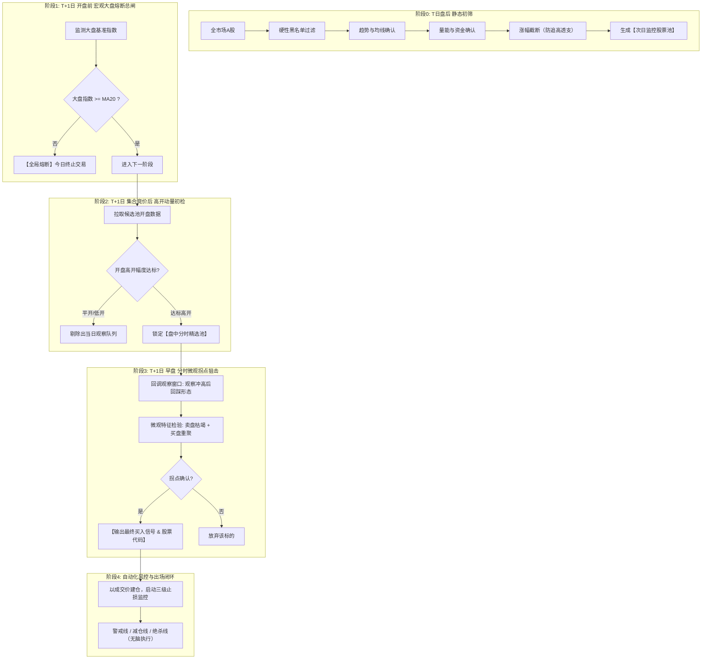

# 智能选股系统 · 选股漏斗示例 1：配置驱动的“收盘突破 → 次日早盘拐点”漏斗

> 文档 ID：`selection-funnel-example-1` · 类型：**漏斗模型示例**（案例说明，非规范）
> 系列定位：本示例是「收盘突破 → 次日早盘拐点」战法的**唯一示例文档**。该战法的全部案例口径——业务叙事、问财语句、四层漏斗、示例取值、微观特征分级建议、模块划分、时点契约、参数化评估与功能提炼——统一收敛于此，不再另设并列示例文档。
> 边界：文中所有阈值、时点、权重与模块划分均为**示例口径**，**不构成系统规范、出厂模板或硬编码**。规范以[《智能选股系统 · 功能建设规范》](./selection-system-specification.md)（`SPEC-ALGO-ISS-001`）、[《智能选股系统 · 模型类型设计规范》](./selection-model-types-specification.md)（`SPEC-ALGO-ISS-MT-001`）与 [《智能选股系统 · 选股模型通用设计规范》](./selection-model-general-specification.md)（`SPEC-ALGO-003`）为准；本文只承载该战法的具体取值与实现建议，不复述规范口径。
> 唯一可执行配置：[`config/funnel_strategy.yaml`](../../../config/funnel_strategy.yaml)（策略 id `close_to_open_turning_point`）。

---

## 结论与规则评估

该策略适合作为短线候选生成器，不应直接等同于自动买入系统。日线突破、趋势、放量和资金流入负责压缩股票池；次日大盘门控和高开过滤负责避开弱环境；早盘回调与价格反转形态负责确认入场时机，并于窗口结束一次性收敛输出。供需拐点需在盘口契约落地后启用。

原始描述存在两组口径冲突，本示例配置选择：

- “收盘创 20 日新高”，而不是后文提到的 60 日新高；修改 `breakout_high.lookback` 即可切换。
- 高开 1%～2%；如果实际意图是“任何正高开”，把 `gap_range.min` 改成 `0`，把 `max` 改成 `null`。

“今日量大于昨日量”只代表单日放量，不等于“量能持续放大”。两者在配置中并存、可组合：单日口径由 `volume_expansion`（`series_compare`）表达，持续口径由 `volume_sustained_expansion`（近 N 日均量 / 前 M 日均量）表达，默认关闭，按需启用并按需调参。

## 一、战法业务叙事（五阶段时序闭环）

系统的核心逻辑不是在单一时间点做决策，而是**以时间切片为导向的多级漏斗状态机**。业务上可归纳为五个阶段：



**与规范骨架的映射**：上图的五阶段业务叙事与 [`SPEC-ALGO-003` §3](./selection-model-general-specification.md) 的 SFTC 阶段流水线、以及本示例的四层漏斗（`post_close → market_gate → opening_gap → turning_point`）是三套等价表述，对应关系如下：

| 业务叙事（Phase） | SFTC 阶段 | 本示例漏斗层 |
| :-- | :-- | :-- |
| 阶段0 盘后静态初筛 | Stage 0 Universe Gate + Stage 1 Signal Screen | `post_close` |
| — （候选截断） | Stage 1.5 Ranking | （声明态 `ranking`） |
| 阶段1 大盘熔断总闸 | Stage 2 Regime Gate | `market_gate` |
| 阶段2 高开动量初检 | Stage 3a 缺口过滤 | `opening_gap` |
| 阶段3 分时微观拐点 | Stage 3b 拐点识别 | `turning_point` |
| — （出票收敛） | Stage 3.5 Confirm & Publish | （`output_policy` 收敛于窗口结束） |
| 阶段4 风控出场闭环 | Stage 4 Risk Exit | （声明态 `risk_exit`） |

> **时点口径**：本示例的“阶段1 大盘熔断”在**开盘前**完成终判（见 §五时点契约），“阶段2 高开初检 / 阶段3 拐点”发生在开盘之后。规范侧对该顺序的约束（门禁须在竞价后、开盘前终判）见 [`SPEC-ALGO-003` §5.3 铁律三](./selection-model-general-specification.md)。

## 二、示例条件 → 系统模型映射

示例原文共四段要求，逐条映射如下（全部落在 `config/funnel_strategy.yaml` 的参数中，无硬编码）：

| # | 示例原文 | 漏斗阶段 | 规则类型 | 配置参数（可视化可微调） |
| :-- | :-- | :-- | :-- | :-- |
| 1 | 收盘价创 20 日新高 | `post_close` | `rolling_high` | `breakout_high.lookback=20` |
| 2 | 股价大于 60 日均线 | `post_close` | `above_sma` | `close_above_ma60.period=60` |
| 3 | 60 日均线向上 | `post_close` | `sma_slope` | `ma60_rising.period=60 / lag=1 / min_slope_pct=0.0` |
| 4 | 今日成交量大于昨日成交量 | `post_close` | `series_compare` | `volume_expansion.left_offset=-1 / right_offset=-2` |
| 4′ | 「量能持续放大」（原话） | `post_close` | `volume_sustained_expansion` | `window / baseline_window / min_ratio`（默认关闭） |
| 5 | 今日主力资金净流入 | `post_close` | `field_compare` | `main_fund_inflow`（`enabled=false`，契约未建立） |
| 6 | 非 ST | `post_close` | `text_exclude` | `exclude_st.tokens=[ST,*ST,退]` |
| 7 | 非北交所 | `post_close` | `symbol_prefix_exclude` | `exclude_bse.prefixes=[4,8,92]` |
| 8 | 流通市值大于 30 亿 | `post_close` | `field_compare` | `minimum_float_market_cap=3000000000` |
| 9 | 剔除当日涨幅 7% 以上 | `post_close` | `field_compare` | `daily_gain_below_7pct=7.0` |
| 10 | 盘后可能选出几十支「选择项很多」 | Stage 1.5 排序截断 | `rank` + Top-N | `ranking.top_n` + 六因子权重（见 §四） |
| 11 | 次日早盘大盘要站在 20 日均线上，否则不做 | `market_gate` | `market_above_sma` | `index_above_ma20.period=20`（veto：不通过整批停摆） |
| 12 | 开盘后选出高开 1～2 个百分点以上，只要高开都行 | `opening_gap` | `range` | `gap_range.min=1.0 / max=2.0`（“只要高开”改为 `min=0 / max=null`） |
| 13 | 早盘冲高回调、卖盘枯竭买盘增加的拐点 | `turning_point` | `intraday_turning_point` | `window_start / pullback_end / max_sell_ratio / min_buy_ratio` |
| 14 | 确认窗口内要出股票代码 | Stage 3.5 确认输出 | `output_policy` | `converge_at_window_end`（窗口结束一次性收敛） |
| 15 | 后面盈亏不管，按止损做 | Stage 4 风控离场 | `stop_ladder` | `-3% / -5% / -8%`（见 §四） |

**映射结论**：示例的 15 项要求**全部命中现有规则类型或阶段契约**；用户点名要参数化的项（新高周期、均线、高开区间、拐点窗口、止损阶梯）**已全部外置为配置参数**。这说明规范具备承载真实意图的完备性。唯一的“新增能力”是第 4′ 行的持续放量口径——它被实现为新增规则类型而非改写既有规则语义（见 §十缺口 G2）。

**问财收盘初筛自然语言口径（示例，即拷即用）**：

```text
收盘价创20日新高，股价大于60日均线，60日均线向上，今日成交量大于昨日成交量，今日主力资金净流入，非ST，非北交所，流通市值大于30亿，今日涨幅小于7%，今日涨幅大于0%
```

> 落地数据统一使用前复权日线，流通市值单位为元；关键字段缺失直接淘汰并标记数据不足。其中“60日均线向上”在本示例中取**单点比较 `MA60_t > MA60_{t-1}`（`lag=1`）**，与 `config/funnel_strategy.yaml` 及执行引擎一致（口径选型见 [`SPEC-ALGO-003` §6.2](./selection-model-general-specification.md)）。

## 三、四层漏斗与示例取值

### 3.1 四层漏斗

1. `post_close`（15:35 后）：非 ST、非北交所、流通市值大于 30 亿、当日涨幅小于 7%、创 N 日新高、收盘高于 MA60、MA60 向上、今日量大于昨日量（可选启用 `volume_sustained_expansion` 的持续放量口径）。15:05-15:30 为交易所清算期，复权因子未定盘，禁止使用；主力资金净流入为预留规则，因资金流契约未建立而暂不生效。
2. `market_gate`（次日开盘前）：默认以上证指数 `sh000001` 为大盘，指数实时价必须高于此前 20 个完整交易日收盘均值。门控失败时整批停止；基准指数可在配置中替换。
3. `opening_gap`（开盘后）：用开盘价相对昨收计算高开幅度，默认保留 1%～2%。
4. `turning_point`（早盘确认窗口，窗口结束收敛输出）：必须先有冲高回调段，再确认价格反转。

拐点采用双轨口径：正式信号必须使用真实主动买卖量，代理口径仅限调试预演并标记 `not_eligible_for_signal`，不得进入正式候选。本期无盘口契约，规则按 `min_confirmations: 0` 的形态版发布（回调 + 价格反转）；卖压衰减、主动买量增强、五档买盘优势为预留确认项，盘口契约落地后将 `min_confirmations` 改为 `1` 即恢复供需版。数据点不足时返回 `INSUFFICIENT_DATA`，不会产生买点。

### 3.2 阶段示例取值

> 下列数值（如 20 日、60 日、30 亿、7%、1%～2%、窗口时刻）均为**示例取值**，用于说明「哪些维度需要可配置」，**不是规范阈值**。参数化判定原则见 §九。

**阶段 0 · 盘后静态多维初筛**

| 维度 | 业务规则 | 量化逻辑（示例） | 示例取值 |
| :--- | :--- | :--- | :--- |
| **基础准入** | 剔除垃圾与低流动性 | `is_st == False` 且 `market not in ['BSE','BJ']` 且 `circ_mv >= min_mv` | 流通市值 ≥ 30 亿 |
| **中期趋势** | 处于中长期上升通道 | `Close > MA60` 且 `MA60_t > MA60_{t-1}` | 60 日均线，斜率步长 `lag=1` |
| **突破动能** | 创阶段新高（强势特征） | `Close_t >= HHV(Close, N)` | 回看周期 N=20（可扩展 N=60） |
| **量能共振** | 资金进场、温和放量 | `Volume_t > Volume_{t-1}` | 放量倍数 > 1.0 |
| **资金流向** | 主力资金净买入 | `NetInflow_main > 0` | 净流入 > 0（本示例 `enabled=false`，契约未建立） |
| **防追高截断** | 剔除加速大阳线 | `0% < ChangePct_t < cap` | 本金上限 7.0%（主板块差异化见规范 D-03） |

**阶段 1 · 大盘环境熔断（总闸机制）**

> 实战经验表明：**逆势做多，九死一生；大盘弱势时个股拐点容易变成“下跌中继”。**

- **检测标的**：上证指数 (`sh000001`) 或沪深300 / 全A指数（应为可配置项）；
- **熔断公式**：`IndexPrice >= MA(IndexPrice, N)`（均线周期应为可配置项，示例 N=20）；
- **动作逻辑**：通过 → 总闸开启；熔断 → 当日全流程终止，不做任何开仓；
- **时点**：须在**竞价结束后、开盘前**完成终判（隔夜跳空风险），盘后仅做预判供参考。

**阶段 2 · 高开动量初检（过滤与排序）**

- **运行时间**：开盘后即时（`opening_gap` 阶段）；
- **筛选目的**：从候选股中，通过开盘竞价态度快速收敛到核心观察标的；
- **量化规则（示例）**：
  1. 高开幅度 `OpenPct = (OpenPrice - PreClose) / PreClose`：硬门槛 `OpenPct > 0%`；示例「黄金进攻区间」`+1.0% ~ +3.0%`（高开过高易被兑现砸盘）；
  2. **竞价量能比（本示例新增建议项，原话未提及）** `AuctionVol / PreDayVol`：示例下限 `0.5% ~ 1.0%`（有真实量能支持，非几手试盘）。该维度依赖集合竞价数据，属二期增强。

**阶段 3 · 分时微观拐点**：取值与实现建议见 §四。

**阶段 4 · 风控出场**：示例阶梯 `-3% / -5% / -8%`，参数与双层结构见 §3.5。

### 3.3 高开区间三档预设（示例）

| 预设 | `gap_min` | `gap_max` | 说明 |
|---|---|---|---|
| 宽松档（“只要高开都行”） | 0.1% | 7.0% | 命中面大，但含大量弱高开与追高陷阱 |
| **示例默认（本示例配置）** | **1.0%** | **2.0%** | 对应“高开1~2个百分点”，上限防追高 |
| 严格档 | 2.0% | 4.0% | 仅取强高开，命中面最小 |

> 规范层对 `gap_max` 的**上限护栏**为强制要求（理由见 [`SPEC-ALGO-003` §2](./selection-model-general-specification.md)），但档位取值属示例口径；默认档与最终数值须回测标定。

### 3.4 Stage 1.5 排序因子与权重（声明态，示例）

| 因子 id | 计算 | 方向 | 权重 | 理由 |
|---|---|---|---|---|
| `breakout_strength` | `(close_T - max(high[T-20..T-1])) / pre_close` | + | 20% | 突破幅度越大，新高越“实”（非擦线新高） |
| `ma60_slope_norm` | 归一化 MA60 斜率（口径 C） | + | 20% | 中期趋势动能 |
| `volume_quality` | `vol_T / MA5(vol)` | + | 15% | 放量强度，非仅“比昨天多” |
| `inflow_intensity` | `main_net_inflow / amount` | + | 20% | 资金流入的相对强度，跨市值可比 |
| `change_pct_sweet` | 涨幅落在 [3%, 6%] 得满分，两端线性衰减 | 钟形 | 15% | 涨幅太小动能不足，太大追高风险 |
| `float_cap_score` | 流通市值在 [30亿, 300亿] 得满分 | 钟形 | 10% | 太小易操纵，太大弹性不足 |

> 权重为工程初值，**必须经回测标定**（见 §十）。截断阈值 `ranking.top_n=20`，落盘 `output/pools/watch_opening_reversal.csv`。

### 3.5 Stage 4 风控示例参数（声明态，示例）

**双层止损结构（受 T+1 约束）**：

- 第一层 · 当日仓位控制（可执行）：单票仓位上限（示例 `20%`，规范侧建议按板块差异化收紧，见 §十缺口）、同日总建仓上限 `40%`、最多同时持有 `3` 只；大盘弱势（五维健康度低于 `60`）仓位减半；`gap_pct` 越大单票仓位越小。
- 第二层 · 次日止损执行（真正的止损）：

| 阶梯 | 触发 | 动作 | 执行时点 |
|---|---|---|---|
| T0 警戒 | 浮亏 -3% | 标记，准备减仓 | 买入日日内监控（仅记录） |
| T1 减仓 | 浮亏 -5% | 减仓 50% | 次日开盘执行 |
| T2 绝杀 | 浮亏 -8% | 清仓 | 次日开盘执行 |
| T-Gap 跳空止损 | 次日开盘价已低于 -8% 线 | 无条件开盘价清仓，不等反弹 | 次日开盘瞬时 |
| T-Time 时间止损 | 次日收盘仍未盈利 | 清仓（超短线不养套牢票） | 次日尾盘 |

- 保本价：调用 `astock-action-execution` 技能，印花税 0.05% + 佣金万2.5（最低5元）+ 过户费，`math.ceil` 向上进位至分位。

## 四、拐点微观特征设计与 ERS 复合评分（示例口径）

> 用户痛点原文（示例来源）：“冲高之后，回调的时候要能够感受到卖盘枯竭，买盘增加的拐点。这个点很重要，要慢慢的优化。确认窗口内出股票代码。”

### 4.1 分时价格走势示意

```
分时价格走势示意图：
       冲高高点
         ▲
        / \
       /   \  回踩缩量（卖盘枯竭，缩量不破分时均线 VWAP）
开盘    \       ★ 买盘再起放量拐点（勾头向上）
              ▼──────▲
            回踩低点  \
                       └──► 窗口结束一次性收敛，锁定代码并出票买入
```

**个股日内阶段划分**：

```
开盘  open
   ↓      冲高段 (Rally)：价格从 open 上行至局部高点 P_peak
   ↓      识别条件：连续若干根 tick/1分钟K 未创新高
P_peak
   ↓      回调段 (Pullback)：价格从 P_peak 回落至局部低点 P_low
   ↓      识别条件：见下方 A/B/C 三组指标
拐点 →    买入触发
```

**关键约束**：
- 冲高段必须**真实存在**：`P_peak / open - 1` 须达到最小冲高幅度（示例 0.5%），否则不构成“冲高后回调”形态，直接跳过该股。
- 回调段起点 P_peak 需经若干根 bar 确认，故最早可能触发时刻晚于开盘。
- 若开盘即最高、全程单边下行（高开低走），**不触发** —— 这类形态是出货，不是洗盘。这条规则是本战法最重要的自我保护。

### 4.2 微观特征分级实现建议（可分级迭代）

将主观盘感「**卖盘枯竭、买盘增加**」解构为可计算的特征：

| 特征维度 | 盘感描述 | Level-1 基础分时版（示例实现） | Level-2 / Tick 级深度版（示例实现） |
| :--- | :--- | :--- | :--- |
| **价格形态** | 冲高回踩不破底，形成分时第二脚 | `P_pullback >= VWAP` 且 `P_low >= OpenPrice` | 回踩获 VWAP 支撑后，走出「1 分钟顶分型后的底分型」 |
| **卖盘枯竭** | 回踩时无大抛单，成交量骤降 | **分时量缩比**：回踩 1 分钟柱量 `< k ×` 冲高柱量 | **主动卖单衰减**：主动卖量连续 2~3 个 Tick 衰减超阈值，买盘挂单未被砸穿 |
| **买盘增加** | 企稳后有主动大单吃货，价格勾头 | **量价勾头**：出现首根阳线 1 分钟柱且量能放大 | **订单流失衡 OFI > 0**：买向吃单比率走高，主力大单主动向上扫盘 |

> **实现建议**：上述系数与阈值（缩量比、衰减比、OFI 阈值、Tick 数）**必须做成参数**，不得写死；成交量的真实主动买卖口径依赖盘口契约，缺失时应按 `UNKNOWN` 处理而非静默降级。

### 4.3 ERS 复合评分模型（示例实例）

> **说明**：ERS（Exhaustion-Reversal Score）是**复合评分模型的一个示例实例**。下列 A/B/C 三组指标、满分配额、权重、阈值与降级规则**全部为示例口径**；评分模型的**规范定义**（`scoring_rank` 类型的过滤层/评分层/排序层/输出层、权重归一化、三态求值）见 [`SPEC-ALGO-ISS-MT-001` §5](./selection-model-types-specification.md)。

**设计要点：不是一个指标，而是三组指标的综合评分，且要求多组同时达标，防止单侧偏科误判。**

**A组 · 卖盘枯竭分（满分 40）**

| 指标 | 计算方式 | 满分条件 | 权重 | 数据依赖 |
|---|---|---|---|---|
| **A1** 主动卖量衰减 | `S_vol(最近30s) / S_vol(前30s)` | ≤ 0.6 | 12 | TICK |
| **A2** 缩量回调 | `avg_vol(回调段每分钟) / avg_vol(冲高段每分钟)` | ≤ 0.5 | 10 | KLINE_MIN |
| **A3** 跌幅收窄 | 回调段连续 1分钟K 实体 `|Δ|` 递减根数 | ≥ 2 根 | 8 | KLINE_MIN |
| **A4** 卖单笔数衰减 | `S_count(最近30s) / S_count(前30s)` | ≤ 0.7 | 6 | TICK |
| **A5** 无大单砸盘 | 回调段是否存在单笔 `S_vol > 5 × 当日均笔量` | 不存在 | 4 | TICK |

> **A2「缩量回调」是这组指标的灵魂**：价格下跌但成交量萎缩，说明抛压在自然衰竭而非有资金出逃。这与“放量下跌”（真出货）形成鲜明对比，是区分洗盘/出货最有效的单一指标。

**B组 · 买盘增强分（满分 40）**

| 指标 | 计算方式 | 满分条件 | 权重 | 数据依赖 | 现状 |
|---|---|---|---|---|---|
| **B1** 主动买量回升 | `B_vol(最近30s) / B_vol(前30s)` | ≥ 1.5 | 12 | TICK | ✅ |
| **B2** 委买卖比回升 | `bid_vol(1-5) / ask_vol(1-5)` 从回调低点回升幅度 | ≥ +50% | 10 | L2_BOOK | ❌ **缺失** |
| **B3** 下方承接 | P_low 附近 ±0.2% 区间内的连续 B 单笔数 | ≥ 3 笔 | 8 | TICK | ✅ |
| **B4** VWAP 之上 | `current_price > 当日VWAP` | 成立 | 6 | KLINE_MIN | ✅ |
| **B5** tick 净买比转正 | `(B-S)/(B+S)`，最近 20 笔 | > 0 | 4 | TICK | ✅ |

**B2 缺失时的降级规则**（必须实现，否则模型跑不起来）：

```
若 L2_BOOK 不可用：
  B组满分 = 30（而非 40）
  ERS 总分满分 = 90
  触发阈值等比折算：threshold_effective = threshold_base × (90/100)
  即默认 65 → 58.5，取 59
  同时在信号输出中标注 "degraded: no_order_book"
```

> **五档数据其实“部分有”**：腾讯快照 `parts[9-28]` 已包含五档买卖价量，只是 `_parse_tencent_quote` 当前未解析这些字段。**补齐成本很低，建议优先做**，它直接决定 B2 这个 10 分指标能否启用。

**C组 · 形态位置分（满分 20）**

| 指标 | 计算方式 | 满分条件 | 权重 | 性质 |
|---|---|---|---|---|
| **C1** 回调不破开盘价 | `P_low > open` | 成立 | 8 | **硬条件（不满足直接否决）** |
| **C2** 回调深度合理 | `retrace = (P_peak-P_low)/P_peak` | ∈ [1.0%, 3.5%] | 6 | 软条件 |
| **C3** 缺口回补约束 | `P_low > close_T × (1 + gap_pct×0.5)` | 成立（回补不超一半） | 4 | 软条件 |
| **C4** 时间有效性 | 拐点时刻 | ∈ 观察窗口内 | 2 | 硬条件 |

> **C2 的钟形约束很重要**：回撤 < 1% 说明根本没洗盘，回调太浅后续动能存疑；回撤 > 3.5% 说明抛压过重，可能已转为出货。区间需回测标定。
>
> **C3 的缺口保护**：高开缺口被完全回补 = 高开失败，是明确的弱势信号。要求最多回补一半。

### 4.4 触发判定参考实现（示例）

```python
def check_trigger(stock, bars_min1, ticks, book) -> Signal | None:
    phase = detect_phase(bars_min1)          # RALLY / PULLBACK / NONE
    if phase != "PULLBACK":
        return None
    if not rally_valid(stock):               # 冲高段必须真实存在
        return None

    A = score_exhaustion(ticks, bars_min1)   # 0-40
    B = score_absorption(ticks, bars_min1, book)  # 0-40 或降级 0-30
    C, c_hard_ok = score_structure(stock, bars_min1)  # 0-20 + 硬条件

    if not c_hard_ok:                        # C1/C4 任一不满足 → 否决
        return None

    total_max = 100 if book else 90
    threshold = BASE_THRESHOLD * total_max / 100   # 默认 65 → 降级 59

    ers = A + B + C
    if ers < threshold:
        return None
    if A < A_MIN or B < B_MIN:               # 双侧达标，防单侧偏科
        return None

    # 二次确认：ERS 首次达标后，等下一根1分钟K确认
    if not pending_confirm(stock):
        mark_pending(stock, ers)
        return None
    if not confirm_bar(stock):               # 收阳 OR 高点 > 前一根高点
        return None

    return Signal(code=stock.code, price=current_price, ts=now(),
                  ers=ers, detail={A, B, C}, degraded=(book is None))
```

**三个防误判设计的必要性**：

1. **双侧达标**：若只要求总分，则可能“卖盘枯竭满分 + 买盘毫无动静”也达标 —— 那是阴跌无人接盘，不是拐点。
2. **二次确认（等下一根1分钟K）**：ERS 达标瞬间价格可能仍在下跌途中，抓在半山腰。等待“收阳或突破前一分钟高点”再确认，牺牲一点入场价换取显著胜率提升。代价是延迟最多 60s，仍在观察窗口内。
3. **冲高段有效性前置校验**：直接排除高开低走的出货形态。

### 4.5 多股排序与截断（Decision Engine）

- **窗口口径（示例）**：回调观察段 `09:30–09:35`、确认输出段 `09:35–09:40`、`09:40` 一次性收敛；窗口内命中只记待定候选，不作为信号锁存。
- **多股排序与截断（Top-K）**：若同时有多只股票出现拐点，按综合得分排序输出前 K 只。示例评分式：

  $$\text{Score} = w_1 \cdot \text{高开涨幅} + w_2 \cdot \text{回踩缩量程度} + w_3 \cdot \text{拐点放量力度} + w_4 \cdot \text{日线MA斜率}$$

  权重与 K 值均为可配置项；更完整的评分模型（ERS 复合评分 A/B/C 三组）见上文 §4.3。

## 五、时点契约与调度（示例口径）

> 规范侧对时点契约的**规范性要求**（每个条件必须声明数据依赖、由调度器推导最早可运行时点、杜绝未来函数）见 [`SPEC-ALGO-003` §5](./selection-model-general-specification.md)。下表的具体时钟取自本示例战法口径，实际时间点由用户在配置中参数化设定。

### 5.1 时点契约表（示例）

| 时刻 | 动作 | 依赖数据 | 产物 | 硬约束 |
|---|---|---|---|---|
| **T日 15:30** | 启动 Stage 0 + 1 | 日K、资金流、静态列表 | 原始候选集 | 资金流须待盘后结算完成，**不可早于 15:30** |
| T日 15:35 | Stage 1.5 排序截断 | 同上 | Watchlist Top-N | 落盘 `output/pools/` |
| T日 15:40 | Stage 2 大盘预判 | 指数日K | GO/NO-GO 预估 | 仅预判，供用户睡前决策 |
| **T+1 09:26** | Stage 2 门禁复核 | 指数实时快照 | **GO/NO-GO 终判** | 竞价结束后、开盘前完成，NO-GO 则终止全流程 |
| T+1 09:25 | 竞价异动预筛（**二期**） | 集合竞价归档数据 | 优先级重排 | 一期完成采集归档后，二期实现 |
| **T+1 开盘后** | Stage 3a 缺口过滤 | 全市场快照（仅N只） | 高开票子集 | 须在开盘后极短时延内完成 |
| T+1 早盘 | Stage 3b 拐点识别（回调观察窗口） | 1分钟K + tick + 五档 | ERS 评分流 → Triggered Set | 秒级轮询，N≤20 只；全程受理触发 |
| **T+1 观察窗口关闭** | 回调观察窗口关闭 | — | 停止受理新触发 | 此后触发的拐点作废 |
| T+1 确认窗口 | Stage 3.5 确认输出 | 触发集合 + 二次确认K | 最终股票代码清单 | 确认窗口；**窗口结束一次性收敛** |
| T+1 收敛后 | 下单执行 | Buy Signal List + 账户状态 | 成交回报 | 对接模拟盘/实盘下单 |
| T+1 全天 | 持仓监控 | 实时快照 | 风控状态 | 仅记录，**T+1不可卖** |
| T+2 开盘 | 止损执行 | 实时快照 | 卖出 | 最早可执行止损时点 |

### 5.2 监控调度时序（示例）

```
09:29:50  预加载 Watchlist，建立快照连接池
09:30:00  Stage 3a 批量快照 → GapPassed 子集
09:30:00  启动 N 个并行监控协程（每只一个）
          每只轮询：tick 每 3s / 1分钟K 每 60s / 快照每 1s
观察窗口   持续 ERS 评分，命中即记录触发（Triggered Set）
窗口关闭   停止受理新触发
确认窗口   对 Triggered Set 做最终确认
收敛时刻   一次性收敛，输出最终股票代码清单（Buy Signal List）
收敛后     下单执行（对接 astock-trade-paper 模拟盘 / 实盘）
```

**限流保护**：20 只 × 3s tick 轮询 ≈ 6.7 req/s，在腾讯源可承受范围内。若 GapPassed 超过并发上限，按 Stage 1.5 排序取前 N，其余记录为“未监控”（不可静默丢弃，须在日志中体现）。

## 六、输入数据契约与 CLI

阶段输入可以是 JSON 数组，也可以是：

```json
{
  "records": [{"code": "600001"}],
  "context": {"market": {"current_price": 3200, "completed_closes": [3180]}}
}
```

`post_close` 每条记录需要 `code/name/circulating_market_cap/change_pct/closes/volumes`；`main_net_inflow` 为预留字段，仅在资金流契约落地后要求。`opening_gap` 需要 `open/previous_close`。`turning_point` 需要 `minute_points`，每点至少含 `time/price/volume`；`buy_volume/sell_volume` 与 `order_book.bid_volume/ask_volume` 为预留字段，正式信号不得以代理值替代。

```bash
./bin/astock funnel validate --json
./bin/astock funnel run --stage post_close --input temp/funnel/post_close.json --save --json
./bin/astock funnel run --stage market_gate --input temp/funnel/market_gate.json --save --json
./bin/astock funnel run --stage opening_gap --input temp/funnel/opening_gap.json --save --json
./bin/astock funnel run --stage turning_point --input temp/funnel/turning_point.json --save --json
```

本示例的 CLI `archive`/`--save` 写入 `output/pools/funnel/<交易日>/<阶段>.json`，每条淘汰记录都包含失败规则及观测值。正式选股系统的归档路径统一为 `output/pools/selection-models/<signal_date>/`（见建设规范 §13.10），迁移期两路径并存。
一个阶段生成的 JSON 可以直接作为下一阶段的 `--input`；CLI 会读取其中的 `passed_records`，因此整条流水线无需手工摘取代码。
最终阶段的 `selected_codes` 即为窗口结束收敛后的股票代码列表；窗口内命中只记为待定候选，不作为信号锁存。

## 七、系统模块划分建议（示例）

为便于在本项目代码库中模块化落地，示例给出以下五组件划分（**仅为实现建议，非系统架构规范**；模块职责应按[主规范 §18/§19](./selection-system-specification.md) 的模块规划对齐）：

```
scripts/core/strategy/            # 示例目录，实际落点以主规范模块规划为准
├── post_screener.py       # 阶段0 盘后选股器（可接入本地K线或问财接口）
├── market_filter.py       # 阶段1 大盘环境熔断检测器
├── auction_picker.py      # 阶段2 高开动量过滤器
├── inflection_detector.py # 阶段3 分时微观拐点检测器（重点）
└── risk_guard.py          # 阶段4 阶梯止损与保本价风控监控器
```

> **现状注记**：上述为设计期模块划分建议；当前仓库中该战法的**实际执行引擎**为 `scripts/core/strategy/stock_funnel.py`（配置驱动），CLI 入口为 `scripts/core/commands/funnel_cmds.py`，配置文件为 [`config/funnel_strategy.yaml`](../../../config/funnel_strategy.yaml)。两者命名不同属建设期过渡，规范层不对此做目录约定。

## 八、引导式意图理解与歧义确认

示例要求系统“支持用户选股规则的智能分析，采用引导式理解用户选股意图，根据意图匹配选股类型与模型层级、规则和配置等构建，并在可视化配置中微调”，且“不明确信息的交互确认”。这一流程被显式化为**匹配确认清单**，五步如下：

1. **意图解析**：接收自然语言选股文案（如示例四段），结构化为待确认草稿；
2. **匹配清单**：列出匹配到的**选股类型**（`funnel` / `condition_tree` / …）、**模型层级**（对应 SFTC 阶段）、**规则清单**与**参数清单**，逐项展示默认值；
3. **歧义项标注**：凡无法从文案唯一确定的口径，一律单独列出并要求用户确认，**不允许系统静默选择口径**；
4. **逐项确认 / 微调**：用户在可视化配置中逐项确认或改参（例如把 `gap_range` 从 1～2% 改为“只要高开”）；
5. **生成草稿**：仅产出**待确认草稿**，草稿不得自动激活、不得自动调度、不得产生正式信号。

针对本示例，系统应标注的歧义项（示例即包含多处“口径不确定”）：

| 示例原文 | 歧义点 | 系统的处理方式 |
| :-- | :-- | :-- |
| “高开 1～2 个百分点**以上**，只要高开都行” | 下限/上限自相矛盾 | 标注歧义，要求确认是「1%～2%」还是「≥0 无上限」，不静默择一 |
| “量能**持续**放大” | 单日 vs 多日 | 标注歧义，建议启用 `volume_sustained_expansion`，并确认 N/M |
| “创 20 日新高” vs 后文“创 60 日新高” | 回看窗口冲突 | 标注歧义，默认 20 日，可切 `lookback` |
| “大盘站在 20 日均线上” | 指数口径 / 是否要求 MA20 向上 | 标注歧义，默认 `sh000001` 且不强制向上 |
| 观察窗口 / 确认窗口 | 窗口端点是否设软截止 | 标注歧义，默认不加软截止、窗口结束一次性收敛 |
| “主力资金净流入” | 资金流契约未建立 | 标注为“预留规则、暂不生效”，而非静默放行 |

## 九、参数化评估：判定原则与全量参数清单

> 本节回应「除点名的周期 / 时点 / 高开区间之外，示例中**其他参数是否也需要制成参数项**」。评估覆盖示例中全部数值、时点、词表、开关与组合逻辑，逐项给出「是否参数化」及其归属；评估范围不含规范本身的固定条款。

### 9.1 判定原则（四问）

对示例中的每个字面量依次发问，任一命中即按其归属处理：

| # | 判定问题 | 命中后的归属 |
| :-- | :-- | :-- |
| 1 | 该值是否会随用户**选股意图**变化？ | **入策略 Schema**，成为可调参数（可视化可改） |
| 2 | 该值是否属**交易所规则或数据契约**的固定事实？ | **平台级常量**，禁止入策略 Schema |
| 3 | 该值是否由其他参数**派生**得出？ | **编译期一致性校验**，不做独立参数 |
| 4 | 调错该值是否会**静默放行或绕过风控**？ | **引擎强制**，不开放为可调参数 |

### 9.2 已参数化（引擎真实读取，`config/funnel_strategy.yaml`）

| 阶段 | 参数 | 默认值 | 配置键 |
| :-- | :-- | :-- | :-- |
| 全局 | 时区 / Schema 版本 | `Asia/Shanghai` / `1` | `strategy.timezone` / `version` |
| `post_close` | 初筛起始时刻 | `15:35` | `stages[post_close].schedule` |
| `post_close` | 非 ST 词表 | `ST / *ST / 退` | `exclude_st.tokens`、`exclude_st.field` |
| `post_close` | 非北交所代码前缀 | `4 / 8 / 92` | `exclude_bse.prefixes` |
| `post_close` | 流通市值下限（元） | `3000000000` | `minimum_float_market_cap.value`（`op=gt`） |
| `post_close` | 当日涨幅上限（%） | `7.0` | `daily_gain_below_7pct.value`（`op=lt`） |
| `post_close` | 新高回看窗口 / 严格性 | `20` / `true` | `breakout_high.lookback` / `.strict` |
| `post_close` | MA 周期 / 严格性 | `60` / `true` | `close_above_ma60.period` / `.strict` |
| `post_close` | MA 斜率比较步长 / 阈值 | `lag=1` / `0.0%` | `ma60_rising.lag` / `.min_slope_pct` |
| `post_close` | 单日放量比较偏移 | `-1` vs `-2` | `volume_expansion.left_offset` / `.right_offset` |
| `post_close` | 持续放量 N / M / 最小倍数 / 启停 | `3` / `5` / `1.0` / `false` | `volume_sustained_expansion.window` / `.baseline_window` / `.min_ratio` / `.enabled` |
| `post_close` | 主力净流入阈值 / 启停 | `0` / `false` | `main_fund_inflow.value` / `.enabled` |
| `market_gate` | 门控窗口 | `09:30-09:35` | `stages[market_gate].schedule` |
| `market_gate` | 大盘基准 / 指数 MA 周期 | `sh000001` / `20` | `index_above_ma20.benchmark` / `.period` |
| `market_gate` | 指数价与历史收盘字段路径 | `market.current_price` / `market.completed_closes` | `index_above_ma20.price_field` / `.series_field` |
| `opening_gap` | 过滤窗口 | `09:30-09:31` | `stages[opening_gap].schedule` |
| `opening_gap` | 高开区间下限 / 上限 | `1.0%` / `2.0%`（`null` 即无上限） | `gap_range.min` / `.max`（`field=gap_pct`） |
| `turning_point` | 阶段窗口 | `09:36-09:40` | `stages[turning_point].schedule` |
| `turning_point` | 数据窗口起止 | `09:30` / `09:40` | `window_start` / `window_end` |
| `turning_point` | 回调段终点 / 确认段起点 | `09:35` / `09:36` | `pullback_end` / `confirm_start` |
| `turning_point` | 最少数据点 | `6` | `min_points` |
| `turning_point` | 回调幅度带 | `0.20%` ～ `2.00%` | `min_pullback_pct` / `max_pullback_pct` |
| `turning_point` | 卖压比上限 / 买量比下限 / 买盘比下限 | `0.75` / `1.20` / `1.20` | `max_sell_ratio` / `min_buy_ratio` / `min_book_ratio` |
| `turning_point` | 回调段 / 确认段最少点数 | `3` / `2` | `min_pullback_points` / `min_confirm_points` |
| `turning_point` | 必需形态 / 可选确认项 / 最少命中数 | `[pullback, price_reversal]` / 3 项 / `0` | `required` / `confirmations` / `min_confirmations` |
| `turning_point` | 输出策略 / 指标口径 | `converge_at_window_end` / `real_only_for_signal` | `output_policy` / `metric_policy` |
| 各阶段 | 阶段启停 / 组合逻辑 | `true` / `all` | `stages[].enabled` / `.logic`（`all` 或 `any`） |

### 9.3 「声明态」参数（Stage 1.5 / Stage 4）

示例文档宣称“全量参数化”，但 Stage 1.5 的截断阈值与 Stage 4 的止损阶梯此前只存在于规范层示例中，未落在示例 `config`。现补为两个**声明态**参数块（`status: declared`）：

| 参数块 | 关键参数 | 默认值 | 说明 |
| :-- | :-- | :-- | :-- |
| `ranking` | `top_n` | `20` | 盘后候选「选择项很多」的排序截断阈值；`persist_to` 落盘路径 |
| `ranking` | `factors[].weight` | 六因子 `0.20/0.20/0.15/0.20/0.15/0.10` | 截断排序因子与权重（见 §3.4） |
| `risk_exit` | `stop_ladder[].drawdown_pct` | `-3 / -5 / -8` | T0 警戒 / T1 减半 / T2 清仓三级阶梯 |
| `risk_exit` | `order_window.start` / `t1_constraint` | `09:40:00` / `true` | 收敛后才可下单；T+1 硬约束标记 |
| `risk_exit` | `intraday_controls.*` | `20% / 40% / 3` | 单票上限 / 单日上限 / 最大并发持仓 |
| `risk_exit` | `breakeven.round` | `ceil_to_cent` | 保本价强制向上进位至分，与实战三原则一致 |

> **状态标记的意义**：`status: declared` 表示参数已冻结、可视化配置可展示与校验，但**当前 `funnel_engine` 尚未实现 Stage 1.5 / Stage 4 两个阶段**（引擎仅支持 `candidate_filter` 与 `universe_gate` 两种 scope），因此该两块**不参与执行**。引擎落地后改为 `active` 并同构迁移，参数值不变。

### 9.4 判定为「不做策略参数」的项（含理由）

这些项**明确不进入策略 Schema**，否则会破坏口径一致性或制造风控绕过面：

| 项 | 现值 | 不做参数的理由（对应 9.1 的判定问号） | 正确归属 |
| :-- | :-- | :-- | :-- |
| 交易所清算期 | `15:05-15:30` | 问 2：交易所规则，非策略偏好；调错会用未定盘数据 | 平台级常量 + `TradeCalendar` |
| `post_close` 最早执行时刻 | `15:35` | 问 2：由清算期结束与数据水位共同决定 | 平台级 `UniverseWatermark` 门控 |
| 数据就绪判据 | 资金流为空则重试、不当作 0 | 问 2：数据契约语义 | 数据层契约 |
| 降级标记 | `not_eligible_for_signal` | 问 4：可调即等于可绕过信号定性 | 引擎强制 |
| 分钟数据源降级层级 | 4 级降级链 | 问 2：容灾链路，非策略语义 | 数据层 |
| 复权方式 / 市值单位 | 前复权 / 元 | 问 2：口径统一约定 | 数据层契约 |
| `min_points` 与两段点数之和 | `6` ≥ `3+2` | 问 3：派生一致性约束 | 编译期校验（不新增参数） |
| `strict` 的缺省值 | `true` | 问 1：本身可参数化，但缺省应由 Schema 固定 | 规则级 Schema 缺省值，避免逐处重复声明 |

### 9.5 判定为「应参数化但尚未形式化」的缺口

| 缺口 | 内容 | 处置 |
| :-- | :-- | :-- |
| 规则级 `parameter_schema` | 每条规则的可调参数、类型、取值范围与缺省值未形式化 | **G4**：可视化配置表单与编译期校验的前置依赖，规范 §1.4-6 待补 |
| 涨跌幅上限的板块差异化 | 示例配置为单值 `7.0`，规范裁定 D-03 为按板块差异化 | 已识别方向：本示例只做主板故保持单值；跨板块时按 `field_compare` 增维 |
| 单票仓位上限 | 示例声明态为 `20%`，规范侧建议按板块差异化收紧（主板 ≤15%、20cm ≤8%） | 待收敛：示例配置暂保持 `20%`，跨板块落地时按 `intraday_controls` 增维 |
| 阶段组合逻辑的嵌套 | 当前仅支持单层 `all/any` | 规划 T-01：升级为可嵌套 AND/OR/NOT group 节点 |
| 排序因子集合的可插拔 | 六因子目前为固定清单 | 与 `factor_synthesizer.py` 的因子注册机制对齐后开放 |

## 十、示例验证与功能提炼

### 10.1 示例来源与定位

本章记录一次“反向验证”：用户提供一份【选股示例】，要求把它作为系统中一种「漏斗模型 → 选股类型」的**新建示例**，用于检验智能选股系统设计规范的完善性。定位有且仅有三条：

1. **验证用途**：示例用于反向验证规范是否能把真实选股意图完整映射为“类型 + 层级 + 规则 + 参数”；
2. **示例中需要参数化的项**（如新高周期、开盘时点、高开区间等）**必须做成参数配置**，不得写死在逻辑里；
3. **本示例仅为案例说明与重要功能提炼，不构成系统的硬编码，也不作为系统规范**。规范以[《智能选股系统 · 功能建设规范》](./selection-system-specification.md)与 [`SPEC-ALGO-003`](./selection-model-general-specification.md) 为准。

### 10.2 重要功能提炼（从示例反推出的系统能力要求）

本示例对系统设计提出了七项刚性能力，均已在上文或规范中落点：

1. **全量参数化**：一切阈值与判定参数入配置并纳入 `definition_hash`；
2. **选股类型注册中心 + 层级漏斗**：意图先匹配“类型”，再编译为统一层级中间结构后执行；
3. **引导式意图理解 + 歧义确认**：文案→草稿，歧义项必须交互确认，禁止静默择口径；
4. **可视化配置微调**：确认清单中的每一项参数均可在工作台改参并预览；
5. **阶段分层与时点契约**：按“数据就绪时刻”切阶段（盘后初筛 / 次日门禁 / 开盘过滤 / 拐点 / 确认输出）；
6. **降级与信号定性**：盘口/资金流缺失时降级并携带 `not_eligible_for_signal`，候选清单 ≠ 正式信号；
7. **归档与可审计**：每阶段落盘，淘汰记录保留失败规则与观测值，支持事后追溯。

此外，示例还反向牵引出下列功能点（提炼为需求，不构成硬编码或规范数值）：

| 编号 | 功能点 | 对应规范 |
|---|---|---|
| F1 | 阶段化流水线须支持**跨时段候选传递**（盘后 → 次日早盘） | [主规范 §9](./selection-system-specification.md)、[模型类型规范 §4](./selection-model-types-specification.md) |
| F2 | 所有阈值（新高周期、均线、涨幅上限、高开区间、止损阶梯、缩量比、OFI 阈值）须**全量参数化** | [主规范 §7](./selection-system-specification.md) |
| F3 | 群体阈值须**板块差异化**（主板/20cm 涨跌幅上限不同） | [`SPEC-ALGO-003` §6.2](./selection-model-general-specification.md) |
| F4 | 盘口缺失时微观特征须判 `UNKNOWN` 而非静默降级，正式信号须用真实主动买卖量 | [主规范 §7.7](./selection-system-specification.md) |
| F5 | 窗口口径须统一（回调观察 / 确认输出 / 收敛输出三点）并支持**窗口结束一次性收敛** | [`SPEC-ALGO-003` §3](./selection-model-general-specification.md) |
| F6 | 保本价须计入全部税费并**向上进位至分位**；止损须三级阶梯化 | [主规范 §12.3](./selection-system-specification.md) |
| F7 | 文案入口须走**引导式意图匹配确认清单**，歧义项（如「只要高开」）须交互确认 | [主规范 §3.4.1](./selection-system-specification.md) |

### 10.3 缺口与现状（反向验证结论）

| 编号 | 反向验证暴露的问题 | 现状与处置 |
| :-- | :-- | :-- |
| **G1** | 窗口口径在示例、规范 §3 流水线图、§7.3 调度三处不一致 | **已统一**：回调观察段 / 确认输出段 / 窗口结束一次性收敛三口径，并新增 Stage 3.5；旧「软截止」口径废止（见 [`SPEC-ALGO-003` §3](./selection-model-general-specification.md)） |
| **G2** | 示例原话「量能持续放大」与公式「今日量＞昨日量」不一致 | **已补能力**：新增 `volume_sustained_expansion` 规则（近 N 日均量 / 前 M 日均量，全参数化），与单日 `volume_expansion` 并存，默认关闭 |
| **G3** | 「主力资金净流入」缺资金流数据契约 | **预留**：`main_fund_inflow` 保持 `enabled=false`，契约落地后改回 `true` 即生效；缺失不得当作 0 |
| **G4** | 规则级参数 Schema 尚未定义（每条规则的可调参数未形式化） | **建设任务**：属规范 §1.4-6 待补项，是可视化配置与编译期校验的前置依赖 |
| **G5** | 示例文档宣称“全量参数化”，但 Stage 1.5 的 `top_n` 与 Stage 4 的 `stop_ladder` 只在规范 §9 中，未落在示例 `config` | **已补齐**：在 `config/funnel_strategy.yaml` 增加 `ranking` 与 `risk_exit` 两个**声明态**参数块（`status: declared`），使“全量参数化”在配置层单点成立（见 §9.3） |

> **结论**：除 G4 属构建期待补项、G3 属外部契约依赖外，示例的全部判定要求均已能被现有设计无损承载。这反向验证了「模型类型 + 层级漏斗 + 谓词模型 + 全量参数化」这套规范的**完备性与可扩展性**——新增意图既可复用既有规则，也可仅通过**新增规则类型 + 注册**扩展，无需改动引擎。

### 10.4 必须回测标定的参数（工程初值，禁止直接实盘）

| 参数 | 初值 | 标定方法 |
|---|---|---|
| ERS `base_threshold` | 65 | 网格搜索 [50, 80]，以胜率×盈亏比为目标 |
| ERS `a_min / b_min` | 20 / 20 | 同上，二维网格 |
| `retrace_band` | [1.0%, 3.5%] | 统计历史回调深度分布，取 P20-P80 |
| `gap_max` | 2.0% | 分组统计不同高开幅度的次日收益 |
| `top_n` | 20 | 权衡信号覆盖率与限流风险 |
| Stage 1.5 六因子权重 | 见 §3.4 | 滚动 IC 加权（复用 `factor_synthesizer.py`） |
| `change_pct_sweet` | [3%, 6%] | 分组统计 |

> 正式使用前必须做滚动样本外验证，至少统计候选数、收敛后收益分布、次日/3日胜率、最大不利变动和不同大盘状态下的分层表现；不能用同一段数据既调拐点参数又宣称有效。

---

## 附：关联索引

- 选股模型通用设计规范（本示例的抽象层 SSOT）：[`selection-model-general-specification.md`](./selection-model-general-specification.md)（`SPEC-ALGO-003`）
- 主规范（系统建设）：[`selection-system-specification.md`](./selection-system-specification.md)（`SPEC-ALGO-ISS-001`）
- 模型类型设计规范：[`selection-model-types-specification.md`](./selection-model-types-specification.md)（`SPEC-ALGO-ISS-MT-001`）
- 可执行配置：[`config/funnel_strategy.yaml`](../../../config/funnel_strategy.yaml)
- 实施进度看板：[`SPEC-ALGO-003` 看板](../specs/algorithm/general-selection-and-turning-point-plan.md)、[`SPEC-ALGO-ISS-001` 看板](../specs/algorithm/selection-system-plan.md)