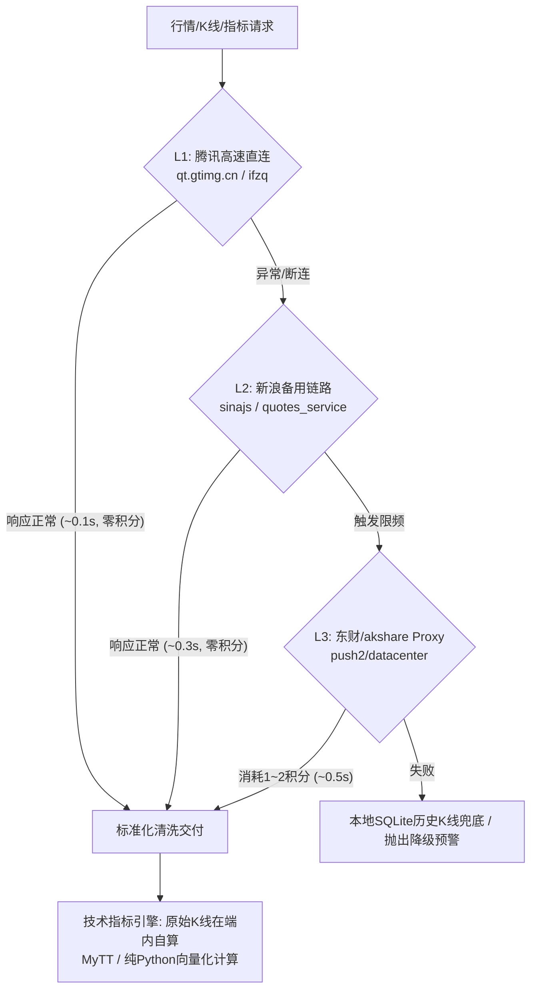

# A-Stock 行情数据接口与全周期技术指标规范 (market-data-api-specification)

> **文档类别**：工程技术与数据接口规范 (Specification)  
> **单一真理来源 (SSOT)**：`scripts/core/data/data_bridge.py` & `scripts/core/indicators/technical_indicators.py`  
> **实施进度看板**：[`SPEC-DATA-001`](../../specs/data/market-data-sync-implementation-plan.md)

---

## 一、 架构总览与 4 级容灾分层

为保障系统在量化回测、实盘盯盘与多智能体对抗研判场景下的高可用性，彻底消除外部数据源单点故障（SPOF），A-Stock Agents 建立如下 4 级降级与端内闭环计算规范：

### 1. 数据源能力矩阵

| 梯队 | 数据源代表 | 核心覆盖场景 | 响应耗时 | 成本属性 | 依赖/风控策略 |
| :--- | :--- | :--- | :---: | :---: | :--- |
| **L1** | **腾讯行情 (Tencent)** | 实时快照、日/周/月K、1~60m分钟K、分笔Tick | 50~150ms | **零成本** | 零第三方依赖、无反爬拦截、项目默认主力源 |
| **L2** | **新浪财经 (Sina)** | 实时快照、全周期K线、板块行业 | 200~400ms | **零成本** | 需配置 Referer 防盗链与浏览器 UA，作为备用降级源 |
| **L3** | **东方财富 (Eastmoney)** | CYQ筹码分布、资金流向、龙虎榜、涨跌停池 | 400~1500ms | **消耗积分** | 需走 Proxy 补丁防封禁（单次 1~18 分），限频使用 |
| **L4** | **DangInvest / efinance** | 行业板块排行、新闻快讯、部分基本面 | 200~500ms | **零成本** | 提供板块宏观与新闻情绪补充 |
| **本地** | **内置指标引擎** | MA/MACD/KDJ/RSI/BOLL/ATR/二次金叉/缺口等 | 1~5ms | **零成本** | **绝不请求外部黑盒指标接口**，原始K线原地闭环计算 |

---

## 二、 实时行情快照接口规范

### 1. 腾讯高速快照协议 (L1 主力)
- **协议端点**：`GET http://qt.gtimg.cn/q={symbols}`
- **标的编码契约**：必须携带规范化市场前缀（沪市 `sh`、深市 `sz`、北交所 `bj`、港股 `hk`）。支持单次请求批量拼接多个代码（如 `sh600519,sz000001,sh000001`）。
- **编码格式**：GBK 编码，以 `\n` 分隔股票记录，单行以 `~` 分隔字段。
- **标准化字段映射字典**：

| 索引位置 | 字段定义 | 数据类型 | 业务说明与转换规则 |
|:---:|:---|:---:|:---|
| `parts[1]` | `name` | string | 证券简称（如“贵州茅台”） |
| `parts[2]` | `code` | string | 6位数字证券代码（如“600519”） |
| `parts[3]` | `price` | float | **最新现价** |
| `parts[4]` | `prev_close` | float | 昨日收盘价（昨结） |
| `parts[5]` | `open` | float | 今日开盘价 |
| `parts[6]` | `volume` | float | 成交量（手） |
| `parts[30]` | `timestamp` | string | 数据时间戳（格式 `YYYYMMDDHHMMSS`） |
| `parts[31]` | `change` | float | 涨跌额（现价 - 昨收） |
| `parts[32]` | `change_pct` | float | 涨跌幅（百分比字符串，如 `"2.77"`） |
| `parts[33]` | `high` | float | 当日最高价 |
| `parts[34]` | `low` | float | 当日最低价 |
| `parts[37]` | `amount` | float | 成交额（万元，系统内标准化乘 10000 换算为元） |
| `parts[38]` | `turnover_pct` | float | 换手率（%） |
| `parts[39]` | `pe` | float | 市盈率 PE（动态） |
| `parts[44]` | `outer_vol` | float | 外盘成交量（手） |
| `parts[45]` | `inner_vol` | float | 内盘成交量（手） |
| `parts[46]` | `pb` | float | 市净率 PB |

### 2. 新浪实时快照协议 (L2 备用)
- **协议端点**：`GET https://hq.sinajs.cn/list={symbols}`
- **防盗链要求**：Header 必须包含 `Referer: https://finance.sina.com.cn`。
- **返回格式**：逗号分隔的字符串序列，包含名称、开盘、昨收、现价、最高、最低、买一至买五、卖一至卖五挂单。

---

## 三、 全周期 K 线数据接口规范

### 1. 腾讯前复权日 / 周 / 月 K 线 (L1)
- **协议端点**：`GET http://web.ifzq.gtimg.cn/appstock/app/fqkline/get?param={symbol},{unit},,{end_date},{count},qfq`
- **参数约束**：
  - `symbol`：带市场前缀代码（如 `sz000001`）；
  - `unit`：周期单位，日线 `day`、周线 `week`、月线 `month`；
  - `end_date`：截止日期（`YYYY-MM-DD`，当天可为空）；
  - `count`：请求条数（默认 120~250 根，单次上限约 320 根）；
  - `qfq`：前复权标识（个股必传）。
- **字段排列陷阱与规约**：
  - **个股节点**：`data[symbol]["qfqday"]`；
  - **指数节点**：指数不复权，节点固定为 `data[symbol]["day"]`；
  - **元素索引顺序**：
    `[0: 日期, 1: 开盘价 open, 2: 收盘价 close, 3: 最高价 high, 4: 最低价 low, 5: 成交量 volume]`
    *(⚠️ 强制规约：腾讯收盘价位于索引 2，最高价位于索引 3，与传统 OHLC 顺序不同，解析时必须严格适配)*。

### 2. 分钟级 K 线 (1m / 5m / 15m / 30m / 60m)
- **协议端点**：`GET http://ifzq.gtimg.cn/appstock/app/kline/mkline?param={symbol},m{interval},,{count}`
- **参数约束**：`m{interval}` 支持 `m1`、`m5`、`m15`、`m30`、`m60`。
- **返回节点**：`data[symbol]["m" + interval]`。

---

## 四、 本地闭环技术指标计算标准

为避免外部黑盒指标的公式差异与延迟，全系统统一基于原始 OHLCV 数据原地计算：

| 指标名称 | 计算公式与算法参数标准 | 核心输出字段 | 业务阈值与判定 |
| :--- | :--- | :--- | :--- |
| **MA** | 简单移动平均 $MA_N = \frac{1}{N}\sum_{i=0}^{N-1} Close_{t-i}$，取 $N=5,10,20,60$ | `ma5, ma10, ma20, ma60` | 多头排列 / 空头排列 |
| **EMA** | 指数平滑移动平均 $EMA_N = \alpha Close_t + (1-\alpha)EMA_{t-1}, \alpha = \frac{2}{N+1}$，取 $N=12,26$ | `ema12, ema26` | 趋势强弱 |
| **MACD** | $DIF = EMA_{12} - EMA_{26}, DEA = EMA_{9}(DIF), Bar = 2 \times (DIF - DEA)$ | `dif, dea, macd_bar` | 零轴上/下金叉、死叉 |
| **KDJ** | $RSV = \frac{C - L_9}{H_9 - L_9} \times 100, K = \frac{2}{3}K_{t-1} + \frac{1}{3}RSV, D = \frac{2}{3}D_{t-1} + \frac{1}{3}K, J = 3K - 2D$ | `kdj_k, kdj_d, kdj_j` | 超买 (>80) / 超卖 (<20) |
| **RSI** | 相对强弱指标，参数 6 / 12 / 24 | `rsi6, rsi12, rsi24` | 超买 (>80) / 超卖 (<20) |
| **BOLL** | 中轨 $MA_{20}$，上下轨 $MA_{20} \pm 2 \times \sigma_{20}$ | `boll_upper, boll_mid, boll_lower` | 触轨突破 / 带宽收口 |
| **ATR** | 真实波幅均值，周期 14 / 20 | `atr` | 波动率仓位管理与阶梯止损 |
| **二次金叉** | 零轴下方两次金叉、波谷极值抬高、绿柱动能缩减 | `verdict (A/B/C)` | 水下二次金叉决策树 |
| **缺口分析** | 当日开盘价与前日收盘价跳空且未被极值回补 | `gaps, latest_gap, count` | 突破性缺口 / 衰竭缺口 |

---

## 五、 调用量级评估与容量规划

### 1. 典型业务场景单次调用负载
- **个股单次全面体检**：3 次 HTTP 请求（实时快照 + 120日K + 行业），耗时 ~0.3s，流量 < 25 KB；
- **多智能体多空辩论**：3~4 次 HTTP 请求（快照 + K线 + CYQ筹码 + 公告），耗时 ~0.6s，流量 < 45 KB；
- **三级股池盘中监控 (30只)**：1 次批量快照请求，耗时 ~0.15s，流量 < 15 KB；
- **全市场 5A 因子扫盘 (5000+只)**：分批切片（600只/批，8线程并发），共 9~10 次批量请求，耗时 1.8~3.2s，流量 ~3.5 MB。

### 2. 缓存分级与风控频控
1. **内存短效缓存 (`_KLINE_CACHE`)**：600 秒 TTL，同会话内多 Agent 分析命中率 > 80%；
2. **本地持久化存储 (`local/`)**：SQLite 嵌入式存储与快速 JSON 镜像，日内离线计算耗时 < 5ms；
3. **东财代理积分保护**：严格限制 `hook_domains`，禁止全市场拉取走代理（单次 12~18 分），全市场扫描 100% 走腾讯零积分链路。
