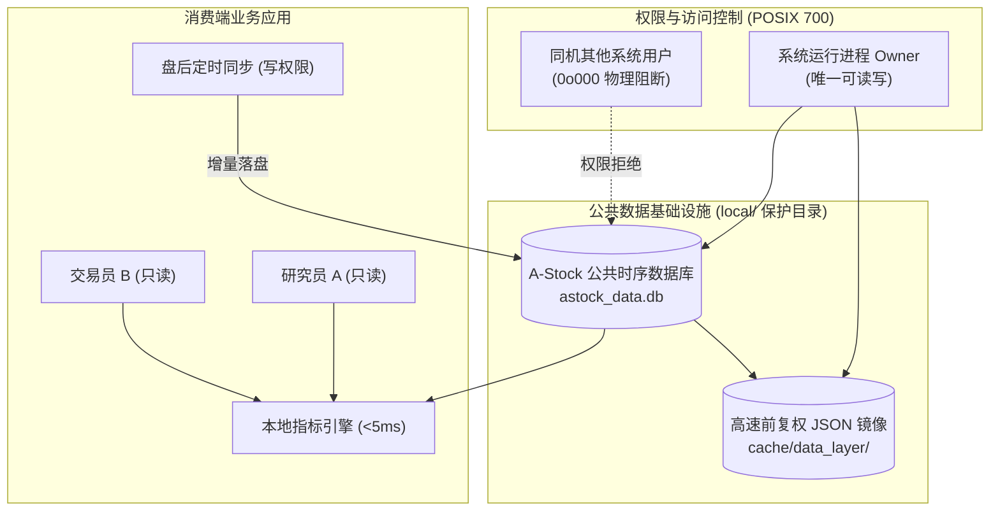

# A-Stock 行情数据 · 本地同步与安全隔离规范 (Market Data Sync & Isolation Specification)

> **文档类别**：工程技术与系统架构规范 (Specification)  
> **单一真理来源 (SSOT)**：`scripts/core/data/sync_engine.py` & `scripts/core/workspace.py`  
> **实施进度看板**：[`SPEC-DATA-001`](../../specs/data/market-data-sync-implementation-plan.md)  
> **所属文档簇**：`A-Stock 行情数据`（中枢：[`market-data-api-specification.md`](./market-data-api-specification.md)，`SPEC-DATA-001`）

---

## 一、 架构定位与设计哲学

为保障全系统技术指标计算一致性、防止多用户并发拉取触发外部 API 频控，并严格遵循项目“零全局污染”与数据安全原则，本地数据同步机制确立以下核心架构哲学：



1. **公共市场数据共享原则**：行情快照、日K线与大盘指数属于公共基础设施，全系统所有用户、角色与 Agent 统一共享同一份时序底座，杜绝重复下载与数据分裂；
2. **私有资产物理隔离原则**：用户个人的持仓档案、自选股列表、交易流水与研究报告严格隔离于 `output/` 个人交付区，不与公共时序数据混合；
3. **数据安全防泄漏原则**：公共基础设施统一归集于根目录 `local/`，采用操作系统级 POSIX 权限阻断，并在版本控制与发布打包中 100% 排除。

---

## 二、 同步调度与时钟驱动策略

A 股交易具有严格的周期时序性，数据同步引擎依时钟状态机运转：

### 1. 交易日时钟状态机
- **盘前阶段 (00:00 - 09:15)**：静默期。禁止任何无意义的外网日线轮询；允许执行本地时序断点检测；
- **盘中阶段 (09:15 - 15:00)**：实时盯盘期。**严禁执行全量日 K 线同步**；仅允许以“动态内存 Bar”记录当前分时状态，不覆盖已定盘的离线历史日K；
- **盘后清算期 (15:05 - 15:30)**：交易所清算期。数据源处于大宗交易与盘后定价结算状态；
- **定盘归档期 (15:35 之后)**：**主同步窗口**。交易所日 K 与复权因子正式定盘，触发增量同步任务，落盘固化当日数据；
- **非交易日 (周末/节假日)**：跳过日线增量同步，仅按需执行“历史完整性深度审计与坏账修补”。

### 2. 标的池优先级调度 (Tiered Universe)
- **P0 核心持仓 (`holdings`)**：最高优先级，保留 250 交易日深度，每日 15:35 优先完成；
- **P1 重点自选/关注 (`watchlist/focus`)**：高优先级，保留 120 交易日深度，每日 15:40 完成；
- **P2 大盘指数 (`indices`)**：上证指数、深证成指、创业板指、科创50、沪深300；
- **P3 全市场标的 (`universe`)**：按需分批执行，采用并发度 8、批大小 600 进行流控。

---

## 三、 数据完整性稽核与自愈算法

系统内置 `TradeCalendar` 交易日历工具与断点探测器，算法流程如下：

### 1. 交易日历基准对齐
1. 过滤周末（周六/周日）与法定节假日；
2. 提取基准指数（`sh000001`）实际发生开市的交易日集合 $D_{ref}$ 作为真值标准。

### 2. 缺漏（Gap）与坏点探测算法
对于目标标的 $S$，其本地时序范围为 $[T_{min}, T_{max}]$，本地日期集合为 $D_S$：
1. **期望交易日集合**：$D_{expected} = \{ d \in D_{ref} \mid T_{min} \le d \le T_{max} \}$；
2. **缺漏切片检测**：$Gaps = D_{expected} \setminus D_S$；
3. **坏点检测**：遍历记录，检查收盘价 $Close \le 0$ 或开高低收存在空值/零值的记录。
4. **状态评级**：
   - 若 $Gaps = \emptyset$ 且无坏点 $\to$ `🟢 healthy`（数据健康完整）；
   - 若 $|Gaps| > 0$ 或存在坏点 $\to$ `🔴 degraded`（存在断点缺漏）。

### 3. 靶向自愈与重构 (Auto-Repair)
对评级为 `degraded` 的标的，自动激活靶向重取流程，拉取覆盖断点区间的完整前复权切片，通过 SQLite `ON CONFLICT DO UPDATE` 机制实施原子合并与缝合。

---

## 四、 本地存储与多用户安全隔离规范

### 1. 存储架构设计
存储介质选用 Python 标准库内置的嵌入式 SQLite（零外部依赖），主文件位于 `local/market_data/astock_data.db`。

#### 核心数据表 Schema 规范
```sql
-- 1. 核心日K线表
CREATE TABLE IF NOT EXISTS daily_kline (
    symbol TEXT NOT NULL,
    date TEXT NOT NULL,
    open REAL NOT NULL,
    close REAL NOT NULL,
    high REAL NOT NULL,
    low REAL NOT NULL,
    volume REAL NOT NULL,
    amount REAL DEFAULT 0.0,
    turnover_pct REAL DEFAULT 0.0,
    pe REAL DEFAULT 0.0,
    pb REAL DEFAULT 0.0,
    PRIMARY KEY (symbol, date)
);
CREATE INDEX IF NOT EXISTS idx_kline_symbol_date ON daily_kline (symbol, date);
CREATE INDEX IF NOT EXISTS idx_kline_date ON daily_kline (date);

-- 2. 同步元数据水位线表
CREATE TABLE IF NOT EXISTS sync_meta (
    symbol TEXT PRIMARY KEY,
    last_sync_date TEXT,
    row_count INTEGER DEFAULT 0,
    min_date TEXT,
    max_date TEXT,
    integrity_status TEXT DEFAULT 'unknown',
    updated_at TEXT
);
```

### 2. `local/` 目录安全加固规范
```
local/                              # POSIX权限: 700 (drwx------)
├── README.md                       # 安全声明与拓扑文档 (权限: 600)
├── market_data/                    # 公共行情时序数据 (权限: 700)
│   └── astock_data.db              # SQLite 时序库 (权限: 600)
├── cache/                          # 高速计算缓存 (权限: 700)
│   └── data_layer/                 # 日K JSON 镜像 (权限: 600)
└── server/                         # 服务端用户与会话数据 (权限: 700)
    └── chats.db                    # 账号、角色、会话数据库 (权限: 600)
```

#### 安全三防机制
1. **POSIX 权限物理阻断**：
   - 目录设为 `0o700`，数据文件设为 `0o600`；
   - 系统中其他非 root 用户无法查看目录列表、无法读取数据库内容，防止密码哈希或量化数据泄漏；
   - `scripts/core/workspace.py` 与 `scripts/core/config.py` 启动时自动执行 `enforce_secure_permissions()` 加固。
2. **Git 版本控制完全忽略**：
   - `.gitignore` 与 `.dockerignore` 显式写入 `local/`，杜绝本地时序库与用户账户入库。
3. **打包发布自动化排除**：
   - 打包脚本 `scripts/tools/pack.py` 的 `EXCLUDE_DIRS` 强制排除 `"local"`。
