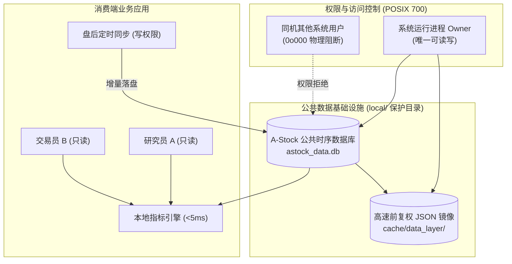

# A-Stock 行情数据 · 本地同步与安全隔离规范 (Market Data Sync & Isolation Specification)

> **文档类别**：工程技术与系统架构规范 (Specification)  
> **单一真理来源 (SSOT)**：`scripts/core/data/sync_engine.py` & `scripts/core/workspace.py`  
> **实施进度看板**：[`SPEC-DATA-001`](../../specs/data/market-data-sync-implementation-plan.md)  
> **所属文档簇**：`A-Stock 行情数据`（中枢：[`market-data-api-specification.md`](./market-data-api-specification.md)，`SPEC-DATA-001`）
> **关联控制面**：[`SPEC-UI-003`](../../specs/ui/market-data-sync-control-console-plan.md)（[行情数据同步控制台交互规范](../ui/market-data-sync-control-console-specification.md)）

---

## 一、 架构定位与设计哲学

为保障全系统技术指标计算一致性、防止多用户并发拉取触发外部 API 频控，并严格遵循项目“零全局污染”与数据安全原则，本地数据同步机制确立以下核心架构哲学：


```mermaid
graph TD
    subgraph "公共数据基础设施 (local/ 保护目录)"
        Store[(A-Stock 公共时序数据库<br>astock_data.db)]
        Cache[(高速前复权 JSON 镜像<br>cache/data_layer/)]
    end

    subgraph "权限与访问控制 (POSIX 700)"
        Owner["系统运行进程 Owner<br>(唯一可读写)"]
        Others["同机其他系统用户<br>(0o000 物理阻断)"]
    end

    subgraph "消费端业务应用"
        User1["研究员 A (只读)"]
        User2["交易员 B (只读)"]
        Cron["盘后定时同步 (写权限)"]
        Indicators["本地指标引擎 (<5ms)"]
    end

    Owner --> Store
    Owner --> Cache
    Others -. 权限拒绝 .-> Store

    Cron -->|增量落盘| Store
    Store --> Cache
    Store --> Indicators
    User1 --> Indicators
    User2 --> Indicators
```

1. **公共市场数据共享原则**：行情快照、日K线与大盘指数属于公共基础设施，全系统所有用户、角色与 Agent 统一共享同一份时序底座，杜绝重复下载与数据分裂；
2. **私有资产物理隔离原则**：用户个人的持仓档案、自选股列表、交易流水与研究报告严格隔离于 `output/` 个人交付区，不与公共时序数据混合；
3. **数据安全防泄漏原则**：公共基础设施统一归集于根目录 `local/`，采用操作系统级 POSIX 权限阻断，并在版本控制与发布打包中 100% 排除。

---

## 二、 同步调度与时钟驱动策略

A 股交易具有严格的周期时序性，数据同步引擎依时钟状态机运转：

### 1. 交易日时钟状态机
- **盘前阶段 (00:00 - 09:15)**：静默期。禁止任何无意义的外网日线轮询；允许执行本地时序断点检测；
- **盘中阶段 (09:15 - 15:00)**：实时盯盘期。**严禁执行全量日 K 线同步**；仅允许以“动态内存 Bar”记录当前分时状态，不覆盖已定盘的离线历史日K；
- **盘后清算期 (15:05 - 15:30)**：交易所清算期。数据源处于大宗交易与盘后定价结算状态；
- **定盘归档期 (15:35 之后)**：**主同步窗口**。交易所日 K 与复权因子正式定盘，触发增量同步任务，落盘固化当日数据；
- **非交易日 (周末/节假日)**：跳过日线增量同步，仅按需执行“历史完整性深度审计与坏账修补”。

### 2. 标的池优先级调度 (Tiered Universe)
- **P0 核心持仓 (`holdings`)**：最高优先级，保留 250 交易日深度，每日 15:35 优先完成；
- **P1 重点自选/关注 (`watchlist/focus`)**：高优先级，保留 120 交易日深度，每日 15:40 完成；
- **P2 大盘指数 (`indices`)**：上证指数、深证成指、创业板指、科创50、沪深300；
- **P3 全市场标的 (`universe`)**：交易日默认 `16:00` 执行全市场增量同步，同时允许控制台按市场或代码选择手动同步；采用默认并发度 8、批大小 600 进行流控。

### 3. P3 全市场同步与资源仲裁

1. **自动任务**：仅在交易日按有效设置中的固定时间触发，默认 `16:00`；自动任务只允许增量模式，非交易日直接跳过；
2. **手动任务**：允许选择全市场、沪市、深市、北交所或指定代码，支持增量同步、完整性审计与缺漏修复；全量重构属于高负载操作，必须由控制面展示影响范围并二次确认；
3. **互斥约束**：同一时刻最多运行一个 P3 任务，存在冲突活动任务时拒绝重复提交；
4. **优先级约束**：P0/P1 高于 P3，P3 不得抢占持仓与自选同步任务；P3 的局部失败不得改变已完成的 P0/P1 结果；
5. **批处理约束**：默认批大小 600、并发度 8；具体有效值由服务端白名单校验后的设置决定。

---

## 三、 数据完整性稽核与自愈算法

系统内置 `TradeCalendar` 交易日历工具与断点探测器，算法流程如下：

### 1. 交易日历基准对齐
1. 过滤周末（周六/周日）与法定节假日；
2. 提取基准指数（`sh000001`）实际发生开市的交易日集合 $D_{ref}$ 作为真值标准。

### 2. 缺漏（Gap）与坏点探测算法
对于目标标的 $S$，其本地时序范围为 $[T_{min}, T_{max}]$，本地日期集合为 $D_S$：
1. **期望交易日集合**：$D_{expected} = \{ d \in D_{ref} \mid T_{min} \le d \le T_{max} \}$；
2. **缺漏切片检测**：$Gaps = D_{expected} \setminus D_S$；
3. **坏点检测**：遍历记录，检查收盘价 $Close \le 0$ 或开高低收存在空值/零值的记录。
4. **状态评级**：
   - 若 $Gaps = \emptyset$ 且无坏点 $\to$ `🟢 healthy`（数据健康完整）；
   - 若 $|Gaps| > 0$ 或存在坏点 $\to$ `🔴 degraded`（存在断点缺漏）。

### 3. 靶向自愈与重构 (Auto-Repair)
对评级为 `degraded` 的标的，自动激活靶向重取流程，拉取覆盖断点区间的完整前复权切片，通过 SQLite `ON CONFLICT DO UPDATE` 机制实施原子合并与缝合。

---

## 四、 本地存储与多用户安全隔离规范

### 1. 存储架构设计
存储介质选用 Python 标准库内置的嵌入式 SQLite（零外部依赖），主文件位于 `local/market_data/astock_data.db`。

#### 核心数据表 Schema 规范
```sql
-- 1. 核心日K线表
CREATE TABLE IF NOT EXISTS daily_kline (
    symbol TEXT NOT NULL,
    date TEXT NOT NULL,
    open REAL NOT NULL,
    close REAL NOT NULL,
    high REAL NOT NULL,
    low REAL NOT NULL,
    volume REAL NOT NULL,
    amount REAL DEFAULT 0.0,
    turnover_pct REAL DEFAULT 0.0,
    pe REAL DEFAULT 0.0,
    pb REAL DEFAULT 0.0,
    PRIMARY KEY (symbol, date)
);
CREATE INDEX IF NOT EXISTS idx_kline_symbol_date ON daily_kline (symbol, date);
CREATE INDEX IF NOT EXISTS idx_kline_date ON daily_kline (date);

-- 2. 同步元数据水位线表
CREATE TABLE IF NOT EXISTS sync_meta (
    symbol TEXT PRIMARY KEY,
    last_sync_date TEXT,
    row_count INTEGER DEFAULT 0,
    min_date TEXT,
    max_date TEXT,
    integrity_status TEXT DEFAULT 'unknown',
    updated_at TEXT
);
```

> 规划数据集表（`stock_basic` / `minute_kline` / `adjust_factor` / `dividend_event` / `index_member` / `financial_report` / `capital_snapshot` / `industry_class` / `capital_flow_daily`）见本文 §5.2，仅在满足 §5.3 接入准入后允许迁移创建；准入前控制台覆盖表保持"未接入"占位。D9 / D11 / D12 定性为**运行捕获归档**，不建 SQLite 表，故不在本清单内。

### 2. `local/` 目录安全加固规范
```
local/                              # POSIX权限: 700 (drwx------)
├── README.md                       # 安全声明与拓扑文档 (权限: 600)
├── market_data/                    # 公共行情时序数据 (权限: 700)
│   └── astock_data.db              # SQLite 时序库 (权限: 600)
├── cache/                          # 高速计算缓存 (权限: 700)
│   └── data_layer/                 # 日K JSON 镜像 (权限: 600)
└── server/                         # 服务端用户与会话数据 (权限: 700)
    └── chats.db                    # 账号、角色、会话数据库 (权限: 600)
```

#### 安全三防机制
1. **POSIX 权限物理阻断**：
   - 目录设为 `0o700`，数据文件设为 `0o600`；
   - 系统中其他非 root 用户无法查看目录列表、无法读取数据库内容，防止密码哈希或量化数据泄漏；
   - `scripts/core/workspace.py` 与 `scripts/core/config.py` 启动时自动执行 `enforce_secure_permissions()` 加固。
2. **Git 版本控制完全忽略**：
   - `.gitignore` 与 `.dockerignore` 显式写入 `local/`，杜绝本地时序库与用户账户入库。
3. **打包发布自动化排除**：
   - 打包脚本 `scripts/tools/pack.py` 的 `EXCLUDE_DIRS` 强制排除 `"local"`。

---

## 五、 数据集登记册与接入规划 (Dataset Registry & Rollout)

控制台"数据覆盖与更新状态"表以本登记册为**唯一设计依据**，12 个展示行与 D1–D12 一一对应。未登记的数据集不得出现在覆盖表；已登记但未接入的数据集必须以"未接入（规划：…）"与"未检测"占位呈现，严禁伪造水位（与 SPEC-UI-003 §7.2 一致）。

> **D9–D12 来源**：这四行由[《智能选股系统 · 选股漏斗示例 1》](../algorithm/selection-funnel-example-1.md)（`close_to_open_turning_point`）的数据依赖反向牵引而出——该战法的 `market_gate` / `opening_gap` / `turning_point` 三阶段所需数据在 D1–D8 中无登记项，属同步规划整类缺口。登记不等于接入：D9–D12 一律以占位呈现，接入须逐条满足 §5.3；与算法侧数据契约的冲突裁定见 §5.4，`post_close` 就绪判据见 §5.5。

**归属注记原则**：随日线管线内嵌的产物（P2 指数 K 线、pe/pb/turnover_pct 估值字段、前复权 JSON 镜像）一律归属 D2，不在其他数据集行重复声明接入状态；各行的"接入状态"仅以其**主存储形态**是否具备真实水位为准。

**字段规避原则**：经依赖声明、技能实测文档与已安装版本函数/docstring 三重证据核验，无法确认外部接口渠道的字段（**退市日期、指数成分历史进出日期、行业变更历史区间**）一律**不入 Schema、不设同步与稽核项**；如未来业务确需变更类信息，必须先按 §5.3 准入条件 5 完成接口确认，再回本登记册重新登记。

### 1. 登记册总览

| # | 数据集（覆盖表行） | 主存储形态（现状） | 规划扩展 | 同步调度窗口 | 完整性稽核口径 | 外部接口渠道（已确认） | 接入状态 |
|:--|:--|:--|:--|:--|:--|:--|:--|
| D1 | 基础资料与交易日历 | `TradeCalendar` 规则日历（2024–2027）+ sh000001 真值延伸 | `stock_basic` 表（名称/市场/上市日期；**退市日期不入库**；`is_st`/`list_status`/`board` 三列渠道未确认，暂不建列，见 §5.4 W-03） | 规则内置；基础资料盘后 15:35 日增核对 | 规则区间与真值交易日对齐；基础资料按已登记标的名称/上市日期覆盖率 | 交易所官方列表 `stock_info_sh/sz/bj_name_code` + `stock_individual_info_em`；日历真值 akshare(sina)。**实测（2026-10-06，akshare 1.18.94）**：`stock_info_sh_name_code` 列仅 代码/简称/全称/上市日期，**无 ST/上市状态列** → `is_st`/`list_status` 维持派生口径（W-03 裁定终局），`board` 可按调用入口（主板A股/科创板/主板B股）派生 | 已接入（规则日历）；基础资料未接入 |
| D2 | 日线行情 | `daily_kline` + `sync_meta`（含 P2 指数符号、pe/pb/turnover_pct 字段、前复权镜像） | P3 全市场水位聚合展示 | P0 15:35 / P1 15:40 / P2 盘后 / P3 16:00 增量 | 本文 §3 缺漏（Gap）与坏点探测 | 腾讯/新浪/雪球/东财 4 级降级 K 线 | 已接入 |
| D3 | 分钟K线 | 无（盘中仅动态内存 Bar，不落盘） | `minute_kline` 表 | **双通道（§5.4 W-04）**：盘中 09:15–15:00 前向采集归档为主（漏斗 `turning_point` 实时消费，不可回补）；盘后归档期按需回补仅限历史审计与回测。保留深度 1m 30 天 / 5m 90 天 / 15·30·60m 180 天滚动 | 每交易日每周期期望 Bar 数 = 交易分钟数 ÷ 周期分钟数，缺段记 gap；外部源历史深度不足时不得回补出假水位 | 腾讯 mkline m1–m60 + `stock_zh_a_hist_min_em`（技能实测 ✅） | 未接入 |
| D4 | 复权因子与分红 | 无独立表（前复权镜像归属 D2 管线产物） | 独立复权因子表 + `dividend_event` 表 | 复权因子随 D2 于 15:35 定盘落盘；分红事件按除权除息日 15:50 增量 | 复权切片连续性随 D2 稽核；分红按交易所公告除权事件覆盖率 | 新浪 `stock_zh_a_daily(adjust="qfq-factor")` 因子序列；`stock_history_dividend` / `stock_dividend_cninfo` 分红 | 未接入 |
| D5 | 指数与成分股 | 指数行情归属 D2（P2 五条指数同表同步） | `index_member` 最新成分快照表（含权重；**历史进出不入库**） | 成分每日 16:10 最新批次快照 | 指数行情随 D2 稽核；成分按最新批次覆盖率与权重非空率 | 中证官方 `index_stock_cons_weight_csindex`（仅最新成分+权重） | 未接入 |
| D6 | 财务报表与指标 | 无 | `financial_report` 表 | 按披露时间每日 16:20 增量，按报告期回补 | 报告期序列完整（一季报/半年报/三季报/年报）；披露时效待巨潮渠道接入 | `stock_financial_analysis_indicator` + 三表 `_by_report_em`（技能实测 ✅）；披露日渠道预留（巨潮 `stock_report_disclosure`，本期 `disclose_date` 留空） | 未接入 |
| D7 | 估值与股本 | pe/pb/turnover_pct 内嵌 D2 字段 | `capital_snapshot` 表（总股本/流通股本/市值；**`total_market_cap`/`float_market_cap` 入库单位为亿元**，见 §5.4 W-09） | **流通市值前置（§5.4 W-02）**：随 D2 于 15:35 定盘批次落盘（`post_close` 硬门槛字段，不得晚于初筛）；股本全市场快照 16:30 仅作深度审计与回补 | 估值随 D2 稽核；股本按字段非空率与日期连续性；候选池缺失市值直接淘汰并记 `INSUFFICIENT_DATA`（禁止置零，见 W-10） | 腾讯 L1 批量快照 PE/PB/市值；股本 = 市值 ÷ 现价 推导（全市场批量） | 未接入 |
| D8 | 行业分类 | 无（仅在线板块/行业接口能力） | `industry_class` 当前分类快照表（**变更历史不入库**） | 每日 16:40 最新分类快照 | 最新批次分类覆盖率（已登记标的） | 东财 `stock_board_industry_name_em`/`cons_em` + `stock_individual_info_em` 行业字段 + 新浪板块 | 未接入 |
| D9 | 盘中实时快照归档 | 无（快照为 HTTP 即时消费，不留水位与历史） | **运行捕获归档**（切片落 `local/cache/intraday/<交易日>/`，POSIX 700/600，纳入容量淘汰），不建 SQLite 表 | 交易日 09:15–15:00 连续捕获，盘后封存切片并计算 §5.5 水位 | 候选池快照覆盖率（有值标的数 ÷ 当日候选池标的数）；缺失不得置零或回退演示值 | 腾讯 L1 `qt.gtimg.cn` 批量快照（[接口规范 §2.1](./market-data-api-specification.md)，含 `open`/`prev_close`/`change_pct`/内外盘）+ 新浪 L2 | 未接入（仅运行捕获） |
| D10 | 资金流（主力净流入） | 无 | `capital_flow_daily` 表（`(symbol, date)` 唯一键，日频增量、可回补 120 交易日） | 盘后随 D2 定盘之后、`post_close` 之前（15:35 批次内）；范围为已登记标的 (P0–P2)，全市场代理档可显式请求（仅排序用途） | 字段非空率 + 交易日连续性；**双档分级**（W-07）：精算档 `eastmoney_exact` 全覆盖才判 finalized，任一标的落代理档即 degraded | **已核验（2026-10-06 实测，akshare 1.18.94）**：东财 `stock_individual_fund_flow` 日频约 120 行、主力/超大单/大单净额单位**元**、可回补历史；腾讯内外盘×VWAP 代理档兜底。管线：精算档优先 + 代理档兜底（`astock dataset --key capital_flow`） | 已接入（2026-10-06，精算+代理双档） |
| D11 | 分笔 Tick / 主动买卖量与五档盘口 | 无（盘中即时消费） | **运行捕获归档**，不建 SQLite 表（与算法侧 D-11 / P-01「盘口仅运行捕获」一致，见 §5.4 W-05） | 交易日 09:15–15:00 前向采集，首期仅覆盖已定候选池（N ≤ 20） | 每标的每交易日 Tick 根数与时序单调性；五档买/卖量为空或卖盘为 0 记 `UNKNOWN`，禁止静默代理 | 腾讯分笔 Tick + L1 快照五档（[接口规范 §1/§2.1](./market-data-api-specification.md)）；`direction`(B/S/M) 为源侧推断，**非真 L2 逐笔**。**五档已按 T-09 收敛至权威解析器 `tencent_fields.parse_order_book`（2026-10-06 落地，真实数据实测通过；缺失或卖盘为 0 → `None`）** | 未接入（仅运行捕获） |
| D12 | 集合竞价归档 | 无 | 首期运行捕获归档（不参与信号）；是否建表待渠道确认后定 | 交易日 09:15–09:25 采集，09:26 封存供门禁复核 | 采集成功率与批次完整性；**采集失败不影响主链路**（可配置关闭） | 东财 `stock_zh_a_hist_pre_min_em` 实测连接失败（2026-10-06 非交易日，RemoteDisconnected，交易日复测待定）→ **维持快照切片归档口径**（`auction.jsonl`，09:15–09:25 窗口快照切片）；渠道确认前不入库 | 未接入（仅采集归档） |

> **实现态注记**：表中"接入状态"是**由控制台真实水位探测驱动的运行态结论**（`scripts/server/services/data_sync_overview.py` 只读探测快照表与 `dataset_audit`，无水位即保持"未接入/未检测"占位），不等同于代码是否具备管线。截至本次核验（2026-10-06）：D3 / D4 / D5 / D6 / D7 / D8 的取数与稽核管线已在 `scripts/core/data/dataset_sync.py` 落地（CLI `astock data dataset`、守护巡检按 §5.1 窗口触发），首次真实同步后即可翻正；D1 交易所全量列表管线同样已落地（**三列核验终局：源无 ST/上市状态列，维持派生口径**）。**D10 资金流已接入**（精算档 `eastmoney_exact` + 代理档兜底，渠道实测通过，覆盖表探测已扩展）；**D9 / D11 / D12 运行捕获切片已落地**（`scripts/core/data/intraday_archiver.py`，CLI `astock data intraday`，切片落 `local/cache/intraday/<交易日>/`，盘后 seal 计算 §5.5 水位，D12 东财盘前渠道待交易日复测）；**T-09 五档解析已收敛**至 `tencent_fields.parse_order_book`（快照与切片透传 `order_book`，真实数据实测通过，ERS B2 委买卖比可计算）；**D3 深度校验已落地**（回补深度不足判 degraded，不出假水位）；§5.5 水位契约已实现（`write_universe_watermark` / `get_universe_watermark` / `check_post_close_ready`，CLI `astock dataset --watermark`）；W-09 / W-10 缺陷已修复并纳入回归测试。

### 2. 规划表 Schema (SQLite)

规划表仅在满足 §5.3 接入准入后由 `MarketDataStore` 迁移创建，创建前不得在覆盖表声明接入：

```sql
-- D1 基础资料（退市日期无外部接口渠道，按字段规避原则不入库）
CREATE TABLE IF NOT EXISTS stock_basic (
    symbol TEXT PRIMARY KEY,
    name TEXT NOT NULL,
    market TEXT NOT NULL,              -- sh / sz / bj
    list_date TEXT,
    updated_at TEXT
);

-- D3 分钟K线
CREATE TABLE IF NOT EXISTS minute_kline (
    symbol TEXT NOT NULL,
    freq TEXT NOT NULL,                -- 1m / 5m / 15m / 30m / 60m
    ts TEXT NOT NULL,                  -- Bar 结束时间 YYYY-MM-DD HH:MM
    open REAL NOT NULL, close REAL NOT NULL, high REAL NOT NULL, low REAL NOT NULL,
    volume REAL DEFAULT 0.0, amount REAL DEFAULT 0.0,
    PRIMARY KEY (symbol, freq, ts)
);
CREATE INDEX IF NOT EXISTS idx_minute_symbol_freq_ts ON minute_kline (symbol, freq, ts);

-- D4 复权因子（新浪 qfq-factor 直取序列）
CREATE TABLE IF NOT EXISTS adjust_factor (
    symbol TEXT NOT NULL,
    date TEXT NOT NULL,
    factor REAL NOT NULL,
    updated_at TEXT,
    PRIMARY KEY (symbol, date)
);

-- D4 分红事件
CREATE TABLE IF NOT EXISTS dividend_event (
    symbol TEXT NOT NULL,
    ex_date TEXT NOT NULL,             -- 除权除息日
    dividend_per_share REAL DEFAULT 0.0,
    bonus_ratio REAL DEFAULT 0.0,
    allot_ratio REAL DEFAULT 0.0,
    source TEXT,
    updated_at TEXT,
    PRIMARY KEY (symbol, ex_date)
);

-- D5 指数成分（仅最新批次快照；历史进出日期无外部接口渠道，按字段规避原则不入库）
CREATE TABLE IF NOT EXISTS index_member (
    index_code TEXT NOT NULL,
    symbol TEXT NOT NULL,
    weight REAL,
    batch_date TEXT NOT NULL,          -- 快照批次日期
    PRIMARY KEY (index_code, symbol, batch_date)
);

-- D6 财务报表
CREATE TABLE IF NOT EXISTS financial_report (
    symbol TEXT NOT NULL,
    report_date TEXT NOT NULL,         -- 报告期 YYYY-03-31 / 06-30 / 09-30 / 12-31
    disclose_date TEXT,
    revenue REAL, net_profit REAL, roe REAL, gross_margin REAL,
    source TEXT,
    updated_at TEXT,
    PRIMARY KEY (symbol, report_date)
);

-- D7 股本快照
CREATE TABLE IF NOT EXISTS capital_snapshot (
    symbol TEXT NOT NULL,
    date TEXT NOT NULL,
    total_shares REAL, float_shares REAL,
    total_market_cap REAL, float_market_cap REAL,
    source TEXT,
    PRIMARY KEY (symbol, date)
);

-- D8 行业分类（仅当前分类快照；变更历史区间无外部接口渠道，按字段规避原则不入库）
CREATE TABLE IF NOT EXISTS industry_class (
    symbol TEXT NOT NULL,
    industry_code TEXT NOT NULL,
    industry_name TEXT NOT NULL,
    batch_date TEXT NOT NULL,          -- 快照批次日期
    PRIMARY KEY (symbol, batch_date)
);

-- D10 资金流（主力净流入；`(symbol, date)` 唯一键，与分钟线同构，可回补）
--     近似档（腾讯内外盘推导）与精算档（东财）共表，以 flow_source 区分；
--     近似档水位 availability=degraded，不得参与正式规则判定（见 §5.4 W-07）
CREATE TABLE IF NOT EXISTS capital_flow_daily (
    symbol TEXT NOT NULL,
    date TEXT NOT NULL,
    main_net_inflow REAL,              -- 主力净流入（元）
    super_large_net_inflow REAL,
    large_net_inflow REAL,
    amount REAL,                       -- 当日成交额（元），用于 inflow_intensity 归一
    flow_source TEXT NOT NULL,         -- tencent_proxy / eastmoney_exact
    updated_at TEXT,
    PRIMARY KEY (symbol, date)
);
CREATE INDEX IF NOT EXISTS idx_flow_date ON capital_flow_daily (date);

-- 稽核快照（覆盖表"完整性/状态"列的数据源；每次同步批次写入一条）
CREATE TABLE IF NOT EXISTS dataset_audit (
    dataset_key TEXT NOT NULL,
    batch_date TEXT NOT NULL,
    covered INTEGER, total INTEGER, missing INTEGER,
    state TEXT, detail TEXT,
    updated_at TEXT,
    PRIMARY KEY (dataset_key, batch_date)
);
```

### 3. 接入准入 (Definition of Connected)

数据集由"未接入"切换为"已接入"必须同时满足：

1. 对应表 Schema 已纳入 SSOT `scripts/core/data/sync_engine.py` 的迁移创建流程；
2. 增量同步任务与 §5.1 调度窗口已实现，并复用本文 §2 的任务互斥与 P0/P1 优先仲裁；
3. §5.1 完整性稽核口径已实现，并接入控制台覆盖表的"完整性/状态"列；
4. 本地读取失败时返回显式不可用状态，不得回退演示值或静默置零；
5. 字段级渠道确认完成：每个入库字段具备"依赖声明 + 技能实测文档 + 已安装版本函数/docstring"三重证据（见 §5.1 外部接口渠道列）；东财源字段接入前须通过列名校验（见技能 `data-source-traps`）；无法通过确认的字段按字段规避原则删除，不得保留占位列。

准入完成前，覆盖表对应行保持"未接入（规划：…）"与"未检测"占位；准入完成后，该行覆盖范围、数据截至/批次与完整性列改由真实水位与真实审计结果驱动。

### 4. 与算法侧数据契约的对齐与冲突裁定 (Alignment & Adjudication)

本节登记[《智能选股系统 · 选股漏斗示例 1》](../algorithm/selection-funnel-example-1.md)与主计划 [`SPEC-ALGO-ISS-001`](../../specs/algorithm/selection-system-plan.md) §26 数据裁定（D-11、P-01～P-08、X-01、T-09；原 R-01/R-02 已被 X-01 作废）同本登记册的逐条比对结论。**冲突未裁定前以本登记册为准**；任何一侧单方面扩字段或改时点均视为规范偏离。

> **编号命名空间**：本节裁定编号 `W-01…W-10` 为**同步侧专用**，与主计划第 3 批的 `W-01～W-03`（Web/API 契约）无关；跨文档引用须写全「同步规范 §5.4 W-nn」。

| # | 冲突 / 缺口 | 双方口径 | 裁定 | 落地要求 |
|:--|:--|:--|:--|:--|
| W-01 | 盘后初筛时点与全市场同步时点错配 | 本文 §2 规定 P3 全市场 `16:00`；漏斗 `post_close` 调度窗为 `15:35-23:59` | `post_close` 的准入判据**不是时钟而是水位**（§5.5）；15:35 批次须先完成"候选池必需字段"子集（D2 日线 + D7 流通市值 + D1 名称/前缀），全市场剩余深度增量仍可 16:00 | 同步引擎按**字段就绪度**而非标的全集判定批次完成 |
| W-02 | 流通市值晚于硬门槛 | D7 原规划 16:30 全市场快照；`minimum_float_market_cap` 是 `post_close` 必过规则 | 流通市值前置到随 D2 的 15:35 定盘批次；16:30 全市场股本快照降级为审计与回补通道 | D7 拆为"门槛字段（随 D2）"+"深度快照（16:30）"两级 |
| W-03 | `stock_basic` 字段集合 | 算法侧 P-07 要求"名称/上市状态/停牌/ST/流通市值/板块归属 + 变更历史"；本文字段规避原则排除退市日期与变更历史 | `is_st` / `list_status` / `board` 三列渠道未过 §5.3 条件 5，**暂不建列**；ST 以 `name` 词表、北交所以代码前缀作**可审计派生口径**；流通市值归 D7 不在 D1 重复；变更历史与退市日期维持不入库。**核验终局（2026-10-06 实测）**：`stock_info_sh_name_code` 列仅 代码/简称/全称/上市日期，源无 ST/上市状态列 → 维持派生口径成立；`board` 按调用入口（主板A股/科创板/主板B股）派生 | P-07 引用本登记册时须显式声明派生口径，不得要求建未确认列 |
| W-04 | 分钟 K 采集通道 | D3 原口径"盘后按需回补"；漏斗 `turning_point` 须秒级实时消费；算法侧另立 `intraday_archiver.py` 前向采集 | D3 双通道：盘中前向采集为主、盘后回补仅限历史审计与回测；外部 1m 源深度不足时**不得回补出假水位** | 已回写 §5.1 D3 行 |
| W-05 | Tick / 主动买卖量 / 五档归属 | 算法侧 D-11 点名"主数据 + 分钟线 + 资金流持久化、盘口仅运行捕获"，未点名 Tick | 合并登记为 D11（Tick + 主动买卖量 + 五档盘口），定性**仅运行捕获、不入正式持久化表**；正式信号的主动买卖量与委买卖比只能取自 D11 捕获切片 | 五档解析统一收敛至权威解析器 `tencent_fields`（算法侧 P-01 / T-09），不新增解析分支 |
| W-06 | `UniverseWatermark` 无同步侧定义 | 算法侧 P-08 / R-03 引用该结构；本规范原仅在示例 §9.4 中被外部指向，自身无定义 | **定义权归本规范**，见 §5.5；算法侧只消费、不重定义 | — |
| W-07 | 资金流代理档可否进入正式规则 | 算法侧 X-01 已作废 R-01/R-02 直连源，改判"主力资金走已注册代理规则并标记口径"；漏斗 §3.1 要求正式信号不得用代理值 | 代理档（`flow_source=tencent_proxy`）仅供排序因子与观察运行；`main_fund_inflow` 转 `enabled=true` 的前提是 D10 存在 `availability=finalized` 的精算档水位。**已落地（2026-10-06）**：精算档 `eastmoney_exact` 渠道核验通过并实现（东财 120 交易日日频，单位元），水印 finalized 仅当全部请求标的取得精算档，任一标的落代理兜底即 degraded | 引擎 Kleene 求值须把代理档判 `UNKNOWN` 而非 `TRUE`，并携带口径标记；东财源存在偶发 ConnectionError，正是水位门控存在的原因 |
| W-08 | 运行捕获切片落盘位置 | 算法侧写"固化到运行目录"；工作区规范禁 `temp/` 存交付物、定 `local/` 为公共时序底座 | D9 / D11 / D12 切片属**不可回补的公共时序数据**，落 `local/cache/intraday/`（700/600、Git 与打包排除、按保留深度淘汰）；由切片派生的候选清单与信号归档仍落 `output/` | 路径统一经 `scripts/core/workspace.py` 解析 |
| W-09 | 流通市值**单位口径不一致** | D7 实际入库沿用快照原值（`circulating_market_cap` 单位**亿元**）；漏斗 `minimum_float_market_cap.value=3000000000` 与示例 §六 声明"流通市值单位为元" | 存储层单位**统一为元**；读取层若沿用亿元源值，须在入库时一次性 `× 1e8` 并在 `capital_snapshot.source` 标记换算口径，禁止在规则层各自换算。**已修复（2026-10-06）**：`sync_capital` 入库换算 + `source=tencent_snapshot_derived_yuan` + 单位回归用例；本层快照 API（`get_fundamentals`）仍按亿元原值交付并在 docstring 显式声明，规则层禁止混用 | 迁移前为高危缺陷：`30 亿` 阈值会被判为 `30 亿亿元`，导致**全市场无差别放行**；旧批次（source 无 `_yuan` 后缀）须删除重同步 |
| W-10 | 关键字段缺失被置零 | 示例 §六 与本文 §5.3 条件 4 要求"缺失直接淘汰 / 显式不可用"；现链 `get_fundamentals()` 在代码非法或字段缺失时返回 `circulating_market_cap=0`、`pe=0` | 缺失一律返回 `None` 并记 `blocking_fields`，由水位契约（§5.5）判 `INSUFFICIENT_DATA`；**不得以 0 参与比较**。**已修复（2026-10-06）**：`get_fundamentals` 返回 `None` + `blocking_fields`；D7/D10 同步分母改为请求标的数，0/缺失标的跳过入库并计入 missing | 规则层按三值逻辑判 `UNKNOWN`；`0 ≠ 缺失` 回归用例已落地 |

### 5. `UniverseWatermark` 契约（盘后就绪判据）

供 `post_close` 与数据装配 `finalized_local` 模式消费。**每次同步批次写一条，复用 §5.2 `dataset_audit` 表**（`detail` 列承载 JSON），不新增表：

```json
{
  "trade_date": "2026-10-06",
  "dataset_key": "D2",
  "finalized_at": "2026-10-06T15:38:12+08:00",
  "universe_total": 5412,
  "covered": 5412,
  "coverage_pct": 100.0,
  "coverage_mv_weighted": 100.0,
  "availability": "finalized",
  "blocking_fields": [],
  "status": "finalized"
}
```

**字段规则**：

1. **主口径** `coverage_pct` = 有值标的数 ÷ 当日候选池标的数（复用算法侧 R-03 双口径）；`coverage_mv_weighted` 仅作参考观测，不参与门禁判定。
2. **门控条件**：`post_close` 允许执行 ⇔ 该阶段引用的每个数据集行（当前为 D2、D7 门槛字段、D1 派生字段；D10 接入后纳入）均满足 `status = finalized` 且主口径达标；`degraded` 只允许观察运行，产物全程携带 `not_eligible_for_signal`。
3. **禁止静默降级**：`blocking_fields` 非空的标的直接淘汰并记 `INSUFFICIENT_DATA`，不得置零、不得回退演示值（与 §5.3 准入条件 4 同构）。
4. `status` 须由 `TradeCalendar` 与 §3 稽核结果派生，**不接受人工覆写**；同一交易日重复写入按 `(dataset_key, batch_date)` 幂等覆盖。

> 本节裁定为规划层单点结论，不改变任何已接入数据集的现有水位；实施进度由 [`SPEC-DATA-001`](../../specs/data/market-data-sync-implementation-plan.md) M5 里程碑跟踪。
