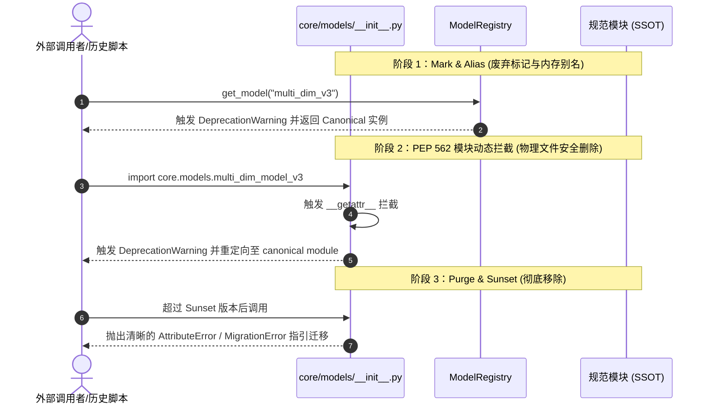
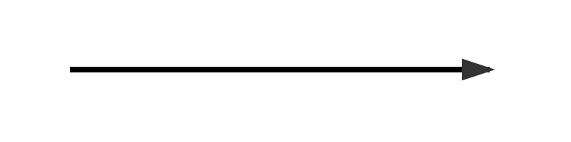

# A-Stock Agents 架构命名规范与设计范式指南

> 适用范围：全仓库 Python 源码、脚本、配置、文档与多智能体技能体系  
> 核心目标：消除版本号侵入文件名的反模式，确立高内聚低耦合的量化模型演进范式，保障代码库长期整洁、可观测与可维护。

---

## 一、物理文件命名规范 (File Naming Conventions)

### 1. 核心铁律：禁止文件名版本化与时间戳化
* **反模式 (Anti-Pattern)**：严禁在源码文件名中使用 `_v1`, `_v2`, `_v3`, `_new`, `_old`, `_final`, `_bak` 或日期时间戳（如 `screen_20260813.py`、`multi_dim_model_v3.py`）。
* **理论依据**：Git 版本控制系统（VCS）是代码演进历史的唯一权威管理者。源码文件名若硬编码版本号，会导致：
  1. **代码分叉与维护灾难**：修复缺陷往往只更新了其中一个版本，导致功能漂移（Feature Drift）。
  2. **二义性与心智负担**：调用者无法直接获知哪个是活跃实现、哪个是废弃代码。
  3. **调用依赖链脆弱**：后续每次算法升级都需要全库搜索替换 `import` 路径。

| 场景 | 🔴 严禁写法 (Bad) | 🟢 标准规范写法 (Good) | 说明 |
| :--- | :--- | :--- | :--- |
| 量化选股模型 | `multi_dim_model_v3.py` | `multi_dim_model.py` | 物理文件名永久稳定，版本通过内部元数据或注册表管理 |
| 因子打分器 | `factor_scorer_new.py` | `factor_synthesizer.py` | 表达核心职责，而非相对修改状态 |
| 临时测试脚本 | `test_temp.py`, `test_v2.py` | `test_models_suite.py` | 归入标准化测试套件，禁止散落一次性测试 |
| 批量扫描执行器 | `screen_20260903_h2.py` | `screen.py --pool h2_expand` | 采用通用执行器 + 声明式配置/传参 |
| 架构决策文档 | `model_design_new.md` | `specs/2026-08-12-multi-dim-design.md` | 唯有不可变的 ADR / RFC 规格文档允许包含创建日期，统一归入 `specs/` |

### 2. 跨层防影子镜像原则 (Anti-Shadowing Pattern)
* **架构定位差异**：
  - `core/`：系统底层引擎库（Core Library），提供高内聚、纯粹的业务逻辑与模型实现。
  - `skills/`：面向 AI Agent 与任务调度的动作执行器（Action Runners）与工作流定义。
* **命名规范**：
  - 严禁在 `skills/*/scripts/` 下创建与 `core/` 模块同名的影子胶水脚本（如避免在 skills 下创建数十个与 core 同名的空转发文件）。
  - `skills/` 下的脚本应全部以**动词或具象化动作命名**（如 `screen.py`, `strategy_benchmark.py`, `pool_audit.py`）。

---

## 二、模型演进四大设计范式 (Model Evolution Paradigms)

当策略或算法需要升级演进、支持多版本对比（如 A/B Testing、新旧算法回测）时，必须采用以下设计范式，严禁新建物理文件：

### 范式 1：模型注册表与工厂模式 (Model Registry & Factory Pattern)
在 [`scripts/core/models/registry.py`](../../../scripts/core/models/registry.py) 集中注册所有模型。外部通过模型标识符（或别名）获取实例：

```python
from core.models import ModelRegistry, get_model

# 1. 实例化当前标准模型 (SSOT)
model = get_model("multi_dim")

# 2. 兼容历史或别名调用 (自动重定向并发出弃用警告)
legacy_model = get_model("multi_dim_v3")

# 3. 动态查看所有可用模型与元数据
for info in ModelRegistry.list_models():
    print(info["name"], info["version"], info["aliases"])
```

### 范式 2：策略模式 (Strategy Pattern)
对于同一模型内部的算法替换，在模块内部通过抽象策略类与策略参数实现插拔：

```python
class ScoringStrategy(ABC):
    @abstractmethod
    def calculate(self, klines: list) -> float: ...

class FiveDimLinearStrategy(ScoringStrategy):
    """基础线性加权打分"""

class FiveDimResonanceStrategy(ScoringStrategy):
    """共振门禁增强打分"""

# 模型初始化时传入策略，而非新建多个模型文件
model = StockSelectionModel(strategy=FiveDimResonanceStrategy())
```

### 范式 3：配置驱动与声明式解耦 (Configuration-Driven)
将易变的业务参数、股票池定义、阈值等从代码中完全剥离，统一放入 `config/`（如 `stock_pools.yaml`, `config.yaml`）：
- 代码负责“机制（Mechanism）”；
- 配置负责“策略与标的（Policy & Targets）”。

### 范式 4：版本元数据内部化 (Internalized Metadata)
版本信息属于模块或类的属性，而非物理文件名：
```python
class StockSelectionModel:
    VERSION = "3.1.0"
    ALGORITHM_NAME = "5a_resonance_rotation"
```

---

## 三、代码废弃与优雅退役协议 (Deprecation & Purge Protocol)

对于必须被淘汰的历史接口或模块，遵循三阶段生命周期：



1. **阶段 1：标记与别名（Deprecate & Alias）**
   - 登记到 `ModelRegistry.register(..., deprecated_aliases={"old_name": "Scheduled for removal in vX.Y.Z"})`。
   - 明确标注 Sunset 目标版本。
2. **阶段 2：内存动态拦截与物理删除（PEP 562 Interception & Physical Purge）**
   - 物理删除带版本号的旧源码文件，杜绝文件系统污染。
   - 在父包 `__init__.py` 中实现 `__getattr__` 拦截历史导入，实现零破坏向下兼容。
3. **阶段 3：永久停用与迁移指引（Sunset Hard Stop）**
   - 跨越主版本号后（如进入 4.0），废弃别名正式关闭，抛出清晰的说明文档链接或替代方案指引。

---

## 四、文档体系命名与目录组织规范 (Documentation Conventions)

为保障工程文档的长期整洁、可检索性与跨平台兼容性，`docs/` 目录严格遵循以下标准：

### 1. 命名铁律
1. **全小写短横线 (kebab-case)**：
   - 所有新建 Markdown 文档必须采用英文全小写短横线命名（例如 `code-review.md`、`execution-manual.md`）。
   - 严禁全大写（`UPPER_SNAKE_CASE`）、下划线（`snake_case`）或中文作为文件名，规避 Windows/macOS/Linux 大小写敏感性陷阱及 URL 编码转义异常。
2. **英文 Slug + 中文大标题 (Bilingual Pattern)**：
   - 物理文件名使用语义明确的英文 slug（如 `breakeven-rules.md`）；
   - 文档内第一行一级标题（`# Title`）采用清晰规范的中文原名，兼顾链接健壮性与中文母语阅读体验；
   - 隶属于某一**文档簇**的文档，标题须按 `{簇标题} · {文档标题}` 收敛，见 §四.5《文档簇编排规范》。
3. **消除版本号与临时状态侵入**：
   - 严禁出现 `_v1`, `_v2`, `_new`, `_final` 等临时后缀；
   - 严禁在正文头部写入 `文档版本 vX.Y.Z` 等版本号字段——版本溯源由 Git 唯一承担，规范生命周期状态统一由 `docs/specs/` 看板的 `**实施状态**` 字段承载；
   - 例外：文档簇内示例文档的 `-example-N.md` 中 `N` 为**簇内示例序号**（非版本号），效力裁定见 §四.5.5。
4. **定义与进度的归档去向分离（Definition vs Progress）**：
   - **规范/指南/架构/规则（定义本身）** → `docs/guidelines/`（单一真理来源 SSOT）；
   - **ADR / RFC / 实施计划 / 整改计划 / 验收看板（落地进度）** → `docs/specs/`；
   - **不可变审查报告与历史审计留痕** → `docs/audits/`（只增不改）；
   - **反镜像铁律 (Anti-Mirror)**：严禁同一份定义在两处并存，跨目录一律以**超链接**代替内容复制。

### 2. 知识库与实施看板双层架构 (Guidelines vs Specs Architecture)

为了实现“设计规范高内聚沉淀”与“工程任务实施进度可观测”的解耦治理，文档体系严格划分两大中心：

1. **`docs/guidelines/`（规范、指南、架构与规则知识库 - SSOT）**：
   - 作为系统唯一的权威知识定义中心，承载**规范 (Specification)**、**指南 (Guide)**、**架构 (Architecture)** 与 **规则 (Rules)** 的完整技术规格与契约。
   - 遵循统一命名范式：`{domain}/{domain_slug}-{category_suffix}.md`
     - `-specification.md`：工程技术规格与标准（如 `project-structure-specification.md`、`a2ui-component-registry-specification.md`）
     - `-guide.md` / `-governance.md`：设计、交互与治理指南（如 `ui-design-guide.md`、`code-review.md`、`testing-guide.md`、`algorithm-governance.md`）
     - `-architecture.md`：系统架构设计（如 `web-aichat-architecture.md`、`llm-provider-architecture.md`、`token-security-architecture.md`、`a2ui-framework-architecture.md`）
     - `-rules.md`：量化数学与交易业务规则（如 `breakeven-calculation-rules.md`、`broker-commission-rules.md`、`trading-execution-rules.md`）
     - `-example-N.md`：文档簇内的案例说明（**非规范**），行为契约见 §四.5《文档簇编排规范》（如 `selection-funnel-example-1.md`）

2. **`docs/specs/`（任务实施与验收执行看板 - Execution Tracking Hub）**：
   - 作为工程落地、任务分解、执行状态与测试验证证据的看板中心。
   - 按 7 大领域子目录归档（`a2ui/`、`algorithm/`、`architecture/`、`business/`、`data/`、`engineering/`、`ui/`），统一采用 `SPEC-{CATEGORY}-{SEQ}` 编号。
   - **命名范式**：承载实施/整改/验收看板性质的文档，文件名必须以 **`-plan.md`** 结尾（如 `eng-remediation-plan.md`、`market-data-sync-implementation-plan.md`）。
     - 严禁使用 `-specification.md` / `-rules.md` / `-design.md` / `-spec.md` 等**与看板性质名实不符**的后缀；此类后缀是 `docs/guidelines/` 的知识定义专属后缀。
     - 历史遗留的**无后缀**看板文件（如 `eng-project-structure-and-workspace.md`）为兼容过渡形态，在每次实质修订时必须补全 `-plan.md` 后缀，渐进收敛。
     - `archive/` 下的历史 ADR / RFC / 审计报告为不可变归档，豁免本规则并保留 `YYYY-MM-DD-*.md` 日期前缀。
   - 文档主体聚焦于**实施任务矩阵、里程碑推进、代码落地映射与回归测试证据**，规范正文一律通过显式超链接直达 `docs/guidelines/`。

### 3. 两范式文档编制模板 (Two-Paradigm Authoring Templates)

`docs/` 下所有文档被严格二分为「**规范/指南范式**」与「**实施计划范式**」两种编制范式。每篇文档必须**完整且仅**采用其中一种范式，混编即为违规。

#### 范式 A：规范/指南范式（`docs/guidelines/` 唯一适用）

```markdown
# <中文规范/指南全称>

> 适用范围：<本规范约束的系统边界与对象>
> 核心目标：<要消除的根本问题与治理目标>

## 一、<定义 / 规则 / 契约>
（完整正文：数学公式、费率数值、JSON Schema、架构图、参数表、代码契约）

---
## 附：关联索引
- 实施进度看板：[`SPEC-XXX-001`](../../specs/<domain>/<slug>-plan.md)
- 相关规范：[`<slug>.md`](./<slug>.md)
```

**硬性铁律**：
* 只回答“**是什么 / 为什么 / 必须怎样**”，承载权威定义本身；
* **严禁**出现：任务清单与勾选框、里程碑排期与日期、人日估算、`P0/P1/P2` 排期、验收证据与测试结果、变更日志；
* **严禁**出现 `**实施状态**` 字段——状态属于 specs 看板；
* 头部以「关联索引」**单向**指向对应 specs 看板，正文内不反向复述进度。

#### 范式 B：实施计划范式（`docs/specs/` 唯一适用）

```markdown
# <中文看板全称>

> 规范编号：`SPEC-<CATEGORY>-<SEQ>`
> 权威定义 (SSOT)：[`<指南文件名>`](../../guidelines/<domain>/<slug>.md)
> **实施状态**：<规划中 (RFC) | 实施中 | 正式基线 | 已废弃>

## 一、规范核心定位摘要
（1-3 条指针式摘要，严禁复制公式、费率数值或 Schema 全文）

## 二、实施任务矩阵
| 任务 | 关联代码路径 | 状态 |
|:---|:---|:---:|

## 三、里程碑推进


## 四、验收与验证证据
| 断言 | 测试路径 | 结果 |
|:---|:---|:---:|

## 五、变更日志
| 日期 | 变更摘要 |
|:---|:---|
```

**硬性铁律**：
* 头部三段字段为**强制必填**，且字面量固定为 `规范编号`（或 `关联规范编号`）、`权威定义 (SSOT)`、`**实施状态**`；严禁改写作 `**文档状态**`、`**状态：**`、`**执行状态：**` 等变体，或省略不写；
* 任务要素**必填**：任务清单（任务矩阵表**或** `- [ ]` 分步复选框均可，二者至少其一）；
* 验收要素**必填**：验收标准或验收证据（二者至少其一）；
* 里程碑时间线与变更日志在**有阶段划分或多次修订时**必填；
* **严禁**复述规范正文——公式、费率数值、Schema、契约一律以超链接指向 guidelines。

#### 反混编判定红线 (Anti-Mixing Rule)

| 内容判据 | 出现在 `guidelines/` | 出现在 `specs/` |
|:---|:---|:---|
| 任务矩阵 / 勾选清单 `- [ ]` | ❌ 违规 → 迁入 specs | ✅ 合规必需 |
| 里程碑排期 / 人日估算 / `P0-P2` 路线图 | ❌ 违规 → 迁入 specs | ✅ 合规必需 |
| 验收证据 / 测试断言结果 / 变更日志 | ❌ 违规 → 迁入 specs | ✅ 合规必需 |
| `**实施状态**` 字段 | ❌ 违规 → 转为 specs 看板头部 | ✅ 强制必填 |
| 数学公式 / 费率数值 / Schema 定义 / 架构契约 | ✅ 合规（SSOT 唯一定义处） | ❌ 违规 → 抽入 guidelines 并改为链接 |
| 中文文件名 / 版本号后缀 | ❌ 违规（违反 kebab-case 铁律） | ❌ 违规（违反 kebab-case 铁律） |

### 4. 标准领域分层结构 (Standard Directory Taxonomy)

```text
docs/
├── index.md                      # [根级索引] 全景速查图谱与知识导航
├── quickstart.md                 # [根级入口] 快速上手与环境自检向导
├── docker-deploy.md              # [根级部署] 容器化部署与运维操作指引
├── guidelines/                   # [权威知识库] 7 大领域规范、指南、架构与规则定义 (SSOT)
│   ├── README.md                 # 知识导航中心与 7 大领域分类矩阵
│   ├── a2ui/                     # [A2UI框架规范] a2ui-framework-architecture, a2ui-component-registry
│   ├── algorithm/                # [算法治理规范] algorithm-governance.md
│   ├── architecture/             # [系统架构规范] web-aichat, llm-provider, token-security
│   ├── business/                 # [量化业务规则] broker-commission, breakeven-calculation, trading-execution
│   ├── data/                     # [行情数据规范] market-data-api, market-data-sync
│   ├── engineering/              # [工程测试规范] project-structure, naming-conventions, code-review, testing, security
│   └── ui/                       # [界面设计规范] ui-design-guide, app-js-modularization-guide
├── specs/                        # [实施看板] 7 大领域实施与执行进度中心
│   ├── README.md                 # 实施总览矩阵与进度追踪看板
│   ├── a2ui/                     # [01.A2UI实施] a2ui-framework-engine-plan, a2ui-component-registry-plan
│   ├── algorithm/                # [02.算法规则实施] algo-lifecycle-and-governance-plan, configurable-funnel-plan
│   ├── architecture/             # [03.系统架构实施] arch-web-aichat, arch-llm-provider, arch-token-gateway
│   ├── business/                 # [04.业务规则实施] biz-broker-commission, biz-breakeven, biz-trading-execution
│   ├── data/                     # [05.数据架构实施] market-data-sync-implementation-plan (SPEC-DATA-001)
│   ├── engineering/              # [06.工程结构实施] eng-project-structure-and-workspace (SPEC-ENG-001)
│   ├── ui/                       # [07.UI设计实施] ui-design-and-interaction-plan (SPEC-UI-001)
│   └── <domain>/archive/         # [不可变归档] 历史 ADR / RFC / 审计报告 (豁免 -plan.md 命名)
├── trading/                      # [实战速查] 纯索引层，不承载规范正文 (SSOT 见 guidelines/business/)
│   ├── execution-manual.md       # 实战交易反应动作速查索引
│   └── breakeven-rules.md        # 最低保本价精算速查索引
├── audits/                       # [审计归档] 不可变审查报告与历史审计留痕 (只增不改)
└── images/                       # [静态资产] 架构全景图与流程示意图
    └── architecture.png
```

### 5. 文档簇编排规范 (Doc Cluster Convention)

为消除「同一业务能力的多篇文档各自为政、导航依赖人工自觉」的治理盲区，`docs/guidelines/` 引入**文档簇 (Doc Cluster)** 编排范式：一组相关文档必须由**唯一中枢声明**，并以**同簇标题**与**成员导航表**保证其可检索、可聚合、可校验。

本章为文档簇定义的**唯一权威落点**；全库簇清单（簇标题、领域、中枢、成员）由 [`guidelines/README.md`](../README.md) 领域矩阵与 [`docs/index.md`](../../index.md) §八 速查表登记，本处不复制清单。

#### 5.1 簇的定义与判定 (Definition)
- **文档簇**：同一领域子目录内、围绕同一业务能力的一组文档；成员资格**以中枢声明为准**，文件命名不自证成员身份。
- **簇前缀（推荐不强制）**：成员文件名统一采用 `{slug_prefix}-*.md`（如 `selection-*`、`a2ui-*`、`market-data-*`），前缀为 kebab-case 的业务能力名。
- **簇标题**：簇的唯一中文标识（如 `智能选股系统`），全簇字面量必须完全一致；簇标题仅在标题前缀与清单登记中使用，不写入文件名。
- **不强制成簇**：领域目录内若无共享语义前缀，**严禁为凑格式批量改名**（当前 `architecture/`、`business/`、`engineering/`、`ui/` 四目录属此类）；单篇文档亦不得自称成簇。

#### 5.2 唯一中枢铁律 (Single Hub)
- 每个簇**有且仅有 1 篇中枢文档 (Hub)**，默认取该簇的体系级/系统级文档（典型如 `selection-system-specification.md`）。
- 中枢职责：承载**成员导航表**、簇内层级定位与「簇 ↔ `SPEC-*`」映射登记。
- 簇内其余文档均为**成员文档**，其头部必须**回链中枢**，保证中枢 ↔ 成员**双向可达**。
- **禁止多中枢**：不得以「并列主规范」为由设置第二个中枢；确需拆分时，应以中枢超链接引用新文档，而非双中枢并存。

#### 5.3 簇标题与文档标题铁律 (Cluster Title)

在 §四.1.2 的基础上，簇内所有文档的一级标题（`# Title`）必须进一步收敛为 **`{簇标题} · {文档标题}`**，分隔符固定为「半角空格 + `·` + 半角空格」：

| 判定 | 示例 |
|:--|:--|
| ✅ 合规 | `# 智能选股系统 · 研究治理规则` |
| ✅ 合规 | `# 智能选股系统 · 模型类型设计规范 (Selection Model Types Specification)` |
| ❌ 违规 | `# 智能选股模型 · 通用设计规范`（同簇出现第二种簇标题） |
| ❌ 违规 | `# 选股漏斗示例 1：……`（成员缺失簇标题前缀） |

- 文档标题部分保留原有语义，允许追加英文括注；`##` 及以下层级标题**一律不加**簇标题前缀，避免层级冗余。
- **过渡条款**：存量成员文档未达标者，在**下一次实质修订**时补齐簇标题即可，渐进收敛；不得仅为补标题而单独发起修订。

#### 5.4 成员导航表契约 (Navigation Table Contract)
- 中枢文档头部必须包含以 **`文档导航`** 开头的小节标题（允许附加括注，如 `### 文档导航（规范与示例分层）`）。
- 表头列序固定为 `层级 | 文档 | 职责`，且**每一成员文档必须占一行**，链接一律使用同目录相对路径。
- 表中允许追加**簇外关联行**（如全局治理、跨领域规范），其"层级"列应显式标注 `（簇外）`，避免与本簇成员混淆；存量中枢在下次实质修订时补齐该标注。
- 导航表是簇成员的**唯一登记处**：严禁在成员文档内另建平行成员清单，违者触发 §四.1.4 反镜像铁律。

#### 5.5 示例文档与规范分离 (`-example-N.md`)
- `-example-N.md` 承载簇内**案例说明**，性质为**非规范**，不得成为默认模板、出厂配置或硬编码来源。
- `N` 为**簇内示例序号**：自 1 起递增，全簇唯一且**不回收**（删除后不重新分配）。
- 同一战法/能力的案例口径**只允许 1 篇**示例文档承载，禁止并列多篇示例互相复制口径。
- **效力裁定**：`N` 属"簇内序号"，与 §四.1.3 所禁的"版本号 / 时间戳"性质不同，**豁免版本号禁令**；但严禁借序号承载版本演进——`-example-2` 只能表示**新增案例**，不得表示前一示例的"新版"。

#### 5.6 一簇多 SPEC 映射裁定 (Cluster ↔ SPEC)
- 允许一个簇映射多个 `SPEC-{CATEGORY}-{SEQ}`（如 `selection-*` 簇映射 `SPEC-ALGO-ISS-001`、`SPEC-ALGO-ISS-MT-001`、`SPEC-ALGO-003`；`a2ui-*` 簇映射 `SPEC-A2UI-001`、`SPEC-A2UI-002`；`market-data-*` 簇映射 `SPEC-DATA-001`）。
- 中枢与各成员仍依 §四.3「范式 A」**单向**指向各自的 `docs/specs/` 看板；严禁因「一簇多 SPEC」而在 `docs/guidelines/` 内复述任务矩阵或 `**实施状态**` 字段（反混编红线）。

#### 5.7 簇变更协议 (Cluster Change Protocol)
| 变更动作 | 必须同步的位置 |
|:--|:--|
| 新建簇 / 候选簇转正 | ①②③（首次建立中枢成员导航表、登记簇标题与簇前缀） |
| 新增 / 删除成员文档 | ① 中枢成员导航表 ② [`guidelines/README.md`](../README.md) 对应领域矩阵 ③ [`docs/index.md`](../../index.md) §八 速查表 |
| 新增 / 删除示例文档 | 仅 ① 中枢成员导航表（纯案例增删豁免 ②③） |
| 中枢迁移 | ①②③ + 全簇成员回链更新 |
| 簇标题变更 | ①②③ + 全簇成员 `# Title` 前缀同步 |
| 文档标题变更 | ①②③ + `docs/specs/` 各看板对该规范的标题引用与 `**规范名称**` 字段同步 |
| 簇解散 | 清除导航表与三处登记，成员移除簇标题并降级为独立文档 |

