# A-Stock Agents 系统安全与加固开发实战指南 (System Security Hardening & Safe Coding Guide)

> **文档类别**：研发与设计指南 (Guides & Governance)  
> **适用范围**：A-Stock Agents 全栈系统（Web 服务端、前端交互看板、Agent 工具链与容器部署）  
> **依据来源**：
> - [`docs/audits/2026-09-14-penetration-testing-report.md`](../../audits/2026-09-14-penetration-testing-report.md)（渗透测试与安全审计报告）
> - [`docs/specs/engineering/security-remediation-plan.md`](../../specs/engineering/security-remediation-plan.md)（安全漏洞整改实施执行计划）
>
> **核心目标**：将 2026-09-14 白盒代码审计与渗透测试中揭示的 8 项典型安全隐患，沉淀为全流程量化投研平台的长效安全规约、编码防线、架构标准与安全测试门禁，杜绝安全退化。

---

## 一、 核心安全防御原则 (Core Security Principles)

在 A-Stock Agents 的架构设计、接口开发与前端交互中，必须无条件遵循以下六项安全黄金法则：

```mermaid
flowchart TD
    subgraph P1[原则 1: 物理沙箱边界]
        A1[外部输入路径] --> B1[提取纯文件名]
        B1 --> C1[强制锁定至 output/reports]
    end

    subgraph P2[原则 2: 网络边界收敛]
        A2[Docker 容器] --> B2[仅监听 127.0.0.1]
        B2 --> C2[引入 API Token 鉴权中间件]
    end

    subgraph P3[原则 3: 沙箱同源隔离]
        A3[研报 iframe] --> B3[剥离 allow-same-origin]
        B3 --> C3[阻断 DOM 与 Storage 逃逸]
    end

    subgraph P4[原则 4: 前端深度净化]
        A4[LLM 渲染输出] --> B4[剥离所有 onclick/on* 事件]
        B4 --> C4[基于 data-action 事件委托]
    end

    subgraph P5[原则 5: SSRF 物理 IP 校验]
        A5[模型外部请求] --> B5[socket.getaddrinfo 解析]
        B5 --> C5[阻断私网/回环/云元数据 IP]
    end

    subgraph P6[原则 6: 凭据落盘必加密]
        A6[第三方 API Key] --> B6[本地对称加密/混淆]
        B6 --> C6[SQLite 密文落盘存储]
    end
```



1. **物理沙箱边界 (Sandboxed Filesystem Boundary)**：
   严禁直接将用户或 Agent 输入的参数拼接至文件系统路径。文件写操作强制收敛至隔离目录（`output/reports/`），文件读操作仅放行明确的文档白名单目录，严禁暴露系统源码与敏感配置文件。
2. **零信任与网络边界最小暴露 (Zero Trust & Network Isolation)**：
   容器部署默认仅监听本地回环地址 `127.0.0.1`，阻断全网卡 `0.0.0.0` 意外暴露；提供受控的 API Token 鉴权中间件，实现接口访问控制。
3. **客户端沙箱同源隔离不妥协 (Strict Iframe Sandbox Isolation)**：
   W3C 规范铁律：**`allow-scripts` 绝对不可与 `allow-same-origin` 共存**。第三方或动态生成的 HTML 内容必须处于无同源权限的沙箱中，消除宿主上下文接管风险。
4. **前端深度净化与事件委托 (Contextual Sanitization & Event Delegation)**：
   DOMPurify 严禁放行任何原生 `on*` 事件属性（包括 `onclick`）。前端所有快捷操作交互统一通过 HTML5 `data-*` 属性携带参数，并在父容器上集中注册事件监听委托。
5. **外部请求物理 DNS 校验与 SSRF 阻断 (Physical DNS Resolution & Anti-SSRF)**：
   对外部大模型接口或用户自定义 URL，禁止仅做字面量正则或简单 IP 拦截；必须发起物理 DNS 解析，对获取到的所有真实 IP 进行私有网段、回环网段与云元数据地址校验。
6. **本地凭据落盘必加密 (At-Rest Credential Encryption)**：
   SQLite 等本地数据存储中禁止明文落盘第三方商业大模型 API Key，必须经过本地对称加密或派生混淆，防止数据备份或环境共享导致密钥失窃。

---

## 二、 八大重点安全风险与防御规约手册 (The 8 Vulnerabilities & Guidelines)

### 1. SEC-01: 工作区任意文件覆写与篡改防御规约 (CWE-22 / CWE-434)
- **风险等级**：🔴 **高危 (CVSS 8.6)**
- **易发位置**：文件保存、研报落盘、模板写入接口（如 `/api/docs/save`）
- **典型漏洞模式**：
  仅判断了 `target.relative_to(workspace_root)`，但允许调用者传递如 `web/index.html` 或 `config/settings.json` 的相对路径，导致前端入口或后端配置被恶意覆盖（持久化 XSS 或拒绝服务）。
- **防御编码规约**：
  1. **锁定专用目录**：写操作强制收敛在 `(workspace_root / "output" / "reports").resolve()`；
  2. **剥离所有路径层级**：使用 `Path(req.path.strip()).name` 仅提取安全文件名，拒绝任何包含 `/` 或 `\` 的子路径；
  3. **黑名单目录拦截**：阻断任何包含 `web`、`config`、`scripts`、`tests`、`.git`、`.agents` 的路径参数；
  4. **双重边界断言**：在执行 `write_text` 前，调用 `target_file.relative_to(reports_dir)`，捕获 `ValueError` 并抛出 HTTP 403。

```python
# [推荐范式] 文件保存端点沙箱收敛实现
clean_p = Path(req.path.strip())
forbidden_prefixes = {"web", "config", "scripts", "tests", ".git", ".agents", ".gemini", "node_modules"}
if any(part in forbidden_prefixes for part in clean_p.parts) or ".." in clean_p.parts:
    raise HTTPException(status_code=403, detail="Access denied: write operation restricted to reports directory")

safe_filename = clean_p.name
if not safe_filename or safe_filename in {".", ".."} or "/" in safe_filename or "\\" in safe_filename:
    raise HTTPException(status_code=400, detail="Invalid filename for document save")

target_file = (reports_dir / safe_filename).resolve()
try:
    target_file.relative_to(reports_dir)
except ValueError:
    raise HTTPException(status_code=403, detail="Access denied: outside reports boundary")
```

---

### 2. SEC-02: Docker 容器网络边界与 API 鉴权规范 (CWE-306 / CWE-284)
- **风险等级**：🔴 **高危 (CVSS 8.2)**
- **易发位置**：`docker-compose.yml` 端口映射、FastAPI 全局路由
- **典型漏洞模式**：
  Docker 配置直接使用 `6300:6300` 监听宿主机全网卡 `0.0.0.0`，同时所有核心控制端点（模拟交易下单、会话读取、模型调度）无任何身份鉴权机制，外部局域网或公网直接完全接管服务。
- **防御编码规约**：
  1. **容器端口显式绑定回环**：在 `docker-compose.yml` 中必须强制指定 `127.0.0.1` 绑定；
     ```yaml
     # [正确配置]
     ports:
       - "127.0.0.1:${A_STOCK_SERVER_PORT:-6300}:6300"
     ```
  2. **API Token 鉴权中间件**：
     - 支持通过环境变量 `A_STOCK_SERVER_TOKEN` 声明密钥；
     - 未配置 Token 时（本地开发），维持免密调试便利；
     - 配置了 Token 时（多机部署/生产），请求必须携带 `Authorization: Bearer <TOKEN>`，否则统一返回 HTTP 401 Unauthorized；
     - 静态资源 (`/`、`/ui/*`、`/js/*`、`/css/*`) 及基础健康检查 (`/api/health`) 纳入豁免白名单。

---

### 3. SEC-03: 研报展示 iframe 沙箱隔离规范 (CWE-1021 / CWE-79)
- **风险等级**：🔴 **高危 (CVSS 7.8)**
- **易发位置**：前端可视化研报容器、HTML 报告展示视窗（`web/index.html`）
- **典型漏洞模式**：
  ```html
  <!-- [致命错误配置] 沙箱实质失效 -->
  <iframe sandbox="allow-scripts allow-same-origin allow-popups"></iframe>
  ```
  同时声明 `allow-scripts` 与 `allow-same-origin` 时，iframe 内部代码可通过 `window.parent` 肆意操纵父页面 DOM、盗取宿主 `localStorage`、甚至挟持网络会话。
- **防御编码规约**：
  1. **彻底剔除 `allow-same-origin`**：
     ```html
     <!-- [推荐标准配置] 严格沙箱隔离 -->
     <iframe class="workspace-html-frame" id="workspaceHtmlFrame" 
             sandbox="allow-scripts allow-popups allow-forms" 
             title="HTML 可视化研报"></iframe>
     ```
  2. **跨框架通信契约**：父子页面间若需交互（例如主题同步、图表缩放通知），严禁直接访问对象引用，必须通过标准的 `window.postMessage` 机制传递结构化消息。

---

### 4. SEC-04: 前端 Markdown 渲染与 XSS 深度净化规范 (CWE-79)
- **风险等级**：🟡 **中危 (CVSS 6.8)**
- **易发位置**：`web/js/chat_presentation.js` (Markdown 解析与 HTML 净化逻辑)
- **典型漏洞模式**：
  1. 在 DOMPurify 白名单中错误添加了 `'onclick'` 属性，导致 LLM 生成的 Markdown 只要包含 `<button onclick="...">` 即可执行任意 JS；
  2. Fallback 兜底方案使用不完整的黑名单正则（仅过滤 `onerror`/`onload`），放行了 `onmouseover`、`onfocus`、`details/ontoggle` 等众多 XSS 载荷。
- **防御编码规约**：
  1. **DOMPurify 属性严守白名单**：严禁将任何 `on*` 事件放入 `ADD_ATTR`，仅放行数据传递属性；
     ```javascript
     // [推荐配置]
     return purifyLib.sanitize(rawHtml, {
       ADD_TAGS: ['button'],
       ADD_ATTR: ['target', 'title', 'type', 'class', 'data-action', 'data-doc-path', 'data-code', 'data-cost', 'data-shares']
     });
     ```
  2. **推行事件委托模式**：为动态操作按钮设置 `data-action="..."`，在父级容器进行监听捕获：
     ```javascript
     // [推荐交互模式] 集中事件委托
     container.addEventListener('click', function(e) {
       var target = e.target.closest('[data-action]');
       if (!target) return;
       var action = target.getAttribute('data-action');
       // 根据 action 分发处理，杜绝内联 eval 执行
     });
     ```
  3. **Fallback 强力正则兜底**：当 DOMPurify 缺失时，采用全局正则强制剥离所有 `on[a-z]+` 属性和伪协议：
     ```javascript
     return String(rawHtml)
       .replace(/<script\b[^<]*(?:(?!<\/script>)<[^<]*)*<\/script>/gi, '')
       .replace(/<style\b[^<]*(?:(?!<\/style>)<[^<]*)*<\/style>/gi, '')
       .replace(/<\/?(?:iframe|object|embed|applet|meta|link|base)\b[^>]*>/gi, '')
       .replace(/<([^>]+)\s+on[a-z]+\s*=\s*(?:'[^']*'|"[^"]*"|[^\s>]+)/gi, '<$1')
       .replace(/(href|src)\s*=\s*["']?\s*javascript:[^"'>]*/gi, '$1="#"');
     ```

---

### 5. SEC-05: 外部网络请求与 SSRF 纵深防御规范 (CWE-918)
- **风险等级**：🟡 **中危 (CVSS 6.5)**
- **易发位置**：`scripts/server/api/models_mgmt.py`（大模型连通性测试、自定义 Provider 探测）
- **典型漏洞模式**：
  仅通过 `ipaddress.ip_address(hostname)` 拦截字面量私网 IP。当攻击者传入动态解析域名（如 `127.0.0.1.nip.io`）或内部主机名时，代码捕获 `ValueError` 并跳过检查，随后直接向内网发起 HTTP 请求，导致内网端口与云元数据暴露。
- **防御编码规约**：
  1. **网络物理解析校验 (Pre-Flight DNS Resolution)**：
     在发起任何 HTTP 请求前，先调用 `socket.getaddrinfo` 解析出域名对应的所有物理 IP；
  2. **全面拦截私有与受保留网段**：
     遍历解析出的所有 IP，只要包含回环地址 (`is_loopback`)、私有网段 (`is_private`)、链路本地 (`is_link_local`) 或保留网段 (`is_reserved`)，立即阻断；
  3. **受控例外管理**：对于本地开发测试（如本地 Ollama 实例 `127.0.0.1:11434`），需通过显式配置白名单并校验特定端口，才允许放行。

```python
# [推荐范式] 物理 DNS 解析与防 SSRF 校验
import socket
import ipaddress
from urllib.parse import urlparse

def validate_external_url_safely(target_url: str, allow_local_ollama: bool = False):
    parsed = urlparse(target_url)
    hostname = parsed.hostname
    port = parsed.port or (443 if parsed.scheme == "https" else 80)

    if not hostname:
        raise ValueError("Invalid URL: missing hostname")

    # 获取物理 DNS 解析结果
    try:
        addr_info = socket.getaddrinfo(hostname, port, proto=socket.IPPROTO_TCP)
    except socket.gaierror:
        raise ValueError("Host resolution failed")

    for family, _, _, _, sockaddr in addr_info:
        ip_str = sockaddr[0]
        ip_obj = ipaddress.ip_address(ip_str)

        # 本地受控服务白名单例外
        if allow_local_ollama and ip_obj.is_loopback and port == 11434:
            continue

        if ip_obj.is_private or ip_obj.is_loopback or ip_obj.is_link_local or ip_obj.is_reserved:
            raise PermissionError(f"Access to private/loopback network ({ip_str}) is strictly prohibited")
```

---

### 6. SEC-06: 源码防泄露与敏感文件只读控制规范 (CWE-200 / CWE-538)
- **风险等级**：🟡 **中危 (CVSS 6.1)**
- **受影响位置**：`/api/docs/read`（工作区文件查阅接口）
- **典型漏洞模式**：
  扩展名白名单包含了 `.py`，且未对目录进行白名单约束。攻击者通过请求 `?path=scripts/server/app.py` 即可直接将后端核心源码完全下载，导致系统核心算法与架构泄露。
- **防御编码规约**：
  1. **剔除可执行代码后缀**：从 `allowed_exts` 中坚决移除 `.py`、`.sh`、`.ps1`、`.env`；
  2. **基准目录白名单限制**：只允许读取 `output/`、`reports/`、`docs/` 以及 `.agents/skills/**/SKILL.md`；
  3. **拦截系统敏感文件**：对请求 `scripts/`、`tests/`、`.git/`、`.env` 的请求直接返回 HTTP 403。

---

### 7. SEC-07: 本地大模型 API Key 静态加密存储规范 (CWE-312 / CWE-313)
- **风险等级**：🟢 **低危 (CVSS 4.9)**
- **受影响位置**：`scripts/server/db.py`（SQLite 凭据表 `llm_providers`）
- **典型漏洞模式**：
  `llm_providers` 表中的 `api_key` 字段采用普通文本列明文存储。若数据库文件 `output/chats.db` 意外流出、放入 Git 或在团队中共享，将直接导致外部付费大模型密钥泄露。
- **防御编码规约**：
  1. **静态落盘密文存储**：写入数据库前进行对称混淆加密；从数据库读出时解密；
  2. **密钥派生与隔离**：加密密钥优先从环境变量 `A_STOCK_SECRET_KEY` 读取，缺省时基于本地机器特征动态派生，确保数据库文件脱离本机后无法直接被还原。

---

### 8. SEC-08: 报表引擎与底层工具输出路径沙箱化 (CWE-73)
- **风险等级**：🟢 **低危 (CVSS 4.3)**
- **受影响位置**：`scripts/core/reporting/report_generator.py`、`scripts/server/agent/tools.py`
- **典型漏洞模式**：
  底层报告生成函数 `generate_simple_report(data, output_path)` 直接使用外部传入的 `output_path`，若调度层或外部输入包含跨目录路径（如 `../../windows/system32/`），可能将生成的文件抛撒到非预期系统路径。
- **防御编码规约**：
  1. **引入路径沙箱净化器**：在所有报告生成入口使用 `_sanitize_report_output_path`；
  2. **强制重定向至沙箱**：若检测到跨目录逃逸路径，强行剥离路径目录，将其安全归并入 `output/reports/<safe_name>`。

---

## 三、 分级实施与整改验证矩阵 (Remediation Milestones)

> 本章分级整改里程碑矩阵与交付节奏见实施看板：[`security-remediation-plan.md`](../../specs/engineering/security-remediation-plan.md)。

---

## 四、 自动化安全测试与红线代码审查门禁 (Verification & Guardrails)

### 1. 自动化安全回归测试套件
本项目已建立专门的安全回归测试集 [`tests/governance/test_security_audit.py`](../../../tests/governance/test_security_audit.py)，所有开发与重构在提交 PR 或合并主干前必须 100% 通过：

```powershell
# 执行安全审计全量回归测试
pytest tests/governance/test_security_audit.py -v
```

**测试套件核心覆盖用例清单**：
- `test_docs_save_blocks_overwriting_web_index`：验证 `/api/docs/save` 阻止写入 `web/index.html`；
- `test_docs_save_blocks_directory_traversal`：验证 `../` 路径穿越请求返回 403；
- `test_docs_save_blocks_scripts_and_config_dirs`：验证拦截写入 `scripts/` 与 `config/`；
- `test_docs_save_confines_to_reports_dir`：验证合法保存严格约束在 `output/reports/` 目录下；
- `test_docs_read_denies_py_source_code`：验证禁止通过 `/api/docs/read` 偷窥 `.py` 源码；
- `test_docs_read_denies_sensitive_system_dirs`：验证禁止读取 `.env` 与系统配置；
- `test_iframe_sandbox_excludes_same_origin`：验证 iframe 沙箱中绝不出现 `allow-same-origin`；
- `test_dompurify_disallows_onclick_attribute`：验证 DOMPurify 白名单中彻底剔除 `onclick`；
- `test_report_generator_sandboxes_output_path`：验证底层报告生成器杜绝输出路径逃逸。

---

### 2. PR 与代码审查安全检查单 (Security Code Review Checklist)

代码审查人员在评审任何代码变更时，必须逐一核对以下 10 项安全红线：

- [ ] **1. [文件写操作]** 是否存在使用外部参数直接拼接文件路径的情况？文件名是否经过 `Path.name` 过滤？
- [ ] **2. [文件目录锁定]** 所有自动生成、保存的文件是否严格落盘在 `output/reports` 或 `output/` 隔离目录下？
- [ ] **3. [文件读操作]** 是否存在允许读取 `.py`、`.sh`、`.env`、`.git` 等核心源码与敏感环境文件的可能？
- [ ] **4. [前端沙箱]** 任何新引入或修改的 `<iframe>`，其 `sandbox` 属性是否坚决排除了 `allow-same-origin`？
- [ ] **5. [前端渲染净化]** DOMPurify 净化配置是否绝对没有包含 `onclick` 等 `on*` 原生事件？
- [ ] **6. [前端事件绑定]** 交互按钮是否统一采用 `data-action` 结合事件委托，而非在 HTML 中内联写 JS？
- [ ] **7. [网络请求 SSRF]** 后端在请求外部 URL 前，是否执行了前置的物理 DNS 解析与私有/回环 IP 过滤？
- [ ] **8. [网络边界暴露]** 容器部署文件（如 `docker-compose.yml`）中的端口映射是否均锁定为 `127.0.0.1:PORT:PORT`？
- [ ] **9. [凭据存储]** 新增的数据库表或文件落盘逻辑中，是否避免了明文写入各类 Token、API Key 或交易密码？
- [ ] **10. [测试防退化]** 修改相关安全边界逻辑后，是否同步运行了 `pytest tests/governance/test_security_audit.py` 并保持全绿？

---

## 五、 文档归档与更新机制

- **主归档路径**：[`docs/guidelines/engineering/security-hardening-guide.md`](security-hardening-guide.md)
- **关联审计报告**：[`docs/audits/2026-09-14-penetration-testing-report.md`](../../audits/2026-09-14-penetration-testing-report.md)
- **整改执行跟踪**：[`docs/specs/engineering/security-remediation-plan.md`](../../specs/engineering/security-remediation-plan.md)
- **演进维护要求**：未来如发现新的安全漏洞或实施新架构加固，需第一时间更新本指南的漏洞规约与审查清单，持续作为团队唯一的安全工程实施规范。
