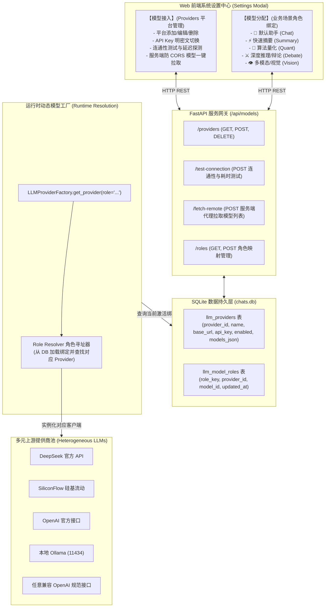

# 大模型双轨接入与多业务场景角色分配架构 (LLM Providers & Role Allocation Architecture)

> **文档类别**：系统架构 (Architecture)  
> **适用范围**：A-Stock Agents 服务端网关、多模型适配运行时、Web 投研前端配置中心  
> **实施进度看板**：[`docs/specs/architecture/arch-llm-provider-and-role-allocation.md`](../specs/architecture/arch-llm-provider-and-role-allocation.md) (`SPEC-ARCH-002`)

---

## 一、 背景与双轨制演进动因 (Context & Motivation)

### 1. 历史现状与痛点
在早期设计中，系统对大模型（LLM）的配置仅限于环境变量中的单一 Provider，无法适应量化投研的多智能体复合场景：
1. **单一模型无法兼顾效率与成本**：
   - 快速提炼会话标题或行情快报仅需极轻量极低成本的高速模型（如 `flash` / `mini` / `8B`）；
   - 因子截面量化计算与代码分析需要具备强代码与逻辑能力的大模型（如 `qwen-2.5-coder` / `deepseek-coder`）；
   - 7 角色多空深度辩论与研报博弈需要高智能深度思考推理模型（如 `deepseek-r1` / `o1`）；
   - 行情图表与 K 线分时形态分析则强制依赖具备视觉感知能力的多模态模型（`vision` / `vl`）。
2. **缺乏多平台提供商（Providers）管理能力**：
   - 无法在界面上直观添加/修改/启停不同的上游提供商（SiliconFlow、DeepSeek 官方、Moonshot/Kimi、OpenAI、本地 Ollama 等）；
   - 浏览器端直接调用上游提供商获取可用模型列表受到严重的跨域（CORS）策略限制；
   - 缺乏实时的 API Key 连通性探测与网络延迟（Latency）度量机制。

### 2. 双轨制架构定义 (Dual-Track Architecture)
确立**“物理层接入管理”与“逻辑层业务场景角色分配”相分离的双轨制架构**：
- **物理接入轨 (Model Providers)**：负责管理上游 API 平台连接凭证、BaseURL、API Key、连通性探测与服务端防 CORS 模型列表拉取；
- **逻辑角色轨 (Model Roles)**：建立量化投研业务场景（Chat / Summary / Quant / Debate / Vision）与具体模型的映射绑定，支持动态解耦与热装配。

---

## 二、 总体架构拓扑 (System Architecture)

系统由**前端配置中心**、**服务网关 API**、**SQLite 持久层**、**动态模型工厂**与**多上游连接池**构成：



---

## 三、 物理接入轨：提供商管理与防 CORS 代理规范

### 1. 提供商元数据规格
每个模型提供商记录包含以下标准字段：
- `provider_id`：唯一标识（如 `prov_deepseek`、`prov_siliconflow`、`prov_local_ollama`）；
- `name`：用户可视平台名称；
- `base_url`：标准兼容服务根路径（如 `https://api.deepseek.com/v1`、`http://localhost:11434/v1`）；
- `api_key`：访问密钥（本地持久化存储，前端支持明密文脱敏切换）；
- `enabled`：是否启用布尔开关；
- `models`：已启用/已拉取的可用模型列表（含标签与上下文长度推断）；
- `timeout_seconds`：超时时间（默认 60s）。

### 2. 连通性与网络延迟探测机制 (`/api/models/test-connection`)
用户在前端配置 BaseURL 和 API Key 后，点击“测试连接”触发后端探测：
1. **探测端点**：优先探测 `{base_url}/models`，其次退回探测 `{base_url}` 根端点；
2. **探测返回结果规范**：
   - **成功 (200/201)**：返回 `status: ok`、耗时 `latency_ms`、`message: 连接成功 (HTTP 200, 150ms)`，前端展示绿色高亮徽标；
   - **鉴权失败 (401)**：返回 `status: error`、`message: 认证失败 (401 Unauthorized)，请检查 API 密钥是否有效`；
   - **网络或超时异常**：返回明确的网络不可达、DNS 解析失败或超时秒数信息。

### 3. 服务端防 CORS 模型发现代理 (`/api/models/fetch-remote`)
由于上游供应商绝大部分未开启对浏览器的跨域资源共享（CORS），前端严禁直接发起跨源拉取。统一由服务端代发请求获取可用模型清单，并解析提取模型 ID。

---

## 四、 逻辑角色轨：五大业务场景角色绑定规范

系统预置 5 种核心业务场景角色（Model Roles）：

| 角色键名 (`role_key`) | 角色显示名称 | 场景诉求与模型偏好 | 推荐候选模型类型 |
|---|---|---|---|
| `chat` | 默认投研助手 | 综合平衡、高吞吐、响应迅速、逻辑严谨 | `deepseek-chat` / `qwen-plus` / `gpt-4o-mini` |
| `summary` | 快速总结与提炼 | 低延迟、低成本、高并发，适合提取标题与要点 | `deepseek-v3` / `gpt-4o-mini` / `qwen-turbo` |
| `quant` | 量化计算与代码分析 | 极强代码推导能力、数学公式生成、严谨因子筛选 | `qwen-2.5-coder-32b` / `deepseek-coder` |
| `debate` | 深度推理与多空辩论 | 深度思考链（COT）、多角色对抗博弈、复杂归因 | `deepseek-r1` / `o1` / `o3-mini` |
| `vision` | 多模态与图表感知 | 支持分时走势图、日K线形态、截图视觉识别 | `gpt-4o` / `qwen-vl-max` / `gemini-1.5-pro` |

运行时通过工厂动态寻址：
```python
# 业务调用示例
from scripts.server.models import LLMProviderFactory

llm_client = LLMProviderFactory.get_provider_for_role("debate")
response = await llm_client.chat_completion(messages=[...])
```
