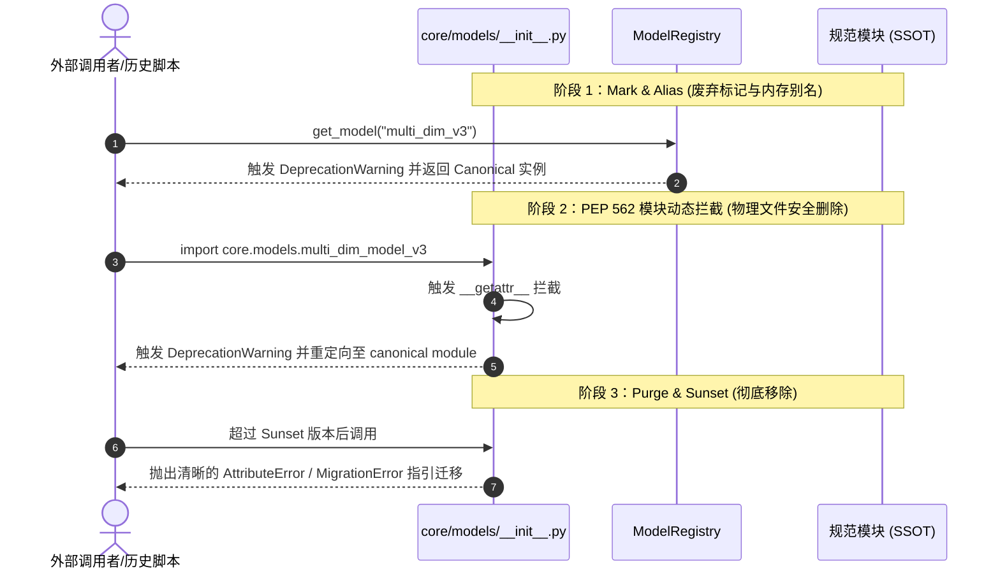

# A-Stock Agents 架构命名规范与设计范式指南

> 适用范围：全仓库 Python 源码、脚本、配置、文档与多智能体技能体系  
> 核心目标：消除版本号侵入文件名的反模式，确立高内聚低耦合的量化模型演进范式，保障代码库长期整洁、可观测与可维护。

---

## 一、物理文件命名规范 (File Naming Conventions)

### 1. 核心铁律：禁止文件名版本化与时间戳化
* **反模式 (Anti-Pattern)**：严禁在源码文件名中使用 `_v1`, `_v2`, `_v3`, `_new`, `_old`, `_final`, `_bak` 或日期时间戳（如 `screen_20260813.py`、`multi_dim_model_v3.py`）。
* **理论依据**：Git 版本控制系统（VCS）是代码演进历史的唯一权威管理者。源码文件名若硬编码版本号，会导致：
  1. **代码分叉与维护灾难**：修复缺陷往往只更新了其中一个版本，导致功能漂移（Feature Drift）。
  2. **二义性与心智负担**：调用者无法直接获知哪个是活跃实现、哪个是废弃代码。
  3. **调用依赖链脆弱**：后续每次算法升级都需要全库搜索替换 `import` 路径。

| 场景 | 🔴 严禁写法 (Bad) | 🟢 标准规范写法 (Good) | 说明 |
| :--- | :--- | :--- | :--- |
| 量化选股模型 | `multi_dim_model_v3.py` | `multi_dim_model.py` | 物理文件名永久稳定，版本通过内部元数据或注册表管理 |
| 因子打分器 | `factor_scorer_new.py` | `factor_synthesizer.py` | 表达核心职责，而非相对修改状态 |
| 临时测试脚本 | `test_temp.py`, `test_v2.py` | `test_models_suite.py` | 归入标准化测试套件，禁止散落一次性测试 |
| 批量扫描执行器 | `screen_20260903_h2.py` | `screen.py --pool h2_expand` | 采用通用执行器 + 声明式配置/传参 |
| 架构决策文档 | `model_design_new.md` | `specs/2026-08-12-multi-dim-design.md` | 唯有不可变的 ADR / RFC 规格文档允许包含创建日期，统一归入 `specs/` |

### 2. 跨层防影子镜像原则 (Anti-Shadowing Pattern)
* **架构定位差异**：
  - `core/`：系统底层引擎库（Core Library），提供高内聚、纯粹的业务逻辑与模型实现。
  - `skills/`：面向 AI Agent 与任务调度的动作执行器（Action Runners）与工作流定义。
* **命名规范**：
  - 严禁在 `skills/*/scripts/` 下创建与 `core/` 模块同名的影子胶水脚本（如避免在 skills 下创建数十个与 core 同名的空转发文件）。
  - `skills/` 下的脚本应全部以**动词或具象化动作命名**（如 `screen.py`, `strategy_benchmark.py`, `pool_audit.py`）。

---

## 二、模型演进四大设计范式 (Model Evolution Paradigms)

当策略或算法需要升级演进、支持多版本对比（如 A/B Testing、新旧算法回测）时，必须采用以下设计范式，严禁新建物理文件：

### 范式 1：模型注册表与工厂模式 (Model Registry & Factory Pattern)
在 [`core/models/registry.py`](file:///Users/handy/workon/a_stock_agents/core/models/registry.py) 集中注册所有模型。外部通过模型标识符（或别名）获取实例：

```python
from core.models import ModelRegistry, get_model

# 1. 实例化当前标准模型 (SSOT)
model = get_model("multi_dim")

# 2. 兼容历史或别名调用 (自动重定向并发出弃用警告)
legacy_model = get_model("multi_dim_v3")

# 3. 动态查看所有可用模型与元数据
for info in ModelRegistry.list_models():
    print(info["name"], info["version"], info["aliases"])
```

### 范式 2：策略模式 (Strategy Pattern)
对于同一模型内部的算法替换，在模块内部通过抽象策略类与策略参数实现插拔：

```python
class ScoringStrategy(ABC):
    @abstractmethod
    def calculate(self, klines: list) -> float: ...

class FiveDimLinearStrategy(ScoringStrategy):
    """基础线性加权打分"""

class FiveDimResonanceStrategy(ScoringStrategy):
    """共振门禁增强打分"""

# 模型初始化时传入策略，而非新建多个模型文件
model = StockSelectionModel(strategy=FiveDimResonanceStrategy())
```

### 范式 3：配置驱动与声明式解耦 (Configuration-Driven)
将易变的业务参数、股票池定义、阈值等从代码中完全剥离，统一放入 `config/`（如 `stock_pools.yaml`, `config.yaml`）：
- 代码负责“机制（Mechanism）”；
- 配置负责“策略与标的（Policy & Targets）”。

### 范式 4：版本元数据内部化 (Internalized Metadata)
版本信息属于模块或类的属性，而非物理文件名：
```python
class StockSelectionModel:
    VERSION = "3.1.0"
    ALGORITHM_NAME = "5a_resonance_rotation"
```

---

## 三、代码废弃与优雅退役协议 (Deprecation & Purge Protocol)

对于必须被淘汰的历史接口或模块，遵循三阶段生命周期：



1. **阶段 1：标记与别名（Deprecate & Alias）**
   - 登记到 `ModelRegistry.register(..., deprecated_aliases={"old_name": "Scheduled for removal in vX.Y.Z"})`。
   - 明确标注 Sunset 目标版本。
2. **阶段 2：内存动态拦截与物理删除（PEP 562 Interception & Physical Purge）**
   - 物理删除带版本号的旧源码文件，杜绝文件系统污染。
   - 在父包 `__init__.py` 中实现 `__getattr__` 拦截历史导入，实现零破坏向下兼容。
3. **阶段 3：永久停用与迁移指引（Sunset Hard Stop）**
   - 跨越主版本号后（如进入 4.0），废弃别名正式关闭，抛出清晰的说明文档链接或替代方案指引。

---

## 四、文档体系命名与目录组织规范 (Documentation Conventions)

为保障工程文档的长期整洁、可检索性与跨平台兼容性，`docs/` 目录严格遵循以下标准：

### 1. 命名铁律
1. **全小写短横线 (kebab-case)**：
   - 所有新建 Markdown 文档必须采用英文全小写短横线命名（例如 `code-review.md`、`execution-manual.md`）。
   - 严禁全大写（`UPPER_SNAKE_CASE`）、下划线（`snake_case`）或中文作为文件名，规避 Windows/macOS/Linux 大小写敏感性陷阱及 URL 编码转义异常。
2. **英文 Slug + 中文大标题 (Bilingual Pattern)**：
   - 物理文件名使用语义明确的英文 slug（如 `breakeven-rules.md`）；
   - 文档内第一行一级标题（`# Title`）采用清晰规范的中文原名，兼顾链接健壮性与中文母语阅读体验。
3. **消除版本号与临时状态侵入**：
   - 严禁出现 `_v1`, `_v2`, `_new`, `_final` 等临时后缀。
   - 所有架构决策（ADR / RFC）、技术规格说明与业务算法规则统一归档于 `docs/specs/`，遵循下述 6 大分类与标准命名前缀规约。

### 2. 规范文档命名规约 (Specification Naming Rules)

归档于 `docs/specs/` 的设计规范严格遵循**“分层目录 + 前缀自解释 + 元数据头契约”**三重标准：

1. **六大核心领域子目录与统一定界前缀**：
   - **`engineering/` (`eng-`)**：项目工程结构规范（零全局污染、SSOT单一真理来源、跨平台 CLI、数据隔离）
   - **`ui/` (`ui-`)**：UI 界面设计规范（浅色金融风格、红涨绿跌、无竖条轻量边框、双模视口）
   - **`architecture/` (`arch-`)**：系统架构设计规范（FastAPI网关、Agent运行时、Skill治理、多模型双轨制、Token安全）
   - **`a2ui/` (`a2ui-`)**：A2UI 框架规范（A2UI渲染引擎、1:1骨架屏、渐进式水合、组件库模块化注册与时序解耦）
   - **`business/` (`biz-`)**：业务规则规范（全摩擦费率配置化、最低保本价进位算法、交易三原则与三级止损）
   - **`algorithm/` (`algo-`)**：算法规则规范（44项算法资产全景清单、AlgoRegistry 2.0、ALCM四道质量门禁）

2. **物理命名范式**：
   ```text
   {category_prefix}-{domain_slug}-{doc_type}.md
   ```
   - `category_prefix`：取自 `eng-`、`ui-`、`arch-`、`a2ui-`、`biz-`、`algo-`；
   - `domain_slug`：全小写短横线（kebab-case）领域语义；
   - `doc_type`：`-specification.md`（体系规格）、`-design.md`（技术方案/ADR）、`-rules.md`（核心业务/算法规则）。

3. **元数据头部契约**：
   每个规范文档第一行必须声明统一头部元数据（规范分类、规范编号如 `SPEC-ENG-001`、版本、当前状态、适用范围与关联文档）。

### 3. 标准领域分层结构 (Standard Directory Taxonomy)

```text
docs/
├── index.md                      # [根级索引] 全景速查图谱与知识导航
├── quickstart.md                 # [根级入口] 快速上手与环境自检向导
├── guidelines/                   # [工程指南] 开发流程、质量审查与命名准则
│   ├── code-review.md            # 代码审查标准与红线清单
│   ├── testing-guide.md          # 回归测试架构与规约
│   ├── algorithm-governance.md   # 算法全生命周期治理指南
│   └── naming-conventions.md     # 本命名规约 (SSOT)
├── specs/                        # [规范中心] 6 大领域规范体系 (SPEC-INDEX)
│   ├── README.md                 # 规范总览矩阵与命名规则说明
│   ├── engineering/              # [01.工程结构] eng-project-structure-and-workspace.md
│   ├── ui/                       # [02.UI设计] ui-design-and-interaction-specification.md
│   ├── architecture/             # [03.系统架构] arch-web-aichat, arch-llm-provider, arch-token-gateway
│   ├── a2ui/                     # [04.A2UI框架] a2ui-framework-engine, a2ui-component-registry
│   ├── business/                 # [05.业务规则] biz-broker-commission, biz-breakeven, biz-trading-execution
│   └── algorithm/                # [06.算法规则] algo-lifecycle-and-governance-specification.md
├── trading/                      # [量化实战] 实操手册与速查指引
│   ├── execution-manual.md       # 实战交易反应动作与执行操作指引
│   └── breakeven-rules.md        # 最低保本价精算数学公式速查
└── images/                       # [静态资产] 架构全景图与流程示意图
    └── architecture.png
```

