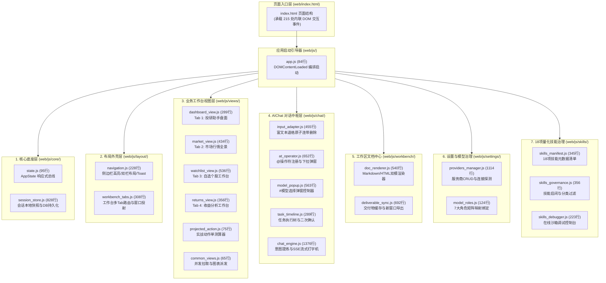

# 前端架构重构与开发指南：app.js 源码拆分与模块化规范 (app.js Modularization & Development Guide)

> **文档类别**：前端系统架构与工程重构实施指南 (Engineering & Architecture Guide)  
> **适用范围**：A-Stock Agents 独立 Web 前端体系架构解耦、代码模块化拆分实施与后续长期功能扩展开发  
> **关联源码**：`web/js/app.js` · `web/index.html` · `web/js/`  
> **单一真理来源 (SSOT)**：本文档作为前端 9,340 行巨石单体解耦、模块化演进与代码开发规范的唯一权威指导文件

---

## 一、 重构背景与核心工程诉求

### 1. 现状评估与痛点诊断 (Monolith Crisis)
随着 A-Stock Agents 系统的快速迭代，前端核心控制文件 `web/js/app.js` 已膨胀至 **9,340 行**（约 400 KB），承担了全站 72.5% 的前端自定义逻辑。经深度语法与依赖审查，暴露出以下严重工程缺陷：

* **单一职责原则严重违背 (SRP Violation)**：
  单文件内混杂了数据通信（REST API/SSE 流）、Canvas 金融图表绘制、富文本输入控制（@操作符/#模型选择）、NLP 提问意图解析、任务分步执行树态导轨、Markdown/HTML 工作区双模渲染、大模型提供商密钥 CRUD，以及 18 项量化投研技能的在线沙箱调试控制台。
* **高频 Git 冲突与协作瓶颈**：
  由于全站核心逻辑均集中在单个文件，不同开发者或智能体在进行界面微调、指标增补或接口适配时，极易产生大面积的代码合并冲突。
* **全局状态无序穿透 (State Mutation Chaos)**：
  全局对象 `AppState` 在近百个全局函数中被随意读写变更，缺乏状态流转通知、变更订阅与生命周期保护。
* **可测试性缺失与排障困难**：
  实战保本卖出价精算（`updateProjectedCalculator`，强制向上进位至分位）以及用户意图短摘要合成等纯算法逻辑与 DOM 强绑定，无法实施隔离单元测试；在浏览器 DevTools 中单步断点调试卡顿，代码定位成本极高。

### 2. 核心工程契约与约束 (Engineering Constraints)
实施源码拆分与模块化重构时，必须严格遵守以下两大底线原则：

1. **零构建工具链依赖原则 (Zero Build Toolchain)**：
   本项目坚持跨平台轻量部署，**不引入 Node.js / npm / Vite / Webpack 构建流水线**。系统由 Python FastAPI（`scripts/server/app.py`）与 Docker 直接进行静态资源托管。拆分后的代码必须能够在现代浏览器中原生直接运行，改动代码后按 F5 刷新即刻生效。
2. **100% 向后兼容性契约 (Zero Regression Contract)**：
   `web/index.html` 中存在 **215 处内联 DOM 事件监听器**（如 `onclick="switchRightTab('market')"`、`oninput="AtOperatorController.handleSearch()"` 等），直接依赖了 `app.js` 中的 **93 个全局函数与对象方法**。拆分方案必须采用“**命名空间封装 + 全局门面导出**”模式，确保所有现有 HTML 事件 100% 正常调用，杜绝发生 `ReferenceError` 运行时异常。

---

## 二、 目标分层架构与 22 模块全景设计

采用 **领域驱动分层 (Domain-Driven Layers) + 全局门面挂载 (Global Facade)** 架构，将 9,340 行的 `app.js` 纵向切分为 **7 大领域分层、22 个高内聚模块**。顶层 `app.js` 蜕变为仅约 **80~100 行** 的纯生命周期引导器（Bootstrap Orchestrator）：



---

## 三、 9,340 行代码精准拆分映射字典 (Code Slice Mapping)

开发实施时，可依据下表精确对照当前 `app.js` 的行号区间与符号清单进行切块迁移：

| 目标文件路径 | 对应 app.js 原代码行号区间 | 模块核心职责与包含符号 | 导出全局句柄 (用于兼容 HTML 内联事件) |
| :--- | :--- | :--- | :--- |
| **`core/state.js`** | `L6 - L56` | `AppState` 核心配置定义、风险参数、响应式发布订阅事件系统 (`on`, `off`, `emit`, `set`) | `window.AppState` |
| **`core/session_store.js`** | `L60 - L824`<br>`L1395 - L1416` | `HistoricalSessions` 数据种子、`SessionStore` 本地缓存快照、会话 CRUD、无限滚动、DB 同步 (`initSessionsFromBackend`) | `HistoricalSessions`, `selectSession`, `startNewChat`, `renderSessionList`, `deleteSession` 等 |
| **`layout/navigation.js`** | `L900 - L985`<br>`L1254 - L1332`<br>`L8371 - L8394` | 左侧菜单导航 (`handleMenuClick`)、单双栏布局切换 (`switchLayoutMode`)、全屏折叠 (`toggleCopilot`)、`showToast` 通知 | `handleMenuClick`, `switchLayoutMode`, `toggleCopilot`, `toggleWorkbenchCollapse`, `showToast` |
| **`layout/workbench_tabs.js`** | `L989 - L1252` | 工作台 Tab 切换 (`switchRightTab`)、标题栏动态专属按钮、右侧内容提问联动、卡片放大投射 (`projectToRight`) | `switchRightTab`, `openRightTab`, `closeRightTab`, `projectToRight`, `askAboutRightContent` |
| **`views/projected_action.js`**| `L1334 - L1389` | 实战动作单投射视窗、最低保本卖出价精算器（含印花税/佣金/过户费，强制向上取整 `math.ceil`） | `updateProjectedCalculator`, `askAboutProjectedAction` |
| **`views/dashboard_view.js`** | `L1418 - L1674`<br>`L9297 - L9300` | 投研盘面视图数据加载 (`loadDashboardData`)、指标卡片水合、盯盘策略开关 (`toggleStrategy`) | `loadDashboardData`, `toggleStrategy`, `initDashboardCharts` |
| **`views/market_view.js`** | `L1675 - L2096` | 市场行情全景视图数据加载 (`loadMarketData`)、四大指数卡片、大盘情绪仪表盘、日K线周期切换、板块资金流向 | `loadMarketData`, `switchKlinePeriod`, `switchSectorTab`, `changeMarketTarget` |
| **`views/watchlist_view.js`** | `L2097 - L2581`<br>`L9311 - L9323` | 自选个股工作台数据加载 (`loadWatchlistData`)、多字段正反序排序、标的切换选择 (`selectWatchStock`)、自适应 Resize | `loadWatchlistData`, `filterWatchlist`, `toggleWatchlistSort`, `selectWatchStock` |
| **`views/returns_view.js`** | `L2582 - L2902` | 收益分析工作台数据加载 (`loadReturnsData`)、资产净值曲线、夏普与最大回撤指标卡、持仓资产穿透明细 | `loadReturnsData`, `askAboutReturnReport`, `switchTrendPeriod` |
| **`views/common_views.js`** | `L2903 - L2950` | 全局数据并发加载器 (`loadAllBackendData`)、多 Tab 图表调度派发器 (`renderTabCharts`)、K线数据生成器 | `loadAllBackendData`, `renderTabCharts`, `generateKlines` |
| **`chat/input_adapter.js`** | `L4160 - L4588` | 输入框跨浏览器兼容层、纯文本提取、富文本回填、退格键原子连带删除（Backspace 一并清除 @操作符和空格） | `clearChatInput`, `getChatInputPlainText`, `setChatInputFromText`, `handleChatInputBackspace` |
| **`chat/at_operator.js`** | `L2983 - L3611` | `@操作符` 数据注册中心 (`AtOperatorRegistry`)、检索过滤、键盘光标导航、下拉浮窗交互与插入回填 | `AtOperatorRegistry`, `AtOperatorController`, `focusChatInput` |
| **`chat/model_popup.js`** | `L3612 - L4159` | `#模型` 选择弹窗控制器 (`ModelPopupController`)、服务商与模型层级分组、关键词搜索过滤与标签插入 | `ModelPopupController`, `openModelPopup`, `closeModelPopup` |
| **`chat/task_timeline.js`** | `L4690 - L4946` | 任务执行树态时间轴导轨、L1批量父任务/L2子任务抽屉折叠展开、人工介入二次确认拦截器 (`requestUserConfirmation`) | `showMessageActions`, `setExecutionStreamingState`, `cancelCurrentExecution`, `handleConfirmationDecision` |
| **`chat/chat_engine.js`** | `L825 - L895`<br>`L2951 - L2982`<br>`L4589 - L4689`<br>`L6100 - L7227` | 提问意图短摘要提炼合成引擎 (`refineTitleAndSummaryFromInput`)、SSE 流式打字机、A2UI 任务管道执行、消息收发调度 | `appendChatMessage`, `streamAIResponse`, `executeOperatorTask`, `handleSendChat`, `sendMessage` |
| **`workbench/doc_renderer.js`**| `L4947 - L5445` | 内置用户操作指南 Markdown 字符串、TOC 目录树提取、Markdown/HTML 工作区双模渲染、目录锚点滚动 | `renderMarkdownToWorkspace`, `renderHtmlToWorkspace`, `scrollToWorkspaceHeading`, `toggleWorkspaceToc` |
| **`workbench/deliverable_sync.js`**| `L5446 - L6099`| 交付物持久化存储同步 (`saveDeliverableDoc`)、HTML/Markdown 互转、独立窗口导出新标签页打开、会话聚焦联动 | `openDocumentInWorkbench`, `closeDeliverablePane`, `copyDeliverableContent`, `setupChatMarkdownLinkDelegation` |
| **`settings/providers_manager.js`**| `L7228 - L8211`<br>`L8313 - L8370` | 大模型提供商管理模态框、提供商 CRUD、Key安全掩码显示、自定义端点连接测试、模型列表拉取与禁用勾选 | `openSettingsModal`, `openProvidersSettingsModal`, `closeSettingsModal`, `ChatModelSelectorController`, `saveSettings` |
| **`settings/model_roles.js`** | `L8212 - L8312` | 7大 AI 分析师角色矩阵配置与动态下拉映射（对话/摘要/量化/辩论/多模态模型角色分配） | `isRoleOptionCompatible`, `chooseDefaultRoleOption`, `renderModelRolesDropdowns`, `handleRoleChange` |
| **`skills/skills_manifest.js`** | `L8396 - L8725` | 18 项内置量化投研技能元数据规范 (`BuiltinSkillsManifest`)、参数 Schema 约束与降级样例字典 | `BuiltinSkillsManifest` |
| **`skills/skills_governance.js`**| `L8726 - L9044` | 技能独立治理中心、技能卡片渲染、一键批量启停开关、分级分类过滤、CLI 命令复制 | `initSkillsGovernance`, `bulkEnableAllSkills`, `handleSkillToggle`, `copyCliCommand` |
| **`skills/skills_debugger.js`** | `L9045 - L9242` | 技能在线沙箱调试控制台、测试参数实时微调、在线执行测试与 200/500 状态解析呈现 | `openSkillTestModal`, `closeSkillTestModal`, `handleDebugSkillChange`, `runSkillTestExecution` |
| **`app.js` (瘦身后主入口)** | `L9243 - L9340` | `DOMContentLoaded` 启动引导生命周期编排、防抖 Resize 监听、全局快捷指令与版本元数据注入 | `AStock.version = '2.0.0'` |

---

## 四、 核心设计模式与技术攻坚方案

### 1. 命名空间与全局门面模式 (Namespace & Window Facade)
**目的**：既享受模块化命名空间的整洁结构，又彻底解决 215 处内联 HTML 调用的 `ReferenceError` 问题。

**代码规范模板**（所有新增/拆分模块均须严格遵循）：
```javascript
// 示例：web/js/layout/workbench_tabs.js
(function(root) {
  'use strict';

  // 1. 模块私有或核心业务实现
  function switchRightTab(tabId) {
    if (!tabId) return;
    // 业务逻辑执行...
  }

  // 2. 现代命名空间挂载 (供跨模块规范调用)
  root.AStock = root.AStock || {};
  root.AStock.WorkbenchTabs = {
    switchRightTab
  };

  // 3. 全局兼容门面挂载 (强制要求：确保 index.html 中 onclick="switchRightTab('market')" 零异常生效)
  root.switchRightTab = switchRightTab;

})(typeof window !== 'undefined' ? window : this);
```

### 2. 响应式状态流转与发布订阅事件总线 (Event Bus Pattern)
**目的**：禁止各模块直接隐式修改 `AppState` 内部属性，提供标准的读写与监听机制。

**核心实现与调用示例**（位于 `web/js/core/state.js`）：
```javascript
// 状态定义与监听支持
const AppState = {
  activeRightTab: 'dashboard',
  // ... 其他基础状态
  
  on(event, callback) {
    if (!this._listeners[event]) this._listeners[event] = [];
    this._listeners[event].push(callback);
    return () => this.off(event, callback);
  },

  set(prop, value) {
    const prev = this[prop];
    this[prop] = value;
    this.emit(`change:${prop}`, value, prev);
    this.emit('change', prop, value, prev);
  }
};

// 业务模块中的优雅使用：
// 监听右侧 Tab 切换
AppState.on('change:activeRightTab', (newTab, prevTab) => {
  console.log(`[ViewSync] Tab changed: ${prevTab} -> ${newTab}`);
  if (typeof renderTabCharts === 'function') renderTabCharts(newTab);
});

// 修改状态并自动触发广播
AppState.set('activeRightTab', 'market');
```

### 3. 单向拓扑无环脚本加载编排 (Topological Script Ordering)
在 `web/index.html` 底部，各模块按照**基础底层 $\to$ 状态层 $\to$ 外壳导航 $\to$ 业务视图 $\to$ 治理与中枢 $\to$ 启动入口**的拓扑次序严格加载：

```html
  <!-- 1. 基础第三方纯净库与底层通信/展示引擎 -->
  <script src="js/libs/marked.min.js"></script>
  <script src="js/libs/highlight.min.js"></script>
  <script src="js/libs/purify.min.js"></script>
  <script src="js/api.js"></script>
  <script src="js/charts.js"></script>
  <script src="js/ui_engine.js"></script>
  <script src="js/components/astock.js"></script>
  <script src="js/chat_presentation.js"></script>

  <!-- 2. 核心状态与会话持久化层 -->
  <script src="js/core/state.js"></script>
  <script src="js/core/session_store.js"></script>

  <!-- 3. 外壳布局与 Tab 路由层 -->
  <script src="js/layout/navigation.js"></script>
  <script src="js/layout/workbench_tabs.js"></script>

  <!-- 4. 四大业务工作台与实战动作单视图 -->
  <script src="js/views/projected_action.js"></script>
  <script src="js/views/dashboard_view.js"></script>
  <script src="js/views/market_view.js"></script>
  <script src="js/views/watchlist_view.js"></script>
  <script src="js/views/returns_view.js"></script>
  <script src="js/views/common_views.js"></script>

  <!-- 5. 设置治理与 18 项量化技能系统 -->
  <script src="js/settings/providers_manager.js"></script>
  <script src="js/settings/model_roles.js"></script>
  <script src="js/skills/skills_manifest.js"></script>
  <script src="js/skills/skills_governance.js"></script>
  <script src="js/skills/skills_debugger.js"></script>

  <!-- 6. 工作区文档持久化与 AIChat 交互中枢 -->
  <script src="js/workbench/doc_renderer.js"></script>
  <script src="js/workbench/deliverable_sync.js"></script>
  <script src="js/chat/input_adapter.js"></script>
  <script src="js/chat/at_operator.js"></script>
  <script src="js/chat/model_popup.js"></script>
  <script src="js/chat/task_timeline.js"></script>
  <script src="js/chat/chat_engine.js"></script>

  <!-- 7. 应用统一启动编排引导器 (瘦身后的 app.js) -->
  <script src="js/app.js"></script>
```

---

## 五、 分阶段实施演进路线图 (Phase-by-Phase Roadmap)

> 本章分阶段实施演进路线图与阶段交付节奏见实施看板：[`app-js-modularization-plan.md`](../../specs/ui/app-js-modularization-plan.md)。

---

## 六、 后续日常开发与功能扩展规范 (Developer Rules)

后续在此架构上进行新特性研发时，所有开发者与智能体必须严格遵循以下标准流程：

### 1. 新增业务工作台 Tab 标准流程 (Add New Workbench View)
若需在主工作区增加新的业务视图（例如“事件驱动与公告看板”）：
1. **新建视图文件**：在 `web/js/views/` 目录下创建 `events_view.js`；
2. **编写闭包与门面**：实现 `loadEventsData()` 与 `renderEventsCharts()`，并挂载到 `AStock.EventsView` 与 `window`；
3. **注册至统一调度器**：在 `views/common_views.js` 中将 `loadEventsData` 纳入 `loadAllBackendData` 的 `Promise.allSettled` 中，并在 `renderTabCharts` 中增加对应的 `tabId === 'events'` 分支；
4. **页面挂载**：在 `web/index.html` 中添加 Tab 导航按钮及视图容器，并在脚本区按序引入 `<script src="js/views/events_view.js"></script>`。
> ⚠️ **红线**：严禁直接向 `app.js` 中追加该视图的具体渲染代码！

### 2. 扩展新类别 @操作符规范 (Extend @Operator)
若需在提问框中引入新的快捷操作符类型（例如 `@策略`）：
1. 在 `web/js/chat/at_operator.js` 的 `AtOperatorRegistry` 中声明数据数组与检索正则；
2. 在 `renderDropdown()` 中配置对应的 CSS Badge 类名（如 `.at-token-strategy`）；
3. 在 `web/js/chat/chat_engine.js` 的 `executeOperatorTask()` 中完善该策略的意图分流与后端参数组装。

### 3. 新增量化投研技能规范 (Register Quantitative Skill)
若底层内核增加了第 18 项量化技能：
1. 仅须在 `web/js/skills/skills_manifest.js` 中的 `BuiltinSkillsManifest` 数组中追加该技能的元数据（包含 `id`, `name`, `desc`, `params`, `sampleCli` 等）；
2. 技能治理界面（`skills_governance.js`）与在线调试控制台（`skills_debugger.js`）将**全自动动态感知并完成渲染**，无须编写额外前端代码。

### 4. 禁止反模式清单 (Anti-Patterns Blacklist)
* 🚫 **严禁重新向 `app.js` 写入具体业务逻辑**：`app.js` 的代码行数上限严格限制在 **120 行以内**；
* 🚫 **严禁遗漏全局门面挂载**：在任何子模块中定义了被 `index.html` 调用的函数，必须显式赋值给 `root.<funcName> = <funcName>`；
* 🚫 **严禁引入构建工具破坏静态化**：严禁私自引入 `npm build` 机制，保持仓库纯净、开箱即用的技术底色。

---

## 七、 质量验证与自动化回归工具

为确保后续任何模块改动均不破坏系统完整性，可随时使用以下命令与自动化工具进行快速核验：

### 1. 全量 JavaScript 语法树静态编译核验
```bash
# 验证 web/js 下所有单文件与子目录模块的语法合法性 (0 错误即为通过)
node -c web/js/*.js web/js/**/*.js
```

### 2. DOM 内联事件处理句柄覆盖率自动扫描脚本
在项目根目录下运行以下 Python 探测脚本，可自动核验 `index.html` 中所有内联事件与 JS 暴露符号的覆盖率：
```python
import re, os

# 1. 提取 index.html 中所有 onX 内联事件调用的首符号
with open("web/index.html", "r", encoding="utf-8") as f:
    html = f.read()

matches = re.findall(r"on\w+\s*=\s*[\"\x27]([^\s\"\x27(]+)", html)
unique_handlers = sorted(list(set(matches)))

# 2. 读取 web/js 下所有模块文本
js_content = ""
for root_dir, _, files in os.walk("web/js"):
    for f in files:
        if f.endswith(".js") and not f.endswith(".bak"):
            with open(os.path.join(root_dir, f), "r", encoding="utf-8") as jf:
                js_content += "\n" + jf.read()

# 3. 逐一比对是否存在声明或全局挂载
missing = []
for h in unique_handlers:
    first_token = h.split(".")[0]
    pattern = rf"(\b(root|window)\.{first_token}\b|\bfunction\s+{first_token}\b|\bconst\s+{first_token}\b)"
    if not re.search(pattern, js_content):
        missing.append(h)

if missing:
    print(f"❌ 发现未覆盖的内联句柄: {missing}")
else:
    print(f"✅ 完美通过！全部 {len(unique_handlers)} 个内联事件句柄均在模块中正确暴露。")
```
