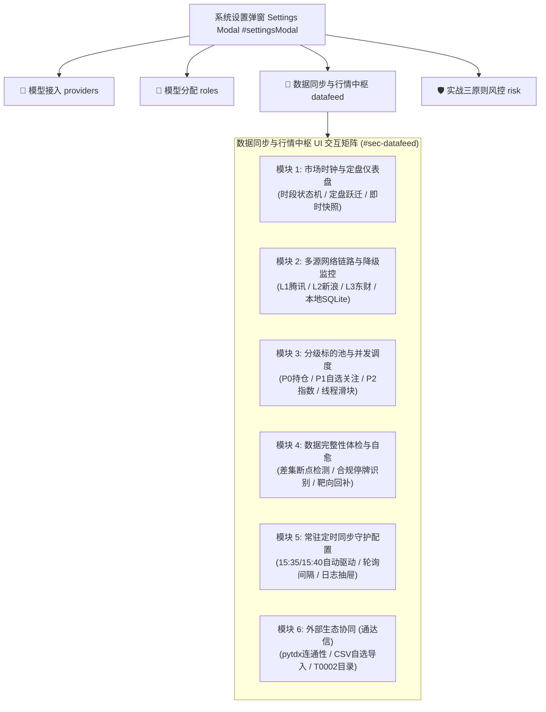
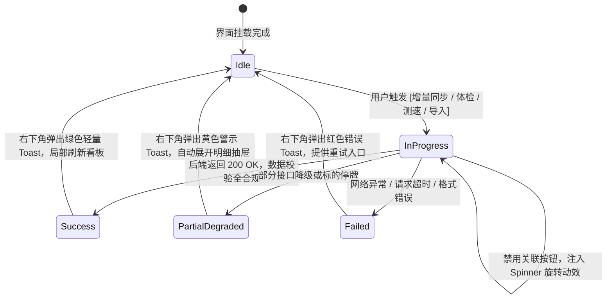

# A-Stock 数据同步与行情中枢系统设置 UI 交互功能说明与设计清单 (data-sync-settings-ui-specification)

> **文档类别**：UI/UX 交互功能规范与设计清单 (Specification & Checklist)  
> **适用范围**：A-Stock Agents Web 投研端系统设置弹窗（Settings Modal）中的【数据同步与行情中枢】模块  
> **归属规范体系**：
> - 权威设计指南：[`docs/guidelines/ui/ui-design-guide.md`](ui-design-guide.md) (`SPEC-UI-001`)
> - 前端样式源码：[`web/css/style.css`](../../../web/css/style.css) 与 [`web/index.html`](../../../web/index.html)
> - 数据底层规范：[`docs/guidelines/data/market-data-sync-specification.md`](../data/market-data-sync-specification.md)
> - 接口协议契约：[`docs/guidelines/data/market-data-api-specification.md`](../data/market-data-api-specification.md)
> - 实施进度看板：[`docs/specs/data/market-data-sync-implementation-plan.md`](../../specs/data/market-data-sync-implementation-plan.md)

---

## 一、 模块定位与交互架构原则

在 A-Stock Agents 的【系统设置】弹窗（`#settingsModal`）中，原有的静态第 3 栏【📶 行情数据源降级】正式升级扩建为 **【📶 数据同步与行情中枢】(Data Sync & Market Data Hub)**。该模块不仅展示网络链路状态，更为投研人员和量化交易员提供对**本地时序时钟、盘后定盘状态机、分级标的池并发调度、完整性自愈及常驻定时守护**的全面可视化管理界面。



---

## 二、 前端视觉规范与 CSS Tokens 严格对齐 (Visual & Design Tokens)

为确保新模块与现有 Web 前端界面达到 **像素级融合与零视觉偏离**，所有 UI 元素**必须 100% 继承并复用** [`web/css/style.css`](../../../web/css/style.css) 中定义的 Design Tokens 与组件基类。

### 1. 核心色彩与 CSS 变量对齐表 (Design Tokens Mapping)

| 语义角色 | CSS 变量名 (style.css) | 颜色值 / 代码 | 规范界面应用场景 | 禁忌偏离说明 |
|:---|:---|:---|:---|:---|
| **画布主背景** | `--bg-canvas` | `#F6F8FC` | 设置弹窗外部底色、二级抽屉背景 | 严禁使用深灰或冷蓝渐变 |
| **卡片纯白底** | `--bg-card` | `#FFFFFF` | 主卡片底色、各功能模块容器背景 | 保持纯正白色，拒绝泛灰 |
| **卡片浅灰底** | `--bg-hover` / `--bg-tag` | `#F8FAFD` / `#FAFCFE` | 数据源条目、时钟横幅、次级信息容器 | 柔和浅灰，用于区分信息层级 |
| **卡片悬浮高亮** | `--bg-active` | `#EBF3FF` | 卡片悬停底色、活跃选中项背景 | 微蓝半透明，提升悬浮层次 |
| **品牌主色 (蓝)** | `--primary` | `#1677FF` | 激活 Tab、主操作按钮、滑块轨道激活态 | 严禁使用过深或泛紫的非标蓝 |
| **品牌悬浮蓝** | `--primary-hover` | `#0958D9` | 按钮悬停、交互触发状态 | 加深一个明度阶梯 |
| **品牌浅蓝底** | `--primary-light` | `#E6F4FF` | 盘中未定盘徽章、测速高亮底色 | 高通透浅蓝，提示进行中状态 |
| **品牌边框蓝** | `--primary-border` | `#91CAFF` | 卡片 Hover 边框、输入框 Focus 状态 | 细微柔和的 1px 聚焦轮廓 |
| **A股红涨/缺漏** | `--color-up` / `--color-up-bg` | `#F5222D` / `#FFF1F0` | 完整性缺漏报警、超时断连、异常标签 | 必须遵循红涨警示，配淡粉底 |
| **A股绿跌/定盘** | `--color-down` / `--color-down-bg` | `#52C41A` / `#F6FFED` | 盘后已定盘、运行正常、完整无缺 | 必须遵循绿跌稳健，配淡绿底 |
| **警示/停牌/备用** | `--color-warn` / `--color-warn-bg` | `#FA8C16` / `#FFF7E6` | 合规停牌、备用链路、待确认状态 | 柔和橙色，表示中性警示 |
| **主标题文本** | `--text-title` | `#1D2129` | 模块标题、股票名称、核心指标大字 | 高对比度近黑深灰 |
| **正文次级文本** | `--text-body` | `#4E5969` | 描述段落、表单 Label、列表主信息 | 易读深灰，保证长时间阅读舒适 |
| **弱化辅助文本** | `--text-muted` | `#86909C` | 次级说明、时间戳、表头字段名 | 中性浅灰，提供弱对比度参考 |
| **卡片微边框** | `--border-card` / `--border-light` | `#EBF0F5` / `#F0F2F5` | 标准 1px 卡片边框、横向分割线 | **彻底摒弃粗彩色竖条**，仅用1px |

### 2. 金融等宽数字与字体排印 (Tabular Numerics)
所有涉及**股票代码、交易时间戳、价格、涨跌幅百分比、网络延迟 (ms)、本地数据条数与同步耗时**的数值节点，必须显式附加 `.tabular-nums` 类或声明样式：
```css
font-variant-numeric: tabular-nums;
font-family: -apple-system, BlinkMacSystemFont, "Segoe UI", Roboto, "PingFang SC", "Hiragino Sans GB", "Microsoft YaHei", sans-serif;
```
确保数据垂直对比时小数点和数字位绝对齐平，杜绝界面左右抖动。

### 3. 微投影与轻量化卡片体系 (Zero-Stripe Principle)
- **卡片容器规范**：统一采用现有的 `.role-config-card` 结构与样式：
  ```css
  padding: 12px 14px;
  border: 1px solid #E8EEF5;
  border-radius: var(--radius-md); /* 10px */
  background: #FAFCFE;
  box-shadow: var(--shadow-card); /* 0 2px 10px rgba(0, 0, 0, 0.035) */
  transition: var(--transition-smooth);
  ```
- **悬停质感**：
  ```css
  &:hover {
    border-color: var(--primary-border); /* #91CAFF */
    box-shadow: var(--shadow-hover); /* 0 6px 18px rgba(22, 119, 255, 0.08) */
    background: #FFFFFF;
  }
  ```
- **轻量微边框原则**：严格执行 SPEC-UI-001 规范，禁止在卡片左侧添加 3px/4px 粗实心彩色竖条。信息状态完全由胶囊徽章（Badge）和状态点（Status Dot）表达。

---

## 三、 六大功能模块 UI 交互说明与 DOM 蓝图

### 模块 1：市场时钟与定盘仪表盘 (Market Clock & State Dashboard)

#### 1. 业务目标
让用户在设置面板中一目了然获取 A 股市场当前时段（早盘竞价/上午连续交易/午间休市/下午交易/盘后清算/已定盘）、判断本日数据是否已完成盘后最终固化，并支持盘中一键落盘今日快照。

#### 2. HTML 结构蓝图 (直接嵌入 `#sec-datafeed`)
```html
<!-- 模块 1: 市场时钟与定盘态仪表盘 -->
<div class="role-config-card sync-clock-hero">
  <div class="sync-clock-main">
    <div class="sync-clock-time tabular-nums" id="syncClockDisplay">15:42:18</div>
    <div class="sync-clock-meta">
      <div class="sync-clock-tags">
        <span class="badge-tag-green" id="syncTradingDayBadge">🟢 交易日</span>
        <span class="status-capsule capsule-settled" id="syncSettleBadge">● 盘后已定盘 (SETTLED)</span>
      </div>
      <div class="sync-clock-desc" id="syncPhaseDesc">
        当日行情已完成收盘与交易所清算，历史 Bar 数据已稳固归档。
      </div>
    </div>
  </div>
  <div class="sync-clock-actions">
    <button type="button" class="btn-secondary" id="btnSyncTodaySnapshot">
      <span class="btn-icon">⚡</span> 立即同步今日快照
    </button>
  </div>
</div>
```

#### 3. 核心视觉样式
- `.sync-clock-hero`：背景使用微光渐变 `linear-gradient(180deg, #FFFFFF 0%, #F8FAFD 100%)`，内边距 `14px 16px`；
- `.sync-clock-time`：字号 `26px`，字重 `700`，字色 `var(--text-title)`，等宽排列；
- `.status-capsule`：圆角 `var(--radius-full)`，内边距 `2px 8px`，字体 `11px`，字重 `600`；
  - 已定盘 (`.capsule-settled`)：背景 `#F6FFED`，边框 `1px solid #B7EB8F`，文字 `#52C41A`；
  - 盘中未定盘 (`.capsule-unsettled`)：背景 `#E6F4FF`，边框 `1px solid #91CAFF`，文字 `#1677FF`；
  - 休市/非交易日 (`.capsule-closed`)：背景 `#F5F5F5`，边框 `1px solid #D9D9D9`，文字 `#8C8C8C`。

---

### 模块 2：多源网络链路与降级监控 (Multi-Tier Datafeed & Failover)

#### 1. 业务目标
对齐系统的 4 级行情容灾规范，透明展示各上游数据链路的实时连通性、测速延迟 (RTT)、协议与费用属性，并支持一键网络巡检。

#### 2. HTML 结构蓝图 (升级自现有 `.datafeed-list`)
```html
<!-- 模块 2: 多源链路与降级监控 -->
<div class="form-group" style="margin-top: 16px;">
  <div class="sync-sec-header">
    <label class="form-label" style="margin-bottom: 0;">4 级高可用行情源链路降级体系</label>
    <button type="button" class="btn-text-action" id="btnPingAllFeeds">
      <span class="btn-icon">🔄</span> 一键链路测速
    </button>
  </div>
  <div class="form-hint" style="margin-bottom: 8px;">
    主力数据源失败或限频时自动毫秒级平滑下切，保障分析流程不中断。
  </div>

  <div class="datafeed-list">
    <!-- L1 主力源 -->
    <div class="datafeed-item">
      <div class="datafeed-tier"><span class="badge-tier tier-l1">L1 首选</span></div>
      <div class="datafeed-info">
        <div class="datafeed-name">腾讯财经高速直连 (Tencent)</div>
        <div class="datafeed-sub">qt.gtimg.cn · 零依赖 / 无反爬拦截 / 全周期日K与实时盘口</div>
      </div>
      <div class="datafeed-status">
        <span class="status-online tabular-nums" id="pingL1">● 运行中 (68ms)</span>
      </div>
    </div>

    <!-- L2 备用源 -->
    <div class="datafeed-item">
      <div class="datafeed-tier"><span class="badge-tier tier-l2">L2 备用</span></div>
      <div class="datafeed-info">
        <div class="datafeed-name">新浪财经实时行情 (Sina)</div>
        <div class="datafeed-sub">hq.sinajs.cn · 零依赖 / 实时快照与分时降级备用</div>
      </div>
      <div class="datafeed-status">
        <span class="status-standby tabular-nums" id="pingL2">● 备用就绪 (124ms)</span>
      </div>
    </div>

    <!-- L3 配额源 -->
    <div class="datafeed-item">
      <div class="datafeed-tier"><span class="badge-tier tier-l3">L3 代理</span></div>
      <div class="datafeed-info">
        <div class="datafeed-name">东方财富 / AkShare (Eastmoney)</div>
        <div class="datafeed-sub">push2/datacenter · CYQ筹码分布 / 资金流向 (配额代理)</div>
      </div>
      <div class="datafeed-status">
        <span class="status-standby tabular-nums" id="pingL3">● 备用就绪</span>
      </div>
    </div>

    <!-- 本地数据库 -->
    <div class="datafeed-item">
      <div class="datafeed-tier"><span class="badge-tier tier-local">本地</span></div>
      <div class="datafeed-info">
        <div class="datafeed-name">本地 SQLite 时序数据库 (Local Engine)</div>
        <div class="datafeed-sub">local/market_data/astock_data.db · WAL并发读写 / 指标原地自算</div>
      </div>
      <div class="datafeed-status">
        <span class="status-online tabular-nums">● 极速就绪 (&lt;1ms)</span>
      </div>
    </div>
  </div>
</div>
```

#### 3. 样式规则与细节
- `.datafeed-item`：高度 `46px`，内边距 `8px 12px`，背景 `#F8FAFD`，边框 `1px solid var(--border-light)`，圆角 `var(--radius-sm)`；
- `.badge-tier`：采用淡雅微标签体系：
  - `tier-l1`：背景 `#E6F4FF`，文字 `#1677FF`，边框 `1px solid #91CAFF`；
  - `tier-l2`：背景 `#F2F5FA`，文字 `#4E5969`，边框 `1px solid #DFE6EF`；
  - `tier-l3`：背景 `#FFF7E6`，文字 `#FA8C16`，边框 `1px solid #FFD591`；
  - `tier-local`：背景 `#F6FFED`，文字 `#52C41A`，边框 `1px solid #B7EB8F`。

---

### 模块 3：分级标的池与并发调度 (Tiered Pools & Concurrency Slider)

#### 1. 业务目标
支持用户对不同重要级的标的池（持仓池、自选池、关注池、全市场）进行按需增量定盘同步，并精确调节后台同步线程池并发度（1~16 线程）。

#### 2. HTML 结构蓝图
```html
<!-- 模块 3: 分级标的池与并发调度 -->
<div class="form-group" style="margin-top: 16px;">
  <label class="form-label">分级标的池增量同步</label>
  
  <div class="pool-grid">
    <!-- P0 核心持仓卡片 -->
    <div class="role-config-card pool-card">
      <div class="pool-card-header">
        <div class="pool-card-title">
          <span class="badge-risk-readonly">P0 核心</span>
          <strong>持仓池 (Holdings)</strong>
        </div>
        <span class="pool-count tabular-nums" id="countHoldings">3 只标的</span>
      </div>
      <div class="pool-card-body">
        <div class="pool-meta tabular-nums">最新已同步: 2026-09-21</div>
        <div class="pool-status-text text-muted">定盘窗口: 每日 15:35 优先同步</div>
      </div>
      <div class="pool-card-footer">
        <button type="button" class="btn-secondary btn-sm" data-pool="holdings">
          增量同步
        </button>
      </div>
    </div>

    <!-- P1 自选关注卡片 -->
    <div class="role-config-card pool-card">
      <div class="pool-card-header">
        <div class="pool-card-title">
          <span class="badge-tier tier-l2">P1 重点</span>
          <strong>自选与关注池</strong>
        </div>
        <span class="pool-count tabular-nums" id="countWatchlist">18 只标的</span>
      </div>
      <div class="pool-card-body">
        <div class="pool-meta tabular-nums">最新已同步: 2026-09-21</div>
        <div class="pool-status-text text-muted">定盘窗口: 每日 15:40 准时同步</div>
      </div>
      <div class="pool-card-footer">
        <button type="button" class="btn-secondary btn-sm" data-pool="watchlist">
          增量同步
        </button>
      </div>
    </div>

    <!-- P2 指数与全市场 -->
    <div class="role-config-card pool-card">
      <div class="pool-card-header">
        <div class="pool-card-title">
          <span class="badge-tier tier-l3">P2 宏观</span>
          <strong>五大核心指数</strong>
        </div>
        <span class="pool-count tabular-nums" id="countIndices">5 只指数</span>
      </div>
      <div class="pool-card-body">
        <div class="pool-meta tabular-nums">上证/深成/创业/科创/中证</div>
        <div class="pool-status-text text-muted">包含多周期完整技术均线</div>
      </div>
      <div class="pool-card-footer">
        <button type="button" class="btn-secondary btn-sm" data-pool="indices">
          增量同步
        </button>
      </div>
    </div>
  </div>

  <!-- 并发度调节滑块 -->
  <div class="concurrency-control-box">
    <div class="concurrency-slider-header">
      <label class="form-label" style="margin-bottom: 0;">多线程下载并发度 (ThreadPool max_workers)</label>
      <span class="concurrency-value-badge tabular-nums" id="valConcurrency">4 线程</span>
    </div>
    <div class="concurrency-slider-wrapper">
      <input type="range" class="form-slider" id="cfgSyncConcurrency" min="1" max="16" step="1" value="4">
      <div class="slider-marks tabular-nums">
        <span>1 (低负载)</span>
        <span>4 (推荐)</span>
        <span>8 (高速)</span>
        <span>16 (极限)</span>
      </div>
    </div>
    <div class="form-hint">
      并发拉取能大幅缩短大批量同步耗时（100只标的自选约 1.8s）。建议设为 4~8 线程，避免触发上游 IP 频控。
    </div>
  </div>
</div>
```

#### 3. 样式与响应规范
- `.pool-grid`：采用 `display: grid; grid-template-columns: repeat(3, 1fr); gap: 10px; margin-bottom: 12px;`；
- `.pool-card`：卡片背景采用 `#FAFCFE`，悬浮时边框高亮为 `var(--primary-border)`，背景变白并上升 `1px`；
- `.concurrency-control-box`：包裹在轻量卡片内，内边距 `10px 12px`，背景 `#F8FAFD`，边框 `1px solid var(--border-light)`，圆角 `var(--radius-sm)`；
- `.form-slider`：轨道高度 `4px`，滑块把手直径 `14px`，主色 `#1677FF`，拖拽流畅无顿挫。

---

### 模块 4：数据完整性体检与断点自愈 (Integrity Audit & Smart Healing)

#### 1. 业务目标
基于交易日历的理论交易日序列与本地实际落盘记录进行集合差集运算，精准检出时序断点；同时与腾讯/新浪接口复核，区分**合规停牌（Suspended）**与**异常缺漏（Missing）**，支持一键靶向回补。

#### 2. HTML 结构蓝图
```html
<!-- 模块 4: 数据完整性体检与断点自愈 -->
<div class="form-group" style="margin-top: 16px;">
  <div class="sync-sec-header">
    <label class="form-label" style="margin-bottom: 0;">数据连续性体检与智能自愈 (Smart Healing)</label>
    <div class="sync-actions-group">
      <button type="button" class="btn-secondary btn-sm" id="btnAuditIntegrity">
        <span class="btn-icon">🔍</span> 全库体检
      </button>
      <button type="button" class="btn-primary btn-sm" id="btnRepairGaps">
        <span class="btn-icon">🩹</span> 靶向自愈回补
      </button>
    </div>
  </div>

  <!-- 体检概览指标条 (KPI Bar) -->
  <div class="audit-kpi-bar">
    <div class="kpi-item">
      <span class="kpi-label">已审计标的</span>
      <strong class="kpi-value tabular-nums" id="kpiAuditedCodes">26</strong>
    </div>
    <div class="kpi-item">
      <span class="kpi-label">健康度评分</span>
      <strong class="kpi-value text-green tabular-nums" id="kpiHealthScore">98.5%</strong>
    </div>
    <div class="kpi-item">
      <span class="kpi-label">真实缺漏切片</span>
      <strong class="kpi-value text-red tabular-nums" id="kpiMissingDays">0</strong>
    </div>
    <div class="kpi-item">
      <span class="kpi-label">已核准合规停牌</span>
      <strong class="kpi-value text-warn tabular-nums" id="kpiSuspendedDays">3</strong>
    </div>
  </div>

  <!-- 体检结果明细表格 (折叠抽屉) -->
  <div class="audit-table-wrapper" id="auditTableDrawer">
    <table class="audit-table">
      <thead>
        <tr>
          <th>标的代码</th>
          <th>标的名称</th>
          <th>理论天数</th>
          <th>实际落盘</th>
          <th>合规停牌</th>
          <th>异常缺漏</th>
          <th>状态判断</th>
          <th>操作</th>
        </tr>
      </thead>
      <tbody id="auditTableBody">
        <tr>
          <td class="tabular-nums font-mono">000001</td>
          <td>平安银行</td>
          <td class="tabular-nums">242</td>
          <td class="tabular-nums">242</td>
          <td class="tabular-nums text-muted">0</td>
          <td class="tabular-nums text-muted">0</td>
          <td><span class="badge-tag-green">🟢 完整</span></td>
          <td><span class="text-subtle">-</span></td>
        </tr>
        <tr>
          <td class="tabular-nums font-mono">600519</td>
          <td>贵州茅台</td>
          <td class="tabular-nums">242</td>
          <td class="tabular-nums">241</td>
          <td class="tabular-nums text-warn">1 (临时停牌)</td>
          <td class="tabular-nums text-muted">0</td>
          <td><span class="badge-tag-warn">🟡 停牌排除</span></td>
          <td><span class="text-subtle">已核准</span></td>
        </tr>
      </tbody>
    </table>
  </div>
</div>
```

#### 3. 样式与金融色彩约定
- `.audit-kpi-bar`：4 列均匀分布的统计容器，底色 `#FAFCFE`，边框 `1px solid var(--border-light)`，圆角 `var(--radius-sm)`，内边距 `8px 12px`；
  - `text-green`：`color: var(--color-down);`（绿色表示健康）
  - `text-red`：`color: var(--color-up);`（红色表示缺漏警示）
  - `text-warn`：`color: var(--color-warn);`（橙色表示停牌中性）
- `table.audit-table`：复用主系统 `table` 规则，表头字号 `11px`，字色 `var(--text-muted)`，行高 `32px`，代码强制 `font-mono tabular-nums`。

---

### 模块 5：常驻定时同步守护配置 (Sync Daemon & Terminal Console)

#### 1. 业务目标
提供对系统级后台守护进程 [`scripts/core/data/sync_daemon.py`](file:///coding/a_stock_agents/scripts/core/data/sync_daemon.py) 的启停控制、执行周期查看、轮询检测频率设定，以及嵌入式守护进程日志控制台。

#### 2. HTML 结构蓝图
```html
<!-- 模块 5: 常驻定时同步守护配置 -->
<div class="role-config-card daemon-card" style="margin-top: 16px;">
  <div class="daemon-header">
    <div class="daemon-title-area">
      <div class="daemon-title-row">
        <strong>盘后自动定盘同步守护进程 (Sync Daemon)</strong>
        <span class="status-online" id="daemonStatusText">● 运行中 (PID: 29104)</span>
      </div>
      <div class="daemon-subtitle">
        每日 15:35 自动触发持仓池同步，15:40 触发关注池与指数同步，自动跳过周末节假日。
      </div>
    </div>
    <div class="daemon-toggle-area">
      <label class="switch-control">
        <input type="checkbox" id="toggleSyncDaemon" checked>
        <span class="switch-slider"></span>
      </label>
    </div>
  </div>

  <!-- 守护时间轴指示 -->
  <div class="daemon-timeline">
    <div class="timeline-step passed">
      <div class="timeline-dot"></div>
      <div class="timeline-content">
        <div class="timeline-time tabular-nums">15:00:00</div>
        <div class="timeline-label">市场收盘</div>
      </div>
    </div>
    <div class="timeline-step active">
      <div class="timeline-dot"></div>
      <div class="timeline-content">
        <div class="timeline-time tabular-nums">15:35:00</div>
        <div class="timeline-label">P0 持仓定盘</div>
      </div>
    </div>
    <div class="timeline-step">
      <div class="timeline-dot"></div>
      <div class="timeline-content">
        <div class="timeline-time tabular-nums">15:40:00</div>
        <div class="timeline-label">P1 自选/指数</div>
      </div>
    </div>
    <div class="timeline-step">
      <div class="timeline-dot"></div>
      <div class="timeline-content">
        <div class="timeline-time tabular-nums">15:45:00</div>
        <div class="timeline-label">全库自愈体检</div>
      </div>
    </div>
  </div>

  <!-- 嵌入式守护日志抽屉 -->
  <div class="daemon-log-box">
    <div class="daemon-log-header">
      <span class="daemon-log-title">实时守护日志流 (sync_daemon.log)</span>
      <div class="daemon-log-actions">
        <button type="button" class="btn-link-xs" id="btnClearDaemonLog">清屏</button>
        <button type="button" class="btn-link-xs" id="btnRefreshDaemonLog">刷新</button>
      </div>
    </div>
    <div class="daemon-terminal-console tabular-nums" id="daemonLogTerminal">
[2026-09-21 15:35:01] [INFO] [守护进程] 交易日 (2026-09-21) 达到 15:35，触发 P0 核心持仓定盘同步...
[2026-09-21 15:35:02] [INFO]     P0 持仓同步完成: 成功 3/3, 耗时 0.08s (4线程并发)
[2026-09-21 15:40:01] [INFO] [守护进程] 达到 15:40，触发 P1 自选与关注池定盘同步...
[2026-09-21 15:40:02] [INFO]     P1 关注池同步完成: 成功 18/18, 耗时 0.22s
[2026-09-21 15:40:03] [INFO]     P2 指数池同步完成: 成功 5/5, 耗时 0.05s
    </div>
  </div>
</div>
```

#### 3. 样式规范与微动效
- `.daemon-card`：内边距 `14px`，背景 `#FAFCFE`，边框 `1px solid #E8EEF5`；
- `.switch-control`：宽度 `36px`，高度 `20px`，圆角 `10px`；激活时背景为品牌蓝 `#1677FF`，过渡平滑；
- `.daemon-timeline`：横向步进器，灰色连线 `1px solid var(--border-light)`；当前激活节点使用 `--primary` 呼吸光晕微动效；
- `.daemon-terminal-console`：深色代码控制台风格，高度 `110px`，内边距 `8px 10px`，背景 `#1E222D`，字色 `#A6E22E`，字号 `11px`，行高 `1.5`，带自动滚屏。

---

### 模块 6：外部投研生态协同 (通达信 TDX Sync)

#### 1. 业务目标
支持投研人员将外部专业看盘软件（如通达信 PC 端）中的自选股列表、选股公式导出文件（`.csv` / `.txt` / `.xls`）无缝导入进本系统的三大自选股池。

#### 2. HTML 结构蓝图
```html
<!-- 模块 6: 外部生态协同 (通达信) -->
<div class="role-config-card" style="margin-top: 16px;">
  <div class="form-label" style="margin-bottom: 8px;">外部投研生态协同 (通达信导入与打通)</div>
  <div class="form-tip" style="margin-bottom: 10px;">
    支持导入通达信自选股导出文本或直连本地 T0002 目录，自动解析 A 股标准 6 位代码并去重导入。
  </div>

  <div class="tdx-sync-layout">
    <!-- 文件拖拽上传区域 (Dropzone) -->
    <div class="tdx-dropzone" id="tdxDropzone">
      <div class="tdx-dropzone-icon">📁</div>
      <div class="tdx-dropzone-text">点击选择或将通达信导出文件拖拽至此处</div>
      <div class="tdx-dropzone-hint">支持 .csv, .txt, .blk 文件格式</div>
      <input type="file" id="tdxFileInput" style="display:none;" accept=".csv,.txt,.blk,.xls">
    </div>

    <!-- 导入参数配置区 -->
    <div class="tdx-options-form">
      <div class="form-group" style="margin-bottom: 8px;">
        <label class="form-label">目标归属股池</label>
        <select class="form-select" id="selectTdxTargetPool">
          <option value="watchlist" selected>重点自选池 (Watchlist)</option>
          <option value="focus">雷达关注池 (Focus)</option>
          <option value="holdings">实盘持仓池 (Holdings)</option>
        </select>
      </div>
      <div class="form-group" style="margin-bottom: 0;">
        <button type="button" class="btn-primary" id="btnExecuteTdxImport" style="width: 100%;">
          解析并执行导入
        </button>
      </div>
    </div>
  </div>
</div>
```

#### 3. 样式细节
- `.tdx-dropzone`：虚线微边框 `1.5px dashed #D6E4FF`，背景 `#F8FAFD`，圆角 `var(--radius-sm)`，居中排版；当文件悬停拖入时，边框高亮为 `var(--primary)`，背景微变淡蓝 `#E6F4FF`。

---

## 四、 UI 交互全生命周期状态机与反馈规约

为保障金融量化业务的严肃性与确定性，前端所有的异步数据交互均严格执行以下交互反馈规约：



### 1. 按钮防重与 Loading 旋转动效
- 当用户点击任意同步、体检或回补按钮后：
  - 按钮立即添加 `.is-loading` 类，内部文字替换为 `“处理中...”`，左侧图标替换为原生 CSS 旋转圆环（`@keyframes spin`）；
  - 按钮属性置为 `disabled="disabled"`，阻止高频二次点击；
  - 任务返回后平滑移除 loading 态，恢复文字与图标。

### 2. 右下角全局 Toast 通知规范 (对齐 SPEC-UI-001)
- **绝对定位契约**：所有消息提示统一通过系统全局 Toast 容器渲染在**屏幕右下角**（`position: fixed; bottom: 24px; right: 24px; z-index: 9999;`），禁止任何在页面顶端或中央遮挡主要视窗的强侵入式弹窗；
- **状态色与文案范例**：
  - **成功提示 (Green)**：
    `✅ 增量同步完成：持仓池 3 只标的定盘数据已更新落盘 (耗时 0.08s)`
  - **中性时钟提醒 (Blue)**：
    `💡 提示：当前处于盘中交易时段，本次同步已生成临时快照；盘后 15:35 守护进程将自动固化定盘`
  - **停牌与自愈提示 (Yellow)**：
    `🟡 自愈完成：成功回补 1 处缺漏数据，核准排除 1 处合规停牌标的 (贵州茅台)`
  - **异常错误提示 (Red)**：
    `❌ 同步失败：上游网络连接超时，已自动切入本地离线数据库 (耗时 3.01s)`

---

## 五、 前端与后端 REST / Tasks API 契约映射表

| 模块序号 | 交互功能入口 | 触发调用 API 路径 | 请求 Payload 参数 | 响应数据字段示例 |
|:---|:---|:---|:---|:---|
| **M1** | 页面加载获取市场时钟 | `GET /api/market_data/clock` 或 `/api/market/sentiment` | 无 | `{date: "2026-09-21", is_trading_day: true, is_settled: true, phase: "SETTLED"}` |
| **M1** | 立即同步今日快照 | `POST /api/tasks` (type: `data_sync`) | `{"codes": ["sh000001", ...], "today": true}` | `{task_id: "task_sync_001", status: "running"}` |
| **M2** | 一键链路测速 | `GET /api/market_data/ping` | 无 | `{"tencent_ms": 68, "sina_ms": 124, "eastmoney_ms": 150, "local_db": true}` |
| **M3** | 池化增量同步 | `POST /api/tasks` (type: `data_sync`) | `{"pool": "holdings", "mode": "incremental", "workers": 4}` | 进度上报 (0% -> 100%)，返回更新记录数 |
| **M3** | 调整线程并发度 | `POST /api/settings/datafeed` | `{"sync_max_workers": 8}` | `{"success": true, "sync_max_workers": 8}` |
| **M4** | 全库完整性体检 | `POST /api/tasks` (type: `data_sync`) | `{"all": true, "check": true}` | `{total_codes: 26, healthy_codes: 25, missing_gaps: 0, suspended_gaps: 1}` |
| **M4** | 靶向自愈回补 | `POST /api/tasks` (type: `data_sync`) | `{"all": true, "repair": true}` | `{repaired_count: 0, confirmed_suspended: 1}` |
| **M5** | 守护进程启停开关 | `POST /api/market_data/daemon/control` | `{"action": "start" / "stop", "interval": 60, "workers": 4}` | `{"daemon_running": true, "pid": 29104}` |
| **M5** | 实时守护日志抓取 | `GET /api/market_data/daemon/logs?tail=50` | 无 | `{"lines": ["[2026-09-21 15:35:01] INFO ..."]}` |
| **M6** | 通达信自选文件导入 | `POST /api/pools/import_tdx` | `Multipart/form-data (file: File, pool: "watchlist")` | `{"imported_count": 18, "duplicates": 2, "failed": 0}` |

---

## 六、 UI 交互设计自检与验收审查清单 (Checklist)

前端工程师与 UI 设计师在完成编码交付前，必须按照下表逐条核验，确保 100% 契合规范：

### 1. 视觉风格与色彩基调审查 (Visual & Palette)
- [ ] 界面完全继承并对齐浅色金融商务风格，卡片背景采用纯白 `#FFFFFF` 与柔和淡灰 `#FAFCFE`；
- [ ] 彻底杜绝卡片左侧或列表左侧 3px/4px 的生硬粗实心彩色竖条，全量采用清爽的 1px 微边框；
- [ ] 红绿色彩严格符合中国 A 股交易习惯（**红涨绿跌**，红代表缺漏与警示，绿代表定盘稳健与完整，严禁误用欧美反向配色）；
- [ ] 所有价格、百分比、时间戳、网络延迟 (ms)、条数与代码节点均已启用 `.tabular-nums`，纵向对齐平直；
- [ ] 状态徽章与胶囊使用柔和淡底色（如 `#F6FFED`、`#E6F4FF`、`#FFF1F0`），无高饱和度刺眼色块。

### 2. 市场时钟与状态跃迁审查 (Clock & Settled Transition)
- [ ] 当前时钟与交易时段能根据服务端时间准确刷新，跳秒流畅不卡顿；
- [ ] 15:00~15:35 之间准确展示“盘中未定盘”微蓝胶囊，15:35 盘后增量定盘完成后无缝平滑跃迁为“盘后已定盘”绿色胶囊；
- [ ] 非交易日（周末/法定假日）时，今日快照按钮自动禁用置灰，并呈现清晰的 Tooltip 说明。

### 3. 多源链路与并发体验审查 (Feed & Concurrency)
- [ ] 点击“一键链路测速”后，所有源条目右侧呈现 Loading 动效，测速结果返回后数字高亮更新；
- [ ] 并发滑块支持 1~16 范围拖拽，并随拖拽实时更新右上方“N 线程”徽章数值；
- [ ] 当并发滑块拖拽超过 8 线程时，下方给予轻量友情提示，防止用户激进调用触发上游限频。

### 4. 数据完整性与自愈体检审查 (Audit & Healing)
- [ ] 体检结果能够明确区分“合规停牌”与“真实缺漏”，合规停牌标的不误标为故障红标；
- [ ] 点击“靶向自愈回补”时，主按钮展示旋转 Spinner 并禁用全区操作按钮，防止并发重入；
- [ ] 结果表格支持代码快速筛选或按状态分类下钻，单条标的具备二次单独复查按钮。

### 5. 守护进程与控制台审查 (Daemon & Terminal)
- [ ] 守护进程 Toggle 开关动效符合现代设计规范（滑动平滑，激活为品牌蓝 `#1677FF`）；
- [ ] 守护进程开关切换后，右侧状态文字及 PID 能实时响应变更；
- [ ] 嵌入式深色日志控制台具备最大高度与平滑滚动条，支持“清屏”与“刷新”操作。

### 6. 异常降级与通知规范审查 (Error & Toast)
- [ ] 所有全局通知提示严格且唯一地出现在**屏幕右下角**，禁止在顶部弹窗遮挡主导航栏；
- [ ] 当网络完全断开时，降级卡片能正确亮起“本地 SQLite 极速就绪”离线指示灯，保障用户对离线可用性的确定心智。
