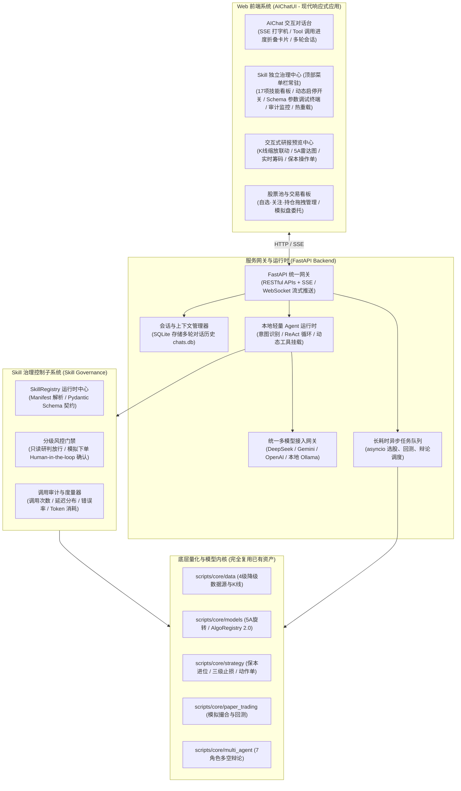
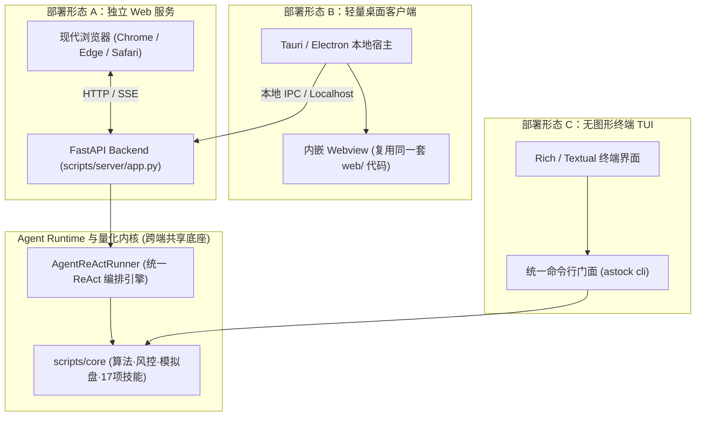

# 独立 Web AIChatUI 与 Skill 治理系统架构设计 (Web AIChat & Skill Governance Architecture)

> **文档类别**：系统架构 (Architecture)  
> **适用范围**：脱离第三方 AI 终端宿主（Antigravity / Hermes / Codex 等），自建独立 Web 界面系统并原生兼容本地客户端（Desktop / TUI）的 A股全流程量化投研交互中枢  
> **实施进度看板**：[`docs/specs/architecture/arch-web-aichat-and-skill-governance.md`](../specs/architecture/arch-web-aichat-and-skill-governance.md) (`SPEC-ARCH-001`)

---

## 一、 架构设计目的与核心诉求

### 1. 现状与背景
早期架构中，A-Stock Agents 作为一个高内聚的 **Skill 集合与量化引擎底座**，主要依赖外部第三方宿主工具（如 Google Antigravity、Hermes Agent、OpenAI Codex 等）提供 LLM 对话上下文、ReAct 思考循环以及终端展示交互，项目自身主要提供“执行双手（CLI Tools & SDK）”。

### 2. 核心目标
本架构旨在**脱离第三方终端工具**，为项目构建完全自闭环、开箱即用的**独立 Web AIChatUI 界面系统**，实现：
1. **自带智能体大脑 (Native Agent Runtime)**：内置轻量 Agent 编排引擎与统一多模型网关，无需第三方工具即可进行多轮量化投研对话；
2. **Skill 治理体系 (Skill Governance)**：对 17 大量化技能提供运行时元数据管理、动态启停、输入输出 Schema 校验、调用审计度量与分级权限风控；
3. **沉浸式交互与研报预览 (Interactive Visualization)**：支持打字机流式输出（SSE）、Tool 调用折叠卡片、交互式 K 线图表渲染（Canvas / Lightweight-Charts）与买卖反应动作单直观呈现。

---

## 二、 总体架构全景 (System Architecture)

系统采用前后端解耦的现代反应式架构，划分为**前端展现层**、**服务网关与 Agent 运行时**、**Skill 治理层**与**量化投研内核基座**四层：

---

## 三、 多端部署拓扑与双模兼容架构 (Dual-Mode Deployment Architecture)

系统不仅支持中心化 Web 服务部署，还原生兼容本地独立客户端（Desktop 桌面端与终端 TUI），支持以下三种部署与接入形态：

---

## 四、 核心交互通信协议与治理机制

### 1. SSE 打字机流式广播规范 (`/api/chat/stream`)
通信协议采用标准 Server-Sent Events (SSE)，支持以下事件帧（Event Frame）：
- `event: thought`：传递智能体思维链片段（COT 推理步骤）；
- `event: tool_call`：传递工具调用通知（函数名、输入参数摘要）；
- `event: tool_result`：传递工具调用执行结果或错误信息；
- `event: text`：传递正式回复文本 Markdown 打字机切片；
- `event: a2ui_render`：传递 A2UI 渲染动作帧（包含组件名、目标槽位、结构化 props）；
- `event: done`：会话生成结束帧，返回耗时统计与 Token 消耗。

### 2. 17 项技能治理控制平面 (Skill Governance Plane)
- **Manifest 契约化**：集中解析 `config/skills_manifest.json` 与 `.agents/skills/*/SKILL.md`；
- **动态启停**：用户可在前端界面随时关闭某些高耗时或未授权的技能；
- **分级风控门禁 (Gatekeeper)**：
  - `Level 1（只读研报类）`：直接放行；
  - `Level 2（模拟盘写入类）`：强制经过 Human-in-the-loop 前端弹窗二次确认；
  - `Level 3（实盘交易通道）`：系统当前物理阻断，禁止任何自动委托。
