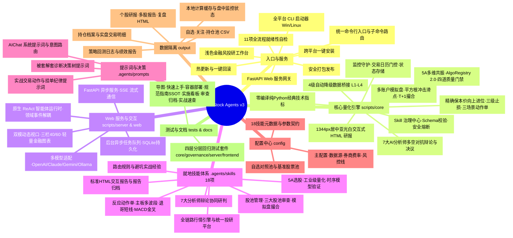
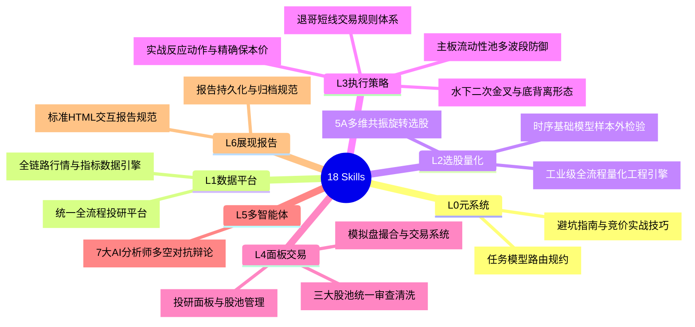
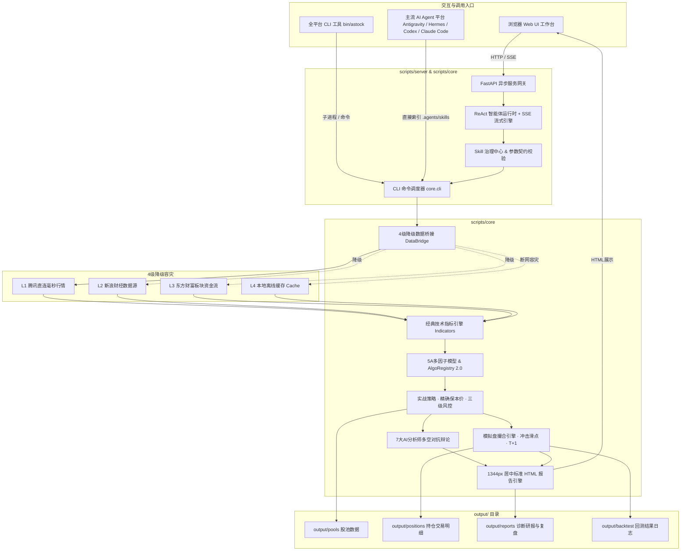

# A-Stock Agents 项目导图

> 基于对工程文件的实际查阅生成（v3）。本导图从「入口与服务 → 核心量化引擎 → Web与交互 → 技能层 → 提示词/配置 → 数据隔离/运维」等维度全面还原项目最新全貌。

---

## 一、总览思维导图



---

## 二、工程目录结构树

```
a_stock_agents/
├── .agents/                 # ★ 智能体专属就地配置与技能资产 (零全局污染原则)
│   ├── manifests/           # 技能清单配置 (skills_manifest.json / yaml)
│   ├── prompts/             # AI 系统提示词与交易反应决策模版
│   │   ├── aichat_system_prompt.md     # AIChat 自然语言系统提示词与意图路由
│   │   ├── trading_action_prompts.md   # 实战动作单与风控指令提示词
│   │   └── trapped_diagnostic_prompts.md # 被套解套诊断决策树提示词
│   └── skills/              # 17 个标准化 Agent 就地技能 (6+1 现代分层架构)
│       ├── astock-action-execution/    # 实战反应动作与精确保本价进位引擎
│       ├── astock-agent-debate/        # 7大AI分析师多空对抗辩论与决议
│       ├── astock-data-feed/           # A股全链路行情与技术指标数据引擎
│       ├── astock-knowledge-tips/      # 避坑指南与实战技巧库
│       ├── astock-meta-routing/        # 任务模型路由规则
│       ├── astock-model-validation/    # 外部时序 AI 模型样本外检验
│       ├── astock-platform-evaluate/   # 统一全流程投研与综合分析平台
│       ├── astock-pool-audit/          # 三大股池统一审查与清洗
│       ├── astock-pool-dashboard/      # 投研面板与股池生命周期管理
│       ├── astock-quant-engine/        # 工业级全流程量化工程引擎
│       ├── astock-report-archive/      # 报告结构化持久化与归档
│       ├── astock-report-html/         # 亚光白 1344px 居中交互报告规范
│       ├── astock-screener-5a/         # 5A 多维共振旋转选股模型
│       ├── astock-strategy-macd/       # 水下二次金叉与 MACD 底背离形态识别
│       ├── astock-strategy-mainboard/  # 主板流动性池多波段防御反击
│       ├── astock-strategy-tuige/      # 退哥短线与涨停接力规则体系
│       └── astock-trade-paper/         # A股模拟盘撮合交易与事件回测
├── bin/                     # 可执行入口与运维包装脚本
│   ├── astock / astock.cmd  # 全平台 CLI 启动器 (自动引导 scripts/core/cli.py)
│   ├── pack.py              # 纯净包安全发布工具 (转发 scripts/tools/pack.py)
│   ├── run_skill.py         # 技能脚本就地执行器 (转发 scripts/tools/run_skill.py)
│   └── update.py            # 安全热更新 + 数据快照备份 + 一键回滚
├── config/                  # 平台集中配置文件
│   ├── config.yaml          # 主配置文件 (数据源、券商费率、三级风控止损参数)
│   ├── skills_manifest.json # 18 技能清单元数据与参数契约 (JSON)
│   ├── skills_manifest.yaml # 18 技能清单元数据与参数契约 (YAML)
│   └── stock_pools.yaml     # 预置关注池与基准测试对照股票池配置
├── docs/                    # 项目分级技术文档体系 (kebab-case 规范，两范式严格二分)
│   ├── index.md             # 全景知识库导图 (本文件)
│   ├── quickstart.md        # 快速上手向导 (环境安装 / 自检 / CLI 与 Web 演示)
│   ├── docker-deploy.md     # Docker 与 Compose 生产容器化部署运维指南
│   ├── guidelines/          # ★ 权威知识定义库 (SSOT)：规范 / 指南 / 架构 / 规则
│   │   ├── README.md        # 知识库 7 大领域分类矩阵导航
│   │   ├── a2ui/            # A2UI 渲染引擎架构与组件库注册发现规范
│   │   ├── algorithm/       # 算法治理、选股体系设计与漏斗规则
│   │   ├── architecture/    # Web AIChat、LLM 双轨、Token 安全网关与生产级平台架构
│   │   ├── business/        # 券商费率、保本价精算与实战交易风控规则 (SSOT)
│   │   ├── data/            # 行情数据接口与本地同步机制规范
│   │   ├── engineering/     # 工程结构、代码审查、命名范式、安全加固与测试规约
│   │   └── ui/              # 界面设计、app.js 模块化与对话呈现指南
│   ├── specs/               # ★ 实施进度看板中心 (SPEC-{CATEGORY}-{SEQ} 编号体系)
│   │   ├── README.md        # 7 大领域实施矩阵总看板 (SPEC-INDEX)
│   │   ├── a2ui/            # SPEC-A2UI-001/002 看板与运行时整改计划
│   │   ├── algorithm/       # SPEC-ALGO-* 看板 + archive/ 历史 ADR 归档 (只增不改)
│   │   ├── architecture/    # SPEC-ARCH-001~004 看板与技能能力验收台账
│   │   ├── business/        # SPEC-BIZ-001~003 看板与费率风控整改计划
│   │   ├── data/            # SPEC-DATA-001 行情同步实施计划与验收看板
│   │   ├── engineering/     # SPEC-ENG-001 / SPEC-SEC-001 及整改总计划与验收台账
│   │   └── ui/              # SPEC-UI-001/002 看板与前端整改计划
│   ├── audits/              # 不可变审查报告归档区 (规格审查/代码审查/渗透测试，只增不改)
│   ├── trading/             # 实战交易速查索引层 (纯索引，权威定义见 guidelines/)
│   │   ├── breakeven-rules.md     # 保本价速查入口 (SSOT 指向 business/breakeven-calculation-rules.md)
│   │   └── execution-manual.md    # 六大反应动作与三场景决策单速查入口
│   └── images/              # 架构全景图等静态图片资源
├── output/                  # 用户专属数据目录 (★ 强制数据隔离，不随源码/安装包分发)
│   ├── pools/               # 个人自选池、关注池、持仓池 CSV
│   ├── positions/           # 个人持仓档案与实盘交易明细记录
│   ├── reports/             # 个股深度研报、多股联合报告与复盘 HTML
│   ├── cache/               # 本地行情运算、监控状态与临时缓存
│   └── backtest/            # 个人策略回测日志与绩效分析结果
├── scripts/                 # ★ 核心业务代码与后端服务实现 (SSOT)
│   ├── core/                # 量化投研核心子系统
│   │   ├── cli.py           # 统一命令行入口与子命令调度
│   │   ├── config.py        # 路径解析、数据隔离、多级配置加载引擎
│   │   ├── workspace.py     # 统一工作区环境引导与上下文管理
│   │   ├── commands/        # CLI 命令实现模块 (按领域职责完全解耦)
│   │   │   ├── backtest_cmds.py   # 回测相关命令 (backtest, multi-backtest)
│   │   │   ├── data_cmds.py       # 数据行情命令 (quote, technical, batch, cyq, events)
│   │   │   ├── model_cmds.py      # 模型评分选股 (score, analyze, screen, evaluate...)
│   │   │   ├── portfolio_cmds.py  # 投资组合风控 (portfolio-risk, pool, position)
│   │   │   ├── strategy_cmds.py   # 实战策略命令 (action, trapped, grid, vol-breakout...)
│   │   │   └── trade_cmds.py      # 模拟盘交易命令 (trade 子命令全家桶)
│   │   ├── data/            # 数据桥接层 (4 级自动降级，L1腾讯→L2/L3→L4本地缓存)
│   │   │   ├── Ashare.py, data_bridge.py, data_layer.py, data_source_registry.py
│   │   │   └── fetch_*.py (行情、K线、指标、个股事件、板块、AH股IPO时间线等)
│   │   ├── governance/      # ★ Skill 治理与质量审计子系统
│   │   │   ├── auditor.py         # 技能执行审计员 (统计成功率/延迟/错误分布)
│   │   │   ├── models.py          # 技能元数据、风险等级、执行结果数据模型
│   │   │   └── skill_registry.py  # 技能注册中心、JSON Schema 转换与安全熔断器
│   │   ├── indicators/      # 经典技术指标引擎 (零编译、纯 Python/NumPy)
│   │   │   ├── technical_indicators.py # MA/MACD/KDJ/RSI/BOLL/ATR/缺口/水下二次金叉
│   │   │   └── pv_factors.py           # 量价因子与换手率沉淀筹码模型
│   │   ├── models/          # 选股与多因子评分模型 (AlgoRegistry 2.0 / ALCM)
│   │   │   ├── base_algorithm.py       # 算法基础基类与元数据规范
│   │   │   ├── combo_scorer.py         # 100分制综合量化打分模型
│   │   │   ├── factor_synthesizer.py   # 因子去极值、Z-score合成与自适应加权
│   │   │   ├── market_assessor.py      # 五维大盘健康度评估器
│   │   │   ├── monitor_governance.py   # 算法衰减监控与实盘熔断调度器
│   │   │   ├── multi_dim_model.py      # 5A 多维共振旋转选股模型
│   │   │   ├── multi_factor_scorer.py  # 多因子 Alpha 综合评分
│   │   │   ├── quality_gates.py        # 四道质量门禁 (G1合规/G2过拟合/G3一致性/G4回撤)
│   │   │   ├── registry.py             # 40+ 算法资产统一注册中心与生命周期工厂
│   │   │   ├── stock_screener.py       # 三层漏斗选股器
│   │   │   ├── strategy_evaluator.py   # 策略综合评估与历史走势扫描
│   │   │   └── unstructured_factors.py # 非结构化舆情因子与半衰期衰减
│   │   ├── monitor/         # 监控守护与告警系统
│   │   │   ├── notifier.py             # 多渠道通知网关 (Windows Toast / Webhook)
│   │   │   ├── schedule_gate.py        # 交易日历与盘中时间门控
│   │   │   └── state_store.py          # 持久化监控状态与告警去重引擎
│   │   ├── multi_agent/     # 7 大 AI 分析师协同辩论与决议系统
│   │   │   ├── ta_orchestrator.py      # 多智能体事件驱动调度编排
│   │   │   ├── ta_analyze.py           # 7大角色单标的对抗研判
│   │   │   └── ta_entry_monitor.py     # 入场监控与信号触发
│   │   ├── paper_trading/   # 模拟盘撮合与事件驱动回测引擎
│   │   │   ├── engine.py               # 考虑冲击滑点、T+1 与涨跌停的撮合核心
│   │   │   ├── service.py              # 多账户独立资金管理与持久化服务
│   │   │   ├── multi_backtest_engine.py# 多标的事件驱动轮动回测
│   │   │   ├── a_stocks_backtest.py    # 单标的历史回测与过拟合检验
│   │   │   └── paper_trading_ctl.py    # 模拟盘守护进程控制与命令行交互
│   │   ├── reporting/       # 投资报告生成与归档引擎
│   │   │   ├── investment_report.py    # 亚光白 1344px 居中自包含 HTML 报告生成
│   │   │   └── report_generator.py     # 个股诊断与多股联合报告流水线
│   │   └── strategy/        # 实战交易策略与风控执行中枢
│   │       ├── execution_action_engine.py # 精确保本价向上进位·三级止损·三场景动作单
│   │       ├── pool_manager.py / pool_schema.py # 股票池拓扑结构与生命周期
│   │       ├── position_manager.py     # 真实持仓盈亏追踪与风控快照
│   │       ├── trapped_position.py     # 解套决策树 (补仓/T+0/换股/止损)
│   │       ├── risk_manager.py / portfolio_risk_manager.py # 个股与组合风控
│   │       ├── dynamic_universe.py     # 市场动态标的池推断
│   │       ├── grid_trading_strategy.py/ mean_reversion_strategy.py / volatility_breakout_strategy.py
│   │       ├── daily_decisions.py      # 主板多波段防御反击决策
│   │       └── strategy_lab/           # 策略实验室 (参数优化与微调)
│   ├── server/              # ★ Web AIChat 与 Skill 治理服务网关 (FastAPI 后端)
│   │   ├── app.py           # FastAPI 主应用工厂、Lifespan、CORS 与静态资源挂载
│   │   ├── config.py        # 服务端配置 (主机/端口/CORS/数据目录)
│   │   ├── db.py            # SQLite 轻量级异步数据库与表结构初始化
│   │   ├── models.py        # 数据库模型 (Session, Message, Task)
│   │   ├── port_utils.py    # 端口自增检测与进程锁管理
│   │   ├── run.py           # 服务启动入口脚本
│   │   ├── agent/           # 原生 ReAct 智能体运行时
│   │   │   ├── react_runner.py # ReAct 循环、工具调用与思考过程解析
│   │   │   ├── events.py       # 领域事件流解耦与 SSE 事件分发
│   │   │   ├── tools.py        # 18 项技能转换为 Agent 可调用工具函数
│   │   │   └── prompts.py      # 服务端 ReAct 提示词模版
│   │   ├── api/             # RESTful API 路由模块
│   │   │   ├── chat.py         # 对话与 SSE 流式输出接口 (/api/chat)
│   │   │   ├── sessions.py     # 会话管理接口 (/api/sessions)
│   │   │   ├── skills.py       # 技能治理与调试接口 (/api/skills)
│   │   │   ├── tasks.py        # 异步任务管理接口 (/api/tasks)
│   │   │   └── health.py       # 服务健康检查接口 (/api/health)
│   │   ├── llm/             # 多 LLM 提供商适配抽象层
│   │   │   ├── factory.py      # 模型工厂 (根据配置动态实例化)
│   │   │   ├── openai_provider.py, claude_provider.py, gemini_provider.py
│   │   │   ├── ollama_provider.py, mock_provider.py
│   │   └── tasks/           # 后台异步任务队列与状态管理
│   │       └── task_manager.py # 异步工作线程、任务进度更新与取消
│   └── tools/               # 平台通用工具与运维实现
│       ├── pack.py          # 安全打包器 (排除 output, .venv, cache)
│       ├── run_skill.py     # 技能直接就地执行脚本
│       └── update.py        # 安全热升级、数据备份与回滚引擎
├── web/                     # ★ Web UI 投研工作台前端 (现代浅色金融风格)
│   ├── index.html           # 工作台单页面应用 (三栏式40/60布局，双模动态视口)
│   ├── css/
│   │   └── style.css        # 浅色金融设计系统、玻璃质感、响应式与折叠动画
│   └── js/
│       ├── app.js           # 前端业务逻辑、会话管理、SSE 流式解析与工具交互
│       └── charts.js        # K线图、雷达图与资金流向轻量可视化渲染
├── tests/                   # 自动化测试套件 (四层分层：core / governance / server / frontend)
│   ├── conftest.py          # 全局测试夹具与数据隔离配置
│   ├── README.md            # 测试套件运行指南与测试红线规范
│   ├── core/                # 量化核心、数据与 CLI 领域回归测试
│   │   ├── test_commands_suite.py / test_data_suite.py / test_indicators.py
│   │   ├── test_models_suite.py / test_algo_registry.py / test_algo_monitoring.py
│   │   ├── test_paper_trading_suite.py / test_strategy_suite.py / test_pool_schema.py
│   │   └── test_dynamic_universe.py / test_monitor.py / test_data_sync.py 等
│   ├── governance/          # 治理红线与文档护栏测试
│   │   ├── test_docs_suite.py         # 文档范式、相对链接与状态声明护栏
│   │   ├── test_governance_suite.py / test_security_suite.py / test_security_audit.py
│   │   └── test_production_authenticity.py / test_capability_truthfulness.py 等
│   ├── server/              # FastAPI 网关与 ReAct 运行时接口测试
│   │   ├── test_server_suite.py / test_market_data_api.py / test_llm_readiness.py
│   │   └── test_live_server_e2e.py / test_cors_security.py / test_session_memory.py 等
│   └── frontend/            # 前端渲染与交互 Node 单测 (test_*.js)
│       └── test_chat_presentation.js / test_markdown_render.js / test_at_operator.js 等
├── install.ps1 / install.sh # 跨平台一键环境安装脚本
├── update.ps1 / update.sh   # 跨平台热更新升级脚本
├── verify.py                # 平台就绪性 11 项全功能自动化自检脚本
├── pyproject.toml           # 项目元数据与依赖配置 (entry: astock = core.cli:main)
└── requirements.txt         # 核心运行依赖清单
```

---

## 三、核心子系统与引擎体系

系统采用高内聚、模块化设计，划分出 10 大核心子系统：

| # | 子系统 | 源码路径 | 关键能力与定位 |
| :-: | :--- | :--- | :--- |
| 1 | **4级降级数据桥接** | `scripts/core/data` | L1 腾讯原生行情直连 → L2/L3 新浪与东财增强 → L4 本地缓存，断网毫秒级容灾。 |
| 2 | **经典技术指标引擎** | `scripts/core/indicators` | MA/MACD/KDJ/RSI/BOLL/ATR/跳空缺口识别/水下二次金叉/波段底背离，零外部复杂 C 库依赖。 |
| 3 | **5A多维共振与算法注册中心** | `scripts/core/models` | 40+ 项算法资产纳管（AlgoRegistry 2.0 / ALCM），5A 选股模型，四道质量门禁（G1-G4）。 |
| 4 | **实战策略与风控中枢** | `scripts/core/strategy` | 最低保本卖出价精算（`math.ceil` 进位至分）、三级风控止损阶梯（-3%/-5%/-8%）、三场景动作单。 |
| 5 | **多智能体协同辩论** | `scripts/core/multi_agent` | 基本面、量价、消息、政策、游资、筹码、首席风控官 7 大角色对抗辩论并形成终审决议。 |
| 6 | **模拟盘撮合与事件驱动回测** | `scripts/core/paper_trading` | 多账户资金隔离、Almgren-Chriss 平方根冲击滑点、T+1 硬约束、单标的与多标的轮动回测。 |
| 7 | **监控守护与告警系统** | `scripts/core/monitor` | 交易日历网关（开盘/盘中/闭市/周末状态机）、多渠道告警（Windows Toast / Webhook）。 |
| 8 | **投资报告生成与归档** | `scripts/core/reporting` | 1344px 居中、亚光白背景、红涨绿跌单文件自包含 HTML 研报与多标的聚合归档流水线。 |
| 9 | **Skill 治理与审计子系统** | `scripts/core/governance` | 18 项技能集中注册、OpenAI Function Schema 转换、动态启停、执行性能与安全熔断审计。 |
| 10 | **Web 服务网关与 AIChat 前端** | `scripts/server` & `web` | FastAPI 异步网关、SSE 流式打字机、ReAct 智能体运行时、双模动态视口与现代浅色金融前端。 |

---

## 四、18 技能体系（6+1 现代分层架构）

全部 18 项技能严格遵循**零全局污染原则**，完全就地存放在 [`.agents/skills/`](../.agents/skills) 目录下，通过统一清单 [`config/skills_manifest.json`](../config/skills_manifest.json) 驱动：



---

## 五、CLI 命令树（`scripts/core/cli.py` 实际路由）

项目通过 `bin/astock`（Linux/macOS）或 `.\bin\astock.cmd`（Windows）提供全套生产就绪的 CLI 工具链，所有子命令均原生支持追加 `--json` 参数输出机器友好数据：

```
astock
├── quote <代码>                  # 实时行情快照 (L1直连)
├── technical <代码>              # 经典技术指标、缺口与二次金叉
├── score <代码>                  # 策略 100 分制量化综合评分
├── analyze <代码>                # 全维度大盘与个股诊断
├── evaluate [代码]               # 策略评估 (单股诊断 / 历史扫描 --auto)
├── market                       # 五维大盘健康度评估
├── batch <代码列表>              # 批量股票实时行情 (逗号分隔)
├── screen [代码列表]             # 三层漏斗选股 (--dynamic 支持热点板块主线推断)
├── multi-factor <代码>           # 多因子 Alpha 综合评分
├── risk <代码>                   # 风控止损与卖点预警
├── golden-cross <代码>           # MACD水下二次金叉形态检测
├── events <代码>                 # 个股重要事件与公告
├── cyq <代码>                    # 换手率沉淀筹码分布特征
├── balance                      # 数据源/代理余额查询
├── trapped <代码>                # 被套解套决策树 (需 --cost 与 --shares)
├── portfolio-risk               # 投资组合风险与集中度评估
├── action <代码>                 # 实战交易反应动作单与最低保本卖出价
├── intent <查询句子>             # 自然语言意图智能解析与技能路由
├── downside <代码>               # 五类下跌场景化精准诊断
├── backtest <代码>               # 单标的回测评估 (夏普/回撤/胜率/过拟合检验)
├── multi-backtest               # 多标的事件驱动轮动回测
├── mean-reversion <代码>         # 均值回归策略回测
├── grid <代码>                   # 网格交易策略区间构建与模拟
├── vol-breakout <代码>           # 波动率突破策略回测
├── debate <代码>                 # 7大AI分析师多空对抗辩论
├── report <代码>                 # 生成亚光白 1344px 交互式 HTML 诊断报告
├── config                       # 配置与环境数据隔离管理
│   ├── paths                    # 查看当前生效的 output/ 路径隔离
│   └── market                   # 查看/修改券商佣金、免5、印花税等费率
├── pool list                    # 查看关注池与自选股池列表
├── position                     # 实盘与持仓管理
│   ├── list                     # 查看持仓明细 (--history 查看平仓历史)
│   ├── pnl                      # 查看持仓盈亏汇总
│   └── snapshot                 # 生成持仓风控快照
├── data                         # 底层数据直连子命令
│   ├── quote <代码...>          # 批量获取行情快照
│   └── tech <代码>              # 获取技术指标数值
├── skill list                   # 列出所有已注册技能模块
├── trade                        # A股模拟盘交易与资金持仓管理
│   ├── balance [账户]           # 查询账户资产与可用资金余额
│   ├── accounts / list-accounts # 查看所有模拟盘账户
│   ├── create-account <账户>    # 创建新模拟盘账户 (--cash 初始资金)
│   ├── reset-account <账户>     # 重置账户资金与持仓
│   ├── set-default <账户>       # 设置默认操作账户
│   ├── positions [账户]         # 查看持仓明细
│   ├── orders [账户]            # 查看委托订单 (--status 过滤)
│   ├── trades [账户]            # 查看成交明细记录
│   ├── buy <标的> <股数>        # 模拟限价或市价买入 (--price / --market)
│   ├── sell <标的> <股数>       # 模拟限价或市价卖出 (--price / --market)
│   ├── cancel <订单号>          # 撤销未成交委托
│   ├── add-cash / deduct-cash   # 账户入金 / 出金
│   └── start / stop / status    # 启动 / 停止 / 查看后台撮合服务
├── server                       # Web AIChat 与服务网关控制
│   ├── start                    # 启动 FastAPI 后端服务 (--host / --port / --reload)
│   ├── status                   # 检查服务运行状态与探针健康度
│   └── preview                  # 在系统默认浏览器中打开 Web UI 预览
├── ui                           # 在默认浏览器中直接打开 Web 投研界面
├── deploy-monitor               # 查看桌面/微信监控部署指南
└── version                      # 显示平台版本与元数据
```

---

## 六、数据流与全链路架构流图



---

## 七、关键设计原则与工程铁律

1. **零全局污染原则 (Zero Global Pollution)**：
   - 本项目 18 项技能、提示词与量化引擎**完全就地运行在当前工作区内**。
   - 严禁将项目技能复制到系统全局目录（如 `~/.gemini/config/skills` 或系统路径）。
2. **单一真理来源 (SSOT) 与物理路径解耦**：
   - 核心业务逻辑统一归集于 `scripts/core/`，服务网关归集于 `scripts/server/`，就地技能存放在 `.agents/skills/`。
   - 彻底移除旧版根目录软链接，全链路采用动态项目根探测与自包含路径引导，实现 Windows、Linux、macOS 全跨平台无缝兼容。
3. **用户数据强制隔离 (`output/`)**：
   - 个人自选池、持仓明细、交易账单与私有研报严格存放于 `output/` 目录。
   - 打包发布工具 `bin/pack.py` 强制排除 `output/`、实盘数据、`.venv` 与临时缓存，严防个人敏感数据外泄。
4. **精确保本价进位 (`math.ceil`)**：
   - 卖出保本价精确计入卖出印花税（0.05%）、券商佣金（万2.5且最低5元起收）、过户费。
   - **强制向上精确进位至分位（`math.ceil`）**，杜绝任何四舍五入导致的隐性亏损。
5. **三级风控止损阶梯与三场景动作单**：
   - 任何个股分析强制输出三级风控止损线：**T0 警戒线 (-3%)**、**T1 减仓线 (-5%)**、**T2 绝杀线 (-8%)**。
   - 配套开盘冲高、盘中震荡、跳水急跌三种场景下的明确触发条件与应对操作。
6. **算法资产全生命周期治理 (AlgoRegistry 2.0 / ALCM)**：
   - 40+ 项算法资产统一纳管，设立研发合规门禁（G1）、效能防过拟合门禁（G2）、表现一致性门禁（G3）与实盘最大回撤退市熔断（G4）。
7. **双模 Web 投研视口与现代金融美学**：
   - 遵循《Web UI 界面设计与交互规范》，打造浅色专业金融风格，采用三栏式 40/60 工作区，支持 AI 投研助手从左向右平滑展开与独立收起。
8. **测试先行与即测即删铁律**：
   - 严守「功能修改，测试先行」理念，维护四层分层标准回归测试套件（`core` / `governance` / `server` / `frontend`）。
   - 单次优化所编写的临时测试用例在验证完成后必须立即清理，通用断言沉淀至标准套件，确保基线测试 100% 幂等绿灯。

---

## 八、技术文档体系速查 (Documentation Index)

### 1. 规范、指南、架构与规则知识库 (`docs/guidelines/` - 权威定义 SSOT)
| 领域 | 文档路径 | 对应实施看板 | 核心内容与定位 |
|---|---|:---:|---|
| **知识库总览** | [`guidelines/README.md`](guidelines/README.md) | [`specs/README.md`](specs/README.md) | 7 大领域全景分类矩阵导航（规范·指南·架构·规则）与文档编制范式 |
| **工程规范** | [`guidelines/engineering/project-structure-specification.md`](guidelines/engineering/project-structure-specification.md) | [`SPEC-ENG-001`](specs/engineering/eng-project-structure-and-workspace.md) | 零全局污染、SSOT、跨平台 CLI 门面与用户私有数据物理隔离规范 |
| **工程规范** | [`guidelines/engineering/code-review.md`](guidelines/engineering/code-review.md) | — | 代码质量基准、安全红线与审查报告标准、防御模式清单 |
| **工程规范** | [`guidelines/engineering/naming-conventions.md`](guidelines/engineering/naming-conventions.md) | — | 文档两范式模板与反混编红线、源码物理命名与四大演进范式 (SSOT) |
| **工程规范** | [`guidelines/engineering/testing-guide.md`](guidelines/engineering/testing-guide.md) | [`SPEC-ENG-001`](specs/engineering/eng-runtime-and-test-remediation-plan.md) | 四层分层回归测试架构、TDD 流程与临时用例即测即删铁律 |
| **工程规范** | [`guidelines/engineering/security-hardening-guide.md`](guidelines/engineering/security-hardening-guide.md) | [`SPEC-SEC-001`](specs/engineering/security-remediation-plan.md) | 8 项渗透测试隐患的长效安全规约、编码防线与安全测试门禁 |
| **界面指南** | [`guidelines/ui/ui-design-guide.md`](guidelines/ui/ui-design-guide.md) | [`SPEC-UI-001`](specs/ui/ui-design-and-interaction-plan.md) | 浅色金融风格、红涨绿跌、双模动态视口、长连通顶栏与卡片微边框指南 |
| **界面指南** | [`guidelines/ui/app-js-modularization-guide.md`](guidelines/ui/app-js-modularization-guide.md) | [`SPEC-UI-002`](specs/ui/app-js-modularization-plan.md) | 前端巨石单体解耦为领域驱动模块、零构建工具依赖与兼容策略 |
| **界面指南** | [`guidelines/ui/chat-response-presentation-guide.md`](guidelines/ui/chat-response-presentation-guide.md) | [`SPEC-UI-001`](specs/ui/chat-response-presentation-plan.md) | 对话回复卡片结构、执行时间线渲染契约与工作台投射规则 |
| **系统架构** | [`guidelines/architecture/web-aichat-architecture.md`](guidelines/architecture/web-aichat-architecture.md) | [`SPEC-ARCH-001`](specs/architecture/arch-web-aichat-and-skill-governance.md) | 独立 Web AIChatUI、FastAPI 服务网关与 18 项技能治理系统架构 |
| **系统架构** | [`guidelines/architecture/llm-provider-architecture.md`](guidelines/architecture/llm-provider-architecture.md) | [`SPEC-ARCH-002`](specs/architecture/arch-llm-provider-and-role-allocation.md) | 大模型双轨接入 (Providers) 与 5 大业务场景角色绑定 (Roles) 架构 |
| **系统架构** | [`guidelines/architecture/token-security-architecture.md`](guidelines/architecture/token-security-architecture.md) | [`SPEC-ARCH-003`](specs/architecture/arch-token-security-gateway.md) | Token 链路安全网关、控制平面隔离、请求脱敏与指纹审计架构 |
| **系统架构** | [`guidelines/architecture/production-agent-platform-architecture.md`](guidelines/architecture/production-agent-platform-architecture.md) | [`SPEC-ARCH-004`](specs/architecture/production-agent-platform-plan.md) | 生产级 Agent 平台分层架构、可靠性保障与演进路线 |
| **A2UI规范** | [`guidelines/a2ui/a2ui-framework-architecture.md`](guidelines/a2ui/a2ui-framework-architecture.md) | [`SPEC-A2UI-001`](specs/a2ui/a2ui-framework-engine-plan.md) | A2UI 前端渲染引擎、WebApp Shell 硬锁定、1:1 骨架与五阶段渐进水合 |
| **A2UI规范** | [`guidelines/a2ui/a2ui-component-registry-specification.md`](guidelines/a2ui/a2ui-component-registry-specification.md) | [`SPEC-A2UI-002`](specs/a2ui/a2ui-component-registry-plan.md) | A2UI 领域组件包契约、时序解耦未决缓冲池、命名空间隔离与自省清单规范 |
| **业务规则** | [`guidelines/business/broker-commission-rules.md`](guidelines/business/broker-commission-rules.md) | [`SPEC-BIZ-001`](specs/business/biz-broker-commission-configurable-plan.md) | 券商佣金及市场费率参数配置化、全局配置中心与未确认友好提醒规则 |
| **业务规则** | [`guidelines/business/breakeven-calculation-rules.md`](guidelines/business/breakeven-calculation-rules.md) | [`SPEC-BIZ-002`](specs/business/biz-breakeven-price-calculation-plan.md) | 最低保本卖出价精算数学公式与向上精确进位至分位 (`math.ceil`) 规则 (SSOT) |
| **业务规则** | [`guidelines/business/trading-execution-rules.md`](guidelines/business/trading-execution-rules.md) | [`SPEC-BIZ-003`](specs/business/biz-trading-execution-and-risk-control.md) | 实战交易三原则、六大交易反应动作与 T0/T1/T2 阶梯止损风控规则 |
| **算法规则** | [`guidelines/algorithm/algorithm-governance.md`](guidelines/algorithm/algorithm-governance.md) | [`SPEC-ALGO-001`](specs/algorithm/algo-lifecycle-and-governance-plan.md) | 44 项算法资产全景清单、AlgoRegistry 2.0 统一抽象与 ALCM 四道门禁 |
| **算法规则** | [`guidelines/algorithm/selection-system-specification.md`](guidelines/algorithm/selection-system-specification.md) | [`SPEC-ALGO-ISS-001`](specs/algorithm/selection-system-plan.md) | 智能选股系统功能建设规范：模型版本控制与层级漏斗引擎（整合中枢，含文档导航） |
| **算法规则** | [`guidelines/algorithm/selection-model-types-specification.md`](guidelines/algorithm/selection-model-types-specification.md) | [`SPEC-ALGO-ISS-MT-001`](specs/algorithm/selection-system-plan.md) | 模型类型设计规范：条件树/漏斗/评分排序/组合 4 类型注册中心、统一编译契约与 CompiledSelectionPlan |
| **示例/范例** | [`guidelines/algorithm/selection-funnel-example-1.md`](guidelines/algorithm/selection-funnel-example-1.md) | [`SPEC-ALGO-ISS-001`](specs/algorithm/selection-system-plan.md) | 漏斗模型唯一示例（案例说明，非规范）：业务叙事与问财语句、配置驱动的“收盘突破 → 次日早盘拐点”四层漏斗口径、数据契约与参数化评估 |
| **算法规则** | [`guidelines/algorithm/selection-model-general-specification.md`](guidelines/algorithm/selection-model-general-specification.md) | [`SPEC-ALGO-003`](specs/algorithm/general-selection-and-turning-point-plan.md) | 选股模型通用设计规范：通用选股口径、拐点识别判据与仓位上限硬约束 |
| **算法规则** | [`guidelines/algorithm/selection-research-governance.md`](guidelines/algorithm/selection-research-governance.md) | [`SPEC-ALGO-ISS-001`](specs/algorithm/selection-system-plan.md) | 智能选股系统研究治理规则：模型评价触发阈值、优化建议闭环与「建议不得自动改版」评审流程 |
| **数据规范** | [`guidelines/data/market-data-api-specification.md`](guidelines/data/market-data-api-specification.md) | [`SPEC-DATA-001`](specs/data/market-data-sync-implementation-plan.md) | 4 级降级数据源规范、实时快照与全周期 K 线协议字典 |
| **数据规范** | [`guidelines/data/market-data-sync-specification.md`](guidelines/data/market-data-sync-specification.md) | [`SPEC-DATA-001`](specs/data/market-data-sync-implementation-plan.md) | 交易日时钟驱动、完整性 Gap 探测自愈与 SQLite 嵌入式存储规范 |

> 📚 **文档簇关系 (Doc Clusters)**：同簇文档共享 `{簇标题} · {文档标题}` 标题格式与唯一中枢「文档导航」成员表；编排契约（唯一中枢、`-example-N.md`、一簇多 SPEC、变更协议）见 [`naming-conventions.md` §四.5](guidelines/engineering/naming-conventions.md)。
> - **智能选股系统**（`algorithm/`，前缀 `selection-*`）中枢：[`selection-system-specification.md`](guidelines/algorithm/selection-system-specification.md) ｜ 成员：[`selection-model-types-specification.md`](guidelines/algorithm/selection-model-types-specification.md)、[`selection-model-general-specification.md`](guidelines/algorithm/selection-model-general-specification.md)、[`selection-research-governance.md`](guidelines/algorithm/selection-research-governance.md)、[`selection-funnel-example-1.md`](guidelines/algorithm/selection-funnel-example-1.md)（唯一示例）
> - **Agent2UI (A2UI)**（`a2ui/`，前缀 `a2ui-*`）中枢：[`a2ui-framework-architecture.md`](guidelines/a2ui/a2ui-framework-architecture.md) ｜ 成员：[`a2ui-component-registry-specification.md`](guidelines/a2ui/a2ui-component-registry-specification.md)
> - **A-Stock 行情数据**（`data/`，前缀 `market-data-*`）中枢：[`market-data-api-specification.md`](guidelines/data/market-data-api-specification.md) ｜ 成员：[`market-data-sync-specification.md`](guidelines/data/market-data-sync-specification.md)

### 2. 实施进度看板与实战操作
| 分类 | 文档路径 | 核心内容与定位 |
|---|---|---|
| **快速入门** | [`quickstart.md`](quickstart.md) | 环境安装、依赖配置、一键自检与 CLI / Web 快速演示向导 |
| **容器部署** | [`docker-deploy.md`](docker-deploy.md) | Docker 与 Docker Compose 生产容器化快速部署与运维指南 |
| **实施总览** | [`specs/README.md`](specs/README.md) | 7 大领域规范实施落地进度追踪总看板 (SPEC-INDEX) |
| **实战速查** | [`trading/execution-manual.md`](trading/execution-manual.md) | 六大实战反应动作、三场景决策单与挂单纪律速查入口（权威定义见 [`guidelines/business/trading-execution-rules.md`](guidelines/business/trading-execution-rules.md)） |
| **保本速查** | [`trading/breakeven-rules.md`](trading/breakeven-rules.md) | 最低保本卖出价速查入口（权威定义见 [`guidelines/business/breakeven-calculation-rules.md`](guidelines/business/breakeven-calculation-rules.md)） |
| **架构图谱** | [`images/architecture.png`](images/architecture.png) | 系统架构全景图高清原图 |
