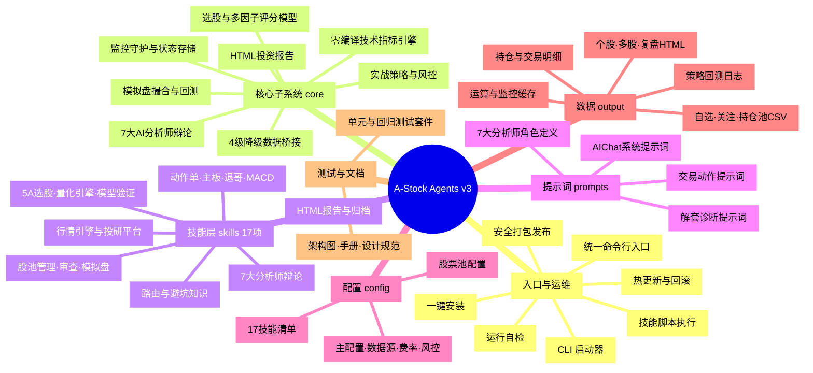
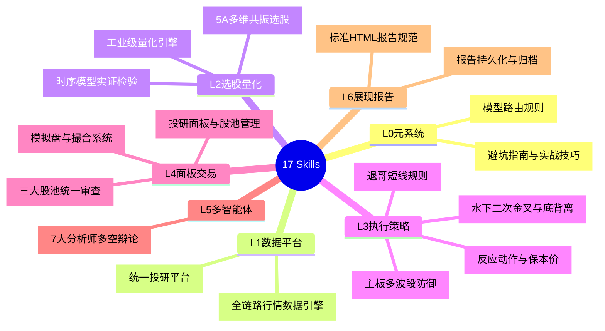
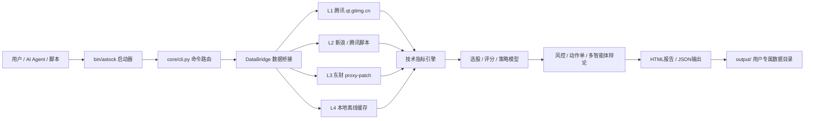

# A-Stock Agents 项目导图

> 基于对工程文件的实际查阅生成（v3）。本导图从「入口 → 核心子系统 → 技能层 → 提示词/配置 → 数据/运维」五个维度还原项目全貌。

---

## 一、总览思维导图



---

## 二、工程目录结构树

```
a_stock_agents/
├── bin/                     # 可执行入口与运维脚本
│   ├── astock / astock.cmd  # CLI 启动器（Linux/Win）
│   ├── run_skill.py         # 技能脚本执行器
│   ├── pack.py              # 安全打包（排除 output/.venv 等）
│   └── update.py            # 热更新 + 备份 + 回滚
├── core/                    # ★ 核心引擎（高内聚、自包含）
│   ├── cli.py               # 统一命令行入口（argparse 子命令路由）
│   ├── config.py            # 项目根解析 / 输出隔离 / 配置加载
│   ├── data/                # 数据桥接层（4级自动降级）
│   │   ├── data_bridge.py       # 核心桥接（L1腾讯→L2/L3→L4缓存）
│   │   ├── data_layer.py        # 数据层抽象
│   │   ├── data_source_registry.py # 数据源注册
│   │   ├── Ashare.py            # A股行情适配
│   │   └── fetch_*.py           # 行情/K线/技术/事件/板块/IPO抓取
│   ├── indicators/          # 技术指标引擎
│   │   ├── technical_indicators.py # MA/MACD/KDJ/RSI/BOLL/ATR/缺口/二次金叉
│   │   └── pv_factors.py        # 量价因子
│   ├── models/              # 选股与多因子模型
│   │   ├── registry.py          # ★ 模型注册中心与工厂 (ModelRegistry，统一管理模型、别名与生命周期)
│   │   ├── multi_dim_model.py   # 5A多维共振选股 (SSOT，带版本号物理文件已完全退役)
│   │   ├── combo_scorer.py      # 100分制综合打分
│   │   ├── multi_factor_scorer.py # 多因子Alpha评分
│   │   ├── stock_screener.py    # 三层漏斗选股
│   │   ├── market_assessor.py   # 大盘健康度评估
│   │   ├── strategy_evaluator.py # 策略评估
│   │   ├── factor_synthesizer.py # 因子合成流水线
│   │   └── unstructured_factors.py # 舆情非结构化因子
│   ├── strategy/            # 实战策略与风控
│   │   ├── execution_action_engine.py # 保本价进位·三级止损·三场景动作单
│   │   ├── risk_manager.py / risk_position_manager.py / portfolio_risk_manager.py
│   │   ├── pool_manager.py / pool_schema.py   # 股池管理
│   │   ├── position_manager.py / position_stop_monitor.py # 持仓管理
│   │   ├── trapped_position.py  # 被套解套决策树
│   │   ├── grid_trading_strategy.py / mean_reversion_strategy.py / volatility_breakout_strategy.py
│   │   ├── daily_decisions.py   # 主板多波段决策
│   │   └── strategy_lab/        # 策略实验（指标/策略/参数）
│   ├── multi_agent/         # 多智能体协同辩论
│   │   ├── ta_orchestrator.py   # 事件驱动TA分析调度
│   │   ├── ta_analyze.py        # 单标的TA分析
│   │   └── ta_entry_monitor.py  # 入场监控
│   ├── paper_trading/       # 模拟盘与回测
│   │   ├── engine.py / service.py / paper_trading_runtime.py # 撮合引擎
│   │   ├── a_stocks_backtest.py # 单标的回测（SMA/ComboScore）
│   │   ├── multi_backtest_engine.py # 多标的事件驱动轮动回测
│   │   ├── backtest_metrics.py / backtest_strategies.py / market_data.py
│   │   └── paper_trade_cli.py / paper_trading_ctl.py   # 模拟盘CLI
│   ├── monitor/             # 监控守护
│   │   ├── notifier.py / schedule_gate.py / state_store.py
│   └── reporting/           # 报告生成
│       ├── report_generator.py / investment_report.py
├── skills/                  # 17个标准化Agent技能（6+1分层）
├── prompts/                 # AI提示词
├── config/                  # 配置文件
├── output/                  # 用户专属数据（隔离，不随包发布）
├── tests/                   # 测试套件 (10大领域回归测试)
├── docs/                    # 项目技术文档体系 (标准 kebab-case 分层)
│   ├── index.md             # 全景知识库导图 (本文件)
│   ├── quickstart.md        # 快速上手向导
│   ├── guidelines/          # 工程质量、代码审查与命名规范指南
│   ├── specs/               # 架构设计方案与功能规格说明 (ADR/RFC)
│   ├── trading/             # 实战交易动作手册与保本计算数学规则
│   └── images/              # 架构图等静态资源
├── cache/ & backups/        # 本地缓存与快照备份
├── pyproject.toml           # 打包元数据（entry: astock = core.cli:main）
├── requirements.txt         # 核心依赖
└── install.ps1 / install.sh / update.ps1 / update.sh / verify.py
```

---

## 三、核心子系统（6 大投研引擎）

| # | 子系统 | 位置 | 关键能力 |
| :-: | :--- | :--- | :--- |
| 1 | 4级降级数据桥接 | `core/data` | L1 腾讯直连 → L2/L3 东财/新浪 → L4 本地缓存，断网高可用 |
| 2 | 技术指标引擎 | `core/indicators` | MA/MACD/KDJ/RSI/BOLL/ATR/跳空缺口/水下二次金叉/底背离 |
| 3 | 选股与多因子模型 | `core/models` | 5A多维共振、动量/价值/质量/量价/轮动 100 分制、因子合成 |
| 4 | 实战策略与风控 | `core/strategy` | 保本价精确进位、T0/T1/T2 三级止损、三场景动作单 |
| 5 | 多智能体协同辩论 | `core/multi_agent` | 基本面/量价/消息/政策/游资/筹码/风控 7 角色多空辩论 |
| 6 | 模拟盘与回测 | `core/paper_trading` | 多账户撮合、T+1/涨跌停、单标的+多标的回测 |

---

## 四、17 技能体系（6+1 分层）



---

## 五、CLI 命令树（`core/cli.py` 实际路由）

```
astock
├── quote <code>                 # 实时行情快照
├── technical <code>             # 技术指标与缺口
├── score <code>                 # 量化策略综合评分
├── analyze <code>               # 全维度大盘与个股诊断
├── evaluate <code>              # 策略评估（单股诊断 / 历史扫描）
├── market                       # 五维大盘健康度
├── batch <codes>                # 批量行情
├── screen [codes]               # 三层漏斗选股
├── multi-factor <code>          # 多因子Alpha评分
├── risk <code>                  # 风控止损与卖点预警
├── golden-cross <code>          # MACD二次金叉检测
├── events <code>                # 个股事件公告
├── cyq <code>                   # 筹码分布
├── balance                      # 数据源/代理余额
├── trapped <code>               # 被套解套决策树
├── portfolio-risk               # 组合风险与集中度
├── action <code>                # 实战反应动作决策单
├── intent <query>               # 自然语言意图解析
├── downside <code>              # 五类下跌场景诊断
├── backtest <code>              # 单标的回测（含过拟合检验）
├── multi-backtest               # 多标的事件驱动回测
├── mean-reversion <code>        # 均值回归策略
├── grid <code>                  # 网格交易策略
├── vol-breakout <code>          # 波动率突破策略
├── report <code>                # 生成HTML诊断报告
├── config {paths|market}        # 路径隔离 / 券商费率配置
├── pool list                    # 股池列表
├── position {list|pnl|snapshot} # 持仓管理
├── data {quote|tech}            # 底层数据直连
├── skill list                   # 已注册技能
├── deploy-monitor               # 监控部署指南
└── version                      # 版本信息
```

> 所有命令原生支持 `--json` 结构化输出，供 AI Agent 平台 / 脚本 / 外部 API 子进程解析。

---

## 六、数据流与降级链路



---

## 七、关键设计要点

1. **单一真理来源（SSOT）**：所有技能代码、提示词、量化引擎均在项目内 Git 统一管理，`skills/*/SKILL.md` 就地按需检索，无需复制到系统全局目录。
2. **用户数据隔离（`output/`）**：持仓、交易记录、私有报告独立存放；`pack.py` 强制排除 `output/`、实盘数据、`.venv`、日志缓存，杜绝打包泄露。
3. **配置优先级**：环境变量 `A_STOCK_OUTPUT_DIR` > `config.yaml` > 默认值；`config market` 支持券商佣金/印花税/过户费/免5 精确配置。
4. **保本价精确进位**：卖出价计入印花税（0.05%）、佣金（万2.5 最低5元）、过户费，并 `math.ceil` 向上进位至分位，避免隐性亏损。
5. **多平台接入**：原生支持 Google Antigravity、Hermes、OpenAI Codex、Claude Code 等项目级就地调用；AIChat 通过 `prompts/aichat_system_prompt.md` 提供自然语言意图路由。
6. **三级风控止损**：T0 警戒 -3% / T1 减仓 -5% / T2 绝杀 -8%，配套三场景（冲高/震荡/急跌）即时动作单。
7. **回归测试与质量防线**：遵循「功能修改测试先行」与「临时优化用例即测即删」铁律，10 大领域回归测试套件（`tests/`）对齐核心架构，杜绝网络波动依赖，基线测试 100% 幂等绿灯。

---

## 八、技术文档体系速查 (Documentation Index)

| 分类 | 规范文档路径 | 核心内容与定位 |
|---|---|---|
| **入门与向导** | [`quickstart.md`](quickstart.md) | 环境安装、依赖配置、一键自检与 CLI 快速演示 |
| **工程规范** | [`guidelines/code-review.md`](guidelines/code-review.md) | 代码审查基准、红线清单、质量缺陷与防御模式 |
| **工程规范** | [`guidelines/testing-guide.md`](guidelines/testing-guide.md) | 回归测试架构、TDD 流程规约与用例生命周期管理 |
| **工程规范** | [`guidelines/naming-conventions.md`](guidelines/naming-conventions.md) | 源码物理命名、模型演进四大范式与文档命名规约 (SSOT) |
| **工程规范** | [`guidelines/algorithm-governance.md`](guidelines/algorithm-governance.md) | 44项算法全景清单、四道质量门禁规范与ALCM治理方案 |
| **设计规格与架构** | [`specs/token-gateway.md`](specs/token-gateway.md) | Token 链路安全网关、敏感凭据脱敏与本地审计 Agent 架构 |
| **设计规格与架构** | [`specs/web-aichat-and-skill-governance.md`](specs/web-aichat-and-skill-governance.md) | 独立 Web AIChatUI、FastAPI 网关与 Skill 治理系统架构设计 |
| **设计规格与架构** | [`specs/broker-commission-configurable-design.md`](specs/broker-commission-configurable-design.md) | 券商佣金及费率参数配置化与首次使用提示设计规范 (ADR) |
| **量化实战** | [`trading/execution-manual.md`](trading/execution-manual.md) | 六大实战反应动作、三场景决策单与挂单纪律 |
| **量化实战** | [`trading/breakeven-rules.md`](trading/breakeven-rules.md) | 最低保本卖出价精算数学公式与向上进位至分位规则 |
| **静态资产** | [`images/architecture.png`](images/architecture.png) | 系统架构全景图高清原图 |

