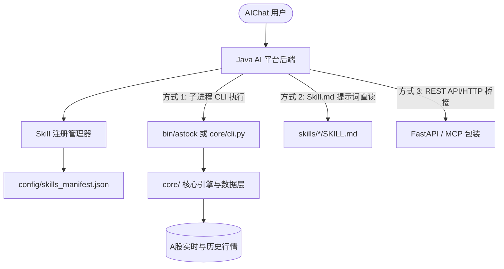

# Java AI 平台与 AIChat 接入集成指南

本项目设计为**与平台无关的自包含量化投研体系**，专为自建 Java AI 平台（如基于 Spring AI、LangChain4j 或自定义 Agent 架构）提供开箱即用的 A股 投研能力。

---

## 一、集成架构总览

Java AI 平台可通过以下三种方式集成 `a_stock_agents`：



---

## 二、接入方式详解

### 方式 1：基于 `skills_manifest.json` 的自动技能注册（推荐）

Java 平台启动时，读取 `config/skills_manifest.json`：
1. **获取技能列表**：解析每个技能的 `name`, `title`, `description`, `triggers`, `cli_command`。
2. **注册为 AI Tool / Function Call**：
   - 工具名称：`a_stock_cli`
   - 参数：`command` (如 `data quote sh600519`, `evaluate sz000001`, `action plan`)
   - 执行逻辑：Java 后端调用 `ProcessBuilder` 执行 `./bin/astock <command> --json` 并解析标准 JSON 输出。

**Java 伪代码示例：**
```java
public class AStockTool {
    private final String projectRoot = "/path/to/a_stock_agents";

    public String executeCommand(String command) throws Exception {
        ProcessBuilder pb = new ProcessBuilder(
            projectRoot + "/bin/astock",
            command,
            "--json"
        );
        pb.environment().put("A_STOCK_AGENTS_ROOT", projectRoot);
        Process process = pb.start();
        String jsonOutput = new String(process.getInputStream().readAllBytes(), StandardCharsets.UTF_8);
        process.waitFor();
        return jsonOutput;
    }
}
```

### 方式 2：AIChat 系统提示词与意图路由

将 `prompts/java_aichat_system_prompt.md` 作为系统提示词注入大模型对话上下文中：
- 大模型可自动根据用户的自然语言问题识别出对应的股票代码与意图。
- 触发对应 Tool 调用，获取数据后按 A股 实战纪律（保本价计算、三级止损线、三场景动作指令）向用户呈现结构化分析。

---

## 三、常用 CLI 指令速查

| 功能 | 命令行指令 | 返回格式 |
| :--- | :--- | :--- |
| 实时行情查询 | `./bin/astock data quote sh600519 sz000858 --json` | JSON |
| 技术指标计算 | `./bin/astock data tech sh600519 --json` | JSON |
| 综合量化评分 | `./bin/astock evaluate sh600519 --json` | JSON |
| 反应动作与保本价 | `./bin/astock action plan --json` | JSON |
| 技能清单列表 | `./bin/astock skill list --json` | JSON |

---

## 四、安全与隔离规范

1. **环境自包含**：项目自带独立 Python 虚拟环境，不污染服务器宿主机全局环境。
2. **零编译轻量依赖**：无需 C++ 编译链即可在主流 Linux 发行版（CentOS, Ubuntu, Debian, Rocky Linux）一键启动。
3. **降级保障**：数据接口自带 4 层自动降级机制，遇到网络封锁或源站故障时自动切换。
