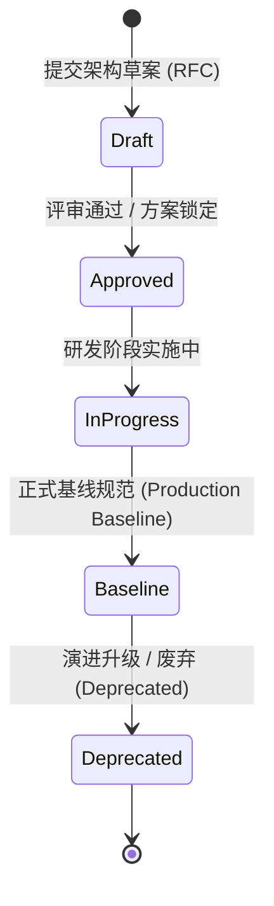

# A-Stock Agents 设计规范中心 (Design Specifications Center)

欢迎查阅 **A-Stock Agents** 技术规范与架构决策中心。为确保工程演进的高内聚性、可维护性与长期自洽性，本项目所有架构决策（ADR）、技术规格（Specification）与业务算法规约统一在此集中归档与治理。

---

## 一、 规范文档命名规则 (Specification Naming Conventions)

所有归档于 `docs/specs/` 的设计规范严格遵循**“分层目录 + 前缀自解释 + 元数据头契约”**三重标准：

### 1. 六大核心领域子目录 (`docs/specs/{category}/`)

| 序号 | 分类目录 | 领域英文 | 统一前缀 | 类别职责界定 |
|:---:|:---|:---|:---:|:---|
| **01** | `engineering/` | 项目工程结构 | `eng-` | 零全局污染原则、单一真理来源 (SSOT)、目录拓扑、跨平台 CLI、用户数据物理隔离 |
| **02** | `ui/` | UI 界面设计 | `ui-` | 现代浅色金融风格、红涨绿跌、Tabular-nums 排版、卡片无竖条边框、双模动态视口 |
| **03** | `architecture/`| 系统架构设计 | `arch-`| 服务端网关、Agent 本地运行时、Skill 治理控制子系统、大模型双轨接入、Token 链路安全 |
| **04** | `a2ui/` | A2UI 框架规范 | `a2ui-`| A2UI 核心渲染引擎、1:1 骨架屏编排、五阶段渐进式水合、领域组件包契约与模块化动态发现 |
| **05** | `business/` | 业务规则设计 | `biz-` | 全摩擦券商费率配置化、最低保本卖出价精算与向上进位至分、实战交易三原则与阶梯止损 |
| **06** | `algorithm/` | 算法规则设计 | `algo-`| 44项算法资产清单、AlgoRegistry 2.0 统一注册中枢、ALCM 四道质量门禁与退市熔断 |

### 2. 文件物理命名范式 (File Naming Schema)

```text
{category_prefix}-{domain_slug}-{doc_type}.md
```
- **`category_prefix`**：类别前缀（`eng-`、`ui-`、`arch-`、`a2ui-`、`biz-`、`algo-`），确保文件在编辑器多标签页或全文检索中具备自解释性。
- **`domain_slug`**：全小写短横线（kebab-case）语义代号，精准概括核心议题，严禁使用 `_v1`、`_new` 等临时版本号。
- **`doc_type`**：统一三种文档类型后缀：
  - `-specification.md`：体系级技术规格说明（如框架引擎、工程系统规范）。
  - `-design.md`：具体技术架构方案与决策（ADR / RFC）。
  - `-rules.md`：核心数学公式、交易纪律或业务约束规则。

### 3. 文档元数据头部契约 (Frontmatter Metadata Contract)

每个规范文档首部必须强制包含标准元数据区块：
```markdown
# [中文大标题] ([English Title])

- **规范分类**：[项目工程结构 | UI设计 | 系统架构设计 | A2UI框架 | 业务规则 | 算法规则]
- **规范编号**：SPEC-[ENG|UI|ARCH|A2UI|BIZ|ALGO]-[序号]
- **文档版本**：vX.Y
- **当前状态**：[正式规范 (Production Baseline) | 架构提案 (RFC/Approved) | 实施中 (In Progress)]
- **创建日期**：YYYY-MM-DD（修订日期：YYYY-MM-DD）
- **适用范围**：...
- **关联文档**：[`...`](...)
```

---

## 二、 核心规范全景矩阵索引 (Specifications Matrix)

### 1. 项目工程结构规范 (`engineering/`)
| 编号 | 规范名称 | 物理路径 | 状态 | 核心内容与定位 |
|:---:|:---|:---|:---:|:---|
| `SPEC-ENG-001` | 项目工程结构与工作区架构设计规范 | [`engineering/eng-project-structure-and-workspace.md`](engineering/eng-project-structure-and-workspace.md) | 正式规范 | 零全局污染、SSOT单一真理来源、目录职责边界、统一跨平台 CLI 与数据隔离机制 |

### 2. UI 界面设计规范 (`ui/`)
| 编号 | 规范名称 | 物理路径 | 状态 | 核心内容与定位 |
|:---:|:---|:---|:---:|:---|
| `SPEC-UI-001` | Web UI 界面设计与交互规范 | [`ui/ui-design-and-interaction-specification.md`](ui/ui-design-and-interaction-specification.md) | 正式规范 | 浅色金融商务风格、双模视口、连通长顶栏、无竖条轻量边框与工作台六大板块 |

### 3. 系统架构设计规范 (`architecture/`)
| 编号 | 规范名称 | 物理路径 | 状态 | 核心内容与定位 |
|:---:|:---|:---|:---:|:---|
| `SPEC-ARCH-001`| 独立 Web AIChatUI 与 Skill 治理系统架构设计 | [`architecture/arch-web-aichat-and-skill-governance.md`](architecture/arch-web-aichat-and-skill-governance.md) | 正式规范 | 独立 Web AIChat、FastAPI 服务网关、17 项技能治理中心与 SSE 流式通信 |
| `SPEC-ARCH-002`| 大模型双轨接入与多业务场景角色分配架构设计 | [`architecture/arch-llm-provider-and-role-allocation.md`](architecture/arch-llm-provider-and-role-allocation.md) | 正式规范 | 物理接入轨 (Providers) 与逻辑角色轨 (Roles) 双轨解耦、防 CORS 代理与延迟探测 |
| `SPEC-ARCH-003`| Token 链路安全网关与本地化审计 Agent 架构 | [`architecture/arch-token-security-gateway.md`](architecture/arch-token-security-gateway.md) | 正式规范 | 控制平面与执行平面分离、上行脱敏、下行过滤、只存指纹的不可篡改审计日志 |

### 4. A2UI 框架设计规范 (`a2ui/`)
| 编号 | 规范名称 | 物理路径 | 状态 | 核心内容与定位 |
|:---:|:---|:---|:---:|:---|
| `SPEC-A2UI-001`| Agent2UI (A2UI) 前端引擎框架设计与架构规范 | [`a2ui/a2ui-framework-engine-specification.md`](a2ui/a2ui-framework-engine-specification.md) | 正式规范 | 动态渲染引擎、WebApp Shell 硬锁定、1:1 骨架屏编排 (CLS=0) 与五阶段渐进水合 |
| `SPEC-A2UI-002`| A2UI 组件库模块化拆解与时序解耦发现机制规范 | [`a2ui/a2ui-component-registry-specification.md`](a2ui/a2ui-component-registry-specification.md) | 正式规范 | 领域组件包规范、时序缓冲解耦池、命名空间隔离 (`@a2ui/pack-astock`) 与约定式自省发现 |

### 5. 业务规则设计规范 (`business/`)
| 编号 | 规范名称 | 物理路径 | 状态 | 核心内容与定位 |
|:---:|:---|:---|:---:|:---|
| `SPEC-BIZ-001` | 券商佣金及费率参数配置化与首次使用提示规范 | [`business/biz-broker-commission-configurable-design.md`](business/biz-broker-commission-configurable-design.md) | 正式规范 | 全摩擦成本动态参数化、全局配置中心接口热重载与首次使用未确认费率友好提示 |
| `SPEC-BIZ-002` | 最低保本卖出价量化精算与精确进位业务规则 | [`business/biz-breakeven-price-calculation-rules.md`](business/biz-breakeven-price-calculation-rules.md) | 正式规范 | 印花税 0.05%、佣金万 2.5 最低 5 元、过户费十万分之一、强制向上精确进位至分 (`math.ceil`) |
| `SPEC-BIZ-003` | 实战交易反应动作与三级风控止损阶梯执行规范 | [`business/biz-trading-execution-and-risk-control.md`](business/biz-trading-execution-and-risk-control.md) | 正式规范 | 实战交易三原则、六大交易反应动作、三场景决策单与 T0(-3%)/T1(-5%)/T2(-8%) 止损阶梯 |

### 6. 算法规则设计规范 (`algorithm/`)
| 编号 | 规范名称 | 物理路径 | 状态 | 核心内容与定位 |
|:---:|:---|:---|:---:|:---|
| `SPEC-ALGO-001`| 算法资产审查、架构评估与全生命周期治理规范 | [`algorithm/algo-lifecycle-and-governance-specification.md`](algorithm/algo-lifecycle-and-governance-specification.md) | 正式规范 | 44项量化算法全景清单、AlgoRegistry 2.0 统一纳管与 ALCM 四道质量门禁 (G1-G4) |

---

## 三、 规范生命周期状态定义



- **Draft (架构草案)**：技术需求提出阶段，包含问题审计、方案对比与原型验证。
- **Approved (评审通过)**：架构决策成立（ADR），方案锁定并具备完整技术路径。
- **InProgress (实施中)**：正在核心代码或前端中逐步推进落地。
- **Production Baseline (正式规范)**：已完全上线验证的生产标准基线，全库所有新代码必须严格遵守。
- **Deprecated (已废弃)**：因系统主版本重构或技术栈演进已退役的历史规范，需注明替代规范链接。
