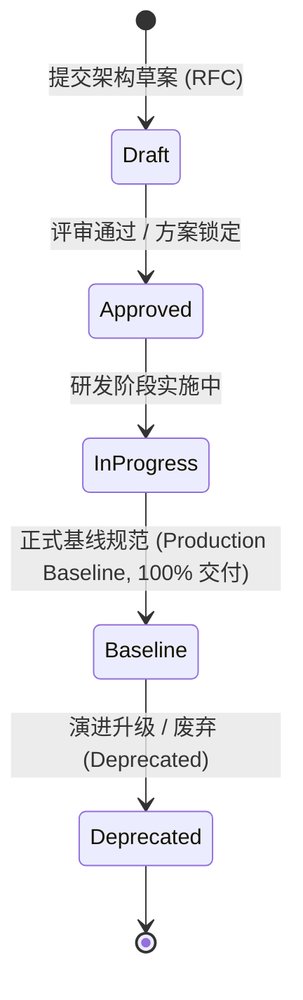

# A-Stock Agents 规范与任务实施执行中心 (Specifications & Execution Center)

欢迎查阅 **A-Stock Agents** 规范实施与任务执行跟踪看板中心。为确保工程演进的严谨性、可度量性与进度可观测性，本项目所有架构决策（ADR）、技术规格（Specification）与业务规则的**落地实施进度、任务矩阵与验收证据**统一在此集中治理与追踪。

> 💡 **核心架构职责划分**：
> - **[`docs/guidelines/`](../guidelines/README.md)（权威知识定义库 - SSOT）**：沉淀 14 项完整的工程规范、交互指南、系统架构设计与量化业务规则定义（包含完整数学公式、架构图谱、Schema 与代码契约）。
> - **`docs/specs/`（实施进度看板 - 本目录）**：保留 6 大领域分类目录与 `SPEC-xxx-001` 规范编号体系，专注于**实施状态跟踪、任务清单矩阵、里程碑交付与回归测试证据**，并通过超链接直达权威指南。

---

## 一、 核心规范实施进度看板矩阵 (Specifications Execution Matrix)

### 1. 项目工程结构 (`engineering/`)
| 编号 | 规范名称 | 实施看板路径 | 权威设计指南 | 实施状态 | 核心落地成果与交付点 |
|:---:|:---|:---|:---|:---:|:---|
| `SPEC-ENG-001` | 项目工程结构与工作区架构设计规范 | [`engineering/eng-project-structure-and-workspace.md`](engineering/eng-project-structure-and-workspace.md) | [`project-structure-specification.md`](../guidelines/project-structure-specification.md) | ✅ 100% 基线 | 零全局污染、SSOT单一真理来源、全平台统一 CLI 启动器与 `output/` 隐私数据物理隔离 |

### 2. UI 界面设计 (`ui/`)
| 编号 | 规范名称 | 实施看板路径 | 权威设计指南 | 实施状态 | 核心落地成果与交付点 |
|:---:|:---|:---|:---|:---:|:---|
| `SPEC-UI-001` | Web UI 界面设计与交互规范 | [`ui/ui-design-and-interaction-specification.md`](ui/ui-design-and-interaction-specification.md) | [`ui-design-guide.md`](../guidelines/ui-design-guide.md) | ✅ 100% 基线 | 浅色金融风格、红涨绿跌、双模视口、@操作符双栏浮窗、富文本输入框与@token高亮、三大股池多维卡片、提交按钮防闪动 |

### 3. 系统架构设计 (`architecture/`)
| 编号 | 规范名称 | 实施看板路径 | 权威设计指南 | 实施状态 | 核心落地成果与交付点 |
|:---:|:---|:---|:---|:---:|:---|
| `SPEC-ARCH-001`| 独立 Web AIChatUI 与 Skill 治理系统架构 | [`architecture/arch-web-aichat-and-skill-governance.md`](architecture/arch-web-aichat-and-skill-governance.md) | [`web-aichat-architecture.md`](../guidelines/web-aichat-architecture.md) | ✅ 100% 基线 | FastAPI 服务网关、原生 ReAct 运行时、SSE 流式通信、17 项技能治理中心与 @操作符四向任务路由中枢 |
| `SPEC-ARCH-002`| 大模型双轨接入与多业务场景角色分配架构 | [`architecture/arch-llm-provider-and-role-allocation.md`](architecture/arch-llm-provider-and-role-allocation.md) | [`llm-provider-architecture.md`](../guidelines/llm-provider-architecture.md) | ✅ 100% 基线 | Providers 管理与 Roles 业务角色双轨解耦、网络延迟探测、防 CORS 发现代理与 SQLite 持久化 |
| `SPEC-ARCH-003`| Token 链路安全网关与本地化审计 Agent 架构 | [`architecture/arch-token-security-gateway.md`](architecture/arch-token-security-gateway.md) | [`token-security-architecture.md`](../guidelines/token-security-architecture.md) | 📋 规划中 (RFC) | 控制平面与执行平面物理分离、上行脱敏、下行过滤、只存 SHA-256 指纹的不可篡改审计日志 |

### 4. A2UI 框架设计 (`a2ui/`)
| 编号 | 规范名称 | 实施看板路径 | 权威设计指南 | 实施状态 | 核心落地成果与交付点 |
|:---:|:---|:---|:---|:---:|:---|
| `SPEC-A2UI-001`| Agent2UI (A2UI) 前端引擎框架架构规范 | [`a2ui/a2ui-framework-engine-specification.md`](a2ui/a2ui-framework-engine-specification.md) | [`a2ui-framework-architecture.md`](../guidelines/a2ui-framework-architecture.md) | ✅ 100% 基线 | WebApp Shell 容器视口锁定 `calc(100vh - 50px)`、1:1 骨架预占位 (CLS=0)、五阶段渐进水合流水线 |
| `SPEC-A2UI-002`| A2UI 组件库模块化拆解与动态发现机制规范 | [`a2ui/a2ui-component-registry-specification.md`](a2ui/a2ui-component-registry-specification.md) | [`a2ui-component-registry-specification.md`](../guidelines/a2ui-component-registry-specification.md) | ✅ 100% 基线 | 领域组件包重构 (`@a2ui/pack-astock`)、未决缓冲队列时序解耦、双重寻址与自省能力清单 (`getCatalog`) |

### 5. 业务规则设计 (`business/`)
| 编号 | 规范名称 | 实施看板路径 | 权威设计指南 | 实施状态 | 核心落地成果与交付点 |
|:---:|:---|:---|:---|:---:|:---|
| `SPEC-BIZ-001` | 券商佣金及费率参数配置化与首次使用提示规范 | [`business/biz-broker-commission-configurable-design.md`](business/biz-broker-commission-configurable-design.md) | [`broker-commission-rules.md`](../guidelines/broker-commission-rules.md) | ✅ 100% 基线 | 全摩擦费率配置化中心、动态参数内存热重载、`astock config market` CLI 与未确认友好引导 |
| `SPEC-BIZ-002` | 最低保本卖出价量化精算与精确进位业务规则 | [`business/biz-breakeven-price-calculation-rules.md`](business/biz-breakeven-price-calculation-rules.md) | [`breakeven-calculation-rules.md`](../guidelines/breakeven-calculation-rules.md) | ✅ 100% 基线 | 印花税 0.05%、佣金万 2.5 最低 5 元、过户费、强制向上精确进位至分 (`math.ceil`) 绝对保本 |
| `SPEC-BIZ-003` | 实战交易反应动作与三级风控止损阶梯执行规范 | [`business/biz-trading-execution-and-risk-control.md`](business/biz-trading-execution-and-risk-control.md) | [`trading-execution-rules.md`](../guidelines/trading-execution-rules.md) | ✅ 100% 基线 | 阿尔法选股与贝塔执行解耦、实战交易三原则、六大交易反应动作、T0(-3%)/T1(-5%)/T2(-8%) 止损阶梯 |

### 6. 算法规则设计 (`algorithm/`)
| 编号 | 规范名称 | 实施看板路径 | 权威设计指南 | 实施状态 | 核心落地成果与交付点 |
|:---:|:---|:---|:---|:---:|:---|
| `SPEC-ALGO-001`| 算法资产审查、架构评估与全生命周期治理规范 | [`algorithm/algo-lifecycle-and-governance-specification.md`](algorithm/algo-lifecycle-and-governance-specification.md) | [`algorithm-governance.md`](../guidelines/algorithm-governance.md) | ✅ 100% 基线 | 44 项量化算法全景拓扑审计、AlgoRegistry 2.0 纳管模型、ALCM 四道质量门禁机制落地 |

---

## 二、 规范生命周期状态定义

- **Draft (架构草案)**：技术需求提出阶段，包含问题审计、方案对比与原型验证。
- **Approved (评审通过)**：架构决策成立（ADR），方案锁定并具备完整技术路径。
- **InProgress (实施中)**：正在核心代码或前端中逐步推进落地。
- **Production Baseline (正式基线)**：已完全上线验证的生产标准基线，全库所有新代码必须严格遵守。
- **Deprecated (已废弃)**：因系统主版本重构或技术栈演进已退役的历史规范，需注明替代规范链接。
