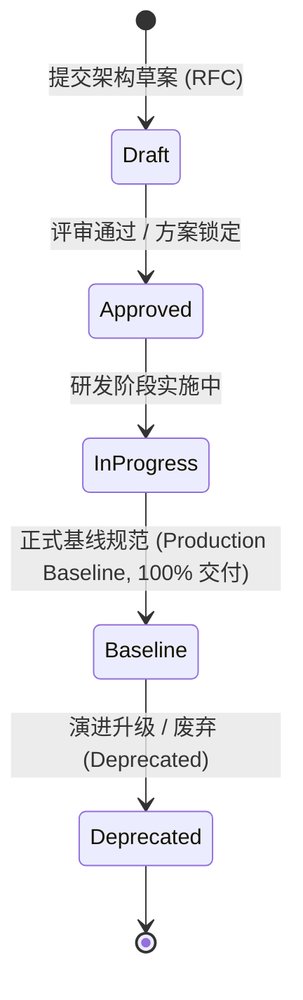

# A-Stock Agents 规范与任务实施执行中心 (Specifications & Execution Center)

欢迎查阅 **A-Stock Agents** 规范实施与任务执行跟踪看板中心。为确保工程演进的严谨性、可度量性与进度可观测性，本项目所有架构决策（ADR）、技术规格（Specification）与业务规则的**落地实施进度、任务矩阵与验收证据**统一在此集中治理与追踪。

> 💡 **核心架构职责划分（两范式严格二分，混编即违规）**：
> - **[`docs/guidelines/`](../guidelines/README.md)（权威知识定义库 - SSOT）**：沉淀 7 大领域、24 篇完整的工程规范、交互指南、系统架构设计与量化业务规则定义（包含完整数学公式、架构图谱、Schema 与代码契约）。
> - **`docs/specs/`（实施进度看板 - 本目录）**：保留 7 大领域分类目录与 `SPEC-{CATEGORY}-{SEQ}` 规范编号体系，专注于**实施状态跟踪、任务清单矩阵、里程碑交付与回归测试证据**，并通过超链接直达权威指南。
>
> 📐 **编制范式与反混编红线**：见 [`naming-conventions.md` §四](../guidelines/engineering/naming-conventions.md)。本目录文档一律遵循「**实施计划范式**」（头部三段字段 `规范编号` / `权威定义 (SSOT)` / `**实施状态**` 强制必填），**严禁**复述公式、费率数值与 Schema 正文——此类定义一律以超链接指向 `docs/guidelines/`。

---

## 一、 核心规范实施进度看板矩阵 (Specifications Execution Matrix)

### 1. 项目工程与安全整改 (`engineering/`)

| 编号 | 规范名称 | 实施看板路径 | 权威设计指南 (SSOT) | 实施状态 | 核心落地成果与交付点 |
|:---:|:---|:---|:---|:---:|:---|
| `SPEC-ENG-001` | 项目工程结构与工作区架构设计规范 | [`engineering/eng-project-structure-and-workspace.md`](engineering/eng-project-structure-and-workspace.md) | [`project-structure-specification.md`](../guidelines/engineering/project-structure-specification.md) | 🚧 实施中 | 原基线声明待整改验收；当前进度见 [验收台账](engineering/eng-remediation-acceptance.md) |
| `SPEC-SEC-001` | 系统安全加固与渗透测试漏洞整改 | [`engineering/security-remediation-plan.md`](engineering/security-remediation-plan.md) | [`security-hardening-guide.md`](../guidelines/engineering/security-hardening-guide.md) | ✅ 已完成 (Completed & Verified) | 8 项漏洞场景闭环修复、物理沙箱隔离、iframe 降权、DNS 防 SSRF；证据见 [渗透测试报告](../audits/2026-09-14-penetration-testing-report.md) |
| — | 工程质量整改总计划（10 项受审规格聚合） | [`engineering/eng-remediation-plan.md`](engineering/eng-remediation-plan.md) | [`code-review.md`](../guidelines/engineering/code-review.md) | 📋 规划中 (RFC) | 审查基准 `88f1f71`；发现项拆分至各领域整改子计划统一验收 |
| — | 运行时与测试体系整改计划 | [`engineering/eng-runtime-and-test-remediation-plan.md`](engineering/eng-runtime-and-test-remediation-plan.md) | [`testing-guide.md`](../guidelines/engineering/testing-guide.md) | 📋 规划中 (RFC) | 归属 `SPEC-ENG-001`；发现 E1/E2/E3/T1，按 E1→E4 顺序推进 |
| — | 生产级 Agent 平台 P0 止血子计划 | [`engineering/production-agent-platform-p0-plan.md`](engineering/production-agent-platform-p0-plan.md) | [`production-agent-platform-architecture.md`](../guidelines/architecture/production-agent-platform-architecture.md) | ✅ 已完成 (Completed) | 归属 `SPEC-ARCH-004`；2026-09-10 完成，原始步骤清单保留用于审计 |
| 📒 台账 | 受审规格整改验收台账 | [`engineering/eng-remediation-acceptance.md`](engineering/eng-remediation-acceptance.md) | [`code-review.md`](../guidelines/engineering/code-review.md) | 🚧 实施中 | 10 项受审规格的 `original_claim` / `findings` / `code_paths` / `tests` / `current_status` 逐条留痕 |

### 2. UI 界面设计与前端重构 (`ui/`)

| 编号 | 规范名称 | 实施看板路径 | 权威设计指南 (SSOT) | 实施状态 | 核心落地成果与交付点 |
|:---:|:---|:---|:---|:---:|:---|
| `SPEC-UI-001` | Web UI 界面设计与交互规范 | [`ui/ui-design-and-interaction-plan.md`](ui/ui-design-and-interaction-plan.md) | [`ui-design-guide.md`](../guidelines/ui/ui-design-guide.md) | 🚧 实施中 | 原基线声明待整改验收；双模动态视口、红涨绿跌色系与 @操作符浮窗 |
| `SPEC-UI-002` | 前端 `app.js` 源码拆分与模块化规范 | [`ui/app-js-modularization-plan.md`](ui/app-js-modularization-plan.md) | [`app-js-modularization-guide.md`](../guidelines/ui/app-js-modularization-guide.md) | 🚧 实施中 | 巨石单体解耦为领域驱动模块、零构建工具依赖、HTML 内联事件兼容 |
| — | 对话响应呈现（回复卡片 / 执行时间线 / 工作台投射） | [`ui/chat-response-presentation-plan.md`](ui/chat-response-presentation-plan.md) | [`chat-response-presentation-guide.md`](../guidelines/ui/chat-response-presentation-guide.md) | 🚧 实施中 | 归属 `SPEC-UI-001`；纯渲染模块与 Node 单测已落地 |
| — | 前端数据契约与 MOCK 兜底接入 | [`ui/frontend-api-integration-plan.md`](ui/frontend-api-integration-plan.md) | [`web-aichat-architecture.md`](../guidelines/architecture/web-aichat-architecture.md) | ✅ 已完成 (Completed) | 归属 `SPEC-UI-001` / `SPEC-ARCH-001`；P0–P3 与里程碑 M0–M3 全部达成 |

### 3. 系统架构设计 (`architecture/`)

| 编号 | 规范名称 | 实施看板路径 | 权威设计指南 (SSOT) | 实施状态 | 核心落地成果与交付点 |
|:---:|:---|:---|:---|:---:|:---|
| `SPEC-ARCH-001` | 独立 Web AIChatUI 与 Skill 治理系统架构 | [`architecture/arch-web-aichat-and-skill-governance.md`](architecture/arch-web-aichat-and-skill-governance.md) | [`web-aichat-architecture.md`](../guidelines/architecture/web-aichat-architecture.md) | 🚧 实施中 | 原基线声明待整改验收；当前进度见 [验收台账](architecture/arch-skill-capability-acceptance.md) |
| `SPEC-ARCH-002` | 大模型双轨接入与多业务场景角色分配架构 | [`architecture/arch-llm-provider-and-role-allocation.md`](architecture/arch-llm-provider-and-role-allocation.md) | [`llm-provider-architecture.md`](../guidelines/architecture/llm-provider-architecture.md) | 🚧 实施中 | 原基线声明待整改验收；物理接入轨与逻辑角色轨双轨解耦 |
| `SPEC-ARCH-003` | Token 链路安全网关与本地化审计 Agent 架构 | [`architecture/arch-token-security-gateway.md`](architecture/arch-token-security-gateway.md) | [`token-security-architecture.md`](../guidelines/architecture/token-security-architecture.md) | 📋 架构提案 (RFC / Approved) | 方案待研发 (Backlog)；控制平面与执行平面物理分离、上行脱敏、下行过滤、只存 SHA-256 指纹 |
| `SPEC-ARCH-004` | 生产级 Agent 平台架构 | [`architecture/production-agent-platform-plan.md`](architecture/production-agent-platform-plan.md) | [`production-agent-platform-architecture.md`](../guidelines/architecture/production-agent-platform-architecture.md) | 🚧 实施中 | P0 止血阶段已交付（见 [P0 子计划](engineering/production-agent-platform-p0-plan.md)），后续阶段推进中 |
| — | Agent 运行时整改计划 | [`architecture/arch-agent-runtime-remediation-plan.md`](architecture/arch-agent-runtime-remediation-plan.md) | [`web-aichat-architecture.md`](../guidelines/architecture/web-aichat-architecture.md) | 📋 规划中 (RFC) | 归属 `SPEC-ARCH-001`（A1-A4）/ `SPEC-ARCH-002`（A5）；按 R1、R2a、R3、R4、R2b 推进 |
| 📒 台账 | 技能能力真实性验收台账 | [`architecture/arch-skill-capability-acceptance.md`](architecture/arch-skill-capability-acceptance.md) | [`web-aichat-architecture.md`](../guidelines/architecture/web-aichat-architecture.md) | 🚧 实施中 | 归属 `SPEC-ARCH-001`；P0 / R2a 止血已验收，P1 统一执行器与 P6 工作台投射待完成 |

### 4. A2UI 框架设计 (`a2ui/`)

| 编号 | 规范名称 | 实施看板路径 | 权威设计指南 (SSOT) | 实施状态 | 核心落地成果与交付点 |
|:---:|:---|:---|:---|:---:|:---|
| `SPEC-A2UI-001` | Agent2UI (A2UI) 前端引擎框架架构规范 | [`a2ui/a2ui-framework-engine-plan.md`](a2ui/a2ui-framework-engine-plan.md) | [`a2ui-framework-architecture.md`](../guidelines/a2ui/a2ui-framework-architecture.md) | 🚧 实施中 | 原基线声明待整改验收；WebApp Shell 硬锁定、1:1 骨架预占位 (CLS=0)、五阶段水合流水线 |
| `SPEC-A2UI-002` | A2UI 组件库模块化拆解与动态发现机制规范 | [`a2ui/a2ui-component-registry-plan.md`](a2ui/a2ui-component-registry-plan.md) | [`a2ui-component-registry-specification.md`](../guidelines/a2ui/a2ui-component-registry-specification.md) | 🚧 实施中 | 原基线声明待整改验收；未决缓冲队列时序解耦、命名空间隔离与自省清单 |
| — | A2UI 运行时整改计划 | [`a2ui/a2ui-runtime-remediation-plan.md`](a2ui/a2ui-runtime-remediation-plan.md) | [`a2ui-framework-architecture.md`](../guidelines/a2ui/a2ui-framework-architecture.md) | 📋 规划中 (RFC) | 归属 `SPEC-UI-001` / `SPEC-A2UI-001` / `SPEC-A2UI-002`；按 F1→F4 推进 |

### 5. 业务规则设计 (`business/`)

| 编号 | 规范名称 | 实施看板路径 | 权威设计指南 (SSOT) | 实施状态 | 核心落地成果与交付点 |
|:---:|:---|:---|:---|:---:|:---|
| `SPEC-BIZ-001` | 券商佣金及费率参数配置化与首次使用提示规范 | [`business/biz-broker-commission-configurable-plan.md`](business/biz-broker-commission-configurable-plan.md) | [`broker-commission-rules.md`](../guidelines/business/broker-commission-rules.md) | 🚧 实施中 | 原基线声明待整改验收；全局费率中心、动态化配置与未配置友好提醒 |
| `SPEC-BIZ-002` | 最低保本卖出价量化精算与精确进位业务规则 | [`business/biz-breakeven-price-calculation-plan.md`](business/biz-breakeven-price-calculation-plan.md) | [`breakeven-calculation-rules.md`](../guidelines/business/breakeven-calculation-rules.md) | 🚧 实施中 | 原基线声明待整改验收；摩擦税费精算与向上进位至分位保本铁律 |
| `SPEC-BIZ-003` | 实战交易反应动作与三级风控止损阶梯执行规范 | [`business/biz-trading-execution-and-risk-control.md`](business/biz-trading-execution-and-risk-control.md) | [`trading-execution-rules.md`](../guidelines/business/trading-execution-rules.md) | 🚧 实施中 | 原基线声明待整改验收；六大交易反应动作与 T0/T1/T2 三级风控止损 |
| — | 费率与风控整改计划 | [`business/biz-fees-and-risk-remediation-plan.md`](business/biz-fees-and-risk-remediation-plan.md) | [`broker-commission-rules.md`](../guidelines/business/broker-commission-rules.md)、[`breakeven-calculation-rules.md`](../guidelines/business/breakeven-calculation-rules.md)、[`trading-execution-rules.md`](../guidelines/business/trading-execution-rules.md) | 📋 规划中 (RFC) | 归属 `SPEC-BIZ-001/002/003`、`SPEC-UI-001`；按 B1→B2→B3 顺序落地 |

### 6. 算法规则设计 (`algorithm/`)

| 编号 | 规范名称 | 实施看板路径 | 权威设计指南 (SSOT) | 实施状态 | 核心落地成果与交付点 |
|:---:|:---|:---|:---|:---:|:---|
| `SPEC-ALGO-001` | 算法资产审查、架构评估与全生命周期治理规范 | [`algorithm/algo-lifecycle-and-governance-plan.md`](algorithm/algo-lifecycle-and-governance-plan.md) | [`algorithm-governance.md`](../guidelines/algorithm/algorithm-governance.md) | 🚧 实施中 | 原基线声明待整改验收；44 项算法全景清单、AlgoRegistry 2.0 与 ALCM 四道门禁 |
| `SPEC-ALGO-ISS-001` | 智能选股系统功能建设规范 | [`algorithm/selection-system-plan.md`](algorithm/selection-system-plan.md) | [`selection-system-specification.md`](../guidelines/algorithm/selection-system-specification.md) | 📋 规划中 (RFC) | 方案待产品评审；选股模型版本控制、层级漏斗引擎、多次运行记录与结果研究 |
| `SPEC-ALGO-002` | 选股体系设计规范 | [`algorithm/selection-design-plan.md`](algorithm/selection-design-plan.md) | [`selection-design-guide.md`](../guidelines/algorithm/selection-design-guide.md) | 📋 规划中 (RFC) | 待执行；选股设计范式与分层架构落地 |
| `SPEC-ALGO-003` | 通用选股与拐点判定规则 | [`algorithm/general-selection-and-turning-point-plan.md`](algorithm/general-selection-and-turning-point-plan.md) | [`general-selection-and-turning-point-rules.md`](../guidelines/algorithm/general-selection-and-turning-point-rules.md) | 📋 规划中 (RFC) | 待执行；通用选股与转折点识别规则的工程化落地 |
| — | 算法治理整改计划 | [`algorithm/algo-governance-remediation-plan.md`](algorithm/algo-governance-remediation-plan.md) | [`algorithm-governance.md`](../guidelines/algorithm/algorithm-governance.md) | 📋 规划中 (RFC) | 归属 `SPEC-ALGO-001`（发现 G1）；按 G1→G3 顺序推进 |
| — | 待办积压登记看板 | [`algorithm/pending-backlog-plan.md`](algorithm/pending-backlog-plan.md) | [`selection-system-specification.md`](../guidelines/algorithm/selection-system-specification.md) | 📋 规划中 (RFC) | 归属 `SPEC-ALGO-ISS-001`；全部条目未开始（整理日期 2026-09-20） |
| 🗄️ 归档 | 历史 ADR / RFC / 审计报告（6 篇，不可变） | [`algorithm/archive/`](algorithm/archive/) | — | 🔒 已归档 | 保留 `YYYY-MM-DD-*.md` 日期前缀，豁免 `-plan.md` 命名规则，只增不改 |

### 7. 数据架构与同步机制设计 (`data/`)

| 编号 | 规范名称 | 实施看板路径 | 权威设计指南 (SSOT) | 实施状态 | 核心落地成果与交付点 |
|:---:|:---|:---|:---|:---:|:---|
| `SPEC-DATA-001` | 本地行情数据同步机制实施计划与验收看板 | [`data/market-data-sync-implementation-plan.md`](data/market-data-sync-implementation-plan.md) | [`market-data-sync-specification.md`](../guidelines/data/market-data-sync-specification.md) | ✅ 正式基线 | SQLite 嵌入式时序主库、交易日历断点探测与自愈、`local/` 700 权限物理阻断、全套回归验证证据 |

---

## 二、 规范生命周期状态定义

- **Draft (架构草案)**：技术需求提出阶段，包含问题审计、方案对比与原型验证。
- **Approved (评审通过)**：架构决策成立（ADR），方案锁定并具备完整技术路径。
- **InProgress (实施中)**：正在核心代码或前端中逐步推进落地。
- **Production Baseline (正式基线)**：已完全上线验证的生产标准基线，全库所有新代码必须严格遵守。
- **Deprecated (已废弃)**：因系统主版本重构或技术栈演进已退役的历史规范，需注明替代规范链接。

> ⚠️ **状态声明红线**：看板头部 `**实施状态**` 必须如实反映当前进展，**严禁**在未完成全部任务与证据回归前声明「正式基线」。历史遗留的失实基线声明统一归入 [整改验收台账](engineering/eng-remediation-acceptance.md) 跟踪复验。

---

## 三、 归档与不可变留痕约定

- **`<domain>/archive/`**：历史 ADR / RFC / 审计报告归档区，**只增不改**，保留 `YYYY-MM-DD-*.md` 日期前缀，豁免 `-plan.md` 命名规则。
- **[`docs/audits/`](../audits/)**：审查报告与留痕归档区（项目规格审查、代码审查、渗透测试、硬编码数据审计），**只增不改**；实施计划类内容一律迁入本目录对应领域，不在 `audits/` 承载任务矩阵。
- 命名范式与目录分层标准见 [`naming-conventions.md` §四](../guidelines/engineering/naming-conventions.md)。