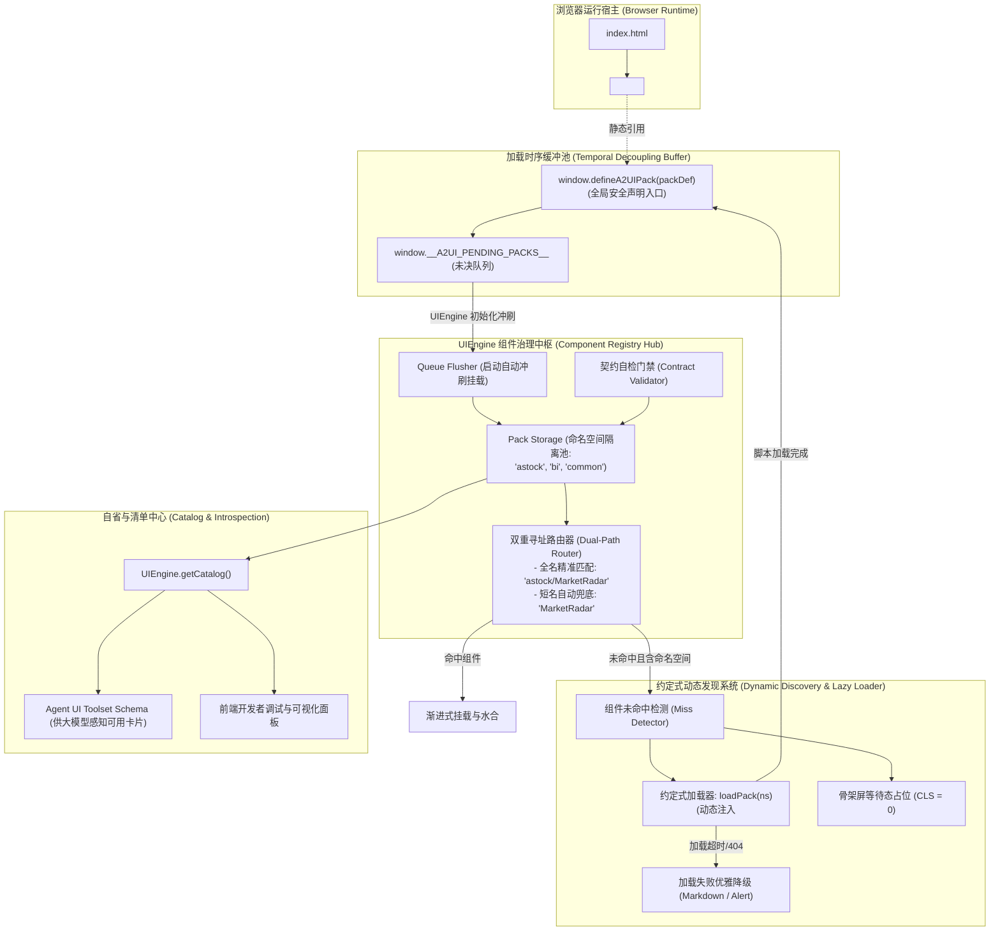

# Agent2UI (A2UI) 组件库拆解与模块化注册发现机制设计规范 (Component Registry & Discovery Specification)

- **文档版本**：v1.0
- **创建日期**：2026-09-07
- **当前状态**：正式规范 (Draft / Approved for Execution)
- **适用范围**：A-Stock Agents 独立 Web 前端、Agent2UI (A2UI) 渲染引擎、跨端组件库生态
- **关联文档**：[`docs/specs/agent2ui-framework-specification.md`](file:///c:/Users/cvdnn/coding/a_stock_agents/docs/specs/agent2ui-framework-specification.md)、[`AGENTS.md`](file:///c:/Users/cvdnn/coding/a_stock_agents/AGENTS.md)

---

## 0. 背景与演进动因 (Context & Motivation)

### 0.1 现状与瓶颈
在现有的 Agent2UI 前端实现中，股票领域的卡片与看板组件全部平铺在单一文件 `web/js/components_astock.js` 中，并在 `web/js/ui_engine.js` 内通过极其简易的键值字典进行注册：
```javascript
// ui_engine.js 现状
registerComponent(name, definition) {
  this.components[name] = definition;
}

// components_astock.js 现状
if (typeof UIEngine !== 'undefined') {
  UIEngine.registerComponent('MarketRadar', AStockMarketRadar);
}
```

随着投研与多智能体系统向更多维度（宏观、商业智能 BI、加密货币、通用数据可视化等）横向演进，当前模式暴露出以下明显的架构瓶颈：
1. **缺乏命名空间隔离 (Namespace Collision)**：扁平的单维字典无法防止不同业务包组件命名冲突（例如多个包同时存在 `SummaryCard` 或 `MetricPanel`）；
2. **强脚本加载时序绑定 (Temporal Coupling)**：组件脚本必须严格在 `ui_engine.js` 之后同步载入，一旦后续采用 `async` / `defer` 或动态按需引入，极易产生 `UIEngine is undefined` 的初始化竞态报错；
3. **缺乏组件元数据清单与自省机制 (Missing Introspection & Catalog)**：前端和后端 Agent 均无法动态查询当前客户端已加载的组件能力集（支持的视图模式、参数规格、组件描述等）；
4. **不支持动态发现与按需懒加载 (No Dynamic Discovery / Lazy Hydration)**：当 Agent 输出一个新领域的卡片指令时，若前端页面未在首屏静态 `<script>` 预先引入，只能静默失败或报错白屏，无法按需动态拉取组件包；
5. **文件平铺杂乱**：所有前端脚本散落在 `web/js/` 根目录下，目录缺乏模块化层次。

### 0.2 演进目标
本规范确立 `web/js/components/` 子目录体系，并将 `components_astock.js` 模块化重构为领域包 `web/js/components/astock.js`，同时在 `UIEngine` 中建立一套**时序解耦、命名空间隔离、支持约定式动态发现、具备自省元数据清单**的高扩展性组件治理体系。

---

## 1. 目录规范与文件组织架构 (Directory Conventions)

### 1.1 目录组织层级
`web/js/` 目录实行“引擎内核”与“领域组件包”两级分离：
```
web/js/
├── app.js                       # 业务主控制器与交互状态机
├── charts.js                    # 金融级 Canvas 底座 (FinancialCharts)
├── ui_engine.js                 # A2UI 通用渲染调度、骨架编排与组件治理中枢 (Registry Hub)
└── components/                  # 【新增】A2UI 领域组件包专有目录 (Packs Root)
    ├── astock.js                # A股量化投研领域包 (@a2ui/pack-astock)
    ├── bi.js                    # [未来扩展] 商业智能与多维报表领域包 (@a2ui/pack-bi)
    ├── crypto.js                # [未来扩展] 加密资产与衍生品领域包 (@a2ui/pack-crypto)
    └── common.js                # [未来扩展] 通用基础卡片与富文本包 (@a2ui/pack-common)
```

### 1.2 目录演进与打包兼容性
- **零额外构建依赖**：组件在原生浏览器环境下运行，通过标准的相对路径 `<script src="js/components/astock.js"></script>` 引入；
- **全平台静态容器兼容**：本地 `file:///` 协议、Python 内置 `http.server`、FastAPI 静态挂载、Nginx、以及桌面端（Tauri / Electron）环境均获得 100% 原生支持；
- **打包工具前向兼容**：若后续项目引入 Vite / Rollup 或原生 ES 模块（`import`），该子目录层级结构天然对齐现代前端模块化标准。

---

## 2. 总体架构拓扑 (Architecture Topology)

组件治理子系统划分为 **安全缓冲池**、**注册治理中枢**、**寻址路由器**、**动态发现加载器** 与 **自省清单中心** 五大核心模块：



---

## 3. 组件与领域包契约规范 (Contract Interfaces)

### 3.1 领域组件包契约 (`A2UIPack`)
每个领域包（如 `astock.js`）以单一实体向注册中枢交付：

```typescript
export interface A2UIPack {
  namespace: string;                          // 领域命名空间，如 'astock'、'bi'
  title: string;                              // 领域包可读中文名称
  version: string;                            // 语义化版本号，如 '1.0.0'
  description?: string;                       // 领域包职能说明
  components: Record<string, A2UIComponent>;  // 包含的组件字典
  dependencies?: string[];                    // 依赖的全局库 (如 ['FinancialCharts'])
}
```

### 3.2 单组件契约规范 (`A2UIComponent`)
领域包内的各个组件必须严格实现以下生命周期契约：

```typescript
export interface A2UIComponent<TProps = any> {
  name: string;                               // 组件名称，如 'MarketRadar'
  category?: string;                          // 所属领域，默认继承 Pack 的 namespace
  description?: string;                       // 组件简短说明
  
  // 1. 骨架屏渲染（必须）
  renderSkeleton(mode: 'compact' | 'expanded'): string;

  // 2. 对话卡片态渲染（必须，AIChat 消息流 40% 视口）
  renderCompact(props: Partial<TProps>): string;

  // 3. 工作台态渲染（必须，工作台大屏 60%~100% 沉浸视口）
  renderExpanded(props: Partial<TProps>): string;

  // 4. 后置水合与生命周期钩子（可选，Canvas 绘制、事件监听）
  onMounted?(container: HTMLElement, props: TProps, mode: 'compact' | 'expanded'): void;

  // 5. 销毁与资源清理钩子（可选，WebGL / 定时器释放）
  onUnmounted?(container: HTMLElement): void;
}
```

---

## 4. 组件注册中枢设计 (Registry Hub Implementation)

### 4.1 全局安全声明入口与缓冲池
为消除由于 `<script>` 乱序或未来异步加载引发的竞态问题，在全局作用域注入轻量声明函数：

```javascript
// 全局未决缓冲队列
window.__A2UI_PENDING_PACKS__ = window.__A2UI_PENDING_PACKS__ || [];

// 安全注册函数（可随时随地调用，无视 UIEngine 加载先后）
window.defineA2UIPack = function(packDef) {
  if (window.UIEngine && typeof window.UIEngine.registerPack === 'function') {
    window.UIEngine.registerPack(packDef);
  } else {
    window.__A2UI_PENDING_PACKS__.push(packDef);
  }
};
```

### 4.2 UIEngine 内部核心扩展
在 `web/js/ui_engine.js` 中重构组件存储结构，支持命名空间字典、冲刷逻辑与双重寻址路由：

```javascript
const UIEngine = {
  // 命名空间存储结构: { [namespace]: { meta, components: { [name]: def } } }
  packs: {},
  // 短名全量扁平索引: { [name]: def }
  componentIndex: {},

  // 1. 领域包注册
  registerPack(packDef) {
    if (!packDef || !packDef.namespace) {
      console.warn('[UIEngine] Invalid pack definition:', packDef);
      return;
    }
    const ns = packDef.namespace;
    this.packs[ns] = {
      meta: {
        namespace: ns,
        title: packDef.title || ns,
        version: packDef.version || '1.0.0',
        description: packDef.description || ''
      },
      components: {}
    };

    const comps = packDef.components || {};
    Object.keys(comps).forEach(compName => {
      this.registerComponentToPack(ns, compName, comps[compName]);
    });

    console.log(`[UIEngine] Successfully mounted pack: @a2ui/pack-${ns} (v${packDef.version || '1.0.0'}) with ${Object.keys(comps).length} components`);
  },

  // 2. 单组件归属注册与契约校验
  registerComponentToPack(namespace, compName, compDef) {
    if (!compDef) return;
    compDef.name = compName;
    compDef.category = namespace;

    // 契约防御检查
    if (!compDef.renderCompact || !compDef.renderExpanded) {
      console.warn(`[UIEngine] Component ${namespace}/${compName} missing renderCompact or renderExpanded contract!`);
    }

    // 存入命名空间池
    if (!this.packs[namespace]) {
      this.packs[namespace] = { meta: { namespace, title: namespace }, components: {} };
    }
    this.packs[namespace].components[compName] = compDef;

    // 更新全局短名索引 (保留向后兼容)
    this.componentIndex[compName] = compDef;
  },

  // 3. 兼容向后旧 API
  registerComponent(name, definition) {
    this.registerComponentToPack('common', name, definition);
  },

  // 4. 双重寻址查询 (Dual-Path Query)
  getComponent(identifier) {
    if (!identifier) return null;

    // 路径 A: 包含命名空间 (e.g. "astock/MarketRadar" 或 "astock:MarketRadar")
    if (identifier.includes('/') || identifier.includes(':')) {
      const [ns, name] = identifier.split(/[\/:]/);
      if (this.packs[ns] && this.packs[ns].components[name]) {
        return this.packs[ns].components[name];
      }
    }

    // 路径 B: 纯短名查找 (Fallback to Short-name Index)
    if (this.componentIndex[identifier]) {
      return this.componentIndex[identifier];
    }

    return null;
  },

  // 5. 冲刷未决缓冲队列
  flushPendingPacks() {
    if (Array.isArray(window.__A2UI_PENDING_PACKS__)) {
      while (window.__A2UI_PENDING_PACKS__.length > 0) {
        const pending = window.__A2UI_PENDING_PACKS__.shift();
        this.registerPack(pending);
      }
    }
  }
};
```

---

## 5. 约定式动态发现与懒加载协议 (Dynamic Discovery & Lazy Loading)

### 5.1 约定式路径解析规则
当 Agent 任务或流式事件指定了一个未注册的组件标识（例如 `bi/FunnelChart`）时，引擎执行约定式加载协议：
$$\text{Script URL} = \text{`js/components/${namespace}.js`}$$

### 5.2 异步发现与水合流程
```javascript
UIEngine.loadPack = function(namespace, customUrl = null) {
  return new Promise((resolve, reject) => {
    // 若已加载直接返回
    if (this.packs[namespace]) {
      return resolve(this.packs[namespace]);
    }

    const scriptUrl = customUrl || `js/components/${namespace}.js`;
    const script = document.createElement('script');
    script.src = scriptUrl;
    script.async = true;

    script.onload = () => {
      this.flushPendingPacks();
      if (this.packs[namespace]) {
        resolve(this.packs[namespace]);
      } else {
        reject(new Error(`Script loaded but pack '${namespace}' was not defined.`));
      }
    };

    script.onerror = () => {
      reject(new Error(`Failed to dynamically load pack script: ${scriptUrl}`));
    };

    document.head.appendChild(script);
  });
};
```

### 5.3 优雅降级防护网
若网络异常或该领域包不存在（404）：
1. 骨架屏停止无限 Loading，展示警示卡片：
   ```html
   <div class="a2ui-fallback-card">
     <span>⚠️ 组件包 [${namespace}] 动态加载失败，已切换至基础数据模式</span>
   </div>
   ```
2. 自动提取已到达的 JSON Props，转化为标准 Markdown 表格呈现，**坚决杜绝控制台抛错导致主界面白屏**。

---

## 6. 组件自省与元数据清单机制 (Catalog & Introspection)

### 6.1 `UIEngine.getCatalog()` 输出规范
供前端配置面板和后端 Agent 调用的完整自省清单：
```json
{
  "totalPacks": 1,
  "totalComponents": 3,
  "packs": [
    {
      "namespace": "astock",
      "title": "A股量化投研组件包",
      "version": "1.0.0",
      "components": [
        {
          "name": "MarketRadar",
          "fullName": "astock/MarketRadar",
          "category": "astock",
          "supports": ["compact", "expanded"],
          "hasLifecycle": true
        },
        {
          "name": "CandleMatrix",
          "fullName": "astock/CandleMatrix",
          "category": "astock",
          "supports": ["compact", "expanded"],
          "hasLifecycle": true
        },
        {
          "name": "RiskBreakevenCalc",
          "fullName": "astock/RiskBreakevenCalc",
          "category": "astock",
          "supports": ["compact", "expanded"],
          "hasLifecycle": true
        }
      ]
    }
  ]
}
```

### 6.2 Agent UI Toolset Schema 赋能
后端 Agent 在系统提示词或 ReAct 循环中，可直接以 JSON 格式读取 `getCatalog()`：
> *“当前前端已就绪组件包括：`astock/MarketRadar`（大盘全景）、`astock/CandleMatrix`（K线量价矩阵）、`astock/RiskBreakevenCalc`（保本算价器）。请优先输出结构化插槽语法而非纯文本代码块。”*

---

## 7. 迁移与工程落地计划 (Migration Plan)

### 7.1 文件变更对照清单
| 操作 | 目标文件路径 | 变更说明 |
| :--- | :--- | :--- |
| **[NEW]** | `web/js/components/` | 新建组件库专有子目录 |
| **[MOVE & UPGRADE]** | `web/js/components_astock.js`<br>➔ `web/js/components/astock.js` | 迁移文件并升级为符合 `defineA2UIPack` 的领域包规范 |
| **[DELETE]** | `web/js/components_astock.js` | 移除原根目录下冗余文件 |
| **[MODIFY]** | `web/js/ui_engine.js` | 实现命名空间存储、双重寻址、缓冲队列冲刷、`loadPack` 动态发现与 `getCatalog` |
| **[MODIFY]** | `web/index.html` | 更新脚本路径：`<script src="js/components/astock.js"></script>` |

### 7.2 实施检查清单 (Verification Checklist)
- [ ] 检查浏览器控制台无任何 `404 Not Found` 静态资源报错；
- [ ] 触发“分析今日大盘行情”快捷指令，验证 `MarketRadar` 骨架屏与图表正常水合渲染；
- [ ] 触发“评估持股策略”快捷指令，验证 `RiskBreakevenCalc` 保本价滑块在对话卡片与工作台正常联动；
- [ ] 控制台执行 `UIEngine.getCatalog()`，确认完整打印 `astock` 领域包与 3 个组件的元数据；
- [ ] 验证双重寻址：`UIEngine.getComponent('MarketRadar')` 与 `UIEngine.getComponent('astock/MarketRadar')` 均准确命中。
