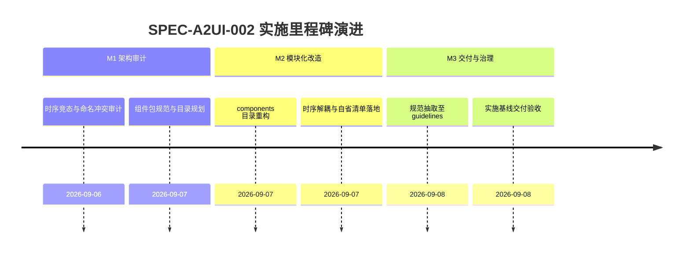

# A2UI 组件库模块化与注册发现实施看板 (A2UI Component Registry Execution Spec)

- **规范分类**：A2UI框架 (Framework)
- **规范编号**：SPEC-A2UI-002
- **文档版本**：v1.2
- **实施状态**：实施中 | 原“正式基线 100% 已交付”声明待整改验收
- **创建日期**：2026-09-07（修订日期：2026-09-08）
- **适用范围**：A-Stock Agents 独立 Web 前端、Agent2UI (A2UI) 渲染引擎、跨端组件库生态
- **权威设计指南**：[`docs/guidelines/a2ui-component-registry-specification.md`](../../guidelines/a2ui-component-registry-specification.md)

> 🔗 **权威规范与架构定义直达**：  
> 本文件为 **A2UI 组件库模块化拆解与动态发现机制实施落地跟踪看板**。关于未决缓冲池时序解耦原理、命名空间隔离、约定式动态发现契约与自省清单 Schema 等完整规范，请查阅权威指南：  
> 👉 [**《A2UI 组件库拆解与模块化注册发现机制规范》(a2ui-component-registry-specification.md)**](../../guidelines/a2ui-component-registry-specification.md)

---

## 一、 规范简要名称与核心要点

- **规范名称**：A2UI 组件库模块化拆解与时序解耦发现机制规范
- **核心定位**：彻底解决前端多领域组件包命名冲突、脚本载入时序耦合竞态与组件自省清单缺失痛点。
- **关键设计要点**：
  1. [时序解耦未决缓冲池 (`__A2UI_PENDING_PACKS__`)](../../guidelines/a2ui-component-registry-specification.md#1-时序解耦与未决缓冲队列-temporal-decoupling)：通过全局 `defineA2UIPack` 打破脚本同步加载强依赖，彻底杜绝 `UIEngine is undefined`；
  2. [领域包命名空间隔离 (`@a2ui/pack-astock`)](../../guidelines/a2ui-component-registry-specification.md#2-命名空间隔离与双重寻址)：组件分包归集，支持短名称优先匹配与命名冲突时降级全名寻址；
  3. [组件元数据自省清单 (`getCatalog()`)](../../guidelines/a2ui-component-registry-specification.md#3-组件能力自省契约-getcatalog)：向 Agent 和调试终端动态暴露组件参数规格与视图模式；
  4. [约定式按需动态发现 (`loadPack()`)](../../guidelines/a2ui-component-registry-specification.md#三-架构拓扑与核心机制-registry-architecture)：运行时根据智能体指令动态加载未知组件包。

---

## 二、 任务实施与执行进度矩阵 (Task Implementation Matrix)

| 实施任务项 | 代码映射路径 | 实施状态 | 验收说明与测试基准 | 交付日期 |
|:---|:---|:---:|:---|:---:|
| **组件物理目录分包重构** | `web/js/components/astock.js` | ✅ 100% | 废弃根目录下 `components_astock.js`，重构为 `components/astock.js` | 2026-09-07 |
| **未决缓冲队列与安全声明** | `web/js/components/astock.js`, `web/js/ui_engine.js` | ✅ 100% | 实现 `window.defineA2UIPack` 与 `flushPendingPacks()` 时序自愈 | 2026-09-07 |
| **双重寻址与命名空间隔离** | `web/js/ui_engine.js` | ✅ 100% | 支持短名称与 `@a2ui/pack-astock/MarketRadar` 全路径寻址 | 2026-09-07 |
| **组件自省清单接口** | `web/js/ui_engine.js` | ✅ 100% | `UIEngine.getCatalog()` 正确返回已注册领域包与组件元数据结构 | 2026-09-07 |
| **HTML 引入路径与异步加载对齐** | `web/index.html` | ✅ 100% | 更新 ``，验证首屏渲染无报错 | 2026-09-07 |

---

## 三、 里程碑推进情况 (Milestone Progress)

---

## 四、 质量验收与验证证据 (Verification Evidence)

1. **时序解耦自愈测试**：
   - 故意将 `components/astock.js` 移至 `ui_engine.js` 之前载入，控制台无任何 `undefined` 错误，组件成功进入未决队列并在引擎启动后自动 flush 注册。
2. **自省清单控制台验收**：
   - 在浏览器控制台执行 `UIEngine.getCatalog()`，返回包含 6 个 A 股核心组件的完整 JSON 清单。

---

## 五、 执行变更日志 (Execution Changelog)

- **2026-09-08 (v1.2)**：按规范治理要求重构，将组件库规范定义抽离至 `docs/guidelines/a2ui-component-registry-specification.md`，本文件重塑为实施看板。
- **2026-09-07 (v1.0)**：初始创建，完成 `components/astock.js` 拆解与 UIEngine 组件治理机制升级。
