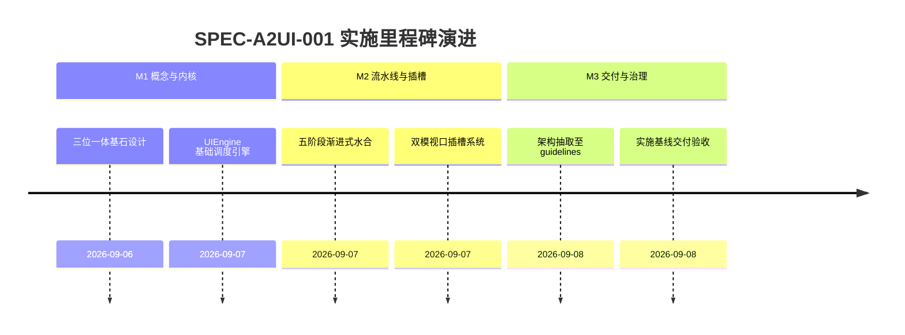

# Agent2UI (A2UI) 前端引擎框架实施看板 (A2UI Engine Framework Execution Spec)

- **规范分类**：A2UI框架 (Framework)
- **规范编号**：SPEC-A2UI-001
- **文档版本**：v1.2
- **实施状态**：实施中 | 原“正式基线 100% 已交付”声明待整改验收
- **创建日期**：2026-09-07（修订日期：2026-09-08）
- **适用范围**：A-Stock Agents 独立 Web 投研前端、Desktop 客户端及跨端 AI 动态驱动 UI 渲染中枢
- **权威设计指南**：[`docs/guidelines/a2ui-framework-architecture.md`](../../guidelines/a2ui-framework-architecture.md)

> 🔗 **权威规范与架构定义直达**：  
> 本文件为 **A2UI 前端渲染引擎框架实施落地与任务执行跟踪看板**。关于 WebApp Shell 容器硬锁定、1:1 骨架屏预占位、五阶段渐进式水合流水线等完整架构设计，请查阅权威指南：  
> 👉 [**《Agent2UI (A2UI) 前端渲染引擎框架架构设计》(a2ui-framework-architecture.md)**](../../guidelines/a2ui-framework-architecture.md)

---

## 一、 规范简要名称与核心要点

- **规范名称**：Agent2UI (A2UI) 前端引擎框架设计与架构规范
- **核心定位**：将 AI 的复杂链式推理（COT）毫秒级转化为直观结构化的金融级交互界面的动态编排引擎。
- **关键设计要点**：
  1. [WebApp Shell 应用外壳硬锁定](../../guidelines/a2ui-framework-architecture.md#一-概述与核心设计基石-the-trinity-of-ux)：视口锁定在 `calc(100vh - 50px)`，杜绝整页滚动，支持双模视口插槽；
  2. [1:1 结构级骨架预占位 (CLS = 0)](../../guidelines/a2ui-framework-architecture.md#一-概述与核心设计基石-the-trinity-of-ux)：识别意图瞬间预先注入相同宽高骨架 DOM，彻底消除页面抖动；
  3. [五阶段渐进式水合流水线](../../guidelines/a2ui-framework-architecture.md#三-五阶段渐进式水合流水线-progressive-hydration-pipeline)：意图识别 -> 骨架占位 -> 快数据先行 -> 重型图表平滑跃迁 -> 全交互激活；
  4. [双向动作总线与自省机制](../../guidelines/a2ui-framework-architecture.md#二-总体架构拓扑-system-topology)：支持从界面参数反写回智能体与逆向穿透提问。

---

## 二、 任务实施与执行进度矩阵 (Task Implementation Matrix)

| 框架实施任务 | 代码映射路径 | 实施状态 | 验收说明与测试基准 | 交付日期 |
|:---|:---|:---:|:---|:---:|
| **UIEngine 核心调度中枢** | `web/js/ui_engine.js` | ✅ 100% | 统一协调流式解调、目标插槽寻址、骨架屏渲染与组件挂载 | 2026-09-07 |
| **WebApp Shell 容器视口锁定** | `web/css/style.css`, `web/index.html` | ✅ 100% | 锁定 `calc(100vh - 50px)`，局部独立滚动，消除整页抖动 | 2026-09-07 |
| **骨架预占位动效体系** | `web/css/style.css`, `web/js/ui_engine.js` | ✅ 100% | 闪烁灰色微光骨架（Shimmer），零布局偏移 (CLS=0) | 2026-09-07 |
| **快数据与 Canvas 异步水合** | `web/js/charts.js`, `web/js/components/astock.js` | ✅ 100% | 现价与指标极速直出，Canvas 走势图使用 `requestAnimationFrame` 顺滑挂载 | 2026-09-07 |
| **双模插槽分发路由** | `web/js/ui_engine.js` | ✅ 100% | 智能分发到对话消息卡片 (`chat`) 与右侧工作台看板 (`workbench`) | 2026-09-07 |

---

## 三、 里程碑推进情况 (Milestone Progress)

---

## 四、 质量验收与验证证据 (Verification Evidence)

1. **零累积布局偏移 (CLS = 0) 验证**：
   - 触发大盘全景雷达图渲染，骨架 DOM 瞬间渲染，尺寸与最终 Canvas 100% 吻合，页面无像素跳变。
2. **渐进式数据上屏平滑度验证**：
   - 模拟延迟 800ms 数据，快指标先行显示，重型图表异步加载无卡顿。

---

## 五、 执行变更日志 (Execution Changelog)

- **2026-09-08 (v1.2)**：按规范治理要求重构，将前端渲染引擎架构定义抽离至 `docs/guidelines/a2ui-framework-architecture.md`，本文件重塑为实施看板。
- **2026-09-07 (v1.0)**：初始创建，确立 A2UI 三位一体基石与渐进水合标准。
