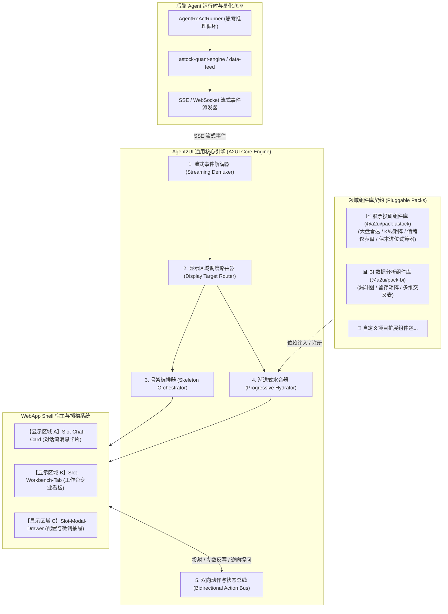

# Agent2UI (A2UI) 前端引擎框架设计与架构规范 (Agent-to-UI Engine Specification)

- **文档版本**：v1.0
- **创建日期**：2026-09-07
- **适用范围**：A-Stock Agents 独立 Web 投研前端、Desktop 客户端（Tauri/Electron）及跨端通用的 AI 动态驱动 UI 渲染中枢
- **状态**：正式规范 (Production Baseline)

---

## 0. 概述与核心愿景

在量化投研与大模型深度融合的交互系统中，传统的“纯文本对话”或“粗糙代码块”已无法满足专业金融交易场景对高精度、多维度、多媒体可视化的严苛要求。

**Agent2UI (A2UI) 前端引擎**是一套**面向 AI 智能体驱动的前端界面编排与动态渲染引擎框架**。它致力于将 AI 的复杂链式推理（COT）与量化数据资产，毫秒级转化为直观、结构化、可深度交互的金融级界面（图表、雷达图、K线量价矩阵、保本试算器等），并实现对【AIChatUI 卡片】与【工作台大屏】的双模自适应调度。

### 核心设计基石 (The Trinity of UX)
1. **WebApp Shell (应用静态外壳)**：视口网格与插槽硬锁定，首屏极速挂载，杜绝整页滚动与结构崩塌；
2. **骨架屏 (Skeleton Screen)**：意图识别瞬间进行 1:1 结构级空间预占位，实现**零页面跳动 (Cumulative Layout Shift, CLS = 0)**；
3. **渐进式渲染 (Progressive Hydration)**：多阶段流水线水合，快数据先行上屏，重型图表平滑跃迁，解决大模型吐字慢与重型可视化渲染卡顿的矛盾。

---

## 1. 总体架构拓扑 (System Topology)

A2UI 引擎采用严格的分层解耦与控制反转（IoC）架构，核心引擎保持纯粹的“业务无关调度”，具体的业务图表通过“领域组件包（Component Pack）”即插即用挂载：



---

## 2. 三位一体运行机制

### 2.1 WebApp Shell 容器硬锁定
* **视口高度硬锁定**：页面主体锁定在 `calc(100vh - 50px)`，严禁整页 Body 滚动，保障金融盯盘稳定性；
* **双模栅格插槽**：
  * **模式一（投研助手模式）**：中间 AIChat 占 40%，右侧工作台占 60%；
  * **模式二（业务主工作区模式）**：中间业务工作台占 100%（或 65%），AI 助手作为伴随式 Copilot 位于右侧（390px）；
* **独立双向局部滚动**：Chat 对话流 (`.chat-messages`) 与工作台视口 (`.right-content-scroll`) 独立上下滚动，互不干涉。

### 2.2 骨架屏 (Skeleton Screen) 预占位规范
传统 Loading 仅有一只旋转菊花，无法预测最终界面大小，导致数据返回时内容严重挤压跳动。A2UI 实施**组件级 1:1 结构骨架规范**：
1. **意图确认即挂载**：Agent 意图识别完成（约 50~100ms），尚未计算复杂历史行情时，前端立即收到 `ui_skeleton` 事件，挂载骨架；
2. **高保真占位**：骨架元素的高度、宽度比例、圆角必须与最终组件绝对对齐；
3. **微光呼吸动效 (Shimmer Effect)**：使用 CSS 硬件加速渐变移动，给用户明确的系统正在高效运算的心理预期：
```css
@keyframes skeletonShimmer {
  0% { background-position: -200% 0; }
  100% { background-position: 200% 0; }
}

.skeleton-shimmer {
  background: linear-gradient(90deg, #F0F2F5 25%, #E6E8EB 37%, #F0F2F5 63%);
  background-size: 400% 100%;
  animation: skeletonShimmer 1.4s ease infinite;
  border-radius: 6px;
}
```

### 2.3 渐进式流式水合 (Progressive Hydration) 流水线
渲染过程坚决杜绝“全量阻塞”，严格执行五阶段渐进演进：

```
[用户触发] "分析市场行情"
  │
  ├─► Stage 0 [0~80ms]:   意图解析 ──► 立即渲染骨架屏 (Mount Skeleton)
  │
  ├─► Stage 1 [100~200ms]: 快数据就绪 ──► 水合核心 KPI、现价、情绪温度计数值
  │
  ├─► Stage 2 [200~800ms]: LLM 研报流 ──► 打字机流式输出正文 (ContentDelta)
  │
  ├─► Stage 3 [800~1400ms]:重型时序就绪 ──► 异步绘制 Canvas/ECharts (K线量能图)
  │
  └─► Stage 4 [完成]:      动作单激活 ──► 绑定保本价试算滑块、放大投射跃迁监听
```

---

## 3. 统一 Agent2UI 协议契约规范 (A2UI Streaming Protocol)

后端 Agent 与前端 A2UI 引擎通过强类型 SSE 事件流进行全双工通信：

### 3.1 事件类型清单
| 事件名称 (`event`) | 说明 | 触发时机 | 引擎动作 |
| :--- | :--- | :--- | :--- |
| `ui_skeleton` | 骨架屏描述符 | 意图解析完成 (50ms) | 在目标区域插入对应尺寸的骨架占位 |
| `ui_hydrate_fast` | 快速指标局部水合 | 实时行情/快因子计算完成 | 局部填充现价、涨跌幅、情绪得分，替换骨架槽 |
| `content_delta` | 研报打字机流 | LLM 归纳文本生成中 | 文本容器增量流式打字渲染 |
| `ui_hydrate_heavy`| 重型图表/复杂矩阵 | K线序列/多因子矩阵就绪 | 异步启动 Canvas/ECharts 渲染与动画展示 |
| `ui_action_sheet` | 实战三原则风控动作单 | 保本价进位核算完成 | 挂载保本卖出价、T0/T1/T2止损与交互滑块 |
| `ui_done` | 整体渲染生命周期结束 | 全流程完毕 | 释放临时加载监听，激活最终双向事件绑定 |

### 3.2 完整协议载荷范例 (以“分析市场行情”为例)
```jsonc
// 1. ui_skeleton 事件载荷
{
  "event": "ui_skeleton",
  "data": {
    "task_id": "task_20260907_market_001",
    "display_target": "both_linked", // "chat_card" | "workbench" | "both_linked"
    "layout_meta": {
      "title": "A股市场行情全景深度研判",
      "icon": "📊",
      "workbench_tab": {
        "tab_id": "tab-market-deep",
        "tab_title": "📊 市场行情全景",
        "closable": true,
        "auto_focus": true
      }
    },
    "skeleton_tree": [
      { "slot_id": "slot_kpi", "component": "MarketRadar", "height": 68 },
      { "slot_id": "slot_candle", "component": "CandleMatrix", "height": 260 },
      { "slot_id": "slot_risk", "component": "RiskBreakevenCalc", "height": 110 }
    ]
  }
}

// 2. ui_hydrate_fast 事件载荷
{
  "event": "ui_hydrate_fast",
  "data": {
    "task_id": "task_20260907_market_001",
    "slot_id": "slot_kpi",
    "props": {
      "indices": [
        { "name": "上证指数", "price": 3426.56, "change_pct": 0.72 },
        { "name": "深证成指", "price": 10892.14, "change_pct": 1.08 },
        { "name": "创业板指", "price": 2289.76, "change_pct": 1.31 }
      ],
      "sentiment": { "score": 78, "text": "贪婪 / 情绪亢温" },
      "total_volume": "1.28万亿元"
    }
  }
}

// 3. ui_hydrate_heavy 事件载荷
{
  "event": "ui_hydrate_heavy",
  "data": {
    "task_id": "task_20260907_market_001",
    "slot_id": "slot_candle",
    "props": {
      "benchmark": "上证指数",
      "klines": [
        ["08-25", 3390.2, 3405.6, 3410.0, 3385.0, 32000],
        ["08-26", 3405.6, 3415.8, 3420.5, 3400.1, 38500],
        ["08-27", 3415.8, 3426.56, 3432.0, 3410.2, 45200]
      ]
    }
  }
}
```

---

## 4. 双模显示区域路由与投射联动规范

A2UI 引擎根据 `display_target` 指令，智能控制渲染目标视窗：

```
                              ┌─────────────────────────┐
                              │  display_target 路由决策 │
                              └────────────┬────────────┘
                                           │
             ┌─────────────────────────────┼─────────────────────────────┐
             ▼                             ▼                             ▼
   ["chat_card"]                  ["workbench"]                  ["both_linked"] (默认推荐)
   仅在对话流中渲染               直接新建/切换工作台 Tab         同时挂载双端：
   紧凑型交互卡片                 全屏沉浸大屏呈现               Chat 呈现实战卡片
                                                                 工作台打开深度视窗
                                                                 附带一键投射与参数联动
```

### 4.1 多标签页保护机制 (Preserve Existing Tabs)
* **严禁暴力覆盖**：当工作台已有正在浏览的视窗（如 `自选个股`、`收益分析`）时，引擎派发新任务**绝对不覆盖、不清空原有 Tab**；
* **动态追加并激活**：在工作台顶部标签栏动态追加新标签（如 `[📊 市场行情全景 ✕]`），平滑激活当前 Tab；点击 `✕` 安全平滑回退至上一活动 Tab。

### 4.2 从左到右弹出硬件加速动效 (`popupSlideFromLeft`)
在 Chat 卡片点击 `[⛶ 放大投射到工作台]` 或由引擎自动激活投射时，工作台对应 Pane 必须应用如下硬件加速动效，营造“内容从左侧 AI 大脑跃迁至右侧工作台”的空间连贯感：
```css
@keyframes popupSlideFromLeft {
  0% {
    opacity: 0;
    transform: translateX(-40px) scale(0.97);
  }
  60% {
    opacity: 1;
    transform: translateX(4px) scale(1.002);
  }
  100% {
    opacity: 1;
    transform: translateX(0) scale(1);
  }
}

.popup-slide-from-left {
  animation: popupSlideFromLeft 0.38s cubic-bezier(0.16, 1, 0.3, 1) forwards;
}
```

---

## 5. 领域组件库契约与股票投研示范库 (`@a2ui/pack-astock`)

### 5.1 通用组件契约接口定义 (TypeScript Interface)
```typescript
export interface A2UIComponent<TProps = any> {
  name: string;             // 组件唯一标识
  category: string;         // 领域分类，如 'finance' | 'bi'
  
  // 1. 骨架屏渲染 (返回骨架 HTML)
  renderSkeleton(mode: 'compact' | 'expanded'): string;

  // 2. 卡片态渲染 (Chat 消息流内 40% 宽度，高概括)
  renderCompact(props: Partial<TProps>): string;

  // 3. 工作台态渲染 (工作台 60%~100% 宽度，全屏交互)
  renderExpanded(props: Partial<TProps>): string;

  // 4. 水合与后置生命周期 (Canvas 绘制、事件监听)
  onMounted?(el: HTMLElement, props: TProps, mode: 'compact' | 'expanded'): void;

  // 5. 销毁与资源回收 (释放 WebGL / Canvas 实例，解绑监听)
  onUnmounted?(el: HTMLElement): void;
}
```

### 5.2 股票投研领域组件库实现细节

#### 组件 1：`MarketRadar` (大盘全景雷达)
* **卡片态**：展示上证、深证、创业板核心点位与涨跌幅微胶囊；
* **工作台态**：全景火花线走势（Sparkline）、两市总成交量大单比率；
* **视觉铁律**：上涨严格 `#F5222D`，下跌严格 `#52C41A`，数字强制应用 `font-variant-numeric: tabular-nums`。

#### 组件 2：`CandleMatrix` (K线量能矩阵)
* **卡片态**：微缩版 28 日多空趋势折线 Sparkline；
* **工作台态**：带成交量柱状图、MA5/10/20均线系统及水下二次金叉标记的完整交互式 Canvas 蜡烛图。

#### 组件 3：`RiskBreakevenCalc` (实战三原则保本价与滑块算价器)
* **合规铁律**：严格遵守 `AGENTS.md` 契约，核算印花税（0.05%）、券商佣金（万2.5最低5元起）、过户费，且**强制向上进位至分位 (`math.ceil`)**，杜绝四舍五入；
* **卡片态**：
  $$\text{最低保本卖出价} = \frac{\lceil (\text{总买入金额} + \text{全流程摩擦税费}) \times 100 \rceil}{100 \times \text{股数}}$$
  配合 T0 (-3%) / T1 (-5%) / T2 (-8%) 三级风控阶梯卡片；
* **工作台态**：搭载双向动态滑块（成本 Slider、股数 Slider），用户拖动时在浏览器本地执行毫秒级实时进位重算，并带出开盘冲高、窄幅震荡、跳水急跌三场景即时动作单。

---

## 6. 异常容错、性能度量与系统健壮性

### 6.1 异常兜底降级规范 (Graceful Degradation)
1. **Schema 校验失败兜底**：若 LLM 吐出的数据结构缺损，A2UI 引擎拒绝崩溃白屏，自动降级为标准 Markdown 格式呈现，并标注 `[⚠️ 结构化数据异常，已切换文本模式]`；
2. **离线与断网重连**：SSE 流断开时，骨架屏保持轻微脉冲动效，并弹出轻提示 `[网络重连中...]`，收到新消息后继续增量水合。

### 6.2 性能控制指标
* **首屏 CLS (Cumulative Layout Shift)**：$\le 0.01$（骨架屏完全消除布局跳动）；
* **骨架屏挂载耗时**：$\le 30\text{ms}$（纯 CSS + 极简 DOM 预注入）；
* **Canvas 重绘防抖**：窗口 Resize 或双栏折叠切换时，实施 `debounce(fn, 150)` 防抖重绘，防止主线程掉帧。

---

## 7. 模块代码文件映射表

| 架构分层 | 对应代码资产 | 职能描述 |
| :--- | :--- | :--- |
| **WebApp Shell** | `web/index.html`<br>`web/css/style.css` | 静态视口网格容器、连通顶部栏、双模 CSS Order 置换 |
| **A2UI Core Engine** | `web/js/app.js` (`UIEngine`) | 流式解调、骨架编排调度器、Tab 路由器、动作总线 |
| **金融图表渲染底座** | `web/js/charts.js` (`FinancialCharts`) | Canvas K线蜡烛图、火花线、情绪温度计、净值曲线 |
| **组件库规范与契约** | `docs/specs/agent2ui-framework-specification.md` | 本文档，作为通用 A2UI 框架与股票投研示范库标准基准 |
| **组件注册与发现机制** | `docs/specs/a2ui-component-registry-specification.md` | 模块化子目录规范、时序解耦缓冲池、双重寻址与约定式动态发现 |
| **交互与视觉规范** | `docs/specs/ui-design-specification.md` | 浅色金融商务风格、双向独立滚动、从左到右弹出动画规范 |
| **风控计算契约** | `AGENTS.md` | 保本卖出价 `math.ceil` 进位算法、三级风控阶梯、三场景动作单 |
