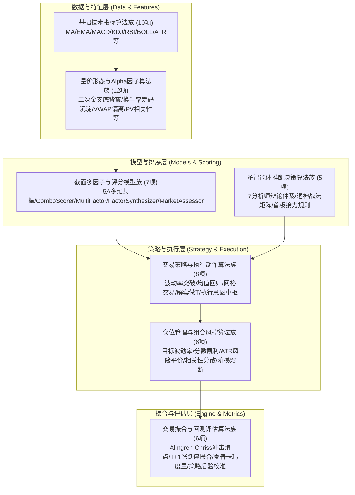
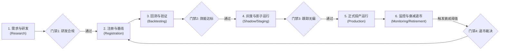

# A-Stock Agents 算法审查、架构评估与全生命周期治理规范 (Algorithm Lifecycle & Governance Specification)

- **规范分类**：算法规则
- **规范编号**：SPEC-ALGO-001
- **文档版本**：v1.1
- **当前状态**：正式规范 (Production Baseline)
- **创建日期**：2026-09-02（修订日期：2026-09-07）
- **适用范围**：A-Stock Agents 40+ 项量化金融模型、技术指标、Alpha因子、选股策略、撮合引擎与风控算法的全生命周期治理
- **关联设计**：[`../engineering/eng-project-structure-and-workspace.md`](../engineering/eng-project-structure-and-workspace.md)、[`../business/biz-breakeven-price-calculation-rules.md`](../business/biz-breakeven-price-calculation-rules.md)、[`../business/biz-trading-execution-and-risk-control.md`](../business/biz-trading-execution-and-risk-control.md)

---

## 0. 执行摘要 (Executive Summary)

经过对本项目全量代码库（涵盖 `scripts/core/indicators/`、`scripts/core/models/`、`scripts/core/strategy/`、`scripts/core/paper_trading/`、`scripts/core/multi_agent/` 及 `.agents/skills/`）的深度审计，系统在量化金融、技术分析与多智能体结合方面已积累了极其深厚的技术底蕴，拥有 **44 项专业量化算法与金融模型**。

本规范确立**统一算法库（Algo Registry 2.0）**架构，建立贴合 A 股市场特性的**算法全生命周期管理（ALCM）治理框架**，实施四道核心质量门禁（G1 研发合规、G2 效能防过拟合、G3 灰度实盘跟踪、G4 运行退市熔断），并输出详尽的**算法全景目录清单**。

---

## 1. 算法族群架构全景 (Algorithm Topology)

系统的 44 项量化算法解构为 7 大层级族群：



---

## 2. 统一算法库（Algo Registry 2.0）架构设计

统一算法库提供强类型元数据描述、分类纳管与兼容别名映射：

```python
from abc import ABC, abstractmethod
from dataclasses import dataclass
from typing import Any, Dict, List, Optional
from enum import Enum

class AlgorithmCategory(str, Enum):
    INDICATOR = "indicator"          # 技术指标
    ALPHA_FACTOR = "alpha_factor"    # 量价/衍生因子
    SCORING_MODEL = "scoring_model"  # 选股/评分模型
    STRATEGY = "strategy"            # 择时/交易策略
    RISK_SIZING = "risk_sizing"      # 仓位与风控算法
    EXECUTION = "execution"          # 撮合/执行算法
    EVALUATOR = "evaluator"          # 绩效度量/策略评估

class AlgorithmLifecycleStage(str, Enum):
    RESEARCH = "research"            # 研发试验中
    BACKTESTED = "backtested"        # 已通过离线回测验证
    STAGING = "staging"              # 模拟盘/影子测试中
    PRODUCTION = "production"        # 实盘正式生效
    DEPRECATED = "deprecated"        # 已废弃预警
    RETIRED = "retired"              # 已退市归档

@dataclass
class AlgorithmMetadata:
    algo_id: str                      # 算法唯一ID
    name: str                         # 算法名称
    category: AlgorithmCategory       # 分类
    version: str                      # SemVer 版本号
    description: str                  # 算法功能描述
    stage: AlgorithmLifecycleStage    # 当前生命周期阶段
    entry_module: str                 # 模块路径
    entry_class_or_fn: str            # 入口类或入口函数
    regime_suitability: List[str]     # 适用市场状态: BULL / BEAR / OSCILLATION
    input_schema: Dict[str, Any]      # 输入参数定义
    output_schema: Dict[str, Any]     # 输出指标定义
    benchmark_metrics: Dict[str, Any] # 基线效能 (IC/夏普/回撤等)
    aliases: List[str]                # 兼容别名
```

---

## 3. 算法全生命周期管理 (ALCM) 与四道质量门禁



### 3.1 四道核心准入质量门禁 (Quality Gates)

| 门禁环节 | 审查要点 | 硬性卡点指标 | 违规处置 |
| :--- | :--- | :--- | :--- |
| **G1: 研发合规门禁** | 无未来函数、A股规则兼容、代码测试覆盖 | 单元测试通过率 100%、参数有默认值与边界保护 | 拒绝合并代码 |
| **G2: 效能达标门禁** | 回测夏普、卡玛比率、样本外泛化 | 年化夏普 $\ge 1.2$、最大回撤 $\le 18\%$、OOS衰减率 $\le 35\%$ | 退回继续调优 |
| **G3: 灰度实盘门禁** | 模拟盘撮合成交率、实际滑点偏差 | 模拟盘成交率 $100\%$、实际滑点与模型预期偏差 $\le 20\%$ | 延长灰度期 |
| **G4: 运行退市门禁** | Alpha衰减、连续回撤破位、模型失效 | 因子IC连续两周为负、策略累计回撤超过回测最大回撤 $1.5\times$ | 强制下线/归档 |

---

## 4. 算法资产全景清单 (44 项)

### 4.1 基础技术指标算法族 (10 项)
| 编号 | 算法名称 | 核心数学原理 | 输出特征 |
| :--- | :--- | :--- | :--- |
| **IND-01** | **简单移动平均 (MA)** | 滑动窗口均值：$MA_t = \frac{1}{n}\sum C_{t-i}$ | `List[float]` |
| **IND-02** | **指数移动平均 (EMA)** | 递推平滑：$EMA_t = \alpha C_t + (1-\alpha) EMA_{t-1}$ | `List[float]` |
| **IND-03** | **平滑移动平均 (SMA)** | 权重平滑递推：$SMA_t = \frac{C_t \cdot m + SMA_{t-1}\cdot(n-m)}{n}$ | `List[float]` |
| **IND-04** | **指数平滑异同均线 (MACD)** | $DIF = EMA_{12}-EMA_{26}, DEA=EMA_9(DIF), Bar=2(DIF-DEA)$ | `dif, dea, bar` |
| **IND-05** | **随机指标 (KDJ)** | RSV 配合 SMA 平滑生成 K、D，求 $J=3K-2D$ | `k, d, j` |
| **IND-06** | **相对强弱指标 (RSI)** | 涨跌幅均值比：$RSI = 100 - \frac{100}{1 + AvgGain/AvgLoss}$ | `List[float]` |
| **IND-07** | **布林带 (BOLL)** | 中轨 MA20，上下轨 $\pm 2\sigma$，计算带宽 Bandwidth | `mid, upper, lower, bandwidth` |
| **IND-08** | **平均真实波幅 (ATR)** | 综合真实波幅最大值后求平滑平均 | `List[float]` |
| **IND-09** | **全指标综合计算器 (calc_all)** | 批处理单股 K 线并提取最新截面指标快照 | `Dict[str, Any]` |
| **IND-10** | **跳空缺口分析 (gap_analysis)** | 检测开盘跳空幅度和当日是否回补缺口 | `gaps, consecutive_same` |

### 4.2 量价形态与高级 Alpha 因子算法族 (12 项)
| 编号 | 算法名称 | 核心数学原理 | 输出特征 |
| :--- | :--- | :--- | :--- |
| **FAC-01** | **MACD水下二次金叉识别** | 零轴下两脚金叉，带跨度过滤（$\ge 4$ 周期且中间死叉） | `verdict, is_divergence` |
| **FAC-02** | **MACD波谷底背离严谨检验** | 局部波谷双重极小值对比：价格创新低而 DIF 不创新低 | `is_divergence (bool)` |
| **FAC-03** | **换手率沉淀筹码成本** | 真实换手率迭代沉淀加权：$w_i = Turnover_i \prod (1-Turnover)$ | `weighted_cost (float)` |
| **FAC-04** | **筹码获利盘比例** | 现价相对于换手沉淀成本偏离率 | `profit_ratio (%)` |
| **FAC-05** | **动量收益率因子 (ret_5d/20d/60d)** | 5日、20日、60日对数或百分比动量收益率 | `ret_5d, ret_20d, ret_60d` |
| **FAC-06** | **均线乖离率因子 (bias_5d/20d)** | 股价偏离短期均线百分比 | `bias_5d, bias_20d` |
| **FAC-07** | **成交量放量比率 (vol_surge)** | 5日均量相对20日均量放大倍数 | `vol_surge_5_20` |
| **FAC-08** | **5日VWAP偏离度** | 成交量加权平均价偏离率 | `vwap_bias_5` |
| **FAC-09** | **价量相关系数因子** | 20日收盘价与成交量皮尔逊相关系数 | `pv_corr_20` |
| **FAC-10** | **归一化波动率因子** | 价格无量纲波幅比率：$ATR_{14} / Close$ | `norm_atr` |
| **FAC-11** | **历史年化波动率** | 20日对数收益率标准差年化 | `hist_vol_20 (%)` |
| **FAC-12** | **全量价Alpha特征抽取器** | 一站式生成 15 维量价技术 Alpha 因子集 | 15维因子字典 |

### 4.3 多维评分与截面多因子模型族 (7 项)
| 编号 | 算法名称 | 核心数学原理 | 输出特征 |
| :--- | :--- | :--- | :--- |
| **MOD-01** | **5A多维共振选股模型** | 结构(25)+资金(22)+动量(18)+筹码(15)+形态(20)五维共振 | 综合评级 (A/B/C/D) |
| **MOD-02** | **三合一组合策略评分器** | 100分制：均线+MACD+量价+筹码+资金+板块+估值 | 0-100总分 |
| **MOD-03** | **截面多因子排序评分器** | 动量(25%)+价值(15%)+质量(10%)+低波动(10%)+Combo(40%) | 多因子得分与排名 |
| **MOD-04** | **因子合成器 (FactorSynthesizer)** | MAD去极值 + Z-Score标准化 + 市场机制动态IC合成 | 合成得分、Percentile Rank |
| **MOD-05** | **五维大盘健康度门控模型** | 趋势(30%)+情绪(20%)+量能(20%)+结构(15%)+资金(15%) | 0-100健康分 |
| **MOD-06** | **非结构化舆情因子分析器** | 研报与新闻情绪提取、事件驱动权重与衰减 | 0-100舆情分 |
| **MOD-07** | **三层漏斗选股器** | 流动性过滤 $\to$ 多因子初筛 $\to$ 核心模型精选 | 精选标的列表 |

### 4.4 交易策略与执行动作算法族 (8 项)
| 编号 | 算法名称 | 核心数学原理 | 输出特征 |
| :--- | :--- | :--- | :--- |
| **STR-01** | **波动率突破策略** | BOLL带宽极端收缩 + 放量突破上轨入场，+2ATR止盈 | 买卖信号、ATR止损价 |
| **STR-02** | **均值回归策略** | RSI<30且触及下轨买入，RSI>70触及上轨卖出 | 交易动作与触发理由 |
| **STR-03** | **ATR锚定网格交易策略** | 依据 BOLL 轨道与 1ATR 动态构建 4~8 格分档挂单 | 网格档位与挂单数量 |
| **STR-04** | **持仓四维量化解套策略** | 诊断画像 + 阶梯减仓(ATR4档) + 网格做T + 换股策略 | 诊断报告、解套推荐 |
| **STR-05** | **动态宇宙与主线推断引擎** | 领涨行业、成交集中度自适应推断每日候选池 | 当日主线板块与股票池 |
| **STR-06** | **基本面硬门禁过滤算法** | ST/退市摘除、商誉过高、扣非巨亏硬性剔除 | 合规准入标记 |
| **STR-07** | **交易执行意图解析中枢** | 自然语言与正则语义识别，路由 5 大核心交易意图 | 意图标签、标的代码 |
| **STR-08** | **下跌应对战术应对矩阵** | 区分高位补跌、急跌假摔、破位阴跌等 5 类场景应对 | 战术动作单 |

### 4.5 仓位管理与组合风控算法族 (6 项)
| 编号 | 算法名称 | 核心数学原理 | 输出特征 |
| :--- | :--- | :--- | :--- |
| **RSK-01** | **目标波动率总仓位管理** | 目标波动率缩放：$Weight = \min(0.95, \max(0.20, \frac{\sigma_{target}}{\sigma_{market}}))$ | 组合总仓位比例 |
| **RSK-02** | **分数凯利头寸分配算法** | 1/3 分数凯利公式：$f^* = \frac{pb - q}{b} \times 0.333$ | 目标仓位金额与股数 |
| **RSK-03** | **ATR风险平价权重修正算法**| 标的归一化波幅反比缩放：$Scalar = \frac{\sigma_{base}}{ATR/Close}$ | 波动率平价修正系数 |
| **RSK-04** | **持仓相关性矩阵分散化算法**| 收益率协方差矩阵两两 $Corr > 0.7$ 触发减仓 | 冗余暴露标的、减仓建议 |
| **RSK-05** | **阶梯组合回撤熔断控制算法**| 浮亏>5%整体减半，>10%仅留A级标的，>15%强制清仓冷冻 | 熔断等级与强制风控动作 |
| **RSK-06** | **行业与板块敞口硬约束算法**| 单行业 $\le 30\%$、单板块 $\le 25\%$、单股 $\le 15\%$ 硬拦截 | 超限拦截与调仓指令 |

### 4.6 交易撮合、回测与效能度量算法族 (6 项)
| 编号 | 算法名称 | 核心数学原理 | 输出特征 |
| :--- | :--- | :--- | :--- |
| **ENG-01** | **Almgren-Chriss 平方根冲击滑点**| $Impact = Base + \gamma \cdot \sigma_{daily} \cdot \sqrt{\frac{OrderShares}{DayVolume}}$ | 成交价格与滑点 bps |
| **ENG-02** | **A股交易规则撮合状态机** | T+1持仓冻结与次日解冻、涨跌停无法买卖、停牌拦截 | 撮合成交回报、订单状态 |
| **ENG-03** | **量化绩效评估套件** | 夏普、索提诺、卡玛、年化收益与波动等 16 项指标 | 风险调整收益字典 |
| **ENG-04** | **水下回撤持续期度量算法** | 计算脱离历史最高峰的最长连续水下交易日天数 | 最大回撤天数 |
| **ENG-05** | **持股策略后验评级校准器** | 检验历史评级（A/B/C/D）与前向收益单调性梯度 | 方向准确率、校准评分 |
| **ENG-06** | **多股轮动回测引擎** | 521日长周期多股池动态轮动与复利撮合 | 轮动收益率、资金利用率 |

### 4.7 多智能体与专家规则算法族 (5 项)
| 编号 | 算法名称 | 核心数学原理 | 输出特征 |
| :--- | :--- | :--- | :--- |
| **AGT-01** | **7分析师多Agent辩论与决策仲裁** | 技术/基本/消息/资金等多视角交叉辩论仲裁 | 综合评级与策略报告 |
| **AGT-02** | **退神短线场景化规则矩阵** | 趋势延续、首板涨停回调、连板接力短线场景匹配 | 场景类型与触发条件 |
| **AGT-03** | **主板趋势跟踪战法引擎** | 主板大市值标的均线多头趋势锁定与回踩低吸 | 趋势买点评分与止盈位 |
| **AGT-04** | **五步选股漏斗规则流** | 宏观门控 $\to$ 行业轮动 $\to$ 财务排雷 $\to$ 量价共振 $\to$ 筹码集中 | 5A优质标的池 |
| **AGT-05** | **智能体路由与调度引擎** | 意图识别后分发至数据抓取、量化预筛、Agent分析管道 | 全链路执行状态反馈 |
