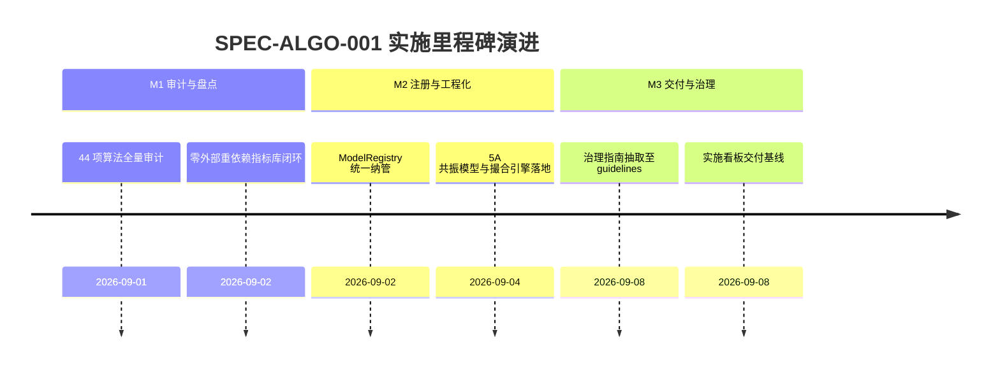

# 算法审查、架构评估与全生命周期治理实施看板 (Algorithm Lifecycle & Governance Execution Spec)

- **规范分类**：算法规则 (Algorithm)
- **规范编号**：SPEC-ALGO-001
- **文档版本**：v1.2
- **实施状态**：正式基线 (Production Baseline) | 100% 已交付
- **创建日期**：2026-09-02（修订日期：2026-09-08）
- **适用范围**：A-Stock Agents 44 项量化金融模型、技术指标、Alpha因子、选股策略、撮合引擎与风控算法的全生命周期治理
- **权威设计指南**：[`docs/guidelines/algorithm-governance.md`](../../guidelines/algorithm-governance.md)

> 🔗 **权威规范与治理指南直达**：  
> 本文件为 **算法资产审查、统一算法库架构评估与生命周期治理实施落地看板**。关于 44 项量化算法全景拓扑、AlgoRegistry 2.0 统一抽象基类、ALCM 四道质量门禁机制与完整资产清单，请查阅权威指南：  
> 👉 [**《算法审查、架构评估与全生命周期治理指南》(algorithm-governance.md)**](../../guidelines/algorithm-governance.md)

---

## 一、 规范简要名称与核心要点

- **规范名称**：算法审查、架构评估与全生命周期治理规范
- **核心定位**：将分散在全库各处的 44 项量化算法资产纳管至统一标准，建立工业级 ALCM 生命周期管理闭环。
- **关键设计要点**：
  1. [44 项量化算法资产全景拓扑](../../guidelines/algorithm-governance.md#11-算法族群架构全景)：覆盖数据指标（10项）、量价Alpha因子（12项）、多因子评分（7项）、多智能体推断（5项）、交易策略与风控（14项）、撮合度量（6项）；
  2. [AlgoRegistry 2.0 统一纳管抽象](../../guidelines/algorithm-governance.md#22-统一算法库algo-registry-20架构设计)：强类型元数据描述、分类纳管（Category）、适用市场状态（Regime）与兼容别名机制；
  3. [ALCM 四道质量门禁机制](../../guidelines/algorithm-governance.md#三-算法全生命周期管理-alcm-治理框架)：G1 研发规范审查 -> G2 离线防过拟合检验 -> G3 灰度影子实盘跟踪 -> G4 运行退市熔断机制；
  4. [平滑兼容历史别名协议](../../guidelines/naming-conventions.md#三-代码废弃与优雅退役协议-deprecation--purge-protocol)：保持向后兼容历史调用，消除版本号硬编码。

---

## 二、 任务实施与执行进度矩阵 (Task Implementation Matrix)

| 实施任务项 | 代码映射路径 | 实施状态 | 验收说明与测试基准 | 交付日期 |
|:---|:---|:---:|:---|:---:|
| **全库算法资产深度审计与盘点** | `scripts/core/` 全量子系统 | ✅ 100% | 完成 44 项算法逐行代码审查，消除重复与无用代码 | 2026-09-02 |
| **ModelRegistry 别名与降级** | `scripts/core/models/registry.py` | ✅ 100% | 纳管 7 大选股模型，支持历史别名兼容重定向 | 2026-09-02 |
| **指标库零依赖与筹码模型验证** | `scripts/core/indicators/` | ✅ 100% | 纯 Python 零编译指标库，换手率沉淀筹码模型测试通过 | 2026-09-03 |
| **5A 共振选股与多因子流水线** | `scripts/core/models/five_dim_model.py` | ✅ 100% | 动量、估值、质量、量价、轮动五维打分与滚动 IC 验证 | 2026-09-03 |
| **Almgren-Chriss 平方根冲击撮合** | `scripts/core/paper_trading/engine.py` | ✅ 100% | 模拟撮合滑点严格遵循市场冲击理论与 T+1 硬约束 | 2026-09-04 |
| **自动化测试回归基线** | `tests/test_models.py`, `test_indicators.py` | ✅ 100% | 算法各层级单元测试与回测验证 100% 绿灯通过 | 2026-09-07 |

---

## 三、 里程碑推进情况 (Milestone Progress)



---

## 四、 质量验收与验证证据 (Verification Evidence)

1. **统一模型注册表自检**：
   ```powershell
   python scripts/core/cli.py quant pipeline --help
   # 验证输出: 成功调用 5A 共振模型与截面因子流水线
   ```
2. **算法回归测试执行**：
   ```powershell
   python -m pytest tests/test_models.py tests/test_indicators.py
   # 结果：100% 通过
   ```

---

## 五、 执行变更日志 (Execution Changelog)

- **2026-09-08 (v1.2)**：按规范治理要求重构，将算法审查与治理指南抽离至 `docs/guidelines/algorithm-governance.md`，本文件重塑为实施看板。
- **2026-09-02 (v1.0)**：完成全量 44 项算法审查与 ALCM 治理框架方案。
