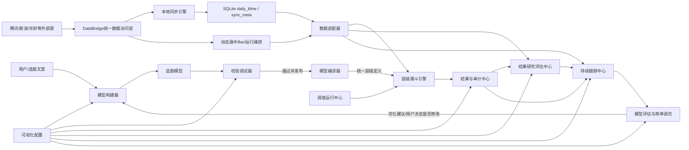
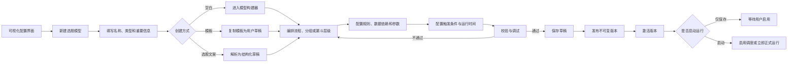
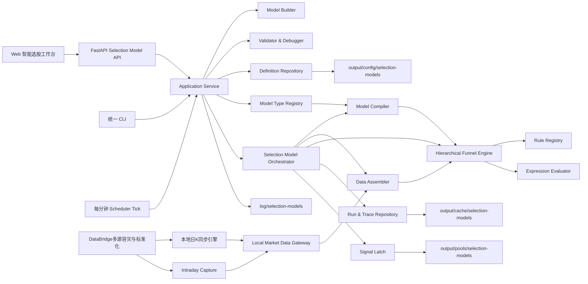
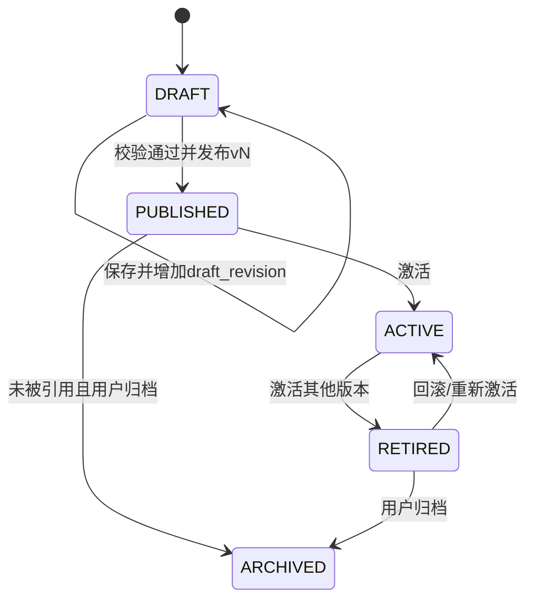
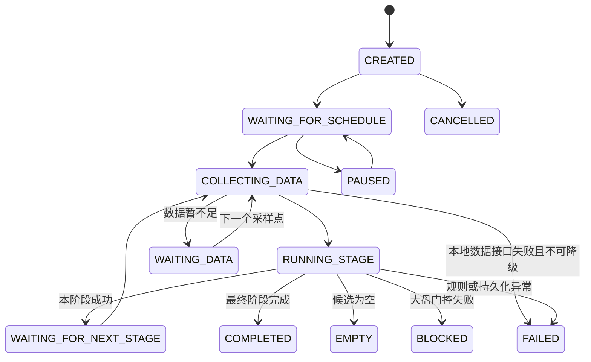
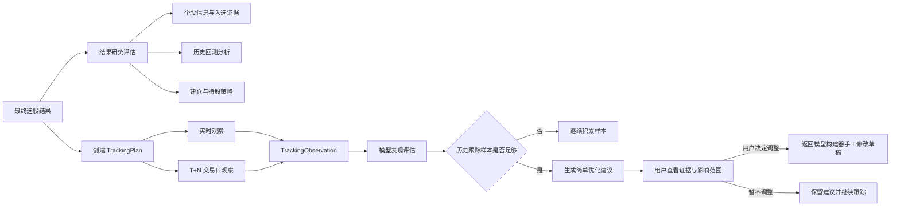

# 智能选股系统功能建设规范

- **规范编号**：SPEC-ALGO-ISS-001
- **文档版本**：v1.8
- **文档状态**：待评审 / 待实施
- **创建日期**：2026-09-18
- **最后更新**：2026-09-19
- **适用范围**：选股模型、模型构建器、层级漏斗引擎、结果研究评估、持续跟踪、模型调优、可视化配置、校验调试器、本地行情数据接口、任务调度、FastAPI、Web 工作台、测试与运维
- **关联基线**：`config/funnel_strategy.yaml`、`scripts/core/strategy/funnel_engine.py`、`scripts/core/strategy/stock_funnel.py`
- **数据权威规范**：`docs/guidelines/data/market-data-api-specification.md`、`docs/guidelines/data/market-data-sync-specification.md`、`docs/specs/data/market-data-sync-implementation-plan.md`

> 本文是“智能选股系统”核心编码与配套 Web 交互开发的实施依据。系统面向多类型选股模型；“漏斗选股”是其中一种复杂模型，而不是系统本身。文中“已具备”代表当前仓库已有能力；“待建设”代表不能在界面或接口中显示为已完成、已启用或运行成功。

---

## 1. 系统定义与建设背景

### 1.1 系统定义

**智能选股系统（Intelligent Stock Selection System，ISS）** 是一个面向A股研究场景的配置化选股平台。它把选股思想抽象为可保存、可执行、可调试、可调度、可追溯的“选股模型”，让用户无需为每套策略重新编写代码，即可通过规则组合、维度分组、漏斗层级和触发条件构建自己的选股流程。

系统中的“智能”主要来自：

1. 多维数据和规则的结构化组合；
2. 不同选股模型类型的自动运行；
3. 时间、数据、条件和事件驱动的流程编排；
4. 缺失数据识别、规则校验、失败诊断和结果解释；
5. 可选的自然语言文案转模型草稿能力。

“智能”不代表黑盒荐股或收益保证。自然语言或模型自动生成的配置只能作为草稿，必须经过结构校验、数据可用性校验、调试预演和用户确认后才能激活。

### 1.2 核心模块定义

| 模块 | 定义 | 核心职责 |
|---|---|---|
| **选股模型** | 用户选股逻辑的版本化领域对象 | 保存模型类型、名称、规则、结构、触发器、输入输出和运行策略 |
| **模型构建器** | 创建和编辑选股模型的统一构建能力 | 支持空白创建、模板复制、文案生成草稿、条件分组和漏斗层级编排 |
| **模型编译器** | 用户模型与统一运行结构之间的转换层 | 把条件树、漏斗、评分排序等模型编译成标准层级定义并执行静态检查 |
| **层级漏斗引擎（Hierarchical Funnel Engine，HFE）** | 驱动所有选股模型层级运行的统一核心引擎 | 执行层级调度衔接、规则计算、逻辑求值、候选传递、状态收敛和运行追踪 |
| **可视化配置** | Web 端模型设计与管理界面 | 模型中心、创建向导、条件树、漏斗画布、规则和触发器属性抽屉 |
| **校验调试器** | 配置准入和可解释调试能力 | 完成语法、Schema、跨字段、数据依赖和调度校验，支持规则/节点/整模预演 |
| **规则与触发器中心** | 规则类型和触发类型的注册中心 | 提供元数据、参数Schema、字段依赖、运行函数和Web表单描述 |
| **统一行情数据子系统** | 独立于智能选股系统的数据上游 | 由 `DataBridge`、本地同步引擎、SQLite日K库、动态盘中Bar和本地指标引擎组成，负责多源容灾与统一字段 |
| **数据装配器** | 统一行情数据与模型输入之间的适配层 | 对定盘本地数据和已捕获盘中数据形成运行快照，执行字段映射、水位、完整性和新鲜度检查 |
| **调度运行中心** | 交易日自动运行与状态管理模块 | Scheduler Tick、交易日历、幂等锁、任务恢复、运行状态机 |
| **结果与审计中心** | 结果交付和全链路追溯模块 | 保存候选、淘汰原因、信号、配置快照、运行日志和审计事件 |
| **结果研究评估中心** | 对最终候选进行二次研究分析的模块 | 生成个股信息、入选证据、历史回测、风险画像、建仓与持股策略 |
| **持续跟踪中心** | 对入选股票建立实时或T+N观察任务的模块 | 记录后续实际走势、收益路径、最大有利/不利波动、相对基准表现和事件变化 |
| **模型评估与简单调优** | 基于历史运行及其后续跟踪结果评价模型的模块 | 汇总后续表现、定位可能问题并生成可解释的参数或规则优化建议 |

### 1.3 模块关系



统一行情数据子系统是独立上游，不属于智能选股系统的运行内核。选股业务代码不得直接访问外部行情端点，只能调用 `LocalMarketDataGateway/DataBridge`。收盘和历史筛选严格使用已定盘的本地 SQLite 数据；盘中层级如需实时快照或分钟数据，由统一数据层完成容灾获取并先写入运行捕获快照，再交给层级漏斗引擎计算。

### 1.4 建设背景

当前工程已经具备配置驱动的单阶段漏斗执行能力，可从 YAML 读取阶段与规则，对候选股票执行过滤，输出通过记录、淘汰原因与规则指标。这只能视为智能选股系统的首个模型原型。系统还需要支持条件选股等其他模型，并允许用户从零创建、命名、编辑和发布自己的选股模型。

以用户提出的规则文案为例，用户应能新建一个类型为“漏斗模型”、名称为“xxx模型”的选股模型，自行增加收盘初筛、大盘门控、高开过滤、早盘拐点四个层级，为每层配置规则和触发时间或触发条件，保存草稿、发布并激活后形成可运行的四层漏斗，而不是由开发者为每个新策略编写一套固定代码。

当前距离可供用户长期使用的完整功能仍缺少以下闭环：

1. YAML 中的 `schedule` 目前只是说明字段，没有调度器读取和执行；
2. CLI 每次只能手工运行一个阶段，尚无整条漏斗状态机；
3. 当前仅日K和同步元数据形成正式持久化基线；分钟序列、资金、证券主数据和盘口与层级输入之间尚无完整、可审计的数据装配契约；
4. 交易日只按周一至周五判断，未覆盖法定节假日和临时休市；
5. 部分分钟拐点计算窗口仍硬编码，尚不能完全通过配置调试；
6. 配置校验只覆盖基础结构，尚无规则级参数 Schema；
7. Web 尚无漏斗编排、参数调试、运行追踪、调度健康和信号查看界面。
8. 尚无选股模型类型注册中心，无法统一承载条件选股、漏斗选股及后续评分排序模型；
9. 尚无用户自建模型向导、模型命名、草稿、发布和复制模板流程；
10. 条件选股尚无“维度分组 + AND/OR/NOT嵌套逻辑”的安全表达式模型。

本项目需要在保留“核心能力就地运行、统一 CLI、真实数据、不伪造成功、用户数据只落 `output/`”的前提下，把现有原型升级为完整的智能选股系统。

---

## 2. 建设目标与非目标

### 2.1 建设目标

1. **模型类型可扩展**：平台统一支持条件选股、漏斗选股，并能把新的评分排序或组合模型编译成标准层级定义。
2. **用户可自建模型**：用户选择模型类型、输入模型名称、从空白或模板开始构建并保存为自己的模型。
3. **层级可配置**：漏斗模型支持新增、删除、复制、启停、排序层级；条件模型支持新增和嵌套维度组，并可编译成单层或多层漏斗。
4. **规则可配置**：规则的字段、运算符、周期、阈值、组合关系和缺失数据策略均可调整。
5. **规则可调试**：支持单规则、单分组/阶段和完整模型三种调试粒度，展示观测值、期望值、失败原因和数据来源。
6. **流程可编排**：系统按模型定义自动执行，并正确处理全局门控、候选过滤、逻辑分组、空结果与执行失败。
7. **触发器可配置**：阶段可由固定时间、时间窗口、上游完成、数据就绪、市场条件、事件或手工操作触发。
8. **任务可调度**：收盘后初筛、次日大盘门控、开盘过滤、分钟采样和拐点检测可以按交易日自动运行。
9. **结果可追溯**：每一次运行保留模型类型、模型版本、配置快照、数据时间、数据来源、候选变化和最终信号。
10. **Web 可操作**：用户可以在 Web 中自建模型、编排规则、验证配置、启动/暂停调度、查看运行过程和导出结果。
11. **扩展不破坏内核**：新增模型类型和规则类型通过注册机制接入，不在 Web、API 或调度层复制量化算法。
12. **本地快照运行**：收盘筛选和历史回放读取已定盘的本地 SQLite；盘中数据只能由统一 `DataBridge` 获取并先固化为本次运行的本地捕获快照，层级漏斗引擎始终只计算已装配快照，不直接抓取外部行情。
13. **结果可研究**：每个最终候选可生成截至运行时点的个股信息、入选证据、历史回测和结构化建仓持股策略。
14. **信号可跟踪**：选股结果支持盘中实时观察或按 T+N 交易日观察，形成不可覆盖的后续走势序列。
15. **模型可评价调优**：基于多次历史运行及其后续跟踪结果生成简单优化建议，但不得自动修改活动版本。
16. **模型可重复执行**：用户可在不同时间多次执行同一个已配置模型，每次执行均形成独立运行记录、数据快照和结果，可从列表进入详情。

### 2.2 非目标

- 本平台不自动提交实盘买单；最终只输出选股结果、信号股票代码和判定证据。
- 本期不承诺策略盈利，不以样本内表现代替滚动样本外验证。
- 不在前端直接访问行情供应商，不在浏览器保存数据源密钥。
- 不重复建设股票行情、K线等数据同步能力；外部数据采集、清洗和落库由独立的本地行情数据同步系统负责。
- 不允许用静态演示候选、模拟运行状态或前端定时器伪造后端任务成功。
- 不把用户自定义策略写回版本控制目录 `config/`；`config/` 只保存系统默认模板。
- 不把单只股票一次涨跌直接解释为模型有效或失效，不根据少量样本自动调参。
- 不自动提交建仓、加仓、减仓或卖出订单；建仓与持股策略属于可解释的研究决策支持。
- 不把“后续走势分析”描述为确定性预测；系统记录实际路径，并可输出带前提、置信度和失效条件的情景判断。

---

## 3. 选股模型类型与用户自建流程

### 3.1 模型类型注册中心

平台通过 `SelectionModelTypeRegistry` 注册模型类型。每个类型必须声明配置 Schema、可用节点、编译器、调试器、Web 编辑器能力和输出契约。模型类型不再绑定独立运行引擎；所有模型必须先编译成统一层级中间结构，再由层级漏斗引擎执行。

首期模型类型：

| 类型 | ID | 结构 | 典型用途 | 首期状态 |
|---|---|---|---|---|
| 条件选股 | `condition_tree` | 多维度规则组 + 布尔表达式树 | 同一时点按技术面、基本面、行业面、资金面、消息面筛选 | P0 |
| 漏斗选股 | `funnel` | 多阶段逐层收缩 + 阶段触发器 | 收盘候选跨时段传递至次日开盘确认 | P0 |
| 评分排序 | `scoring_rank` | 因子评分 + 权重 + Top-K | 多因子综合评分与排名 | P2 |
| 组合模型 | `composite` | 引用其他模型输出并做集合运算 | 多模型交集、并集、排除与二次排序 | P2 |

新增模型类型不得修改已有模型定义；通过注册中心提供后向兼容的插件式扩展。

统一关系如下：

| 用户侧模型类型 | 编译结果 | 统一运行方式 |
|---|---|---|
| 条件选股 | 单层或多层，每层包含安全逻辑表达式树 | 层级漏斗引擎逐层执行 |
| 漏斗选股 | 多个有序层级及阶段触发器 | 层级漏斗引擎逐层执行 |
| 评分排序 | 过滤层、评分层、排序层和输出层 | 层级漏斗引擎按节点类型执行 |
| 组合模型 | 子模型输入、集合运算层和汇总层 | 层级漏斗引擎按依赖图执行 |

### 3.2 条件选股模型

条件选股由一个或多个维度组组成。首期内置维度包括：

- 技术面：均线、突破、量能、MACD、波动率、形态；
- 基本面：盈利、成长、估值、现金流、财务风险；
- 行业面：行业归属、行业强度、行业资金、主线排名；
- 资金面：主力净流入、北向、换手、量比、筹码；
- 消息面：公告、新闻、事件、舆情时效；
- 市场面：指数趋势、情绪、涨跌停结构；
- 风险面：ST、退市、停牌、流动性、异常交易；
- 自定义：由已注册字段和规则组成，不允许执行任意代码。

逻辑使用安全表达式树，不接受字符串 `eval`：

```yaml
model_type: condition_tree
groups:
  - id: technical
    name: 技术面
    logic: all
    rules: []
  - id: industry
    name: 行业面
    logic: any
    rules: []
  - id: news
    name: 消息面
    logic: all
    rules: []
expression:
  op: and
  children:
    - ref: technical
    - op: or
      children:
        - ref: industry
        - ref: news
    - op: not
      child: {ref: risk}
```

支持 `AND`、`OR`、`NOT` 和嵌套分组。Web 通过可视化组块生成 AST，后端负责最终校验与执行。

条件选股本质上是层级漏斗的一种简化建模方式：简单条件模型可编译成一个过滤层，按业务维度拆分的条件模型可编译成多个顺序层。逻辑运算的叶子是原子规则，参与 AND/OR/NOT 求值的是规则产生的 `PASS/FAIL/UNKNOWN` 条件结果。

顺序层级之间天然表示“通过上一层 AND 通过下一层”。类似 `(A AND B) OR (C AND D)` 的表达式必须放在同一层的嵌套逻辑树中；首期不允许用普通顺序层表达跨层 OR。后续如需跨层并行与合并，必须增加显式分支/合并节点，不能隐式改变候选传递语义。

### 3.3 漏斗选股模型

漏斗选股由有序层级构成，每层接收上游候选并输出更小的候选集合。层级除规则外，还必须定义触发器：

| 触发器 | ID | 示例 |
|---|---|---|
| 固定交易时间 | `trading_time` | 每个交易日15:35之后（定盘数据仍需另行校验） |
| 时间窗口轮询 | `interval_window` | 09:36～09:40每60秒 |
| 上游完成 | `upstream_completed` | 收盘初筛成功后 |
| 数据就绪 | `data_ready` | 已取得至少6个分钟点 |
| 条件触发 | `condition` | 大盘门控通过且候选非空 |
| 事件触发 | `event` | 新公告、股池更新 |
| 手工触发 | `manual` | 用户点击调试或正式运行 |

条件触发器同样使用受限 AST 和注册字段，禁止任意 Python 表达式。

“条件选股”和“漏斗选股”的区别保留在模型构建体验、默认模板和约束规则中，不再形成两套运行时：前者强调维度分组和逻辑树，后者强调候选传递、跨时段层级和阶段触发，二者最终都由模型编译器生成标准层级定义。

### 3.4 用户自建模型生命周期



用户输入的“xxx模型”是显示名称；系统同时生成不可变的 `model_id`。名称可以修改，ID不随名称变化。

选股文案生成只负责把自然语言转换成待确认草稿，并同时返回无法确定的歧义项。例如“高开1～2%以上，只要高开都行”必须提示用户确认上下限，不允许系统静默选择口径。生成草稿不得自动激活、自动调度或直接产生正式信号。

完整建模过程分为八个阶段：

| 阶段 | 用户操作 | 系统产物与约束 |
|---|---|---|
| 1. 创建 | 在可视化界面填写名称、类型、说明、市场范围等信息 | 创建稳定 `model_id` 和可编辑草稿 |
| 2. 构建 | 在模型构建器中编排条件组、逻辑树或漏斗层级 | 形成类型匹配的流程结构 |
| 3. 配置 | 为节点添加规则、参数、数据依赖、缺失数据策略 | 形成可执行规则定义，不接受任意代码 |
| 4. 触发 | 配置运行时间、时间窗口、上游完成、数据就绪或事件条件 | 形成结构化触发器和调度定义 |
| 5. 校验调试 | 执行静态校验、单规则调试、单节点调试和整模预演 | 输出错误定位、候选变化和规则证据 |
| 6. 保存 | 保存当前编辑内容 | 更新可编辑草稿，不影响活动版本和既有运行 |
| 7. 发布 | 将校验通过的草稿发布为新版本 | 发布版本不可变，草稿不能参与正式运行 |
| 8. 激活启动 | 激活指定版本并启用调度，或执行一次正式运行 | 创建运行实例，后续全程绑定该版本快照 |

“保存”“发布”“激活”“启动”必须是不同动作：保存允许保留未完成草稿；发布必须通过准入校验；激活只切换模型的正式版本；启动才会创建运行实例或启用自动调度。界面不得用一个含糊的“保存并运行”按钮绕过这些状态。

### 3.5 四层漏斗示例的形成过程

用户选择“漏斗选股”，命名为“xxx模型”，从空白模型依次创建：

1. `post_close`：收盘后技术、资金、风险初筛，最早15:35且所需本地数据水位全部就绪后触发；
2. `market_gate`：次日大盘MA20门控，触发时间09:30；
3. `opening_gap`：高开区间过滤，触发时间09:31且要求大盘门控通过；
4. `turning_point`：回调与供需拐点，触发条件为09:36～09:40且分钟数据就绪。

保存草稿、发布并激活后，该用户模型形成当前四层漏斗示例。系统默认模板只是帮助用户快速创建，正式运行逻辑必须来自已发布且已激活的模型版本。

---

## 4. 当前能力审查基线

| 能力 | 当前状态 | 建设结论 |
|---|---|---|
| 模型类型注册中心 | 未具备 | 新建统一注册中心，首期支持条件与漏斗模型 |
| 用户自建和命名模型 | 未具备 | 新建创建向导、草稿、版本、激活和复制流程 |
| 条件选股维度组 | 未具备 | 建设技术面、基本面、行业面、资金面、消息面等分组 |
| AND/OR/NOT逻辑树 | 未具备 | 使用安全AST，不接受任意表达式执行 |
| 阶段列表增删与排序 | 已具备 YAML 结构 | 保留并增加 Schema、版本和迁移机制 |
| 阶段启停 | 已具备 `enabled` 读取 | Web 提供显式开关并显示影响 |
| 阶段组合逻辑 | 已具备 `all/any` | 增加嵌套规则组能力 |
| 阶段作用域 | 仅 `candidate_filter/universe_gate` | 扩展数据采样、评分和输出阶段，或以 Hook 表达 |
| 规则阈值调整 | 大部分已具备 | 补齐类型、范围、默认值和说明 Schema |
| 分钟拐点调参 | 部分可配置 | 移除最近2分钟、均价3点等硬编码窗口 |
| 配置校验 | 基础校验 | 增加规则级、跨字段和调度级校验 |
| 单阶段 CLI | 已具备 | 保留并增加 `run-all/debug/tick` |
| 自动数据装配 | 未具备 | 新建本地数据网关、DataAssembler 与数据水位检查器 |
| 自动调度 | 未具备 | 新建 Scheduler Tick 与交易日历门控 |
| Web 配置界面 | 未具备 | 新建策略工作台 |
| 运行审计 | 部分具备 JSON 证据 | 增加持久化运行、阶段和信号模型 |

---

## 5. 用户角色与典型场景

### 5.1 模型创建者与策略使用者

- 点击“新建选股模型”，选择条件选股或漏斗选股；
- 输入“xxx模型”等自定义名称；
- 从空白模型新增维度组、层级、规则和触发器；
- 从默认模板复制一套漏斗；
- 把20日新高改为60日新高；
- 把高开1%～2%改为只要求高开；
- 启动每日调度；
- 在不同时间多次手工执行同一个已配置模型；
- 从运行记录列表查看每次执行的时间、状态和结果，并点击进入完整运行详情；
- 在09:35～09:40查看最终代码与拐点证据。

### 5.2 策略研究者

- 组合技术面、行业面、消息面等维度，通过 AND/OR/NOT 调整条件模型；
- 新增或删除一层；
- 调整卖压衰减、主动买量和盘口比例；
- 用历史样本或上传的 JSON 调试单条规则；
- 比较两个策略版本的候选变化；
- 发起滚动样本外验证。

### 5.3 系统管理员

- 查看调度执行器是否在线；
- 检查本地行情同步系统健康度、数据水位、任务积压和失败率；
- 暂停全部自动任务；
- 审计谁修改了策略、何时启用、运行了哪个版本。

---

## 6. 总体架构



### 6.1 依赖原则

- Web 和 API 只调用应用服务，不复制规则算法；
- 调度器只负责判断“现在该执行什么”，不计算交易规则；
- 模型编译器负责把不同建模方式转换为标准层级，不直接读取行情或产生选股结果；
- 层级漏斗引擎是唯一正式模型运行内核，不为条件模型和漏斗模型维护两套执行链；
- 数据装配层只调用统一行情数据网关：盘后/历史采用 `finalized_local`，盘中采用 `intraday_capture`；它不实现供应商协议或容灾逻辑；
- 规则函数保持纯计算，便于单元测试和回放；
- 用户配置、运行状态、最终结果和日志严格遵守三桶规范。

---

## 7. 配置模型设计

### 7.1 模型定义

```yaml
schema_version: 2
model:
  id: close_to_open_turning_point
  name: 收盘突破至早盘拐点漏斗
  model_type: funnel
  version: 3
  enabled: true
  timezone: Asia/Shanghai
  exchange_calendar: CN_STOCK
  description: 收盘后筛选，次日早盘确认供需拐点

data_requirements:
  - id: morning_intraday_data
    type: intraday_capture_readiness
    datasets: [quote_snapshot, minute_bar, order_book]
    max_lag_seconds: 10
    schedule:
      type: interval_window
      trading_days_only: true
      start: "09:30"
      end: "09:40"
      every_seconds: 60

stages:
  - id: post_close
    name: 收盘后硬条件初筛
    enabled: true
    order: 10
    scope: candidate_filter
    logic: all
    schedule:
      type: after_time_and_data_ready
      trading_days_only: true
      earliest_at: "15:35"
      datasets: [daily_kline, sync_meta]
      integrity_required: healthy
    input_binding: market.daily_universe
    missing_data_policy: reject
    rules: []
```

### 7.2 统一层级中间结构

模型编译器输出不可变的 `CompiledSelectionPlan`。层级漏斗引擎只接收该结构，不直接解释条件模型、漏斗模型或 Web 草稿：

```yaml
compiled_plan:
  plan_schema_version: 1
  engine: hierarchical_funnel
  source_model:
    model_id: close_to_open_turning_point
    model_type: funnel
    model_version: 3
  plan_hash: sha256:...
  stages:
    - id: post_close
      kind: filter
      order: 10
      input: market.daily_universe
      trigger:
        type: after_time_and_data_ready
        earliest_at: "15:35"
        datasets: [daily_kline, sync_meta]
        integrity_required: healthy
      data_requirements:
        - dataset: security_master
          as_of: stage_time
        - dataset: daily_bar
          lookback: 61
          adjustment: qfq
        - dataset: money_flow
          as_of: stage_time
      expression:
        op: and
        children:
          - rule: rolling_high
            params: {field: close, lookback: 20}
          - rule: above_rising_ma
            params: {field: close, period: 60}
      missing_data_policy: reject
      output: post_close.candidates
```

编译契约：

1. 相同模型版本和相同编译器版本必须生成相同 `plan_hash`；
2. 条件模型的维度组被展开或引用为层内表达式节点，简单模型通常生成一个 `filter` 层；
3. 漏斗模型的用户层级按依赖和顺序编译为多个 stage；
4. `all/any` 只是 `and/or` 的编辑器快捷写法，运行时统一使用表达式 AST；
5. 层内表达式支持 `AND/OR/NOT` 和 `PASS/FAIL/UNKNOWN` 三态求值；
6. 普通顺序层之间只做候选传递，语义上等价于逐层 AND；跨层 OR 必须使用未来的显式分支/合并节点；
7. 编译结果必须保存来源模型版本、编译器版本、规则版本和计划哈希，供运行复现和审计；
8. 任何无法解析的规则、数据集、触发器或节点类型都必须在发布阶段失败，不能延迟到正式运行时猜测处理。

首期层级类型包括 `filter`、`gate` 和 `output`；`score`、`rank`、`branch`、`merge` 在对应执行器实现前只能被编译器拒绝，不能显示为可运行。

### 7.3 层级配置能力

每一层必须支持：

| 字段 | 说明 |
|---|---|
| `id/name` | 稳定标识与显示名称 |
| `enabled` | 是否参与运行 |
| `order` | 执行顺序，不依赖 YAML 物理顺序 |
| `scope` | `candidate_filter`、`universe_gate`、`scoring`、`output_gate` |
| `logic` | `all`、`any`，后续支持嵌套规则组 |
| `schedule` | 结构化调度定义 |
| `input_binding` | 输入数据集或上一阶段输出 |
| `missing_data_policy` | `reject`、`wait`、`skip_rule`、`fail_stage` |
| `on_empty` | `stop_pipeline`、`continue_empty` |
| `on_failure` | `stop_pipeline`、`retry`、`mark_degraded` |

### 7.4 规则配置能力

所有规则类型必须在注册表中声明以下元数据：

```json
{
  "type": "rolling_high",
  "label": "滚动新高",
  "category": "日线技术",
  "description": "最新收盘价是否突破此前N个交易日高点",
  "parameter_schema": {
    "field": {"type": "field_ref", "required": true},
    "lookback": {"type": "integer", "min": 2, "max": 500, "default": 20},
    "strict": {"type": "boolean", "default": true}
  },
  "required_inputs": ["closes"],
  "output_metrics": ["current", "previous_high"]
}
```

Web 表单必须由 `parameter_schema` 动态生成，不为每一种规则硬编码独立表单。

### 7.5 拐点规则参数化

现有硬编码窗口必须迁移至配置：

```yaml
- id: pullback_supply_demand_turn
  type: intraday_turning_point
  params:
    window_start: "09:30"
    window_end: "09:40"
    pullback_end: "09:35"
    confirm_start: "09:35"
    min_points: 6
    price_reversal:
      comparison_points: 2
      moving_average_points: 3
    pressure_windows:
      baseline_points: 2
      recent_points: 2
    min_pullback_pct: 0.20
    max_pullback_pct: 2.00
    max_sell_ratio: 0.75
    min_buy_ratio: 1.20
    min_book_ratio: 1.20
    required: [pullback, price_reversal, sell_exhaustion]
    confirmations: [buy_strengthening, book_support]
    min_confirmations: 1
```

### 7.6 配置存储与版本控制

- 系统默认模板：`config/funnel_strategy.yaml` 等内置模板，只读；
- 用户模型：`output/config/selection-models/<model_id>/definition-v<N>.yaml`；
- 编译计划：`output/config/selection-models/<model_id>/plan-v<N>.json`；
- 编辑草稿：`output/config/selection-models/<model_id>/draft.yaml`，不参与正式调度；
- 当前启用版本：`output/config/selection-models/<model_id>/active.json`；
- 保存只更新用户草稿；校验通过并执行“发布”时才创建不可变版本；
- 已发布版本不允许原地覆盖，修改后必须发布为新版本；
- 每次运行保存完整配置快照与哈希；
- 旧 Schema 必须通过显式迁移器升级，禁止静默丢字段。

版本对象采用以下标识：

| 字段 | 说明 |
|---|---|
| `model_id` | 模型稳定ID，重命名不会改变 |
| `version` | 模型内单调递增整数，界面显示为 `v1`、`v2` |
| `base_version` | 草稿或新版本来源版本；从空白创建时为 `null` |
| `draft_revision` | 草稿每次保存递增，用于并发编辑冲突检测 |
| `definition_hash` | 已发布定义内容哈希，发布后永久不变 |
| `compiler_version` | 生成统一层级计划所使用的编译器版本 |
| `plan_hash` | 编译后 `CompiledSelectionPlan` 哈希 |
| `status` | `PUBLISHED`、`ACTIVE`、`RETIRED`、`ARCHIVED`；草稿独立存储，不属于发布版本状态 |

版本生命周期：



版本控制硬约束：

1. 一个模型可以有多个已发布版本，但同一时刻只能有一个活动版本；
2. 发布版本号由服务端分配，客户端不能指定或复用旧版本号；
3. 草稿必须记录 `base_version`；若活动版本或草稿修订号已变化，保存或发布返回版本冲突，禁止静默覆盖；
4. 激活旧版本就是回滚，只移动活动版本指针，不复制、不修改旧版本；
5. 新运行在创建时读取活动版本并固定 `model_version/definition_hash/plan_hash`；运行中切换活动版本不影响该运行及其后续层级；
6. 定时任务在创建 `SelectionModelRun` 时确定版本，不能在跨时段执行中途自动升级；
7. `NodeRun`、`CandidateTrace`、`SignalEvent`、`ResultAssessment`、`TrackingPlan`、`ModelEvaluation` 和 `OptimizationSuggestion` 必须能够追溯到来源 `run_id` 和模型版本；
8. 模型评估默认只汇总同一版本；跨版本数据只能进入显式“版本对比”，不得混合生成单版本优化建议；
9. 优化建议固定引用 `source_model_version`；活动版本变化后建议标记为 `STALE`，不能假定仍适用于新版本；
10. 所有已发布版本禁止物理删除；非活动版本可以归档，但定义、哈希及引用关系必须永久保留；
11. Schema迁移必须生成新版本或新的可审计派生记录，不得原地改写历史版本；
12. 发布和激活必须在模型级锁内原子完成；`active.json` 保存活动版本、指针修订号、操作者和更新时间，失败时不得留下半发布状态；
13. 每次激活、回滚、归档、草稿覆盖冲突和版本迁移都写入审计日志。

---

## 8. 规则校验与调试设计

### 8.1 校验分层

1. **语法校验**：YAML/JSON格式、必填字段、类型；
2. **结构校验**：阶段ID唯一、规则ID唯一、顺序无冲突；
3. **规则校验**：规则类型存在、参数满足 Schema；
4. **跨字段校验**：`min <= max`、窗口长度合理、确认项存在；
5. **流程校验**：阶段输入能够由上游或数据任务提供；
6. **调度校验**：时区、交易日历、时间窗口、执行间隔合法；
7. **可运行性校验**：所需数据字段已有注册适配器，访问模式、同步/捕获水位和运行依赖当前可用；任何 `unsupported` 依赖阻止发布或激活。
8. **数据口径校验**：标的前缀、复权、单位、交易日历、指标引擎版本和Universe覆盖率满足模型声明。

### 8.2 调试模式

| 模式 | 输入 | 输出 |
|---|---|---|
| 单规则调试 | 一只股票记录 + 一条规则 | PASS/FAIL、observed、expected、metrics |
| 单阶段调试 | 候选集 + 阶段配置 | 通过/淘汰数量、逐股失败规则 |
| 完整模型回放 | 完整历史快照 | 条件组/层级流失、最终代码、状态时间线 |
| 实时只读预演 | 本地最新可用行情快照 | 不落正式信号、不发送通知 |

调试输出必须包含：模型类型、模型版本、规则版本、输入字段、数据来源、数据时间、是否使用代理指标、缺失字段和异常堆栈摘要。

---

## 9. 选股模型运行状态机



### 9.1 运行状态

`CREATED`、`WAITING_FOR_SCHEDULE`、`COLLECTING_DATA`、`RUNNING_STAGE`、`WAITING_DATA`、`WAITING_FOR_NEXT_STAGE`、`BLOCKED`、`EMPTY`、`COMPLETED`、`FAILED`、`PAUSED`、`CANCELLED`。

### 9.2 关键语义

- 大盘门控失败使用 `BLOCKED`，不属于系统异常；
- 无候选使用 `EMPTY`，不生成替代股票；
- 分钟数据尚不足使用 `WAITING_DATA`，不能标记失败或成功；
- 只有最终阶段满足规则时才写正式 `SignalEvent`；
- 同一股票同一模型版本同一交易日只允许锁存一次正式通知信号，但每个运行实例仍需独立保存其筛选结果；
- 每次定时启动或用户手工执行都创建独立 `SelectionModelRun` 和唯一 `run_id`；
- 同一个模型及版本允许在同一交易日或不同交易日执行多次，运行记录和结果不得覆盖；
- 后续层级通过 `execution_key` 关联到所属运行实例，不得仅按模型ID或交易日查找“当天唯一运行”；
- 用户重复提交同一个客户端请求时使用 `request_id` 幂等；用户在其他时间主动再次执行应创建新运行。

### 9.3 端到端运行闭环

正式运行采用“调度触发 → 加载编译计划 → 检查定盘水位/捕获就绪 → 数据装配 → 层级执行 → 结果归并 → 审计固化”的固定主链：


运行时约束：

1. Scheduler 或手工正式运行负责触发，不由规则引擎自行决定执行时间；
2. Orchestrator 只加载已发布且已激活的版本及其编译计划，草稿、未激活版本和校验失败版本不得执行；
3. Data Assembler 按模型声明装配输入：收盘/历史数据从本地定盘库读取，盘中数据由 `DataBridge` 标准化后先写入运行捕获快照；同时记录业务时间、水位、完整性、来源、参数和算法版本；
4. 不同模型类型由 Model Compiler 转换成统一层级定义，层级漏斗引擎不再按 `condition_tree` 或 `funnel` 分叉到不同运行时；
5. 引擎每执行一个条件组、表达式节点或漏斗层级，都要原子保存输入数、输出数、淘汰数、状态、耗时和规则证据；
6. 上游结果作为下游输入，数据不足进入 `WAITING_DATA`，门控不通过进入 `BLOCKED`，候选耗尽进入 `EMPTY`；
7. 整个运行周期收敛后生成最终候选、空结果或失败结论，不得用推荐股票填补空结果；
8. 配置快照、版本哈希、触发来源、操作者、执行时间、数据来源、节点轨迹、最终结果和异常必须进入审计链；
9. 每个 `run_id` 在创建后永久绑定模型版本和配置快照，后续模型修改不能改变历史运行详情。

“层级漏斗引擎”是统一执行内核，但不替代模型构建器、模型编译器、调度器或数据装配器：构建器决定用户如何配置，编译器决定配置如何转换，调度器决定何时运行，数据装配器决定本次运行看到哪一个本地数据快照，层级漏斗引擎负责按计划执行并传递候选。

---

## 10. 定时调度建设

### 10.1 调度原则

采用“**一个固定 Scheduler Tick + 配置决定阶段触发**”模式。操作系统只需每分钟调用一次固定入口，修改策略层数或时间不需要重新编辑 crontab。

统一入口：

```bash
./bin/astock screen-model tick --json
```

目标 crontab：

```cron
CRON_TZ=Asia/Shanghai
* * * * 1-5 cd /absolute/path/a_stock_agents && /absolute/path/venv/bin/python scripts/core/cli.py screen-model tick --json >> log/selection-models/tick.log 2>&1
```

Windows 使用任务计划程序每分钟调用 `bin\astock.ps1 screen-model tick --json`。Web 只管理应用内的模型调度定义，不直接拼接任意 shell 命令。

### 10.2 Tick 执行步骤

1. 获取上海时区当前时间；
2. 查询中国证券交易日历；
3. 获取所有启用选股模型、模型类型及活动版本；
4. 根据结构化 `schedule` 计算到期层级，并检查其声明的定盘水位或盘中捕获就绪条件；
5. 生成幂等键并获取策略运行锁；
6. 按 `execution_key` 查找所属活动运行；若当前触发是新的起始触发，则创建新的 `SelectionModelRun`；
7. 以 `finalized_local` 或 `intraday_capture` 模式形成一致性运行快照，再执行到期层级；
8. 原子写入运行状态、候选轨迹和信号；
9. 更新调度心跳、耗时、下一次运行时间；
10. 释放锁。

### 10.3 默认时间表

| 时间 | 类型 | 行为 |
|---|---|---|
| 15:35之后 | 数据就绪后一次 | 等待全目标股票本地日K定盘且完整性达标，再执行 `post_close` |
| 09:30～09:40 | 每60秒 | 通过统一数据层捕获分钟线与盘口快照，固化后装配候选输入 |
| 09:30 | 一次 | 执行 `market_gate` |
| 09:31 | 一次 | 执行 `opening_gap` |
| 09:36～09:40 | 每60秒 | 执行 `turning_point`，命中后锁存代码 |

### 10.4 交易日与时区

- 使用权威交易日历，不以 `weekday() < 5` 作为最终判断；
- 日历不可用时，盘中自动任务默认失败关闭，不得猜测开市；
- 所有调度使用 `Asia/Shanghai`；
- Web 显示服务器时间、交易所时间及二者偏差；
- 收盘日与信号日分别保存为 `source_trade_date` 和 `signal_trade_date`。

### 10.5 幂等、锁和补偿

运行启动和层级执行使用不同幂等键：

```text
run-start:<model_id>:<model_version>:<trigger_type>:<scheduled_slot_or_request_id>
run-node:<run_id>:<job_or_node_id>:<scheduled_slot>
```

- 同一定时 `scheduled_slot` 只能创建一个运行实例；不同时间的定时触发创建不同实例；
- 每次用户手工执行生成新的 `request_id` 和 `run_id`；只有客户端重试同一 `request_id` 时返回原运行；
- 同一层级执行幂等键只能成功提交一次；
- 使用文件锁或数据库唯一约束防止多进程重复执行；
- 本地定盘数据读取和统一数据层盘中捕获允许有限重试，但选股模块不得绕过 `DataBridge` 直连供应商；
- 写信号、归档和通知不得无条件自动重试；
- 调度错过后是否补跑由阶段配置决定，早盘时效阶段默认不补跑；
- `turning_point` 已命中后继续采样，但不得撤销或重复发送已锁存信号。

---

## 11. 数据装配与输入契约

### 11.1 权威规范与当前能力审查

本章以 `market-data-api-specification.md`、`market-data-sync-specification.md` 和 `SPEC-DATA-001` 为数据事实基线。选股模型中的数据集名称是逻辑契约，不代表当前本地库已经存在同名表。当前能力矩阵如下：

分层边界遵循“基础数据层保持业务无关、业务消费契约由下游定义”：两份行情规范只负责描述通用采集、标准化、同步、存储、完整性和安全能力；本章负责定义智能选股如何解释、装配、留痕和使用这些能力。任何选股专属状态、发布门禁、Universe覆盖率或运行快照要求均不得反向写入底层通用规范。

| 逻辑数据/能力 | 当前基线 | 访问或存储形态 | 选股系统处理 |
|---|---|---|---|
| 个股/指数日K | **已具备** | SQLite `daily_kline`；`sync_meta`记录范围与完整性 | 收盘、历史、回测采用 `finalized_local` |
| 技术指标 | **已具备** | 基于原始OHLCV由本地指标引擎即时派生，不是独立同步数据集 | 保存 `indicator_engine_version`、参数和输入快照 |
| 实时行情快照 | **接口可用，未形成持久化基线** | `DataBridge` 多源容灾并标准化返回 | 盘中先写入 `intraday_capture`，再计算 |
| 分钟K | **接口/动态内存可用，未形成持久化基线** | `DataBridge` 或盘中动态内存Bar | 保存实际使用的分钟点和捕获元数据 |
| 盘口/主动买卖量 | **部分源可能提供，尚无稳定本地契约** | 供应商响应或动态DTO | 注册标准适配器前视为 `unsupported` |
| 主力资金净流入 | **接口能力存在，尚无本地持久化契约** | 东方财富等L3能力 | 正式模型所需时必须先补契约或注册可审计捕获适配器 |
| 证券主数据/ST/流通市值 | **现有两份数据规范未定义** | 无权威本地Schema与水位 | “非ST、流通市值”等规则在补齐前阻止发布/激活 |
| 行业快照、公告、新闻 | **现有同步基线未覆盖** | 可能由其他能力临时提供 | 未注册成版本化输入前不得用于正式可复现运行 |

因此，原四层漏斗的算法设计成立，但以当前数据基线不能直接标记“全部可正式运行”。其中日K、新高、均线、成交量和指数日线可由本地基线支撑；`security_master`、ST、流通市值、`money_flow`、稳定盘口及主动买卖量仍是上线前置缺口。系统不得以名称、涨跌量或其他代理字段静默替代；仅当模型显式选用已注册代理规则并在证据中标记口径时才允许使用。

### 11.2 统一数据边界与访问模式

统一行情数据子系统是智能选股系统唯一数据访问边界，但“统一访问”不等于“所有数据均已本地持久化”。供应商协议和L1～L4容灾由 `DataBridge` 负责，选股模块不得复制供应商解析逻辑或直接访问外部端点。

`LocalMarketDataGateway` 对上层提供两种正式访问模式：

| 模式 | 使用场景 | 允许来源 | 运行约束 |
|---|---|---|---|
| `finalized_local` | 收盘筛选、历史回放、回测、T+N日线观察 | SQLite `daily_kline` + `sync_meta` | 仅使用15:35后已定盘且完整性达标的数据 |
| `intraday_capture` | 实时快照、高开、分钟回调、盘口确认 | 统一 `DataBridge`/动态内存Bar | 标准化数据必须先固化到本次运行快照，规则随后读取该快照 |

物理与逻辑映射遵守以下契约：

- 逻辑 `daily_bar` 映射物理表 `daily_kline`；指数日K使用同一时序契约；
- 标的统一规范化为 `sh`、`sz`、`bj`、`hk` 前缀，规则层不得自行猜测市场；
- 个股日K默认前复权 `qfq`，指数不复权，复权口径必须进入快照清单；
- 成交量单位统一为“手”，成交额统一为“元”；
- 技术指标只能基于快照中的原始OHLCV本地计算，不调用外部黑盒指标；
- 交易日判断、T+N计算、同步水位与选股调度必须共用同一 `TradeCalendar` 口径。

### 11.3 DataAssembler 职责

- 解析编译计划中的逻辑数据依赖，校验每个依赖是否为 `supported`；
- 以 `finalized_local` 批量读取目标股票和指数的 `daily_kline/sync_meta`；
- 以 `intraday_capture` 调用统一数据层，将标准化实时快照、分钟点或盘口DTO先固化后再提供给规则；
- 把物理表或API DTO转换为稳定输入，不向规则层暴露供应商或数据库私有字段；
- 记录业务时间、读取/捕获时间、来源层级、完整性、复权、单位、查询参数、算法版本和内容哈希；
- 在一致性只读事务中读取日线数据，禁止读取 `as_of` 之后的数据；
- 批量读取同类数据，避免逐股重复查询和不一致水位；
- 对全市场层级生成 `UniverseWatermark`，校验目标标的数、健康标的数、缺失标的及覆盖率；
- 数据尚未就绪时返回 `WAITING_DATA`，已确定不支持时在发布/激活阶段失败，不得由选股模块临时补数；
- 为每次运行生成不可变快照清单，并保存规则实际使用的输入切片和派生值。

### 11.4 收盘阶段输入

收盘层级最早在15:35之后，并且只有当P3目标股票池的 `UniverseWatermark` 达到模型要求时才执行；“到达时间”本身不表示数据已定盘。默认正式策略要求所需标的覆盖率100%，若产品允许降低阈值，必须在模型中显式配置并在结果页突出披露缺失范围。

```json
{
  "code": "sh600001",
  "closes": [10.01, 10.12],
  "volumes": [100000, 130000],
  "derived": {"ma60": 9.81, "rolling_high_20": 10.05},
  "field_status": {
    "daily_kline": "present",
    "security_master": "unsupported",
    "circulating_market_cap": "unsupported",
    "main_net_inflow": "unsupported"
  },
  "data_meta": {
    "data_snapshot_id": "dss_20260918_close_ab12cd",
    "access_mode": "finalized_local",
    "physical_tables": ["daily_kline", "sync_meta"],
    "adjustment": "qfq",
    "as_of": "2026-09-18T15:40:00+08:00",
    "read_at": "2026-09-18T15:40:21+08:00",
    "integrity_status": "healthy",
    "universe_watermark": {"expected": 5200, "healthy": 5200, "coverage": 1.0},
    "indicator_engine_version": "technical_indicators@<version>",
    "snapshot_manifest_hash": "sha256:..."
  }
}
```

示例中的 `unsupported` 是激活阻断证据，不是可传给规则的零值。只有补齐证券主数据和资金流契约，或用户删除相应规则，当前示例模型才能通过数据依赖准入。

### 11.5 早盘阶段输入

```json
{
  "code": "sh600001",
  "previous_close": 10.00,
  "open": 10.15,
  "minute_points": [
    {"time": "09:30", "price": 10.20, "volume": 800, "buy_volume": 500, "sell_volume": 300}
  ],
  "order_book": {"bid_volume": 1500, "ask_volume": 1000},
  "data_meta": {
    "data_snapshot_id": "dss_20260921_093700_ef34gh",
    "access_mode": "intraday_capture",
    "capture_id": "cap_20260921_093700_001",
    "provider_route": "DataBridge:L1",
    "as_of": "2026-09-21T09:37:00+08:00",
    "captured_at": "2026-09-21T09:37:02+08:00",
    "watermarks": {"minute_bar": "2026-09-21T09:37:00+08:00", "order_book": "2026-09-21T09:37:00+08:00"},
    "normalization_schema_version": 1,
    "snapshot_manifest_hash": "sha256:..."
  }
}
```

该DTO表达目标契约，不证明盘口和主动买卖量当前已经可稳定取得。捕获适配器必须先声明字段可用性、时间戳、单位和来源；字段缺失时按 `unsupported/not_ready/source_error` 处理，禁止用默认数字填充。

### 11.6 水位、完整性与缺失数据

每个字段必须区分：`present`、`not_ready`、`missing`、`stale`、`unsupported`、`source_error`。不得用 `0` 统一代替缺失值。

- `not_ready`：同步或盘中捕获尚未推进到要求水位，可在允许窗口内等待；
- `missing`：水位已到但目标记录不存在，按缺失策略处理；
- `stale`：存在记录但业务时间或更新时间超过模型允许阈值；
- `unsupported`：当前数据能力没有该字段，发布或激活必须被阻止；
- `source_error`：本地库、统一接口或其上游失败，不得伪装成空值。

`sync_meta.integrity_status` 到选股状态的映射固定为：`healthy` 且水位、新鲜度、覆盖率全部达标才是 `present`；`degraded` 进入 `WAITING_DATA`、修复或失败关闭；`unknown` 视为 `not_ready`。全市场筛选不能只检查少量成功标的，必须检查 `UniverseWatermark`。P3全市场同步属于按需任务，调度器应等待明确的数据就绪事件或查询到合格水位，不能假定15:35时已自动完成。

### 11.7 快照、复现与修复隔离

当前 SQLite Schema 没有原生“数据集版本”字段，因此 `data_snapshot_id` 由选股系统在装配时生成，不能伪称同步库已经提供版本号。快照清单至少包含：

- 数据库Schema/文件标识、查询时间、`as_of`、查询参数和目标Universe；
- `sync_meta` 的同步日期、范围、行数、完整性和更新时间；
- `UniverseWatermark`、复权口径、单位、交易日历版本；
- 盘中捕获ID、实际标准化记录、供应商路由和捕获时间；
- `indicator_engine_version`、指标参数、输入哈希、派生值和清单哈希。

同步引擎会通过 SQLite Upsert 修补历史记录，后续修复可能改变同一主键的内容。为保证历史运行不被改写，选股系统必须在运行目录保存本次实际使用的标准化输入切片、派生值和内容哈希，而不能只保存数据库主键。历史回放只能读取目标 `as_of` 当时可见的数据；若没有当时快照，只能标记为“按当前修订数据重算”，不得声称精确复现原运行。

---

## 12. 结果研究、持续跟踪与模型调优

选股完成不是运行闭环的终点。系统应把最终候选转换为可研究、可持续观察、可评价模型质量的后续任务，但必须严格区分三类结果：

1. **选股结果质量**：模型是否在目标市场环境中稳定选出具有相对优势的股票；
2. **个股后续表现**：入选后实际价格路径、风险、事件和相对基准表现；
3. **交易策略表现**：在给定入场、仓位、止盈止损和持有规则后，计入交易约束与摩擦的模拟结果。

三者不得混为同一指标。个股上涨不必然证明模型长期有效，交易策略亏损也可能来自入场和风控规则而非选股规则。



### 12.1 结果股票研究评估

每只最终候选生成 `ResultAssessment`，至少包含：

| 分组 | 内容 |
|---|---|
| 个股信息 | 代码、名称、行业、上市板、流通市值、交易状态、风险标签、截至 `as_of` 的行情和关键事件 |
| 入选解释 | 来源模型、版本、运行、命中层级、通过规则、关键观测值、同批候选排名和证据链接 |
| 技术与风险画像 | 趋势、动量、波动率、ATR、成交活跃度、跳空、回撤、流动性和停牌/涨跌停风险 |
| 历史行为 | 相似信号历史次数、T+N收益分布、最大有利波动MFE、最大不利波动MAE、最大回撤 |
| 相对表现 | 相对大盘、行业或配置基准的超额收益和胜率 |
| 建仓策略 | 允许入场时间、触发条件、禁止追高条件、建议试仓比例、最大仓位、分批规则 |
| 持股策略 | T+1约束、失效条件、初始止损、移动止损、分批止盈、最长观察期和退出条件 |

个股信息必须绑定 `assessment_as_of` 和 `data_snapshot_id`。盘后生成的报告不得使用次日数据，盘中报告不得读取报告时点之后的分钟线、公告或修订字段。

### 12.2 回测分析要求

回测分为两类，必须分别展示：

- **信号标记分析（Markout）**：不假设真实交易，只观察入选后 T+1、T+3、T+5、T+10、T+20 等交易日的开盘、收盘或VWAP收益路径；
- **交易策略回测**：应用明确的建仓、仓位、止盈止损和持有规则，模拟可成交的资金曲线与交易记录。

交易策略回测至少满足：

1. 采用逐日或更细粒度的事件驱动回测，不用最终收益直接倒推中间成交；
2. 模拟A股T+1、100股整手、停牌、涨跌停不可成交、除权复权和成交量容量约束；
3. 交易成本参数化，包括佣金及最低收费、印花税、过户费、滑点和市场冲击；
4. 输出 CAGR、最大回撤、Sharpe、Calmar、胜率、盈亏比、换手率、平均持有期、MFE和MAE；
5. 同时给出大盘和行业基准，区分绝对收益与相对超额；
6. 使用当时可见的本地数据，避免未来函数、幸存者偏差和后来修订字段；
7. 展示样本数量、统计区间、市场环境和置信区间，不用单次或极小样本下结论；
8. 参数选择与最终评价数据隔离，采用滚动样本外验证或训练/验证/测试时间切分。

### 12.3 建仓与持股策略输出

建仓与持股策略必须是结构化、可解释且可回测的 `PositionPolicy`，不能只输出自然语言“建议买入”：

```json
{
  "entry": {
    "window": "next_trade_day_09:30-10:00",
    "conditions": ["gap_pct <= 0.02", "price_above_vwap"],
    "invalid_if": ["market_gate_failed", "limit_up_unbuyable"]
  },
  "position": {
    "initial_weight": 0.05,
    "max_weight": 0.10,
    "sizing_method": "risk_budget",
    "round_lot": 100
  },
  "risk": {
    "initial_stop": "max(-5%, -2*ATR)",
    "trailing_stop": "ATR",
    "max_holding_trade_days": 10,
    "t_plus_one": true
  },
  "exit": {
    "take_profit_steps": [0.05, 0.10],
    "model_invalidation": true
  }
}
```

- 仓位必须结合账户权益、组合目标波动率、个股波动率、流动性和单股上限计算；可选风险平价或保守的分数凯利，但不得只按“看好程度”拍脑袋分配；
- 具有计划入场价和股数时，应计算包含全部费用的最低保本卖出价并向上进位至分位；
- 默认展示警戒、减仓和绝杀三级风控参考，同时允许模型模板覆盖；
- 策略输出必须显示适用前提、失效条件和数据时点，并明确属于研究方案而非自动下单指令；
- 没有账户规模、允许风险或计划成交价时，不生成伪精确股数和保本价，只输出待补充字段。

### 12.4 实时与T+N持续跟踪

每次正式选股运行可以按模型配置自动创建 `TrackingPlan`，也允许用户只跟踪部分候选。

| 模式 | 定义 | 典型用途 |
|---|---|---|
| 实时跟踪 | 从首次信号开始，按配置频率读取本地分钟线、快照和事件，直到日内窗口或跟踪周期结束 | 观察入选后的冲高、回撤、成交量和规则失效 |
| T+N跟踪 | 以信号交易日为T，按证券交易日历在T+1、T+3、T+5等观察点计算结果 | 评价模型短中期后续表现 |
| 事件跟踪 | 当本地事件数据出现公告、停复牌、风险标签或重大行情变化时记录观察 | 分析结果变化的外部原因 |

T+N中的N必须按交易日计算，不按自然日。每个观察点保存：基准价格口径、现价或收盘价、原始收益、复权收益、相对指数收益、相对行业收益、MFE、MAE、区间最大回撤、波动率、成交状态、事件和数据版本。

跟踪状态采用：`CREATED`、`ACTIVE`、`WAITING_DATA`、`COMPLETED`、`EXPIRED`、`CANCELLED`、`FAILED`。跟踪失败不能修改原始选股结果；补数只能追加新观察版本，不能覆盖已经用于评估的历史记录。

### 12.5 模型综合评估

首期模型评估以“模型ID + 模型版本 + T+N观察周期”形成批次，只统计能够由历史运行与已完成跟踪直接得到的指标：

- 纳入分析的运行次数、完成跟踪的候选数和数据完整率；
- 各T+N周期的收益均值/中位数、上涨比例、MFE、MAE和最大回撤；
- 相对大盘和行业的平均超额收益；
- 各层输入、淘汰、通过数量和候选流失率；
- 规则通过组与未通过组的后续表现差异（仅在历史轨迹数据完整时计算）；
- 按运行时间、行业或市场门控状态进行的简单分组对比；
- 不同模型版本在相同观察口径下的结果对比。

系统必须分别给出“选股模型评价”和“PositionPolicy评价”，避免把建仓时机或止损规则的问题错误归因到选股层级。

参数敏感性、截面IC、复杂漂移检测、自动寻参和高级统计检验属于后续研究能力，不作为首期简单调优的依赖。

### 12.6 基于历史跟踪的简单调优

现阶段调优只读取已完成的历史 `SelectionModelRun`、对应最终候选以及后续 `TrackingObservation`，不引入自动寻参、实验版本、压力测试或影子运行编排。系统按模型版本和观察周期汇总表现，生成 `OptimizationSuggestion`。

首期建议类型限制为：

- 某条规则过严或过松，建议调整阈值；
- 某一层候选流失异常，建议检查规则组合或缺失数据策略；
- 某个运行时间段的T+N表现持续偏弱，建议调整触发时间或观察窗口；
- 某规则通过组与未通过组后续表现差异不明显，建议降低其优先级或停用观察；
- 某行业、市值或市场环境表现显著分化，建议增加适用范围或市场门控；
- 数据陈旧、缺失或延迟与较差结果相关，建议提高数据新鲜度要求。

每条建议必须包含：来源模型及版本、统计区间、运行次数、跟踪样本数、适用T+N周期、对比指标、涉及层级/规则、建议修改项、建议值或方向、依据、风险提示和置信等级。样本不足时只显示“继续观察”，不得生成强建议。

简单调优流程为：

```text
历史运行列表
    → 关联各次运行的后续跟踪结果
    → 按模型版本和T+N周期汇总
    → 识别持续偏弱、无区分度或流失异常的层级/规则
    → 生成OptimizationSuggestion
    → 用户查看证据
    → 用户自行决定是否进入模型构建器修改草稿
```

建议只读保存，不自动创建草稿、不自动修改参数、不自动发布和激活。用户接受建议后仍按正常的“编辑草稿—校验—发布—激活”流程操作。

禁止行为：

- 根据单只股票或单次运行自动调整生产阈值；
- 把同一批历史跟踪样本上的改善描述为未来确定收益；
- 自动覆盖活动版本或追溯修改历史运行；
- 只优化收益而忽略回撤、换手、容量和成本；
- 同时提出大量相互冲突的参数修改却不说明影响范围。

### 12.7 跟踪调度与数据依赖

- 实时观察由独立 Tracker Tick 驱动，默认只在模型配置的观察窗口读取本地增量数据；
- T+N任务由证券交易日历计算到期观察点，并在本地日线或快照水位就绪后执行；
- 跟踪任务与选股运行使用不同幂等键和状态机，不能阻塞下一次模型选股；
- 所有观察绑定原始 `run_id`、`signal_id`、模型版本、基准价格、`as_of` 和 `data_snapshot_id`；
- 大规模实时跟踪必须配置最大股票数、采样频率、保留期限和批量读取，避免逐股轮询拖垮本地数据接口；
- 优化建议计算只读取已经固化的观察批次，不读取尚未完成或被标记为数据异常的样本。

---

## 13. 持久化模型

### 13.1 SelectionModelDefinition

保存模型ID、名称、模型类型、活动版本、启停状态、创建人、更新时间和配置文件引用。

### 13.2 SelectionModelVersion

保存 `model_id`、`version`、`base_version`、状态、不可变定义、`definition_hash`、`compiler_version`、`plan_hash`、发布人、发布时间、激活/停用时间和归档状态。运行引用后禁止物理删除。

### 13.3 SelectionModelRun

```json
{
  "run_id": "selection_20260921_xxxxxx",
  "execution_key": "manual:user-request-uuid",
  "trigger_type": "manual",
  "triggered_by": "user_id",
  "model_type": "funnel",
  "model_id": "close_to_open_turning_point",
  "model_version": 3,
  "definition_hash": "sha256:...",
  "data_snapshot_id": "snapshot_20260921_093700",
  "source_trade_date": "2026-09-18",
  "signal_trade_date": "2026-09-21",
  "status": "WAITING_DATA",
  "current_stage": "turning_point",
  "input_count": 46,
  "current_count": 3,
  "selected_codes": [],
  "started_at": "2026-09-21T09:30:00+08:00",
  "finished_at": null,
  "created_at": "...",
  "updated_at": "..."
}
```

同一 `model_id` 和 `model_version` 可以对应任意多个 `SelectionModelRun`。运行列表默认按 `started_at` 倒序展示，并支持按模型版本、触发方式、状态、日期和操作者过滤。

### 13.4 NodeRun / StageRun

条件模型保存分组/表达式节点运行，漏斗模型保存阶段运行；每条记录必须引用所属 `run_id`，并统一记录状态、输入数、输出数、耗时、失败原因、数据来源和配置快照哈希。

### 13.5 CandidateTrace

按 `run_id + 股票 + 层级 + 规则` 保存 `passed/status/reason/observed/expected/metrics`，用于 Web 下钻与审计；同一股票在不同运行中的轨迹不得合并覆盖。

### 13.6 SignalEvent

保存 `run_id`、代码、首次命中时间、命中节点、规则证据、模型版本、通知状态和幂等键。信号不可因后续未再次命中而删除。

### 13.7 ResultAssessment / PositionPolicy

`ResultAssessment` 保存个股信息快照、入选证据、风险画像、回测摘要和评估时点；`PositionPolicy` 保存可回测的建仓、仓位、持有、止盈止损和失效规则。二者必须引用来源 `signal_id` 和数据快照。

### 13.8 TrackingPlan / TrackingObservation

`TrackingPlan` 保存来源 `run_id`、`model_version`、模式、观察周期、频率、基准价格、比较基准、到期点和状态；`TrackingObservation` 以追加方式保存每个观察点的价格路径、收益、MFE、MAE、相对收益、事件和数据版本。

### 13.9 ModelEvaluation / OptimizationSuggestion

`ModelEvaluation` 保存单一模型版本、历史运行范围、跟踪观察范围、T+N指标、分层结果和评价结论；`OptimizationSuggestion` 保存 `source_model_version`、涉及层级/规则、历史证据、样本数量、建议方向或建议值、风险提示、置信等级和用户处理状态。活动版本变化时重新判断建议是否为 `STALE`。建议不包含自动修改或激活能力。

### 13.10 路径规范

```text
output/config/selection-models/                 用户模型版本
output/cache/selection-models/<signal_date>/     可恢复运行状态与采样缓存
output/cache/selection-models/<run_id>/inputs/    实际输入切片、快照清单与内容哈希
output/pools/selection-models/<signal_date>/     最终候选与信号
output/backtest/selection-models/                回测结果
output/reports/selection-models/                 个股评估与模型评价报告
output/cache/selection-models/tracking/           可恢复跟踪状态与观察缓存
log/selection-models/<date>/                     调度、数据、阶段与审计日志
temp/selection-models/                            原子写临时文件和锁文件，结束后清理
```

---

## 14. CLI 功能规划

| 命令 | 作用 |
|---|---|
| `screen-model types` | 列出可用模型类型和能力 |
| `screen-model create --type <type> --name <name>` | 从空白或模板创建用户模型 |
| `screen-model draft --from-text <file>` | 把选股文案转换为待确认草稿和歧义清单 |
| `screen-model list` | 列出用户模型及活动版本 |
| `screen-model show <id>` | 查看模型定义 |
| `screen-model versions <id>` | 列出全部发布版本、状态、哈希和引用情况 |
| `screen-model diff <id> --from <N> --to <N>` | 比较两个发布版本的层级、规则、触发器和参数差异 |
| `screen-model activate <id> --version <N>` | 激活指定发布版本；激活旧版即回滚 |
| `screen-model runs <id>` | 按时间倒序列出该模型的全部运行实例 |
| `screen-model validate <id>` | 完整配置校验 |
| `screen-model debug --rule` | 调试单规则 |
| `screen-model debug --node` | 调试条件组或漏斗阶段 |
| `screen-model run <id>` | 按模型类型执行当前可运行节点 |
| `screen-model tick` | 所有模型的调度器每分钟入口 |
| `screen-model pause/resume` | 暂停或恢复模型 |
| `screen-model status` | 查看当日运行状态和下一触发时间 |
| `screen-model results` | 查看选股结果、最终代码与证据 |
| `screen-model backtest` | 发起历史回放或样本外验证 |
| `screen-model assess --run <run_id>` | 生成候选个股信息、回测摘要和建仓持股策略 |
| `screen-model track create/status` | 创建或查看实时/T+N跟踪计划 |
| `screen-model track tick` | 执行到期的实时或T+N观察任务 |
| `screen-model evaluate <id> --version <N>` | 汇总模型版本的跟踪表现和稳定性 |
| `screen-model tune suggest <id>` | 基于历史运行及跟踪结果生成优化建议，不修改活动版本 |

现有 `funnel run --stage` 在迁移期保留为兼容入口，内部必须委托给 `model_type=funnel` 的统一运行时，不得继续演化为第二套实现。

所有命令必须支持 `--json`，错误输出采用稳定错误码。

---

## 15. 后端 API 设计

统一前缀：`/api/selection-models`

### 15.1 模型与规则元数据

| 方法 | 路径 | 说明 |
|---|---|---|
| GET | `/api/selection-models/types` | 列出模型类型、节点能力与编辑器Schema |
| GET | `/api/selection-models/rule-types` | 获取规则类型、维度和参数Schema |
| GET | `/api/selection-models` | 列出用户模型，可按类型过滤 |
| POST | `/api/selection-models` | 指定类型、名称及模板创建模型草稿 |
| POST | `/api/selection-models/drafts/from-text` | 解析选股文案，返回未激活草稿和歧义项 |
| GET | `/api/selection-models/{id}` | 获取模型、活动版本及摘要 |
| PATCH | `/api/selection-models/{id}/draft` | 携带 `base_version/draft_revision` 保存草稿，冲突时拒绝覆盖 |
| GET | `/api/selection-models/{id}/versions` | 列出全部发布版本、状态、哈希、发布时间和运行引用数 |
| GET | `/api/selection-models/{id}/version-diff?from=N&to=M` | 获取两个版本的结构化差异 |
| GET | `/api/selection-models/{id}/versions/{version}` | 获取指定不可变版本及编译计划摘要 |
| POST | `/api/selection-models/{id}/versions` | 将校验通过的草稿发布为服务端分配的不可变新版本 |
| POST | `/api/selection-models/{id}/versions/{version}/copy-to-draft` | 以指定版本为基线创建或替换草稿，需校验草稿修订号 |
| POST | `/api/selection-models/{id}/versions/{version}/archive` | 归档非活动版本，保留全部内容和引用 |
| POST | `/api/selection-models/{id}/activate/{version}` | 激活版本 |
| POST | `/api/selection-models/{id}/validate` | 校验草稿配置 |

### 15.2 调试与运行

| 方法 | 路径 | 说明 |
|---|---|---|
| POST | `/api/selection-models/{id}/debug/rule` | 单规则调试 |
| POST | `/api/selection-models/{id}/debug/node` | 条件组或漏斗阶段调试 |
| POST | `/api/selection-models/{id}/runs` | 手工创建模型运行 |
| GET | `/api/selection-models/{id}/runs` | 分页查询该模型的历史运行实例，可按版本、时间、状态和触发方式过滤 |
| GET | `/api/selection-models/runs/{run_id}` | 获取运行摘要 |
| GET | `/api/selection-models/runs/{run_id}/nodes` | 获取条件组/阶段运行列表 |
| GET | `/api/selection-models/runs/{run_id}/candidates` | 查询候选轨迹 |
| GET | `/api/selection-models/runs/{run_id}/events` | SSE运行事件流 |
| POST | `/api/selection-models/runs/{run_id}/cancel` | 取消运行 |

### 15.3 调度、结果研究与跟踪

| 方法 | 路径 | 说明 |
|---|---|---|
| GET | `/api/selection-models/{id}/schedule` | 获取模型调度、心跳和下一执行时间 |
| PUT | `/api/selection-models/{id}/schedule` | 更新应用内调度定义 |
| POST | `/api/selection-models/{id}/pause` | 暂停自动运行 |
| POST | `/api/selection-models/{id}/resume` | 恢复自动运行 |
| GET | `/api/selection-models/results` | 查询条件选股结果和漏斗正式信号 |
| GET | `/api/selection-models/data-health` | 本地数据网关、数据集水位与同步健康度 |
| POST | `/api/selection-models/runs/{run_id}/assessments` | 为最终候选生成结果研究评估 |
| GET | `/api/selection-models/runs/{run_id}/assessments` | 获取个股信息、回测和建仓持股策略 |
| POST | `/api/selection-models/tracking-plans` | 创建实时或T+N跟踪计划 |
| GET | `/api/selection-models/tracking-plans/{tracking_id}` | 获取计划、状态和观察点 |
| GET | `/api/selection-models/tracking-plans/{tracking_id}/observations` | 查询不可变跟踪序列 |
| POST | `/api/selection-models/{id}/evaluations` | 按模型版本和观察窗口生成综合评价 |
| GET | `/api/selection-models/{id}/evaluations/{evaluation_id}` | 获取历史运行范围、T+N指标和层级/规则对比 |
| POST | `/api/selection-models/{id}/tuning-suggestions` | 基于历史运行及其跟踪结果生成简单优化建议 |

### 15.4 API 错误码

`MODEL_TYPE_UNKNOWN`、`MODEL_CONFIG_INVALID`、`MODEL_VERSION_NOT_FOUND`、`MODEL_VERSION_CONFLICT`、`MODEL_VERSION_IN_USE`、`MODEL_DRAFT_CONFLICT`、`MODEL_RULE_UNKNOWN`、`MODEL_TRIGGER_INVALID`、`MODEL_DATA_MISSING`、`MODEL_DATA_STALE`、`MODEL_DATA_UNSUPPORTED`、`MODEL_DATA_DEGRADED`、`MODEL_UNIVERSE_INCOMPLETE`、`MODEL_MARKET_CLOSED`、`MODEL_NODE_NOT_DUE`、`MODEL_RUN_LOCKED`、`MODEL_RUN_NOT_FOUND`、`MODEL_RUN_REQUEST_CONFLICT`、`MODEL_SCHEDULER_OFFLINE`、`MODEL_CRITICAL_DEPENDENCY_FAILED`、`TRACKING_PLAN_NOT_FOUND`、`TRACKING_OBSERVATION_NOT_DUE`、`EVALUATION_SAMPLE_INSUFFICIENT`、`OPTIMIZATION_SUGGESTION_NOT_FOUND`。

---

## 16. Web 信息架构

入口建议放在“策略中心 → 选股模型”。首页先展示模型卡片并支持按“条件选股、漏斗选股、评分排序、组合模型”筛选。进入具体模型后包含十个一级页签：

1. **总览**：模型类型、活动版本、今日结果、最终信号、下一执行时间；
2. **模型编排**：条件模型展示维度组和逻辑树；漏斗模型展示阶段画布和触发器；
3. **版本管理**：版本列表、活动版本、版本差异、引用情况、回滚和归档；
4. **规则调试**：单规则/单节点/完整模型预演、输入与证据查看；
5. **运行记录**：按时间列出每次手工或定时执行，点击查看阶段耗时、逐股淘汰原因和最终结果；
6. **调度中心**：时间表、执行器心跳、暂停/恢复、失败任务；
7. **数据诊断**：数据能力矩阵、访问模式、水位、新鲜度、完整性、Universe覆盖率、捕获状态和缺失字段；
8. **结果研究**：逐只候选查看个股信息、入选证据、回测和建仓持股策略；
9. **持续跟踪**：查看实时路径、T+N观察点、相对基准表现和风险事件；
10. **模型评估**：基于历史运行及其跟踪情况查看版本表现、分层归因和简单优化建议。

模型中心必须提供“新建选股模型”主按钮。创建向导第一步选择模型类型，第二步输入名称和说明，第三步选择空白或模板；创建成功后进入相应类型的编辑器。

---

## 17. Web 页面与交互规范

### 17.1 总览页

```text
┌──────────────────────────────────────────────────────────────┐
│ 收盘突破至早盘拐点漏斗   已启用  v3   下一执行 等待定盘水位 │
├──────────────┬──────────────┬──────────────┬────────────────┤
│ 收盘候选 46  │ 高开通过 8   │ 拐点命中 2   │ 调度器 正常    │
├──────────────────────────────────────────────────────────────┤
│ 今日漏斗：全市场 → 46 → 大盘门控通过 → 8 → 2              │
├──────────────────────────────────────────────────────────────┤
│ 最终信号：600001  600002             首次命中 09:37        │
└──────────────────────────────────────────────────────────────┘
```

- 状态数据必须来自后端；无运行时显示“今日尚未运行”；
- 大盘门控失败显示 `BLOCKED`，不能显示红色系统故障；
- 数量卡点击后进入候选轨迹筛选；
- 信号只提供研究结果，不展示“已买入”。

### 17.2 模型编排页

左侧为维度/规则库，中间为模型画布，右侧为属性抽屉。画布由模型类型决定：

- `condition_tree`：显示维度组卡片和 AND/OR/NOT 逻辑树，可拖拽规则到技术面、行业面、消息面等组；
- `funnel`：显示纵向阶段画布，每层配置规则、输入来源和时间/条件触发器；
- 未实现的模型类型只能显示“规划中”，不得提供可点击的假编辑器。

漏斗阶段卡片显示：

- 顺序、名称、作用域、启停；
- 规则数量及 `ALL/ANY`；
- 调度摘要；
- 上次输入数/输出数；
- 数据依赖与缺失警告。

条件组卡片显示：维度名称、组内逻辑、规则数、通过数、缺失数据策略，以及该组在根表达式树中的引用位置。

支持：

- 拖拽排序；
- 从规则库拖入条件组或漏斗阶段；
- 复制阶段和规则；
- 新增、重命名和删除维度组；
- 通过可视化节点构建 AND/OR/NOT，不允许输入可执行表达式；
- 为漏斗层配置固定时间、窗口轮询、上游完成、数据就绪、条件、事件或手工触发器；
- 草稿保存、校验、发布新版本；
- 查看与活动版本的差异；
- 未通过校验时禁止激活。

### 17.3 版本管理页

版本列表每行至少展示：版本号、状态、来源版本、发布时间、发布人、`definition_hash`、`plan_hash`、运行引用数和最近一次运行时间。活动版本使用唯一明确标识。

支持查看不可变定义、两个版本结构化差异、复制指定版本为草稿、激活指定版本和归档非活动版本。激活旧版本时界面明确提示“回滚只影响新运行，当前运行继续使用原版本”。

版本差异按“层级、规则、参数、触发器、数据依赖、缺失数据策略”分组，不能只展示原始JSON文本。所有发布版本均不提供物理删除操作，非活动版本只允许归档。草稿保存发生 `MODEL_DRAFT_CONFLICT` 时必须提示刷新、对比或另存，禁止最后写入者静默覆盖。

### 17.4 规则编辑抽屉

由规则 Schema 动态渲染字段：

- 字段选择器；
- 运算符；
- 周期与阈值；
- 必选/可选确认项；
- 缺失数据策略；
- 参数说明、默认值和合法范围。

每次修改进行前端轻校验，但后端校验是最终准入依据。

### 17.5 规则调试页

布局为“输入 → 计算过程 → 结果”：

- 输入可选择历史运行、上传JSON或本地最新快照只读预演；
- 展示规则读取的字段和值；
- 展示 PASS/FAIL/INSUFFICIENT_DATA；
- 展示观测值、目标值、派生指标和数据来源；
- 支持修改草稿参数后重新运行；
- 调试结果不得自动覆盖正式配置。

### 17.6 运行详情页

“运行记录”入口首先展示运行实例列表，每一行代表一次独立执行，至少包含：执行时间、`run_id`、模型版本、触发方式、操作者、状态、耗时、输入数、最终候选数和数据快照。默认按执行时间倒序，支持分页、筛选和状态刷新。

同一模型允许出现多条同日记录。点击任意一行进入该次运行详情；再次运行模型只新增记录，不更新或覆盖既有行。

采用可折叠步骤时间线。漏斗模型按层级展示，条件模型按维度组和表达式节点展示：

```text
收盘初筛  5234 → 46  PASSED  15:42:21
  ├─ 7%以上涨幅淘汰：28
  ├─ 未创20日新高：3140
  └─ 资金非净流入：872
大盘门控 46 → 46  PASSED  09:30:04
高开过滤 46 → 8   PASSED  09:31:02
拐点确认 8 → 2    COMPLETED 09:37:03
```

点击股票显示完整 `CandidateTrace`，支持按失败规则、状态、代码过滤和导出 CSV/JSON。

运行详情页必须同时提供：

- **运行摘要**：模型名称、类型、版本、触发方式、开始/结束时间、最终状态和候选数；
- **步骤结果**：每个层级或节点的输入、通过、淘汰、等待和异常数量；
- **候选轨迹**：逐股展示在哪个步骤、哪条规则通过或被淘汰；
- **数据证据**：数据来源、数据时间、观测值、期望值、代理指标和降级说明；
- **最终结果**：最终候选、首次命中时间，或明确的 `EMPTY/BLOCKED/FAILED` 结论；
- **审计记录**：创建人、发布人、激活人、手工运行人、配置哈希及状态变更事件。

运行中的页面通过轮询或事件推送刷新，但历史节点结果不可被后续刷新覆盖。整个周期结束后，本次运行成为只读审计记录；若需重新运行，必须创建新的 `run_id`。

### 17.7 调度中心

必须展示：

- 策略自动运行开关；
- 交易日历状态；
- 时区与服务器时钟偏差；
- Scheduler Tick 最近心跳；
- 每个任务上次/下次执行时间；
- 最近错误与重试次数；
- 手工执行按钮，明确标注“调试运行”或“正式运行”。

当 Tick 心跳超过2分钟未更新时显示 `SCHEDULER_OFFLINE`，不得继续显示“运行正常”。

### 17.8 结果研究与持股策略页

页面采用“候选列表 + 个股研究工作区”布局。候选列表显示代码、名称、入选层级、信号时间、跟踪状态和当前T+N表现；研究工作区包含：

- 截至评估时点的个股信息与风险标签；
- 完整入选理由、规则证据和同批候选位置；
- 信号标记分析与交易策略回测的独立指标区；
- 收益曲线、回撤、MFE/MAE和基准对比；
- 结构化建仓、仓位、持股、止盈止损和失效条件；
- 数据快照、回测参数、交易成本和样本区间说明。

缺少账户规模或计划成交价时，界面显示“待补充”而不是伪造建议股数或保本价。任何策略卡片必须带“研究方案，不自动下单”标识。

### 17.9 持续跟踪页

提供“活动计划、到期观察、已完成计划、异常任务”四个视图。单个计划展示实时价格路径和T+N时间轴，并允许切换原始收益、大盘超额和行业超额。

必须支持按模型、版本、运行批次、股票、跟踪模式和状态过滤；点击观察点可查看基准价格、业务时间、本地数据版本、MFE、MAE、事件及计算公式。补数记录应以新版本并列展示，禁止无提示覆盖。

### 17.10 模型评估与调优页

页面分为“历史运行范围、后续表现概览、层级/规则分析、版本对比、优化建议”五个区域：

- 历史运行范围展示纳入分析的运行次数、时间区间、模型版本和已完成跟踪比例；
- 后续表现概览显示样本数、各T+N收益、超额、胜率、盈亏比和回撤；
- 层级/规则分析展示每层流失率，以及通过组和未通过组的后续表现差异；
- 优化建议展示涉及层级/规则、历史依据、影响样本、建议方向、置信等级和风险提示；
- 建议支持“未处理、已查看、已采纳、已忽略”状态，但采纳只记录用户决定，不自动修改模型；
- 样本不足时明确显示 `EVALUATION_SAMPLE_INSUFFICIENT`，不输出强结论。

### 17.11 视觉与响应式

- 遵循现有浅色金融风格和A股红涨绿跌规范；
- 主内容使用现有业务工作区模式，右侧保留390px Copilot；
- 阶段画布桌面端纵向连线，窄屏改为列表；
- 表格数值使用等宽数字；
- 不使用粗彩色竖条；
- PASS 使用中性蓝或绿色，BLOCKED 使用黄色，FAILED 使用红色；
- 所有颜色状态同时提供文字和图标，不仅依赖颜色。

---

## 18. 前端模块规划

建议新增：

```text
web/js/selection-models/
├── selection-model-api.js
├── selection-model-store.js
├── model-center.js
├── model-create-wizard.js
├── model-overview.js
├── model-versions.js
├── condition-tree-builder.js
├── funnel-builder.js
├── rule-editor.js
├── rule-debugger.js
├── model-runs.js
├── model-scheduler.js
├── result-assessment.js
├── position-policy.js
├── tracking-dashboard.js
├── model-evaluation.js
├── optimization-suggestions.js
└── selection-model-components.js

web/css/selection-models.css
```

`web/js/api.js` 只增加薄 API 方法；业务状态与渲染逻辑放入独立模块，避免继续膨胀全局 `app.js`。

前端状态至少包含：`modelTypes`、`definitions`、`activeDefinition`、`versions`、`selectedVersion`、`versionDiff`、`draft`、`draftRevision`、`validation`、`runs`、`selectedRun`、`assessments`、`trackingPlans`、`observations`、`evaluations`、`optimizationSuggestions`、`schedulerHealth`、`dataHealth`。所有请求必须支持 loading、empty、error、success 四种真实状态。

---

## 19. 后端模块规划

```text
scripts/core/selection_models/
├── models.py
├── schemas.py
├── model_type_registry.py
├── model_compiler.py
├── model_builder.py
├── text_draft_parser.py
├── definition_repository.py
├── version_repository.py
├── rule_registry.py
├── trigger_registry.py
├── validator.py
├── debugger.py
├── local_market_data_gateway.py
├── data_assembler.py
├── orchestrator.py
├── layered_funnel_engine.py
├── expression_evaluator.py
├── stage_executors.py
├── scheduler.py
├── run_repository.py
├── signal_latch.py
├── result_assessment.py
├── backtest_service.py
├── position_policy.py
├── tracking_service.py
├── tracker_scheduler.py
├── model_evaluator.py
├── optimization_advisor.py
└── service.py

scripts/server/api/selection_models.py
scripts/server/tasks/selection_model_tasks.py
```

迁移原则：现有 `funnel_engine.py` 与 `stock_funnel.py` 的纯计算能力迁入或适配为层级执行器和原子规则；条件树由模型编译器转换为层内表达式。所有模型共享规则注册表、表达式求值器和层级漏斗引擎，不保留按模型类型拆分的并行运行时。回测和仓位策略优先复用项目量化引擎已有的事件驱动回测、交易成本、T+1和风险仓位能力，禁止再造口径不同的第二套计算。

---

## 20. 权限、安全与审计

### 20.1 权限

| 权限 | 能力 |
|---|---|
| `selection_model:view` | 查看模型、运行和结果 |
| `selection_model:create` | 创建和命名用户模型 |
| `selection_model:edit` | 编辑草稿、层级、条件组、规则和触发器 |
| `selection_model:publish` | 发布新版本和归档允许归档的旧版本 |
| `selection_model:activate` | 激活版本、回滚活动版本、启停调度 |
| `selection_model:run` | 发起正式手工运行 |
| `selection_model:track` | 创建、暂停和取消结果跟踪计划 |
| `selection_model:evaluate` | 生成模型评价和调优建议 |
| `selection_model:admin` | 管理模型类型、调度器和本地数据接口配置 |

### 20.2 安全约束

- API 不接受任意本地文件路径；
- 模型ID、版本号和导出文件名必须白名单校验；
- Web 不显示或保存上游行情供应商密钥；该密钥只归本地行情数据同步系统管理；
- 自定义配置不能包含 Python 表达式或 `eval`；
- 调度 API 不允许提交任意 shell 命令；
- 正式运行与实时预演必须明确区分；
- 发布版本不可变；API必须校验草稿修订号、基础版本和服务端分配的版本号；
- 所有发布版本禁止物理删除，非活动版本只允许归档；
- 所有策略修改、激活、暂停、手工运行和导出写审计日志。
- 优化建议不得自动创建草稿或写入活动版本；用户查看、采纳或忽略建议必须写审计日志。

---

## 21. 可观测性

### 21.1 指标

- Tick 心跳时间与延迟；
- 到期任务数、成功数、失败数和跳过数；
- 每阶段输入/输出数量；
- 每规则淘汰数量；
- 本地数据网关成功率、读取耗时、数据水位、新鲜度和同步异常次数；
- 锁冲突与幂等命中次数；
- 版本发布数、激活/回滚次数、草稿冲突和版本迁移失败次数；
- 信号数量和首次命中时间。
- 活动跟踪计划数、到期观察数、延迟、失败和补数次数；
- 各T+N周期已完成样本数和数据完整率；
- 模型评价耗时、样本不足次数和优化建议数量；
- 回测任务耗时、成本侵蚀、不可成交事件和未来数据检测失败次数。

### 21.2 日志

日志按日期与模块保存：

```text
log/selection-models/20260921/scheduler.log
log/selection-models/20260921/data.log
log/selection-models/20260921/run-<run_id>.log
log/selection-models/20260921/tracking.log
log/selection-models/20260921/evaluation.log
log/selection-models/20260921/audit.log
```

日志不得包含 API Token、完整认证头或用户敏感配置。

---

## 22. 测试方案

### 22.1 核心单元测试

- 模型类型注册、未知类型拒绝和类型能力发现；
- 条件模型与漏斗模型能够编译为统一层级中间结构；
- 从空白创建并命名条件模型和漏斗模型；
- 发布版本号单调递增且服务端分配；
- 发布版本内容和哈希不可修改；
- 草稿 `base_version/draft_revision` 冲突被拒绝；
- 激活旧版本只切换活动指针，不复制或改写历史版本；
- 运行开始后切换活动版本，该运行仍固定使用原版本和计划哈希；
- 单版本评价不会混入其他版本的运行和跟踪样本；
- 活动版本变化后，来源旧版本的优化建议正确标记为 `STALE`；
- 条件模型维度分组和嵌套 AND/OR/NOT 表达式树；
- 表达式循环引用、缺失引用和非法操作符拒绝；
- 任意增加、删除、排序和停用阶段；
- `all/any` 与嵌套规则组；
- 每种规则参数 Schema 的合法/非法边界；
- 20日切换60日无需改代码；
- 高开上限设为 `null`；
- 分钟窗口和均价点数可配置；
- 缺失数据策略四种分支；
- 门控失败整批终止；
- 数据不足不产生信号；
- 15:35之前或P3 `UniverseWatermark` 未达标时，收盘层级不执行；
- `healthy/degraded/unknown` 正确映射为就绪、修复/失败关闭和未就绪；
- `security_master`、流通市值、资金流或盘口适配器未注册时阻止模型发布/激活；
- 盘中数据在规则计算前已经生成 `intraday_capture`，且捕获内容、来源和时间可审计；
- 同一 `data_snapshot_id` 可重复得到一致结果；
- `as_of` 查询不会读取运行时点之后的数据；
- 选股引擎与规则运行器不直接发起外部行情网络请求，盘中网络获取只能由 `DataBridge` 完成；
- 技术指标快照包含 `indicator_engine_version`、参数和原始OHLCV哈希；
- SQLite历史行经Upsert修复后，原运行仍可依靠已保存输入切片复现；
- 信号标记分析与交易策略回测口径严格分离；
- 回测正确执行T+1、整手、停牌、涨跌停、费用和滑点；
- 建仓策略缺少账户规模或成交价时不生成伪精确股数和保本价；
- T+N按证券交易日历计算，跨周末和节假日结果正确；
- MFE、MAE、最大回撤、基准超额和行业超额计算正确；
- TrackingObservation只能追加版本，不能覆盖历史观察；
- 样本不足时模型评价返回 `EVALUATION_SAMPLE_INSUFFICIENT`；
- 调优建议不能直接修改、发布或激活生产模型；
- 信号锁存和幂等。

### 22.2 调度测试

- 上海时区；
- 周末、法定节假日与正常交易日；
- 收盘日到下一交易日映射；
- 错过时点不错误补跑；
- 同一分钟重复 Tick 不重复执行；
- 两进程竞争时只有一个获得锁；
- Tick 离线后 Web 正确告警；
- Tracker Tick只执行到期观察，同一观察点重复调用保持幂等；
- 本地数据水位未就绪时跟踪任务进入等待且不写伪观察值。

### 22.3 API 集成测试

- 模型类型列表、按类型创建模型和名称/ID独立性；
- 策略 CRUD 与不可变版本；
- 版本列表、指定版本、结构化差异、发布、激活和回滚接口；
- 所有发布版本无法物理删除，非活动版本允许归档；
- 配置校验错误码；
- 权限和越权访问；
- 运行创建、取消、查询与事件流；
- 同一模型在不同时间手工运行产生不同 `run_id` 和独立结果；
- 相同 `request_id` 的客户端重试只返回原运行，不重复创建；
- 运行列表分页、筛选、倒序和详情关联正确；
- 调度暂停/恢复；
- 信号查询与导出；
- 个股评估、跟踪计划、观察序列和模型评价接口；
- 跟踪、评价和激活生产版本的权限相互独立；
- 简单优化建议只能读取历史运行与已固化跟踪数据，不能修改模型；
- 不允许任意路径和命令注入。

### 22.4 前端测试

- 新建模型向导：选择类型、输入名称、选择空白/模板；
- 条件模型维度组与逻辑树编辑；
- 漏斗模型层级、规则和触发器编辑；
- 阶段拖拽排序与键盘可访问性；
- 动态规则表单；
- 非法参数即时提示；
- 草稿差异和版本激活；
- 版本列表、活动版本标识、版本差异和回滚提示；
- 草稿并发冲突不能静默覆盖；
- loading/empty/error/success 状态；
- 运行时间线与候选下钻；
- 同一模型多次运行在列表中形成多行，点击每行进入对应 `run_id` 详情；
- 个股评估页区分信号标记与交易策略回测；
- 实时/T+N跟踪时间线和收益基准切换；
- 模型评价的样本不足、漂移和建议处理状态展示；
- 优化建议页不存在自动修改草稿或活动版本的操作；
- 调度离线提示；
- 接口失败时不回退到 Mock。

### 22.5 端到端交易日回放

使用固定的本地数据版本模拟：前一日15:35后全市场定盘水位就绪 → 收盘初筛 → 次日09:30门控 → 09:31高开过滤 → 盘中数据捕获推进 → 09:37拐点命中 → 生成个股评估和跟踪计划 → 实时观察 → T+1/T+3观察 → 模型版本评价。验证最终代码、证据、时间、模型版本、`data_snapshot_id`、后续收益、MFE/MAE和通知去重完全一致；另用条件模型验证多维度布尔树编译后与统一层级执行结果一致。

---

## 23. 验收标准

### 23.1 P0 核心闭环

- [ ] 平台能够注册并发现 `condition_tree` 与 `funnel` 两种模型类型；
- [ ] 条件模型和漏斗模型均能编译为统一层级定义，并由同一个层级漏斗引擎执行；
- [ ] 用户能够从空白创建、命名、保存和重新打开自己的模型；
- [ ] 保存草稿、发布版本、激活版本和启动运行具有独立状态与权限；
- [ ] 发布版本采用模型内单调递增版本号，并保存定义哈希、编译器版本和计划哈希；
- [ ] 已发布版本不可变，被运行引用后不可物理删除；
- [ ] 激活旧版本能够回滚，且不影响已经启动的运行；
- [ ] 草稿并发编辑通过 `base_version/draft_revision` 检测冲突；
- [ ] 条件模型支持多个维度分组和嵌套 AND/OR/NOT；
- [ ] 漏斗模型支持逐层配置规则及时间/条件触发器；
- [ ] 层数、顺序、启停通过配置生效；
- [ ] 所有默认规则参数可配置且具有 Schema；
- [ ] `run-all` 能按依赖执行完整漏斗；
- [ ] DataAssembler 能以 `finalized_local` 和 `intraday_capture` 两种模式形成四阶段一致性输入快照；
- [ ] 每次运行绑定 `data_snapshot_id`、`as_of`、快照清单、数据水位和内容哈希；
- [ ] 收盘层级只在15:35之后且目标Universe覆盖率和完整性达标后执行；
- [ ] 当前未支持的数据字段会阻止发布/激活，不能以零值、Mock或未声明代理继续运行；
- [ ] 技术指标记录引擎版本与参数，盘中输入记录实际捕获内容、来源和时间；
- [ ] Scheduler Tick 能在真实交易日正确触发；
- [ ] 同一分钟重复调用不重复执行；
- [ ] 同一模型允许多次手工执行，每次生成独立 `run_id`、配置快照和运行结果；
- [ ] 相同手工请求重试保持幂等，不同时间的新请求不被错误去重；
- [ ] 09:35～09:40输出稳定 `selected_codes`；
- [ ] 数据不足不产生信号；
- [ ] 正式运行只加载已发布且已激活的不可变版本；
- [ ] 层级漏斗引擎保存每个表达式节点和层级的筛选结果；
- [ ] 定盘数据未就绪、陈旧或缺失时按配置等待或失败关闭；盘中数据仅能通过统一 `DataBridge` 捕获；
- [ ] 运行与信号完整落盘并可恢复。

### 23.2 P1 Web 闭环

- [ ] 模型中心能够按类型展示用户模型；
- [ ] 新建向导支持“类型 → 名称 → 空白/模板”；
- [ ] 条件树编辑器与漏斗编辑器按模型类型正确加载；
- [ ] 可视化编辑、校验和激活策略；
- [ ] 单规则、单阶段和整链调试；
- [ ] 今日漏斗和运行时间线使用真实后端数据；
- [ ] 候选可下钻到规则证据；
- [ ] 运行详情能够查看每个层级或步骤的输入、通过、淘汰和异常结果；
- [ ] 周期结束后能够查看最终结果、配置快照和完整审计记录；
- [ ] 运行记录列表按时间展示同一模型的所有执行实例，并可点击进入对应详情；
- [ ] 版本管理页能够查看版本列表、活动版本、结构化差异、引用数、回滚和归档状态；
- [ ] 调度中心显示真实心跳和下一执行时间；
- [ ] 权限、审计和错误状态完整；
- [ ] 最终候选能够生成个股信息、入选证据、信号标记分析和交易策略回测；
- [ ] 建仓与持股策略以结构化规则展示，明确前提、失效条件、T+1和风险约束；
- [ ] 用户能够创建、暂停、取消和查看实时/T+N跟踪计划；
- [ ] 每个观察点能够追溯到原始信号、基准价格、数据版本和计算公式；
- [ ] 系统能够仅根据历史运行及其后续跟踪结果生成简单优化建议；
- [ ] 优化建议包含样本、证据、涉及层级/规则和风险提示，且不能自动修改模型；
- [ ] 前端不存在 Mock 回退。

### 23.3 P2 研究增强

- [ ] 不同模型版本的后续表现对比；
- [ ] 历史回放与滚动样本外验证；
- [ ] 参数敏感性分析；
- [ ] 候选流失与规则贡献可视化；
- [ ] 各T+N收益、相对基准、MFE、MAE、回撤和市场分层评价；
- [ ] 选股模型与PositionPolicy分别评价；
- [ ] 高级性能漂移检测；
- [ ] CSV/JSON报告导出。

---

## 24. 实施任务拆分

### 阶段A：配置与核心引擎

1. 建立 `SelectionModelTypeRegistry`，注册条件模型与漏斗模型；
2. 实现草稿修订、不可变版本仓库、活动版本指针、差异和回滚；
3. 定义统一 v2 Schema、层级中间结构与迁移器；
4. 实现模型编译器，将条件树和漏斗模型转换为统一层级计划；
5. 实现层级漏斗引擎与安全 AND/OR/NOT 表达式求值器；
6. 建立规则、触发器元数据和参数校验注册表；
7. 消除分钟规则硬编码窗口；
8. 增加嵌套规则组、三态逻辑和缺失数据策略；
9. 实现统一模型运行状态机。

### 阶段B：数据与调度

1. 以 `daily_kline/sync_meta` 接入 `finalized_local`，实现一致性读取和 `UniverseWatermark`；
2. 实现 `intraday_capture`，将 `DataBridge` 标准化快照、分钟点和已支持盘口字段固化到运行目录；
3. 定义并实现证券主数据/ST/流通市值、资金流、盘口与主动买卖量的缺失契约，未完成前保持 `unsupported`；
4. 实现 `data_snapshot_id`、快照清单、输入切片、内容哈希与指标引擎版本留痕；
5. 接入与同步引擎一致的交易日历；
6. 实现 Scheduler Tick、15:35后定盘水位和盘中捕获就绪触发；
7. 实现运行锁、幂等和Signal Latch；
8. 完成跨交易日状态传递和恢复。

### 阶段C：API与持久化

1. 模型类型、用户模型和不可变版本仓库；
2. 运行、阶段、候选和信号存储；
3. ResultAssessment、TrackingPlan、TrackingObservation、ModelEvaluation和OptimizationSuggestion存储；
4. Selection Model API 与权限；
5. SSE运行事件；
6. 审计与健康接口。

### 阶段D：Web工作台

1. 模型中心和新建模型向导；
2. 条件树编辑器与漏斗编排器；
3. 动态规则与触发器编辑抽屉；
4. 调试器；
5. 运行时间线和候选下钻；
6. 调度中心与数据诊断；
7. 结果研究、持续跟踪和模型评估工作区。

### 阶段E：结果研究、跟踪与调优

1. 实现结果个股信息快照与入选证据聚合；
2. 复用量化引擎实现信号标记、事件驱动回测和PositionPolicy；
3. 实现实时/T+N TrackingPlan、Tracker Tick和观察存储；
4. 实现历史运行范围、T+N汇总、层级流失和规则通过/未通过组对比；
5. 实现基于历史运行与后续跟踪结果的简单优化建议，不自动修改模型。

### 阶段F：验证与发布

1. 单元、集成、前端和E2E测试；
2. 一周影子运行，不发送正式信号；
3. 本地数据同步延迟、缺失、陈旧、接口故障和调度恢复演练；
4. 开启正式信号；
5. 对简单优化建议进行人工抽样复核和审计检查。

---

## 25. 发布门禁

以下任一条件不满足时不得标记正式可用：

1. `schedule` 已被真实调度器读取，而非仅显示在界面；
2. 用户能够从空白创建至少条件模型和漏斗模型，保存草稿、发布并激活后无需编码即可运行；
3. Web 所有数字可追溯到后端运行记录；
4. 节假日不会运行早盘策略；
5. 数据不足不会生成股票代码；
6. 重启后当日状态能够恢复；
7. 重复 Tick 不会重复信号或通知；
8. 配置错误在激活前被阻止；
9. 已发布版本不可变，活动版本切换不会影响已启动运行；
10. 正式运行与调试运行严格隔离；
11. 用户配置、缓存、最终结果和日志路径符合工作区规范；
12. 回测或历史跟踪结果不得被界面描述为未来收益保证。
13. 收盘/历史运行只读取已定盘本地库，盘中运行只读取已固化的 `intraday_capture`；两者均能用 `data_snapshot_id`、输入切片和内容哈希复现结果。
14. 实时/T+N观察可以从原始信号完整追溯，重复Tracker Tick不生成重复观察。
15. 回测计入A股交易约束和配置化摩擦成本，并通过未来数据检测。
16. 样本不足时不生成强优化结论，任何建议都不能自动修改、覆盖或激活生产版本。
17. 建仓与持股策略明确标识为研究方案，系统不存在自动实盘下单路径。
18. 同一模型的多次执行分别保存，运行列表、详情、结果和审计不会互相覆盖。
19. 简单优化建议只基于已完成的历史运行及其跟踪结果，并可追溯到具体 `run_id` 和观察样本。

---

## 26. 待产品确认事项

1. “高开1%～2%”是否设置2%硬上限，还是仅要求高开不少于1%；
2. 默认突破周期采用20日还是60日；
3. 大盘门控固定上证指数，还是允许沪深300/中证1000按策略选择；
4. 卖压衰减是否必须取得主动买卖量，还是允许分钟涨跌量代理；
5. 09:36首次满足即输出，还是统一等待09:40后一次性输出；
6. Web 中谁有权激活策略和启停自动调度；
7. 信号通知渠道采用Web站内、桌面Toast还是外部消息渠道。
8. 条件模型首期是否允许跨维度引用派生分数，还是仅允许布尔结果引用；
9. 用户自建模型是否默认仅本人可见，后续是否支持模板共享和复制；
10. 模型名称是否允许重复；建议允许显示名称重复，但 `model_id` 必须全局唯一。
11. 证券主数据/ST/流通市值、资金流、分钟线和盘口首期哪些扩展为本地持久化表，哪些仅使用可审计的运行捕获适配器；
12. P3全市场收盘筛选的默认覆盖率是否必须100%；建议正式信号默认100%，降低阈值必须由模型显式配置并披露缺失标的；
13. 默认跟踪哪些候选、实时采样频率以及T+N观察点；建议首期跟踪全部最终候选，默认T+1/T+3/T+5/T+10/T+20；
14. T+N默认使用开盘、收盘还是VWAP作为标记价格；建议同时保存标准口径，但模型评价固定一个主口径；
15. 建仓策略使用统一风险模板，还是允许每个模型绑定独立PositionPolicy；建议允许模型绑定模板并保存版本；
16. 模型评价触发的最小样本数、最短观察周期和默认比较基准；上线前必须由研究治理规则确定；
17. 优化建议是否提供“一键带入模型构建器”；建议首期仅支持查看和标记处理状态，由用户手工修改草稿；
18. 盘中捕获快照及实际输入切片的保留期限和容量上限；建议至少覆盖运行审计、回测与调优的最长观察周期。

在这些事项确认前，规则口径默认采用当前基线：20日新高、高开1%～2%、上证指数MA20门控、09:36～09:40首次满足即锁存，仅在Web站内展示信号。但数据准入不设默认替代：证券主数据、流通市值、资金流、盘口或主动买卖量仍为 `unsupported` 时，含相应必选规则的版本不得发布或激活。
