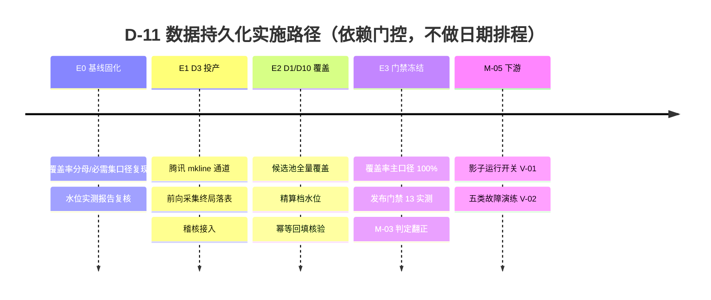

# 智能选股系统 · D-11 数据持久化实施计划与验收看板

> 关联规范编号：`SPEC-ALGO-ISS-001`（D-11 关键路径项） / `SPEC-DATA-001`（数据侧实现载体）
> 权威定义 (SSOT)：[`market-data-sync-specification.md`](../../guidelines/data/market-data-sync-specification.md)（登记册 D1–D12、§5.2 Schema、§5.3 接入准入、§5.4 冲突裁定 W-01～W-10、§5.5 `UniverseWatermark` 契约）
> **实施状态**：📋 规划中 (RFC) | 立项已登记（2026-10-07），实现未启动

---

## 一、 规范核心定位摘要

1. **D-11 是选股系统 M-03/M-05 的关键路径阻塞项**：未就绪时，`finalized_local` 装配的覆盖率主口径长期不达标，正式信号被整场降级阻断。定位与裁定见 [`selection-system-plan.md`](selection-system-plan.md) §七「关键路径立项 · D-11 数据持久化」。
2. **实现载体在数据同步体系，选股侧只做消费者**：选股系统不直连外部端点、不复制供应商解析逻辑（裁定 X-01）；本计划只做**进度与任务编排**，Schema、水位契约、字段口径一律以 SSOT 为准，本文不复述。
3. **经裁定 W-05 映射**：「主数据 + 分钟线 + 资金流持久化」= 同步侧 **D1 基础资料 + D3 分钟K线 + D10 资金流**；Tick/主动买卖量/五档（同步侧 D11）定性为**仅运行捕获、不建 SQLite 表**。
4. **不变量**：缺失禁置零（W-10）、单位单点换算（W-09）、代理档不得进正式规则（W-07）、回补不得造出假水位（W-04）。

---

## 二、 范围与边界

### 1. 范围内（本计划交付）

| 算法侧 D-11 组件 | 同步侧登记项 | 主存储形态 | 备注 |
|:---|:---:|:---|:---|
| 证券主数据 | **D1** | `stock_basic` 表 | 名称/市场/上市日期；`is_st`/`list_status`/`board` 维持可审计派生口径（W-03），不建列 |
| 分钟线 | **D3** | `minute_kline` 表 | 双通道（W-04）：盘中前向采集归档为主、盘后回补仅限审计/回测 |
| 资金流 | **D10** | `capital_flow_daily` 表 | 精算档 `eastmoney_exact` + 代理档 `tencent_proxy` 兜底；代理档判 `degraded`（W-07） |

### 2. 不在范围内（边界声明）

- **盘口/Tick/集合竞价**（同步侧 D11/D12）：仅运行捕获，落 `local/cache/intraday/`，不建表，不属本计划。
- **D2 日线 / D7 估值股本**：虽为 `post_close` 硬门槛字段，但属 D-11 之外的既有已接入项；本计划仅消费其水位，不改造。
- **控制面（Web 手动范围选择、P3 定时增量、设置持久化）**：归 `SPEC-UI-003` 跟踪，不计入本计划。
- **M-05 阶段 F**：影子运行开关（V-01）与五类故障演练（V-02）不属本计划，仅在本计划完成后作为下游里程碑。

---

## 三、 现状基线（2026-10-07 本环境实测）

> 数据来源：`local/market_data/astock_data.db` 实测行数 + [`SPEC-DATA-001`](../data/market-data-sync-implementation-plan.md) M5 投产记录。行数仅作基线快照，不代表可达外网环境的最终水位。

| 数据集 | 表 | 实测行数 | 接入状态 | 剩余缺口 |
|:---:|:---|:---:|:---:|:---|
| D1 | `stock_basic` | 5572 | ✅ 已接入 | 覆盖率按候选池对齐（分母剔除指数） |
| D3 | `minute_kline` | **0** | 🔴 未投产 | 东财 `stock_zh_a_hist_min_em` 上游不可达；需腾讯 mkline 通道或可达环境 |
| D10 | `capital_flow_daily` | 7 | ✅ 已接入 | 仅 7 标的；需覆盖候选池全量、精算档水位 |
| （参考）D2 | `daily_kline` | 1295465 | ✅ 已接入 | `post_close` 必需集之一 |
| （参考）D7 | `capital_snapshot` | 7 | ✅ 已接入 | 门槛字段随日线定盘（W-02） |
| （参考）D4/D8 | `adjust_factor` / `industry_class` | 0 | 🔴 未投产 | 东财系上游不可达（非 D-11 范围，登记参考） |

- **门控实况**：`astock dataset --watermark` 已于 2026-10-07 首次返回 `ready=True`（base_calendar / daily_kline / valuation 三必需集全 `finalized`）——即 D-11 的**持久化内核已具备**，缺口集中在 **D3 投产**与 **D1/D10 覆盖候选池**。

---

## 四、 实施任务矩阵

> 阶段编号 E0–E3 为本计划内部编排，**不做日期排程**，以"依赖就绪 + 门禁通过"为唯一触发条件（延续 SPEC-ALGO-ISS-001 §七）。

### E0 · 基线固化与缺口确认

| 任务 | 关联代码路径 | 状态 |
|:---|:---|:---:|
| E0-1 固化覆盖率分母与必需集口径（对齐 SSOT §5.5 与裁定 A-05 分层分母），把"当日候选池标的清单"落为可复现输入 | [`data_assembler.py`](../../../scripts/core/data/data_assembler.py)（`build_universe_watermark` / `layer_denominator` / `coverage_gate`） | ⬜ 待办 |
| E0-2 覆盖率只读实测报告：逐数据集水位与 `post_close` 就绪判定（真实水位驱动，不伪造） | [`dataset_sync.py`](../../../scripts/core/data/dataset_sync.py)（`get_universe_watermark` / `check_post_close_ready`）、CLI `astock dataset --watermark` | ✅ 已具备（复核口径） |

### E1 · D3 分钟线投产（关键路径第一缺口）

| 任务 | 关联代码路径 | 状态 |
|:---|:---|:---:|
| E1-1 增加腾讯 mkline 通道（SSOT §5.1 D3 已确认渠道之一），作为东财 push2his 不可达时的可取数路径；保留 W-04 回补深度校验，**不得造出假水位** | [`dataset_sync.py`](../../../scripts/core/data/dataset_sync.py)（`sync_minute_kline` / `_expected_min_date`） | ⬜ 待办 |
| E1-2 前向采集切片终局落表：盘中 `intraday_archiver` 切片（append-only、ts 去重）在盘后 seal 时归并入 `minute_kline`（与其水位对齐） | [`intraday_archiver.py`](../../../scripts/core/data/intraday_archiver.py)、[`sync_daemon.py`](../../../scripts/core/data/sync_daemon.py) | ⬜ 待办 |
| E1-3 D3 完整性稽核接入控制台覆盖表（SSOT §5.3 条件 3） | [`data_sync_overview.py`](../../../scripts/server/services/data_sync_overview.py) | ⬜ 待办 |

### E2 · D1 / D10 覆盖候选池

| 任务 | 关联代码路径 | 状态 |
|:---|:---|:---:|
| E2-1 D1 基础资料按已登记标的对齐覆盖率；上市状态/ST/board 维持派生口径（W-03），**不建未确认列** | [`dataset_sync.py`](../../../scripts/core/data/dataset_sync.py)（`sync_stock_basic`） | 🟡 管线已具备，待覆盖率达标 |
| E2-2 D10 逐标的覆盖候选池（当前 7 → 候选池全量）；精算档 `finalized` 才可进正式规则，代理档判 `degraded`（W-07） | [`dataset_sync.py`](../../../scripts/core/data/dataset_sync.py)（`sync_capital_flow`） | 🟡 管线已具备，待覆盖达标 |
| E2-3 幂等回填 + 去重 + 容量淘汰（SSOT §5.1 保留深度 / 裁定 D-18） | [`sync_engine.py`](../../../scripts/core/data/sync_engine.py)（`MarketDataStore` upsert 族）、[`dataset_sync.py`](../../../scripts/core/data/dataset_sync.py) | 🟡 已具备幂等写入，待退役任务核验 |

### E3 · 覆盖率硬门禁实测与冻结

| 任务 | 关联代码路径 | 状态 |
|:---|:---|:---:|
| E3-1 目标候选池覆盖率主口径稳定 100%，发布门禁 13 实测通过 | [`data_assembler.py`](../../../scripts/core/data/data_assembler.py)（`coverage_gate`） | ⬜ 待办 |
| E3-2 与选股侧 M-03 判定联动：`部分达标 → 达成`；更新 [`selection-system-plan.md`](selection-system-plan.md) §七 里程碑表 | 文档回写 + 门禁证据 | ⬜ 待办 |
| E3-3 更新 [`SPEC-DATA-001`](../data/market-data-sync-implementation-plan.md) 遗留项与覆盖表（真实水位驱动翻正） | 文档回写 | ⬜ 待办 |

---

## 五、 里程碑推进

- **依赖链**：E1、E2 可并行（互不依赖）；E3 依赖 E1 且 E2 就绪。
- **临界路径**：E1（D3 投产）是唯一硬缺口；E2 更多是"扩大覆盖范围"而非新管线。
- **解锁判定**：E3 完成 ⇔ M-03 由"部分达标"转"达成"；M-05 仍需独立的阶段 F 交付。

---

## 六、 验收标准与门禁映射

| 门禁 / 裁定 | 判据（指向 SSOT） | 责任交付 |
|:---|:---|:---|
| 发布门禁 13（覆盖率 100%） | SSOT §5.5 主口径 `finalized` + 算法侧 R-03/A-05 | E3-1 |
| 接入准入（5 条） | SSOT §5.3：Schema 迁移 / 增量任务 / 稽核接入 / 失败显式不可用 / 字段渠道三重证据 | E1、E2 |
| W-04（分钟线不造假水位） | 深度不足判 `degraded`，不得以片段冒充完整覆盖 | E1-1 |
| W-07（资金流代理档） | 代理档仅排序/观察；精算档 `finalized` 才可进正式规则 | E2-2 |
| W-09 / W-10（单位与缺失） | 入库单点换算 + 缺失返回 `None` + `blocking_fields` | E2（回归用例已落地） |
| 调度窗口 | SSOT §5.1 各数据集窗口 + 交易日历门控 | E1-2 |

---

## 七、 验收与验证证据

> 实装后逐条回填；现有已落地的回归用例仅登记"已具备"，不替代本计划验收。

| 断言 | 测试路径 | 结果 |
|:---|:---|:---:|
| D3 分钟线非空且保留深度校验生效（W-04） | `tests/core/test_data_sync.py`（`test_minute_kline_depth_guard_marks_shallow_history` 已具备） | 待回填 |
| D10 精算档水位 `finalized`、代理档 `degraded`（W-07） | `tests/core/test_data_sync.py`（`test_capital_flow_proxy_refuses_zero_net_inflow_without_evidence` 已具备） | 待回填 |
| D1 覆盖候选池（分母剔除指数） | `tests/core/test_data_sync.py`（`test_stock_basic_sync_and_coverage` / `test_base_calendar_universe_excludes_indices` 已具备） | 待回填 |
| 覆盖率主口径 100%（发布门禁 13） | `tests/core/test_data_assembler.py`（覆盖率门禁用例） | 待回填 |
| 幂等回填不产生重复行 | `tests/core/test_data_sync.py`（增量防重用例） | 待回填 |
| 单位口径 `×1e8` 入库（W-09） | `tests/core/test_data_sync.py`（`test_capital_snapshot_persisted_in_yuan` 已具备） | 待回填 |

---

## 八、 风险与开放项

| 类型 | 编号 | 内容 | 处置建议 |
|:---:|:---:|:---|:---|
| 环境 | R1 | 东财系上游在本执行环境完全不可达（`push2his` / `push2` / `stock_individual_info_em` 均 ConnectionError），D3/D4/D8 三表无法投产 | E1-1 走腾讯 mkline 通道规避；或在可达东财的环境复跑并留痕 |
| 数据 | R2 | 覆盖率分母漂移（候选池口径变化）导致"已达标"复现困难 | E0-1 把候选池清单落为可复现输入并纳入 `data_snapshot_id` |
| 口径 | R3 | 回补/去重不彻底将污染覆盖率分子 | E2-3 幂等回填 + 去重核验；W-10 缺失必须计 missing 而非置零 |
| 范围 | R4 | 与 `SPEC-UI-003` 控制面职责边界混淆 | 控制面（手动范围选择/定时增量/设置）归 UI-003；本计划只交付数据侧内核 |
| 成本 | R5 | 分钟线/资金流存储与同步工期上升 | 按 SSOT §5.1 保留深度与 D-18 淘汰策略控制容量 |

---

## 九、 变更日志

| 日期 | 变更摘要 |
|:---|:---|
| 2026-10-07 | 依据 [`selection-system-plan.md`](selection-system-plan.md) §七「关键路径立项 · D-11」制定本实施计划：明确映射（D1/D3/D10）、边界、现状基线（2026-10-07 实测）、E0–E3 任务矩阵、门禁映射与风险；登记入 [`docs/specs/README.md`](../README.md) §6 算法矩阵 |

---

## 附：关联索引

- 权威规范（SSOT）：[`market-data-sync-specification.md`](../../guidelines/data/market-data-sync-specification.md)
- 数据侧实施看板：[`market-data-sync-implementation-plan.md`](../data/market-data-sync-implementation-plan.md)（`SPEC-DATA-001`）
- 选股侧看板与立项：[`selection-system-plan.md`](selection-system-plan.md) §七
- 实现审查留痕：[`2026-10-07-selection-system-implementation-review.md`](../../audits/2026-10-07-selection-system-implementation-review.md)