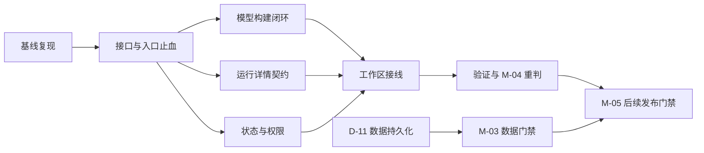

# 智能选股工作区修复计划（2026-10-08）

> 关联规范编号：`SPEC-ALGO-ISS-001` / `SPEC-ALGO-ISS-MT-001`
> 权威定义 (SSOT)：[`selection-system-specification.md`](../../guidelines/algorithm/selection-system-specification.md)、[`selection-model-types-specification.md`](../../guidelines/algorithm/selection-model-types-specification.md)
> **实施状态**：🟡 R0 基线取证进行中 | R1～R6 代码修复尚未启动；R0 遗留与门禁结果见基线记录

## 结论与范围

以本计划关联的两份 SSOT 和[《智能选股系统功能建设实施看板》](selection-system-plan.md)为验收依据。当前实现有引擎、版本、调度和 API 基础，但“空白建模→编辑→保存→校验→发布→激活→运行→查看每层结果”的 Web 闭环尚未可靠成立。因此先撤回 M-04 的“已达成”判定，修复并重验后再恢复；D-11 数据持久化和 M-05 正式信号发布仍作为独立门禁。

参考设计：[工作区截图](../../images/23_16_36.png)与[选股模型工作台备份页](../../../web/backup/选股模型工作台.html)。该 HTML 是静态演示，含固定模型名、5 层数量、股票行情、假分页及只弹窗的停止按钮，不能作为业务数据或直接复制进生产页面。

## 参考图评估与目标信息架构

| 参考图元素 | 可保留的设计 | 生产实现要求 |
|---|---|---|
| 左侧模型实例列表 | 清楚的选中态、模型名与状态摘要 | 接 `GET /api/selection-models`；状态拆为草稿、活动版本、运行实例与调度器状态，不能以“已激活”推断“运行中” |
| 顶部模型标题与操作 | 清晰的当前模型上下文和主要操作 | 显示模型 ID/类型/活动版本/当前 run_id；按状态和权限启用操作；停止只针对可取消的运行实例 |
| 中间纵向漏斗 | 强调层级顺序、当前层及通过量 | 从指定 run_id 的阶段记录生成；每层显示 input/output/reject/unknown、状态、时间、水位；未运行显示空态，不显示预设 5 层与数量 |
| 右侧当前层股票表 | 点击层级后查看该层候选，符合任务流 | 用 run_id + stage_id 查询通过/淘汰候选；搜索、分页、总数均由真实数据契约支持；行情字段带 `as_of`/来源，缺失显示“未提供” |
| 运行日志与导出 | 上下文内可发现 | 日志链接到运行事件/审计；导出与当前 run_id、stage_id、过滤条件一致，并标注数据时点 |

参考图只适合**运行详情/结果页**。模型构建器应是独立视图：左侧规则库，中间条件树或阶段编排画布，右侧属性抽屉。模型中心、编辑、运行详情、研究/跟踪/评价需要明确导航层次，避免把“漏斗运行图”当成编辑画布。

设计落地时沿用现有应用视觉变量，不照搬备份页的 2040px 固定画布和 `transform: scale(...)`。桌面保留三栏关系；窄屏按“模型列表→漏斗→当前层候选”顺序纵向排列。状态必须有文字、图标与颜色共同表达；按钮提供禁用原因、加载反馈、键盘焦点和可访问名称。

## 实施进度总览

状态口径：`⬜ 未开始`、`🟡 进行中`、`⛔ 阻塞`、`✅ 已完成`。只有该阶段所有复选项完成、验收证据已登记且不存在阻断缺陷时，才可标记 `✅`。日期填写实际完成日；不预填预计日期。代码路径与证据路径随实施记录，不能用“代码已提交”替代运行结果。

| 阶段 | 依赖 | 当前状态 | 完成日期 | 验收证据 / 阻塞说明 |
|:---:|---|:---:|:---:|---|
| R0 可复现基线 | 无 | ✅ 已完成 | 2026-10-08 | [R0 基线记录](selection-workbench-r0-baseline.md)：R0-1～R0-3 已取证；V-05 P0 门禁失败，独立保留 |
| R1 接口与旧入口止血 | R0 | ⬜ 未开始 | — | 待填 |
| R2 草稿及模型构建闭环 | R1 | ⬜ 未开始 | — | 待填 |
| R3 运行详情数据契约 | R1 | ⬜ 未开始 | — | 待填 |
| R4 权限、调度与停止语义 | R1；权限裁定复核 | ⬜ 未开始 | — | 待填 |
| R5 参考图工作区接线 | R2、R3、R4 | ⬜ 未开始 | — | 待填 |
| R6 验证、里程碑与文档收口 | R1～R5 | ⬜ 未开始 | — | 待填 |

## 实施任务清单

### R0 · 可复现基线

- [x] **R0-1** 确认当前服务进程对应的工作区与代码版本；记录健康检查、选股接口认证状态、页面脚本版本。**状态：✅ 已完成（2026-10-08）**；当前 HEAD 的隔离进程可对应，旧 6300 进程的精确加载提交仍明确为未知。证据：[R0 基线记录](selection-workbench-r0-baseline.md)。
- [x] **R0-2** 使用隔离模型与测试身份，记录未登录、仅查看、模型作者和管理员的页面加载与关键动作；不读取或修改用户现有模型。**状态：✅ 已完成（2026-10-08）**；浏览器同源取证使用临时 API 地址适配，正式产品仍需修复非 6300 页面的 API 接线。证据：[R0 基线记录](selection-workbench-r0-baseline.md)。
- [x] **R0-3** 将失败现象映射到 API 响应、浏览器错误和代码入口；建立后续逐项复测清单。**状态：✅ 已完成（2026-10-08）**。证据：[R0 基线记录](selection-workbench-r0-baseline.md)。

### R0 补充验证清单（评估于 2026-10-08）

以下项目把尚未验证的事实转成可判定的证据；勾选前记录请求时间、隔离服务进程、模型 ID 和实际响应。R0-3 已完成，不因后续发现的新缺陷回退。旧 6300 进程的精确加载提交不可追溯时，应如实保留“未知”；以明确记录当前 HEAD 的新隔离进程作为后续复测基线。

| 编号 | 归属 | 需要补充的核验 | 通过标准与证据 | 状态 |
|---|---|---|---|:---:|
| V-01 | R0-1 | 为后续复测启动当前工作区的隔离服务，记录启动前 HEAD、工作树状态、进程 PID/命令/启动时间、隔离数据库与仓库路径、健康响应和页面脚本版本；保留旧 6300 进程的已知信息 | 新服务的代码来源、进程和响应可一一对应；旧服务的未知提交明确标注，不把静态资源版本当作 Python 版本 | ✅ 已取证 |
| V-02 | R0-2 前置 | 修通隔离浏览器的 API 地址；用浏览器网络记录确认页面、选股 API 与登录 API 均指向同一隔离服务，不转向 6300 | 请求目标、HTTP 状态及隔离服务访问记录一致；首屏不再出现由测试地址接线导致的 Failed to fetch | ✅ 临时同源适配验证通过；正式接线待修 |
| V-03 | R0-2 | 在独立会话中依次检查未登录、只读 researcher、模型作者、管理员；每次用 /api/auth/me 核对身份，打开选股页并操作隔离模型的查看、创建、保存、发布、激活、运行、调试入口 | 四角色的页面加载、按钮状态、提示和对应 API 响应均记录；拒绝动作不能改动隔离模型；用户现有模型未被读取或修改 | ✅ 已取证，暴露权限提示问题 |
| V-04 | R0-2/R0-3 | 对 401、403、业务 error 和浏览器请求失败分别保存网络状态/响应、页面文案与控制台错误；对模型切换和首次加载记录触发顺序 | 每个现象能关联到具体请求、前端入口和隔离模型；浏览器网络故障与后端业务拒绝分开归因 | 🟡 请求与页面已归因；控制台错误未取得，文案缺陷待 R1/R4 |
| V-05 | 代码改动门禁 | 恢复 P0 运行环境后验证 Windows 档位映射和核心门禁；先核对 core 选中数大于 0，再执行规定的 P0 命令 | 记录实际选中/通过/失败数与运行时长；无 0x8007000e、无失败，才能将 P0 标为通过。当前测试指南的 132/430 数量是旧基线，需与实际收集数核对 | ❌ 227 selected；44% 时 1 failed，按失败即止中断 |

V-01～V-04 用于关闭 R0-1/R0-2；V-05 是代码改动的测试门禁，不替代四角色浏览器取证。真实 run_id 的节点/候选归属、两次运行隔离与导出对账分别由 R1/R3 验收；权限裁定及停止语义由 R4 验收。P1、全量、network 和 live 测试仍按工作区规约先取得人工确认。

### R1 · 接口与旧入口止血

- [ ] **R1-1** 修正 `scripts/server/api/selection_models.py` 中 `/{model_id}/runs` 与 `/runs/{run_id}` 的匹配顺序或路径歧义；同一 `run_id` 的详情、节点和候选查询均能命中对应路由。证据：待填。
- [ ] **R1-2** 删除 `web/js/app.js` 中已废弃的 `SelectionWorkbench` 内存状态及旧刷新、搜索处理；`web/index.html` 所有选股事件由 `SelModels` 唯一处理。证据：待填。
- [ ] **R1-3** 对接口异常、401/403 和业务错误统一展示真实错误状态；页面入口与首次加载顺序不再因旧代码覆盖而变化。证据：待填。

### R2 · 草稿及模型构建闭环

- [ ] **R2-1** 统一 `draft.base_version` 与 `draft.draft_revision` 的前端状态来源；修复 `funnel_editor.js` 使用不存在的 `__draft_revision`，并同步核对条件树、发布、复制到草稿及版本切换。证据：待填。
- [ ] **R2-2** `property_drawer.js` 将“编辑现有规则”按原位置更新、“新建规则”追加；规则 ID 冲突、参数非法和未保存修改有明确反馈。证据：待填。
- [ ] **R2-3** 在模型构建视图实际挂载规则库，并完成条件组与漏斗阶段的新增、删除、命名、顺序、启停、规则挂接、表达式/触发器配置；维持编译器失败关闭。证据：待填。
- [ ] **R2-4** 条件树和漏斗各走通“空白创建→编辑→连续保存→刷新恢复→校验→发布→激活”；并发修改返回 `MODEL_DRAFT_CONFLICT`，不得静默覆盖。证据：待填。

### R3 · 运行详情数据契约

- [ ] **R3-1** 核对 `stages.json` 与 `candidates.json` 的持久化内容，定义阶段输入、通过、淘汰、未知数量的对账口径；若缺少必要字段，先补充运行写入，再扩展查询接口。证据：待填。
- [ ] **R3-2** 提供按 `run_id`、`stage_id`、判定、关键词和分页参数读取候选的接口；返回实际 `total`、数据时点、来源及水位，不从浏览器拼造行情。证据：待填。
- [ ] **R3-3** 同一模型多次运行分别保存与查询；按当前运行和当前层级导出，CSV 行数与所选过滤条件一致。证据：待填。
- [ ] **R3-4** 缺少价格、名称、行业或快照时显示“未提供”及原因；不得沿用备份页固定股票、行情和假分页。证据：待填。

### R4 · 权限、调度与停止语义

- [ ] **R4-1** 复核实施看板 D-07、W-02、A-01、C-03 与当前角色菜单的冲突，确定“模型作者激活本人模型”的服务端校验与迁移方案；权限判断不能只靠前端隐藏按钮。证据：待填。
- [ ] **R4-2** 将模型发布/激活、计划暂停、守护进程在线和运行实例状态分别建模与展示；权限不足或状态不允许时禁用操作并说明原因。证据：待填。
- [ ] **R4-3** 基于真实 Tick 或守护进程心跳提供最后执行时刻、在线判定、下一窗口和异常原因；守护进程离线不得显示“运行中”。证据：待填。
- [ ] **R4-4** 核对同步手工运行与取消接口的真实能力；在没有可中断执行机制时隐藏或禁用“停止运行”，如需支持则先实现协作式取消与终态校验。证据：待填。

### R5 · 参考图工作区接线

- [ ] **R5-1** 将参考图的模型列表、纵向漏斗、当前层候选表用于**运行详情**；模型编辑另设规则库、编排画布和属性抽屉，不混用两种状态。证据：待填。
- [ ] **R5-2** 漏斗卡片绑定指定 `run_id` 的阶段状态、计数和水位；点击卡片只查询该层候选；切换模型或运行时清空旧结果。证据：待填。
- [ ] **R5-3** 日志、导出、搜索、分页和状态动作均接真实接口；无数据时展示空态，绝不复制备份 HTML 的静态演示值。证据：待填。
- [ ] **R5-4** 沿用现有应用视觉变量，检查桌面和窄屏布局、键盘焦点、按钮可访问名称、对比度与无横向溢出；不复制备份页固定画布缩放。证据：待填。

### R6 · 验证、里程碑与文档收口

- [ ] **R6-1** 每批代码改动后先执行 P0 核心门禁并记录结果；失败即停止该批次并定位。证据：待填。
- [ ] **R6-2** 对 API/权限/前端接线提出 P1 与必要浏览器 E2E 验证申请，先说明 P0 覆盖缺口、预计耗时、是否触网或写盘；取得人工确认后执行。证据：待填。
- [ ] **R6-3** 用隔离数据复测下方关键场景，记录运行 ID、数据快照、接口响应、浏览器结果和未解决限制。证据：待填。
- [ ] **R6-4** 依据实测更新 `selection-system-plan.md` 的 M-04 判定并登记旧审查结论的修订说明；D-11、M-03 和 M-05 仍独立验收。证据：待填。

## 里程碑推进

R2、R3、R4 在 R1 稳定后可以分别推进，但 R5 必须等待三者提供稳定接口与状态契约。M-04 只评价 API/Web 闭环；M-03 与 M-05 不随 R6 自动转绿。

## 关键验收场景

1. 管理员创建空白 `condition_tree` 和 `funnel`，分别编辑规则与层级，连续保存两次，刷新后定义不丢失；不同浏览器修改同一草稿时报告 `MODEL_DRAFT_CONFLICT`。
2. 校验失败阻止发布；发布后版本不可变；激活旧版只影响新运行。模型作者与研究员按最终权限裁定分别看到正确按钮和拒绝原因。
3. 用隔离、可审计的本地快照发起两次手工运行；列表有两个不同 `run_id`，运行详情、阶段数量、候选轨迹、导出各自对应，不互相覆盖。
4. 数据水位不足或字段 `unsupported` 时失败关闭，页面显示缺失原因与来源，不生成股票代码，也不借用备份页的行情和数量。
5. 守护进程停止、模型暂停和模型激活三种状态在界面上不同；搜索与分页基于所选层级的真实候选集合。
6. 在桌面与窄屏检查布局、键盘操作、焦点、错误提示及无横向溢出。

## 验收与验证证据台账

| 验收断言 | 对应用例或核验方式 | 当前结果 | 证据链接 / 运行 ID | 完成日期 |
|---|---|:---:|---|:---:|
| 两类模型空白创建、编辑、连续保存与刷新恢复 | 前端交互 + 隔离模型 | ⬜ 待验 | 待填 | — |
| 草稿冲突、发布、激活、旧版回滚与权限边界 | API 集成 + 浏览器 | ⬜ 待验 | 待填 | — |
| `/runs/{run_id}` 详情与节点、候选归属一致 | API 集成 | ⬜ 待验 | 待填 | — |
| 同模型两次运行互不覆盖，阶段计数可对账 | 隔离快照 + 浏览器 | ⬜ 待验 | 待填 | — |
| 搜索、分页、导出与所选运行/层级一致 | 浏览器交互 | ⬜ 待验 | 待填 | — |
| 调度离线、暂停、活动版本、执行中状态明确区分 | API 集成 + 浏览器 | ⬜ 待验 | 待填 | — |
| 缺数据失败关闭且无备份页演示值回流 | 治理断言 + 浏览器 | ⬜ 待验 | 待填 | — |
| P0 核心门禁 | 工作区规定的 core 标记命令 | ❌ 失败 | [R0 基线记录](selection-workbench-r0-baseline.md)：补充运行选中 227/547 例，44% 时出现 1 个失败并按规约中断；未见 `0x8007000e` | — |
| 经确认的 P1 与必要 E2E | 依工作区测试规约执行 | ⬜ 待确认 | 待填 | — |

## 门禁与实施约束

- 本计划不把备份 HTML 迁入生产路径，也不复用其中的固定数据、状态文案或 `fitLayout` 缩放逻辑。
- 先修可靠性再做视觉重构；界面需要后端缺失的数据时先定义可追溯契约，不能由浏览器拼造。
- 任何代码改动后默认只执行工作区规定的 P0 核心门禁。P1、全量、网络和 live 测试按 `AGENTS.md` 须先说明覆盖缺口、耗时及触网/写盘情况并取得人工确认。浏览器 E2E 使用隔离数据，不改动现有用户模型。
- 即使 R6 完成，D-11 数据持久化、100% 覆盖率、影子运行和正式信号发布仍单独验收；不因 Web 修好而宣布系统正式可用。

## 变更日志

| 日期 | 变更摘要 |
|---|---|
| 2026-10-08 | 建立参考图评估与 R0～R4 修复方向。 |
| 2026-10-08 | 将修复方向拆为 R0～R6、26 项可勾选任务，新增阶段状态、完成日期、证据台账和依赖关系；补入权限裁定冲突、规则编辑误新增及同步运行停止语义。 |
| 2026-10-08 | 标记 R0-1/R0-2 部分完成、R0-3 完成；登记 P0 门禁未完成及对应基线证据。 |
| 2026-10-08 | 评估 R0 补充验证需求，新增 V-01～V-05 的隔离、身份、错误取证和 P0 通过标准；区分旧进程提交不可追溯与新进程版本取证。 |
| 2026-10-08 | 完成 V-01～V-03 隔离浏览器与服务取证；V-04 缺控制台记录；V-05 选中 227 例但遇 1 个失败后中断。R0 基线取证完成，P0 门禁仍未通过。 |
