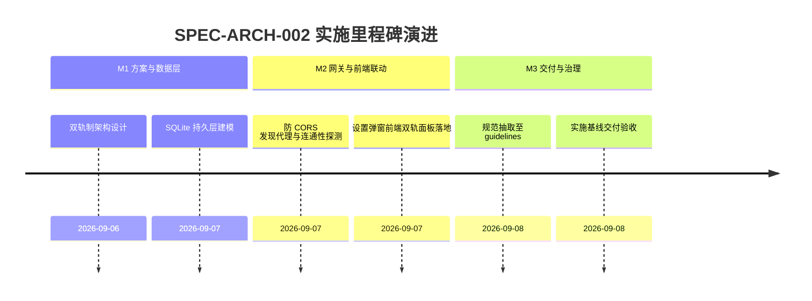

# 大模型双轨接入与多场景角色分配实施看板 (LLM Providers & Role Allocation Execution Spec)

- **规范分类**：系统架构设计 (Architecture)
- **规范编号**：SPEC-ARCH-002
- **文档版本**：v1.2
- **实施状态**：正式基线 (Production Baseline) | 100% 已交付
- **创建日期**：2026-09-07（修订日期：2026-09-08）
- **适用范围**：A-Stock Agents 服务端网关、多模型适配运行时、Web 投研前端配置中心
- **权威设计指南**：[`docs/guidelines/llm-provider-architecture.md`](../../guidelines/llm-provider-architecture.md)

> 🔗 **权威规范与架构定义直达**：  
> 本文件为 **大模型双轨接入与多业务场景角色分配实施落地看板**。关于物理接入轨与逻辑角色轨双轨架构、防 CORS 代理规范、模型工厂寻址逻辑等完整定义，请查阅权威指南：  
> 👉 [**《大模型双轨接入与多业务场景角色分配架构》(llm-provider-architecture.md)**](../../guidelines/llm-provider-architecture.md)

---

## 一、 规范简要名称与核心要点

- **规范名称**：大模型双轨接入与多业务场景角色分配架构设计规范
- **核心定位**：解决多智能体量化投研中不同场景对大模型智能、成本、代码能力与多模态感知的异构诉求。
- **关键设计要点**：
  1. [双轨制解耦架构](../../guidelines/llm-provider-architecture.md#2-双轨制架构定义-dual-track-architecture)：物理接入轨 (Providers 凭证/延迟/发现) 与逻辑角色轨 (Chat/Summary/Quant/Debate/Vision) 彻底分离；
  2. [服务端防 CORS 代理发现机制](../../guidelines/llm-provider-architecture.md#3-服务端防-cors-模型发现代理-apimodelsfetch-remote)：规避浏览器跨域限制，后端统一代理拉取上游服务商可用模型列表；
  3. [网络连通性与延迟即时探测](../../guidelines/llm-provider-architecture.md#2-连通性与网络延迟探测机制-apimodelstest-connection)：支持 HTTP 200 耗时毫秒级测试与鉴权失效预警；
  4. [运行时动态工厂与热装配](../../guidelines/llm-provider-architecture.md#四-逻辑角色轨五大业务场景角色绑定规范)：`LLMProviderFactory` 根据业务场景键名动态获取对应实例。

---

## 二、 任务实施与执行进度矩阵 (Task Implementation Matrix)

| 实施任务项 | 代码映射路径 | 实施状态 | 验收说明与测试基准 | 交付日期 |
|:---|:---|:---:|:---|:---:|
| **Providers 数据表与持久化** | `scripts/server/database.py`, `chats.db` | ✅ 100% | SQLite 维护 `llm_providers` 与 `llm_model_roles` 表结构 | 2026-09-07 |
| **提供商 CRUD 与防 CORS 代理** | `scripts/server/api/models.py` | ✅ 100% | 实现 `/providers`, `/test-connection`, `/fetch-remote` 接口 | 2026-09-07 |
| **五大场景角色绑定接口** | `scripts/server/api/models.py` | ✅ 100% | 实现 `/roles` 读取与更新，支持热切换 | 2026-09-07 |
| **系统设置中心前端双栏** | `web/index.html`, `web/js/app.js` | ✅ 100% | 包含【模型接入】与【模型分配】两大独立配置面板与连通性测试按钮 | 2026-09-07 |
| **运行时多模型解析工厂** | `scripts/server/models.py` | ✅ 100% | 智能体在 `quant`, `debate` 等场景调用时自动路由到分配的专属模型 | 2026-09-07 |

---

## 三、 里程碑推进情况 (Milestone Progress)

---

## 四、 质量验收与验证证据 (Verification Evidence)

1. **连通性与测速测试**：
   - 发送 `POST /api/models/test-connection`，成功返回 `{status: "ok", latency_ms: 128, message: "连接成功"}`。
2. **多业务场景角色热装配测试**：
   - 更新角色 `debate` 映射为 `deepseek-r1`，多智能体辩论触发时即时采用新模型。

---

## 五、 执行变更日志 (Execution Changelog)

- **2026-09-08 (v1.2)**：按规范治理要求重构，将技术设计定义抽离至 `docs/guidelines/llm-provider-architecture.md`，本文件重塑为实施看板。
- **2026-09-07 (v1.0)**：初始创建，确立大模型双轨制接入与角色分配设计基线。
