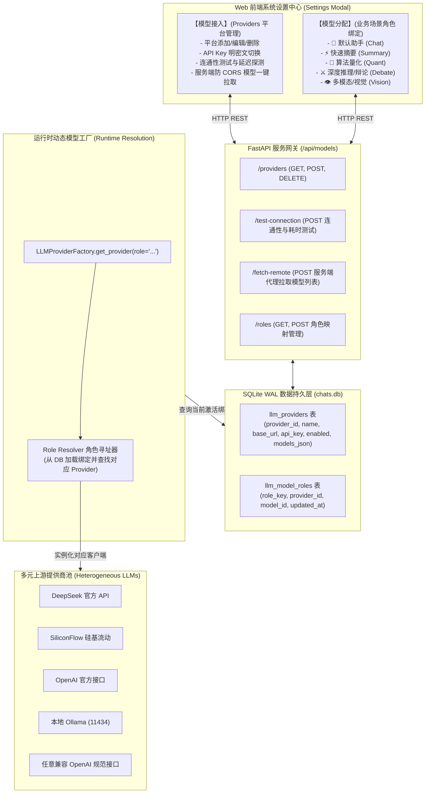

# 大模型双轨接入与多业务场景角色分配架构设计规范 (LLM Providers & Role Allocation Specification)

- **规范分类**：系统架构设计
- **规范编号**：SPEC-ARCH-002
- **文档版本**：v1.1
- **当前状态**：正式规范 (Production Baseline)
- **创建日期**：2026-09-07
- **适用范围**：A-Stock Agents 服务端网关、多模型适配运行时、Web 投研前端配置中心
- **关联文档**：[`arch-web-aichat-and-skill-governance.md`](arch-web-aichat-and-skill-governance.md)、[`arch-token-security-gateway.md`](arch-token-security-gateway.md)、[`../ui/ui-design-and-interaction-specification.md`](../ui/ui-design-and-interaction-specification.md)

---

## 0. 背景与演进动因 (Context & Motivation)

### 0.1 历史现状与痛点
在早期设计中，系统对大模型（LLM）的配置仅限于环境变量（`config.yaml` 或 `.env`）中的单一 Provider，或在前端系统设置中提供一个硬编码的静态下拉选项（如 DeepSeek-V3 / Gemini / 本地 Ollama）。这种模式在面对 A 股专业量化投研的多智能体复合场景时暴露出了致命瓶颈：
1. **单一模型无法兼顾效率与成本**：
   - 快速提炼会话标题或行情快报仅需极轻量极低成本的高速模型（如 `flash` / `mini` / `8B`）；
   - 因子截面量化计算与代码分析需要具备强代码与逻辑能力的大模型（如 `qwen-2.5-coder` / `deepseek-coder`）；
   - 7 角色多空深度辩论与研报博弈需要高智能深度思考推理模型（如 `deepseek-r1` / `o1`）；
   - 行情图表与 K 线分时形态分析则强制依赖具备视觉感知能力的多模态模型（`vision` / `vl`）。
2. **缺乏多平台提供商（Providers）自愈与管理能力**：
   - 无法在界面上直观添加/修改/启停不同的上游提供商（SiliconFlow、DeepSeek 官方、Moonshot/Kimi、OpenAI、本地 Ollama 等）；
   - 浏览器端直接调用上游提供商获取可用模型列表受到严重的跨域（CORS）策略限制；
   - 缺乏实时的 API Key 连通性探测与网络延迟（Latency）度量机制。

### 0.2 演进目标：双轨制架构
确立**“物理层接入管理”与“逻辑层业务场景角色分配”相分离的双轨制架构**：
- **物理接入轨 (Model Providers)**：负责管理上游 API 平台连接凭证、BaseURL、API Key、连通性探测与服务端防 CORS 模型列表拉取；
- **逻辑角色轨 (Model Roles)**：建立量化投研业务场景（Chat / Summary / Quant / Debate / Vision）与具体模型的映射绑定，支持动态解耦与热装配。

---

## 1. 总体架构拓扑 (System Architecture)

系统由**前端配置中心**、**服务网关 API**、**SQLite 持久层**、**动态模型工厂**与**多上游连接池**构成：



---

## 2. 物理接入轨：提供商管理与防 CORS 代理规范 (Providers Management)

### 2.1 提供商元数据规格
每个模型提供商以 JSON/SQLite 记录，包含以下标准字段：
- `provider_id`：唯一标识（如 `prov_deepseek`、`prov_siliconflow`、`prov_local_ollama`）；
- `name`：用户可视平台名称；
- `base_url`：标准兼容服务根路径（如 `https://api.deepseek.com/v1`、`http://localhost:11434/v1`）；
- `api_key`：访问密钥（本地安全持久化，界面支持明密文切换）；
- `enabled`：是否启用布尔开关；
- `models`：已启用/已拉取的可用模型列表（包含标签能力推断）；
- `timeout_seconds`：超时时间（默认 60s）。

### 2.2 连通性与网络延迟探测机制 (`/api/models/test-connection`)
用户在前端配置 BaseURL 和 API Key 后，点击“测试连接”触发后端探测：
1. **探测端点**：优先探测 `{base_url}/models`，其次退回探测 `{base_url}` 根端点；
2. **探测返回结果规范**：
   - **成功 (200/201)**：返回 `status: ok`、耗时 `latency_ms`、`message: 连接成功 (HTTP 200, 150ms)`，前端展示绿色高亮徽标；
   - **鉴权失败 (401)**：返回 `status: error`、`message: 认证失败 (401 Unauthorized)，请检查 API 密钥是否有效`；
   - **网络或超时异常**：返回明确的网络不可达、DNS 解析失败或超时秒数信息。

### 2.3 服务端防 CORS 模型发现代理 (`/api/models/fetch-remote`)
由于各大模型提供商未针对浏览器前端开放宽松的 CORS 标头，客户端直接 AJAX 请求将触发浏览器阻断。因此系统实施**服务端代理拉取机制**：
1. **防跨域请求中继**：前端向本地网关 POST `/api/models/fetch-remote`（传递 base_url 与 api_key），由 Python `httpx.AsyncClient` 发起网络请求；
2. **规范化与能力智能推断 (Capability Inference)**：
   后端解析上游返回的标准 OpenAI 格式 `{"data": [{"id": "xxx"}, ...]}`，并自动按模型名称前缀推断其适用能力标签：
   - 含有 `vision`、`vl`、`4o`、`gemini` $\to$ 标注 `capabilities: ["vision"]`；
   - 含有 `r1`、`reasoner`、`o1`、`o3`、`thinking` $\to$ 标注 `capabilities: ["reasoning"]`；
   - 含有 `coder`、`code`、`qwen`、`deepseek` $\to$ 标注 `capabilities: ["tools"]`；
   - 含有 `flash`、`mini`、`turbo`、`small` $\to$ 标注 `capabilities: ["fast"]`。

---

## 3. 逻辑角色轨：业务场景多角色绑定矩阵 (Scenario Roles Allocation)

系统确立了量化投研核心链路的 **5 大标准场景业务角色**：

| 业务角色标识 (`role_key`) | 场景中文名称 | 典型业务场景与使用时机 | 推荐模型类型与要求 | 默认基线绑定推荐 |
| :--- | :--- | :--- | :--- | :--- |
| **`chat`** | **默认投研助手** | 中间主会话投研对话、多轮追问、量化推演生成 | 通用高智力指令大模型，响应平稳，格式遵循强 | DeepSeek-V3 / Qwen-2.5-72B |
| **`summary`** | **快速与标题概要** | 会话标题自动生成、盘中要闻快速提炼、简短快讯 | 超低延迟、极低成本、高并发小型模型 | Gemini 2.5 Flash / Qwen-2.5-7B |
| **`quant`** | **算法与量化工程** | 因子截面计算、MAD 去极值逻辑生成、代码执行 | 代码专精、逻辑严密、长上下文指令遵循 | Qwen-2.5-Coder-32B / DeepSeek-Coder |
| **`debate`** | **深度推理与辩论** | 7 角色多空对抗研判、多智能体深度博弈、深度研报 | 链式思考 (COT)、长推理、多步骤演绎模型 | DeepSeek-R1 / OpenAI o1-preview |
| **`vision`** | **多模态与视觉研判** | K 线量价图形态识别、分时波段走势图解、盘口截屏 | 多模态视觉模型 (Visual Language Model) | Qwen2-VL-72B / GPT-4o / Claude 3.5 |

---

## 4. 数据库持久层设计 (SQLite DDL)

数据统一隔离持久化于本地 `output/cache/chats.db` 中（WAL 模式）：

```sql
-- 1. 大模型接入提供商表
CREATE TABLE IF NOT EXISTS llm_providers (
    provider_id TEXT PRIMARY KEY,
    name TEXT NOT NULL,
    base_url TEXT NOT NULL,
    api_key TEXT DEFAULT '',
    enabled INTEGER DEFAULT 1,
    models_json TEXT DEFAULT '[]',
    custom_headers_json TEXT DEFAULT '{}',
    timeout_seconds INTEGER DEFAULT 60,
    created_at TEXT NOT NULL,
    updated_at TEXT NOT NULL
);

-- 2. 业务场景模型分配表
CREATE TABLE IF NOT EXISTS llm_model_roles (
    role_key TEXT PRIMARY KEY,       -- chat, summary, quant, debate, vision
    provider_id TEXT NOT NULL,       -- 关联 llm_providers.provider_id
    model_id TEXT NOT NULL,          -- 绑定的具体模型名称
    updated_at TEXT NOT NULL
);
```

---

## 5. 核心 API 接口契约

### 5.1 获取提供商列表
- **请求**：`GET /api/models/providers`
- **响应**：
```json
{
  "status": "ok",
  "total": 3,
  "providers": [
    {
      "provider_id": "prov_deepseek",
      "name": "DeepSeek 官方平台",
      "base_url": "https://api.deepseek.com/v1",
      "enabled": true,
      "models": [
        {"id": "deepseek-chat", "name": "deepseek-chat", "capabilities": ["chat", "tools"]},
        {"id": "deepseek-reasoner", "name": "deepseek-reasoner", "capabilities": ["reasoning"]}
      ]
    }
  ]
}
```

### 5.2 保存/更新提供商
- **请求**：`POST /api/models/providers`
- **载荷**：
```json
{
  "provider_id": "prov_siliconflow",
  "name": "SiliconFlow 硅基流动",
  "base_url": "https://api.siliconflow.cn/v1",
  "api_key": "sk-xxxx",
  "enabled": true,
  "models": [
    {"id": "deepseek-ai/DeepSeek-V3", "name": "DeepSeek-V3", "capabilities": ["chat", "tools"]},
    {"id": "deepseek-ai/DeepSeek-R1", "name": "DeepSeek-R1", "capabilities": ["reasoning"]}
  ],
  "timeout_seconds": 60
}
```

### 5.3 获取与更新业务角色绑定
- **获取请求**：`GET /api/models/roles`
- **更新请求**：`POST /api/models/roles`
- **载荷**：
```json
{
  "roles": {
    "chat": {"provider_id": "prov_deepseek", "model_id": "deepseek-chat"},
    "summary": {"provider_id": "prov_siliconflow", "model_id": "Qwen/Qwen2.5-7B-Instruct"},
    "quant": {"provider_id": "prov_siliconflow", "model_id": "Qwen/Qwen2.5-Coder-32B-Instruct"},
    "debate": {"provider_id": "prov_deepseek", "model_id": "deepseek-reasoner"},
    "vision": {"provider_id": "prov_siliconflow", "model_id": "Qwen/Qwen2-VL-72B-Instruct"}
  }
}
```

---

## 6. 运行时工厂解析与热装配逻辑 (`LLMProviderFactory`)

系统在执行具体投研任务时，通过统一工厂进行依赖注入：

```python
# 核心解析顺序 (Resolution Hierarchy)
class LLMProviderFactory:
    @staticmethod
    def get_provider(model: Optional[str] = None, role: Optional[str] = None, **kwargs) -> BaseLLMProvider:
        # 1. 优先根据角色 (role) 从数据库获取当前绑定的 provider_id 与 model_id
        if role:
            roles = get_model_roles()
            if role in roles:
                target_provider_id = roles[role]["provider_id"]
                target_model = roles[role]["model_id"]

        # 2. 从数据库加载对应 provider 实体并提取 base_url 与 api_key
        # 3. 依据 URL 或模型特征动态实例化适配器 (ClaudeProvider / OpenAIProvider / OllamaProvider)
        # 4. 若未匹配或未配置，平滑退回至默认 chat 角色或全局默认模型
```

---

## 7. 前端 UI 与交互规范

### 7.1 系统设置二级导航架构
系统设置弹窗（`#settingsModal`）内设立清晰的 Tab 切换：
1. **【模型接入】**：左侧提供提供商列表与搜索框，支持一键添加平台；右侧展示平台配置表单（API Key 提供一键明暗显示切换）；提供 `[⚡ 测试连通性]` 与 `[🔄 自动拉取远程模型]` 交互按钮；
2. **【模型分配】**：卡片式展示 5 大角色；每个角色卡片提供双级联动下拉选单（第一级选择已启用的提供商，第二级选择该提供商下的可用模型）；保存时实时提交并更新全局状态。
3. **【通用设置】**：实战三原则税费参数（印花税、佣金万2.5保底5元、T0/T1/T2止损线）。

---

## 8. 实施与验收标准
- [x] 后端完成 SQLite 数据表结构迁移与默认模型角色写入；
- [x] 后端完成 `/api/models/*` 路由实现及防 CORS 远程拉取中继；
- [x] 动态模型工厂实现按业务场景角色热装配；
- [x] 前端完成【模型接入】平台管理与【模型分配】5角色可视化交互；
- [x] 跨端与脱网环境（单机离线状态）下可自适应退回至 Mock 或内置离线逻辑。
