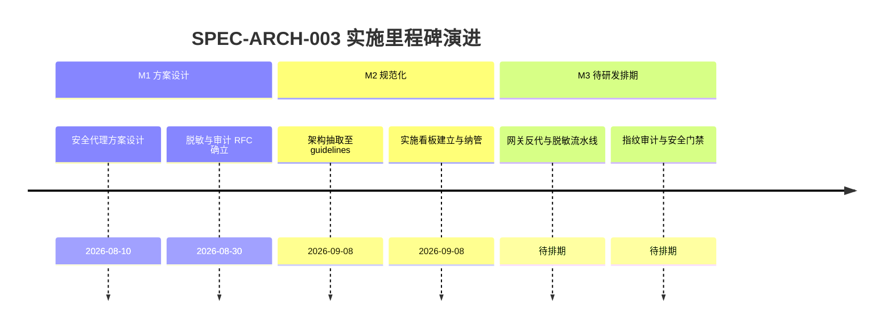

# Token 链路安全网关与审计实施看板 (Token Gateway & Security Audit Execution Spec)

- **规范分类**：系统架构设计 (Architecture)
- **规范编号**：SPEC-ARCH-003
- **文档版本**：v1.3
- **实施状态**：架构提案 (RFC / Approved) | 方案待研发 (Backlog)
- **创建日期**：2026-08-10（修订日期：2026-09-08）
- **适用场景**：本地智能体与上游 LLM 服务商之间的流量代理、安全脱敏与调用审计控制平面
- **权威设计指南**：[`docs/guidelines/token-security-architecture.md`](../../guidelines/token-security-architecture.md)

> 🔗 **权威规范与架构定义直达**：  
> 本文件为 **Token 链路安全网关与审计 Agent 实施落地看板**。关于控制平面与执行平面分离拓扑、请求脱敏流水线、不可篡改指纹审计等完整设计，请查阅权威指南：  
> 👉 [**《Token 链路安全网关与本地化审计架构设计》(token-security-architecture.md)**](../../guidelines/token-security-architecture.md)

---

## 一、 规范简要名称与核心要点

- **规范名称**：Token 链路安全网关与本地化审计 Agent 架构规范
- **核心定位**：位于 Agent 与上游 LLM 供应商之间的独立控制平面，实现数据脱敏、内容审计与动作风控。
- **关键设计要点**：
  1. [控制平面与执行平面物理分离](../../guidelines/token-security-architecture.md#一-架构设计目的与核心诉求)：Agent 仅持有网关虚拟地址，真实 Token 隔离注入；
  2. [请求上行脱敏与响应下行过滤](../../guidelines/token-security-architecture.md#1-token-安全网关核心反向代理)：自动识别与替换个人银行账号、持仓明细明文与系统环境变量；
  3. [不可篡改指纹审计日志 (JSONL)](../../guidelines/token-security-architecture.md#2-本地化审计-agent-security-auditor)：采用 SHA-256 记录进出数据流特征，支持合规审计追踪；
  4. [语义级高危行为阻断 (Fail-Closed)](../../guidelines/token-security-architecture.md#1-token-安全网关核心反向代理)：当检测到破坏性工具调用时在网关侧直接拦截。

---

## 二、 任务实施与执行进度矩阵 (Task Implementation Matrix)

| 实施任务项 | 拟定代码映射路径 | 实施状态 | 验收说明与设计基准 | 交付状态 |
|:---|:---|:---:|:---|:---:|
| **安全反向代理中间件** | `scripts/server/security/gateway.py` | 📋 规划中 | 规划在网关层注入真实 Token，Agent 客户端零泄露 | 待排期 |
| **上行与下行正则脱敏器** | `scripts/server/security/masker.py` | 📋 规划中 | 规划识别手机号、身份证、账号密码并执行单向占位替换 | 待排期 |
| **异步指纹审计日志落盘** | `scripts/server/security/auditor.py` | 📋 规划中 | 规划输出 `output/cache/audit.jsonl`，哈希指纹校验完整 | 待排期 |
| **危险指令预检与阻断** | `scripts/server/security/guard.py` | 📋 规划中 | 针对实盘下单等高危操作实施二次拦截与确认门禁 | 待排期 |

---

## 三、 里程碑推进情况 (Milestone Progress)

---

## 四、 质量验收与验证基准 (Verification Benchmarks & Plans)

1. **脱敏测试规划**：
   - 规划构造包含 API Key、个人账号与手机号的模拟请求，验证通过脱敏器后被安全替换为 `[MASKED_KEY]`。
2. **审计日志指纹完整性验证方案**：
   - 规划读取生成的 JSONL 记录，检验 SHA-256 签名与原始请求哈希严格一致的校验逻辑。

---

## 五、 执行变更日志 (Execution Changelog)

- **2026-09-08 (v1.3)**：审查修正：将任务状态客观校准为规划待研发 (RFC Backlog)，规范任务执行路径；架构设计定义已抽离至 `docs/guidelines/token-security-architecture.md`。
- **2026-09-08 (v1.2)**：按规范治理要求重构，将架构设计定义抽离至 `docs/guidelines/token-security-architecture.md`，本文件重塑为实施看板。
- **2026-08-10 (v1.0)**：初始创建安全网关与审计 Agent 架构草案。
