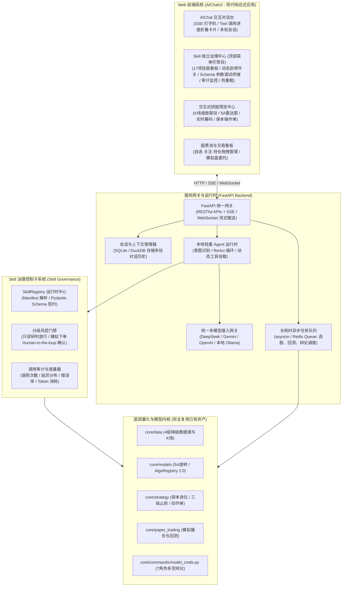
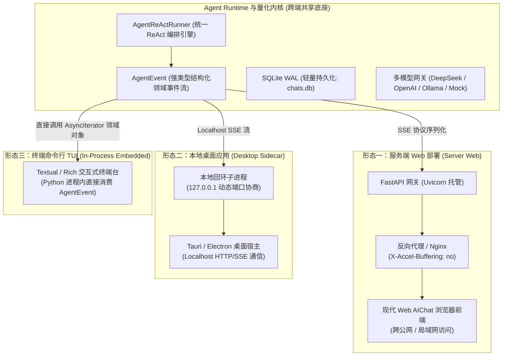

# 独立 Web AIChatUI 与 Skill 治理系统架构设计规范 (Web AIChat & Skill Governance Specification)

- **规范分类**：系统架构设计
- **规范编号**：SPEC-ARCH-001
- **文档版本**：v1.3
- **当前状态**：正式规范 (Production Baseline)
- **创建日期**：2026-09-05（修订日期：2026-09-07）
- **适用场景**：脱离第三方 AI 终端宿主（Antigravity / Hermes / Codex 等），自建独立 Web 界面系统并原生兼容本地客户端（Desktop / TUI）的 A股全流程量化投研交互中枢
- **关联设计**：[`arch-llm-provider-and-role-allocation.md`](arch-llm-provider-and-role-allocation.md)、[`arch-token-security-gateway.md`](arch-token-security-gateway.md)、[`../ui/ui-design-and-interaction-specification.md`](../ui/ui-design-and-interaction-specification.md)、[`../a2ui/a2ui-framework-engine-specification.md`](../a2ui/a2ui-framework-engine-specification.md)

---

## 0. 架构设计目的与核心诉求

### 0.1 现状与背景
在早期架构中，A-Stock Agents 作为一个高内聚的 **Skill 集合与量化引擎底座**，主要依赖外部第三方宿主工具（如 Google Antigravity、Hermes Agent、OpenAI Codex 等）提供 LLM 对话上下文、ReAct 思考循环以及终端展示交互，项目自身主要提供“执行双手（CLI Tools & SDK）”。

### 0.2 核心目标
本架构的目标是**脱离第三方终端工具**，为项目构建完全自闭环、开箱即用的**独立 Web AIChatUI 界面系统**，实现：
1. **自带智能体大脑 (Native Agent Runtime)**：内置轻量 Agent 编排引擎与统一多模型网关，无需第三方工具即可进行多轮量化投研对话；
2. **Skill 治理体系 (Skill Governance)**：对 17 大量化技能提供运行时元数据管理、动态启停、输入输出 Schema 校验、调用审计度量与分级权限风控；
3. **沉浸式交互与研报预览 (Interactive Visualization)**：支持打字机流式输出（SSE）、Tool 调用折叠卡片、交互式 K 线图表渲染（Lightweight-Charts / ECharts）与买卖反应动作单直观呈现。

---

## 1. 总体架构全景 (System Architecture)

系统采用前后端解耦的现代反应式架构，分为**前端展现层**、**服务网关与 Agent 运行时**、**Skill 治理层**与**量化投研内核基座**四层：

---

## 1.2 多端部署拓扑与双模兼容架构 (Dual-Mode Deployment Architecture)

系统不仅支持中心化云端 Web 服务部署，还原生兼容本地独立客户端（Desktop 桌面端与终端 TUI），支持以下三种部署与接入形态：

### 1.2.1 三大部署接入形态规范

| 部署形态 | 典型适用场景 | 进程模型 | 通信介质与协议 | 存储与数据库位置 | 外部环境依赖 |
| :--- | :--- | :--- | :--- | :--- | :--- |
| **① 服务端 Web** | 团队投研云平台、私有化服务器、远程访问 | 独立后台常驻进程 (`uvicorn server.app:app`) | HTTP REST + SSE 流 (`text/event-stream`) | 服务器端 `output/cache/chats.db` | 仅需 Python 3.10+，Nginx可选 |
| **② 本地 Desktop** | 个人电脑独立桌面客户端 (Tauri/Electron) | 桌面应用主进程 + 后台 Local Sidecar 子进程 | 本地回环 Localhost / HTTP IPC | 用户本地 `output/cache/chats.db` | 零外部依赖，开箱即用 |
| **③ 本地 TUI** | 极客终端、低功耗 VPS、无桌面快捷盯盘 | 单进程纯内嵌 (`In-Process` 导入直接运行) | Python 内存对象流 (`AsyncIterator[AgentEvent]`) | 工作区就地 `output/cache/chats.db` | 零端口占用，零网络开销 |

### 1.2.2 核心事件层与传输层解耦规范
为保障 Agent 编排核心在 Web 与本地客户端（Desktop/TUI）的双模通用性，系统实施严格的**事件模型与传输协议分层隔离**：
1. **领域事件内核 (`AgentEvent`)**：`AgentReActRunner` 统一产出强类型领域事件模型，包含：
   - `ThoughtEvent`：大模型内部思考与链式推理（COT）；
   - `ToolCallStartEvent` / `ToolCallCompleteEvent`：工具调用生命周期状态与摘要；
   - `RiskCardEvent`：严格符合实战三原则的风控动作单与保本价结构化数据；
   - `ContentDeltaEvent`：打字机内容文本增量；
   - `DoneEvent` / `ErrorEvent`：完成度量与异常事件。
2. **多协议适配器 (Protocol Adapters)**：
   - **Web / Desktop 适配器**：位于 `server.api.chat`，负责将 `AgentEvent` 序列化为标准的 SSE `event: <type>\ndata: <json>\n\n` 文本流；
   - **TUI 适配器**：位于终端客户端模块，直接在异步循环中获取 `AgentEvent` 实例，驱动 Rich Console 或 Textual 控件实时折叠/高亮渲染，无需经过二次 JSON 反序列化。

### 1.2.3 关键演进约束与兼容指标
1. **端口动态发现与协商 (Port Hunting)**：本地 Sidecar 模式下，启动命令支持 `--port 0` 自动绑定系统空闲端口，并将分配的端口写入本地运行时锁定文件（`.server.port`），杜绝 8000 端口冲突导致桌面应用初始化失败。
2. **零外部强依赖 (Zero Global Pollution)**：全链路默认采用标准库 `sqlite3` (WAL 模式)，禁止引入强制依赖 Redis/PostgreSQL 等外部服务中间件的硬编码逻辑，确保全平台单一命令即可就地运行。
3. **多租户隔离扩展性储备**：`sessions` 与 `messages` 持久化表结构预留 `user_id` 逻辑字段（单机默认 `default_user`），确保未来升级至公网多用户 SaaS 模式时，可通过统一中间件注入 JWT 鉴权无缝平滑迁移。

---

## 2. 服务与网关层设计 (Server & API Gateway)

### 2.1 技术选型
* **API 框架**：FastAPI（高性能异步框架，原生支持 OpenAPI 规范与 Pydantic 契约）。
* **流式通信**：Server-Sent Events (SSE)，用于大模型打字机流式吐字及 Tool Call 进度事件推送。
* **任务调度**：轻量模式采用 Python 原生 `asyncio.create_task` + 内存状态机；生产可无缝切换至 Celery / Redis。

---

## 3. Skill 治理控制子系统 (Skill Governance)

### 3.1 独立 17 项量化投研技能治理中心规范 (Skill Governance Center Modal)
为实现专业级技能自省与调试，治理系统从原系统设置二级菜单中彻底独立，提升为**顶部菜单栏一级入口 `🛡️ 技能治理`**（弹窗 `#modalSkillsGovernance`），下辖四大核心功能视窗：
1. **技能全景看板 (Skills Grid)**：
   - 渲染全部 17 项量化技能卡片（`astock-data-feed` 至 `astock-screener-5a` 等）；
   - 支持按类别（行情数据、多因子、实战交易、报告评估、系统底座）及关键字即时过滤；
   - 每张卡片标识明确的风险等级徽标（`readonly` 只读研判、`simulation` 模拟撮合、`destructive` 破坏性操作）与即时启用/停用 Switch。
2. **运行审计与度量中心 (Audit & Metrics)**：
   - 统计聚合指标：累计调用量、今日调用量、P95 延迟 (ms)、异常错误率、熔断保护状态；
   - 配合调用日志表格，支持按状态码及耗时溯源历史执行详情。
3. **JSON Schema 参数在线调试控制台 (Schema Debugger & Execution Console)**：
   - 点击任一技能的 `[调试]`，动态读取其 `parameters_schema` 并自动生成可视交互式表单；
   - 用户输入代码与参数后，点击 `[运行测试]` 可就地发起 CLI 进程执行；
   - 内置**仿终端黑色控制台 (Live Execution Console)**，实时回显标准输出流、执行耗时与 JSON 返回结果。
4. **热重载与治理同步机制 (Hot-Reload & Manifest Sync)**：
   - 提供 `[🔄 重新扫描本地技能]` 按钮，一键对齐 `.agents/skills/` 与 `config/skills_manifest.json`，无需重启后台服务即可热更新技能元数据。

---

## 4. 前端视口与交互协同规范

> 完整 UI/UX 设计规范详见独立文档：[`docs/specs/ui/ui-design-and-interaction-specification.md`](../ui/ui-design-and-interaction-specification.md)

1. **双模视口协同**：【投研助手】模式以 AIChat 对话为主轴（40/60 双栏），【业务主工作区】模式以大屏看盘为主轴（AI 助手定位于右侧 390px 伴随式辅助）；
2. **深度双向联动**：支持针对右侧图表与标的行一键引用提问；在对话中生成的实战动作单与修改参数，支持一键投射至右侧并触发动态重绘；
3. **A2UI 驱动引擎**：前端图表与卡片编排遵循 [`a2ui-framework-engine-specification.md`](../a2ui/a2ui-framework-engine-specification.md) 协议。

---

## 5. 核心 REST API 契约

| 模块 | 请求方法 | 路由路径 | 说明 |
| :--- | :--- | :--- | :--- |
| **会话** | `POST` | `/api/chat/sessions` | 创建新对话会话 |
| **会话** | `GET` | `/api/chat/sessions` | 获取会话历史列表 |
| **对话** | `POST` | `/api/chat/completions/stream` | 发送问题并建立 SSE 流式对话 |
| **治理** | `GET` | `/api/skills` | 获取 17 项技能清单与状态 |
| **治理** | `PATCH` | `/api/skills/{skill_id}` | 动态启用/停用技能或修改配置 |
| **治理** | `POST` | `/api/skills/{skill_id}/test` | 在线参数调试与就地执行命令测试 |
| **治理** | `GET` | `/api/skills/audit/stats` | 获取技能调用频次、耗时与审计度量 |
| **模型** | `GET/POST` | `/api/models/providers` | 大模型上游接入平台 (Providers) 列表与增删改 |
| **模型** | `POST` | `/api/models/test-connection` | 探测指定 BaseURL 与 Key 连通性及网络延迟 |
| **模型** | `POST` | `/api/models/fetch-remote` | 服务端防 CORS 代理拉取远程可用模型清单 |
| **模型** | `GET/POST` | `/api/models/roles` | 获取与更新 5 大投研业务场景模型角色绑定 |
| **研报** | `GET` | `/api/reports` | 获取历史已生成的研报列表 |
| **研报** | `GET` | `/api/reports/{id}/data` | 获取研报结构化图表渲染数据 |
| **研报** | `GET` | `/api/reports/{id}/html` | 导出/预览单文件自包含 HTML |
| **任务** | `GET` | `/api/tasks/{task_id}` | 查询长耗时回测/选股异步任务进度 |
