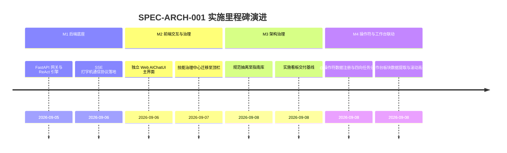

# 独立 Web AIChatUI 与 Skill 治理系统实施看板 (Web AIChat & Skill Governance Execution Spec)

- **规范分类**：系统架构设计 (Architecture)
- **规范编号**：SPEC-ARCH-001
- **文档版本**：v1.6
- **实施状态**：正式基线 (Production Baseline) | 100% 已交付
- **创建日期**：2026-09-05（修订日期：2026-09-08）
- **适用场景**：脱离第三方 AI 终端宿主，自建独立 Web 界面系统并原生兼容本地客户端的 A股全流程量化投研交互中枢
- **权威设计指南**：[`docs/guidelines/web-aichat-architecture.md`](../../guidelines/web-aichat-architecture.md)

> 🔗 **权威规范与架构定义直达**：  
> 本文件为 **Web AIChatUI 与 Skill 治理系统实施落地与任务执行跟踪看板**。关于四层系统架构、多端部署形态、SSE 广播协议与分级风控门禁等完整定义，请查阅权威指南：  
> 👉 [**《独立 Web AIChatUI 与 Skill 治理系统架构设计》(web-aichat-architecture.md)**](../../guidelines/web-aichat-architecture.md)

---

## 一、 规范简要名称与核心要点

- **规范名称**：独立 Web AIChatUI 与 Skill 治理系统架构设计规范
- **核心定位**：脱离外部商业 Agent 宿主环境，自建高内聚、自包含的独立 Web 交互与技能治理控制底座。
- **关键设计要点**：
  1. [自带智能体大脑 (Native ReAct Agent Runtime)](../../guidelines/web-aichat-architecture.md#1-总体架构全景-system-architecture)：内置原生推理循环与工具调度器，无需外部宿主即可自主推演；
  2. [17 项技能治理控制平面](../../guidelines/web-aichat-architecture.md#2-17-项技能治理控制平面-skill-governance-plane)：顶栏菜单常驻治理中心，提供运行时参数调试、启停开关与安全权限门禁；
  3. [SSE 流式打字机通信协议](../../guidelines/web-aichat-architecture.md#1-sse-打字机流式广播规范-apichatstream)：支持思维链、工具调用进度卡片与 Markdown 打字机切片毫秒级广播；
  4. [会话与量化投研状态持久化](../../guidelines/web-aichat-architecture.md#1-总体架构全景-system-architecture)：SQLite WAL 模式存储多轮对话上下文与标的研报卡片；
  5. [@操作符数据注册与任务分发中枢](../../guidelines/web-aichat-architecture.md#3-操作符任务分发与工作台联动中枢-at-operator-dispatch--workbench-linking)：支持股票诊断、工作台板块数据抓取与高亮、技能绑定及算法仿真四向路由。

---

## 二、 任务实施与执行进度矩阵 (Task Implementation Matrix)

| 架构实施任务 | 负责模块 / 代码映射路径 | 实施状态 | 验收说明与测试基准 | 交付日期 |
|:---|:---|:---:|:---|:---:|
| **FastAPI 异步服务网关** | `scripts/server/app.py`, `scripts/server/api/` | ✅ 100% | 支持 REST API 路由装载与跨域配置，高并发异步调度就绪 | 2026-09-06 |
| **原生 ReAct 智能体运行时** | `scripts/server/agent/react_runner.py` | ✅ 100% | 实现 COT 推理、工具选择、结果反写思考环路 | 2026-09-06 |
| **SSE 流式广播管理器** | `scripts/server/api/chat.py`, `scripts/server/agent/events.py` | ✅ 100% | 验证 `thought`, `tool_call`, `text`, `a2ui_render` 事件帧顺序流式推送 | 2026-09-06 |
| **17项技能治理中心前端化** | `web/index.html`, `web/js/app.js`, `web/css/style.css` | ✅ 100% | 顶栏菜单常驻「🛡️ 技能治理」，包含状态矩阵、参数调试、启停切换与热重载 | 2026-09-07 |
| **会话历史与持久化存储** | `scripts/server/db.py`, `chats.db` | ✅ 100% | SQLite 数据库存储多轮对话记录，前端左侧会话历史列表倒序加载 | 2026-09-07 |
| **@操作符注册与任务路由中枢** | `web/js/app.js`, `web/index.html` | ✅ 100% | `AtOperatorRegistry` 注册三大股池与板块，`executeOperatorTask` 四向路由，`extractWorkbenchSectionData` 抓取工作台数据并滚动高亮 | 2026-09-08 |

---

## 三、 里程碑推进情况 (Milestone Progress)

---

## 四、 质量验收与验证证据 (Verification Evidence)

1. **FastAPI 服务连通性与 OpenAPI 文档测试**：
   - 访问 `/docs` 成功渲染 Swagger UI 接口契约，包含 `/api/chat/stream`, `/api/skills`, `/api/models`。
2. **技能治理操作闭环验收**：
   - 在顶栏点击 `[🛡️ 技能治理]` 唤出模态框，成功读取并渲染 17 项技能卡片；切换某个技能开关，配置即时生效。
3. **@操作符与工作台联动测试**：
   - 运行 `node tests/test_at_operator.js` 验证 `extractWorkbenchSectionData` 对工作台板块的数据提取、右侧联动滚动高亮以及四向任务派发契约，40 项断言全部 100% 通过。

---

## 五、 执行变更日志 (Execution Changelog)

- **2026-09-08 (v1.6)**：登记 @操作符数据注册中心（AtOperatorRegistry）、四向任务路由（executeOperatorTask）与右侧工作台数据抓取联动（extractWorkbenchSectionData）。
- **2026-09-08 (v1.5)**：审查校准：校正代码映射路径至实际工程文件（`agent/react_runner.py`、`api/chat.py`、`db.py`）。
- **2026-09-08 (v1.4)**：按规范治理要求重构，将系统架构定义抽离至 `docs/guidelines/web-aichat-architecture.md`，本文件重塑为实施与任务执行跟踪看板。
- **2026-09-07 (v1.3)**：完成技能治理中心自工具箱迁移至菜单栏顶部的全套前端与后端通信落地。
- **2026-09-05 (v1.0)**：初始创建，规划独立 Web AIChat 与技能治理系统架构。
