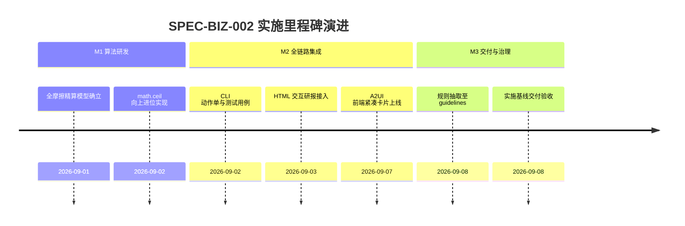

# 最低保本卖出价精算与精确进位实施看板 (Breakeven Price Calculation Execution Spec)

- **规范分类**：业务规则 (Business Rules)
- **规范编号**：SPEC-BIZ-002
- **文档版本**：v1.3
- **实施状态**：正式基线 (Production Baseline) | 100% 已交付
- **创建日期**：2026-09-02（修订日期：2026-09-08）
- **适用范围**：A股量化实战交易动作中枢、保本价试算器、HTML交互研报持仓明细表与模拟撮合风控
- **权威设计指南**：[`docs/guidelines/breakeven-calculation-rules.md`](../../guidelines/breakeven-calculation-rules.md)

> 🔗 **权威规范与规则定义直达**：  
> 本文件为 **最低保本卖出价量化精算与向上进位实施落地与任务执行跟踪看板**。关于全流程摩擦税费精算数学模型、二分法求解原理、强制向上精确进位至分 (`math.ceil`) 规则等完整定义，请查阅权威指南：  
> 👉 [**《A股最低保本卖出价量化精算与精确进位业务规则》(breakeven-calculation-rules.md)**](../../guidelines/breakeven-calculation-rules.md)

---

## 一、 规范简要名称与核心要点

- **规范名称**：最低保本卖出价量化精算与精确进位业务规则规范
- **核心定位**：确保交易员与量化系统在卖出平仓时 100% 覆盖全部买卖双向税费，杜绝任何微小亏损。
- **关键设计要点**：
  1. [绝对无损保本铁律](../../guidelines/breakeven-calculation-rules.md#一-核心原则与进位铁律-the-breakeven-iron-law)：必须均强制向上精确进位至 0.01 元 (`math.ceil`)，坚决杜绝四舍五入；
  2. [全摩擦税费覆盖](../../guidelines/breakeven-calculation-rules.md#二-费率参数标准-market-fee-parameters)：严格计入卖出印花税（0.05%）、券商佣金（万2.5/保底5元）、过户费（十万分之1）；
  3. [精确数学建模求解](../../guidelines/breakeven-calculation-rules.md#三-保本价精算与进位算法数学模型)：以净收入函数单调性为基础，进行高精度收敛并严格进位；
  4. [持仓明细与动作单全链路接入](../../guidelines/breakeven-calculation-rules.md#四-python-标准工程实现)：所有个股分析报告、动作单与持仓卡片必须明确展示最低保本卖出价。

---

## 二、 任务实施与执行进度矩阵 (Task Implementation Matrix)

| 实施任务项 | 代码映射路径 | 实施状态 | 验收说明与测试基准 | 交付日期 |
|:---|:---|:---:|:---|:---:|
| **保本价精算核心算法实现** | `scripts/core/strategy/execution_action_engine.py` | ✅ 100% | 实现 `calc_min_breakeven_price`，向上精确进位至分位 | 2026-09-02 |
| **黄金测试用例基准验证** | `tests/test_strategy_suite.py` | ✅ 100% | 验证中国中车(6.1411->6.15)、紫金矿业、恒瑞医药等 5 组实盘案例 | 2026-09-02 |
| **实战动作单 CLI 命令接入** | `scripts/core/cli.py` (`astock action plan`) | ✅ 100% | 输入成本与股数，直接输出带向上进位说明的实操保本卖出价 | 2026-09-02 |
| **HTML 交互研报 10 列持仓表** | `scripts/core/reporting/html_reporter.py` | ✅ 100% | 持仓明细表第 4 列强制展示「最低保本卖出价」 | 2026-09-03 |
| **前端 A2UI 紧凑卡片组件** | `web/js/components/astock.js` | ✅ 100% | 前端卡片直观显示保本价，去除冗余进位文本，保持紧凑 | 2026-09-07 |

---

## 三、 里程碑推进情况 (Milestone Progress)



---

## 四、 质量验收与验证证据 (Verification Evidence)

1. **实战黄金案例验证结果**：
   - 中国中车（5,000股，成本 ¥6.1411）：理论未进位 ¥6.1463 $\longrightarrow$ **输出 ¥6.15**，挂单卖出产生净利润 +¥18.51，零亏损。
2. **回归自动化测试执行**：
   ```powershell
   python -m pytest tests/test_strategy_suite.py
   # 结果：100% 通过
   ```

---

## 五、 执行变更日志 (Execution Changelog)

- **2026-09-08 (v1.4)**：校准实施任务映射测试套件路径至 `tests/test_strategy_suite.py`。
- **2026-09-08 (v1.3)**：按规范治理要求重构，将业务算法规则抽离至 `docs/guidelines/breakeven-calculation-rules.md`，本文件重塑为实施看板。
- **2026-09-07 (v1.2)**：前端组件卡片优化，精简进位文本展示。
- **2026-09-02 (v1.0)**：初始创建，实现全摩擦成本向上进位算法与测试套件。
