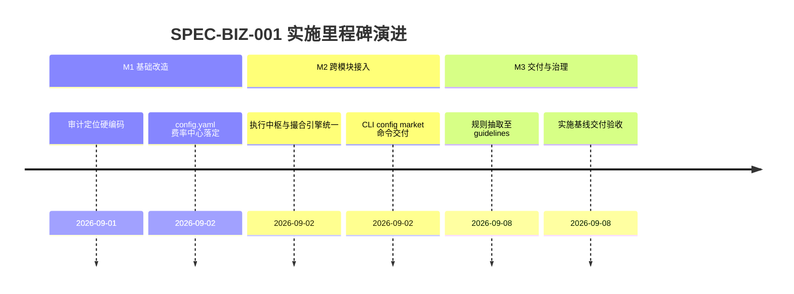

# 券商佣金及费率参数配置化实施看板 (Broker Commission Configurable Execution Spec)

- **规范分类**：业务规则 (Business Rules)
- **规范编号**：SPEC-BIZ-001
- **文档版本**：v1.2
- **实施状态**：正式基线 (Production Baseline) | 100% 已交付
- **创建日期**：2026-09-02（修订日期：2026-09-08）
- **适用范围**：A-Stock Agents 交易成本精算、实战动作单生成、模拟盘撮合引擎与策略回测模块
- **权威设计指南**：[`docs/guidelines/broker-commission-rules.md`](../../guidelines/broker-commission-rules.md)

> 🔗 **权威规范与规则定义直达**：  
> 本文件为 **券商佣金及费率参数配置化实施落地与任务执行跟踪看板**。关于全市场摩擦费率基准、配置项读取与热重载接口、未配置友好引导规则等完整细节，请查阅权威指南：  
> 👉 [**《券商佣金及市场交易费率参数配置化业务规则》(broker-commission-rules.md)**](../../guidelines/broker-commission-rules.md)

---

## 一、 规范简要名称与核心要点

- **规范名称**：券商佣金及费率参数配置化与首次使用提示设计规范
- **核心定位**：彻底消除系统各子模块中券商佣金（万2.5/最低5元）的硬编码，实现全局配置统一与个性化费率支持。
- **关键设计要点**：
  1. [全局统一费率配置中心 (`config.yaml`)](../../guidelines/broker-commission-rules.md#二-全局配置规范-configconfigyaml)：印花税、佣金比例、过户费率、单笔最低5元保底统一管理；
  2. [免五与个性化费率支持](../../guidelines/broker-commission-rules.md#二-全局配置规范-configconfigyaml)：支持高频交易用户将 `min_commission` 设为 `0.0`；
  3. [内存热重载与单一真理来源 (SSOT)](../../guidelines/broker-commission-rules.md#三-python-核心访问与热重载接口-scriptscoreconfigpy)：修改后即时生效，杜绝各业务模块数值分叉；
  4. [首次使用未配置友好引导](../../guidelines/broker-commission-rules.md#三-python-核心访问与热重载接口-scriptscoreconfigpy)：`is_user_configured` 为 `false` 时显式输出配置向导提示。

---

## 二、 任务实施与执行进度矩阵 (Task Implementation Matrix)

| 实施任务项 | 代码映射路径 | 实施状态 | 验收说明与测试基准 | 交付日期 |
|:---|:---|:---:|:---|:---:|
| **全局配置项与结构化解析** | `config/config.yaml`, `scripts/core/config.py` | ✅ 100% | 支持 `get_market_config()` 与 `save_market_config()`，单元测试覆盖 | 2026-09-02 |
| **保本精算引擎移除硬编码** | `scripts/core/strategy/execution_action_engine.py` | ✅ 100% | 动态接入全局配置，正确处理最低 5 元门槛 | 2026-09-02 |
| **风控与解套做T接入** | `scripts/core/strategy/risk_position_manager.py` | ✅ 100% | 读取全局费率计算做 T 收益与保本位 | 2026-09-02 |
| **模拟撮合与事件回测接入** | `scripts/core/paper_trading/engine.py`, `a_stocks_backtest.py` | ✅ 100% | 撮合手续费计入单笔最低 5 元保底与动态佣金率 | 2026-09-02 |
| **CLI 费率管理子命令** | `scripts/core/cli.py` (`astock config market`) | ✅ 100% | 支持命令行直接修改与交互式向导配置 | 2026-09-02 |
| **单元测试套件覆盖** | `tests/test_config.py` | ✅ 100% | 针对读写持久化、边界回退与免五场景全部测试通过 | 2026-09-02 |

---

## 三、 里程碑推进情况 (Milestone Progress)



---

## 四、 质量验收与验证证据 (Verification Evidence)

1. **CLI 费率查看与修改测试**：
   ```powershell
   python scripts/core/cli.py config market --commission 0.00025 --min-commission 5.0
   # 验证输出: 费率更新成功，is_user_configured 标记为 True
   ```
2. **单元测试回归验证**：
   ```powershell
   python -m pytest tests/test_config.py
   # 结果：100% 通过
   ```

---

## 五、 执行变更日志 (Execution Changelog)

- **2026-09-08 (v1.2)**：按规范治理要求重构，将业务规则定义抽离至 `docs/guidelines/broker-commission-rules.md`，本文件重塑为实施看板。
- **2026-09-02 (v1.0)**：初始创建，完成全库券商费率配置化重构。
