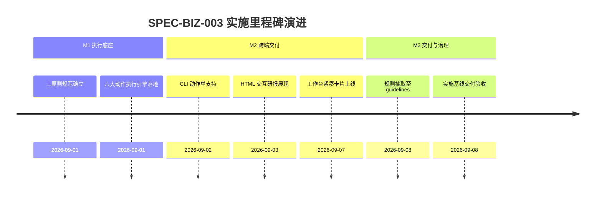

# 实战交易反应动作与风控执行实施看板 (Trading Execution & Risk Control Execution Spec)

- **规范分类**：业务规则 (Business Rules)
- **规范编号**：SPEC-BIZ-003
- **文档版本**：v1.3
- **实施状态**：正式基线 (Production Baseline) | 100% 已交付
- **创建日期**：2026-09-01（修订日期：2026-09-08）
- **适用范围**：全量 A 股量化策略的统一交易反应与执行层 (EMS)
- **权威设计指南**：[`docs/guidelines/trading-execution-rules.md`](../../guidelines/trading-execution-rules.md)

> 🔗 **权威规范与规则定义直达**：  
> 本文件为 **实战交易反应动作与三级风控止损阶梯实施落地与任务执行跟踪看板**。关于阿尔法与贝塔解耦分层架构、实战交易三原则、六大交易反应动作、量化风控阈值库等完整规范，请查阅权威指南：  
> 👉 [**《A股实战交易反应动作与量化决策风控执行规则》(trading-execution-rules.md)**](../../guidelines/trading-execution-rules.md)

---

## 一、 规范简要名称与核心要点

- **规范名称**：A股实战交易反应动作与量化决策风控执行规范
- **核心定位**：将量化静态打分转化为确定性买卖时间窗口、挂单点位与风控动作的执行中枢。
- **关键设计要点**：
  1. [阿尔法选股与贝塔执行解耦](../../guidelines/trading-execution-rules.md#一-核心架构原则阿尔法选股与贝塔执行彻底解耦)：第一层负责打分选股，第二层执行中枢（EMS）负责翻译动作指令，第三层负责终端呈现；
  2. [实战交易三原则（输出铁律）](../../guidelines/trading-execution-rules.md#二-实战交易三原则智能体输出铁律)：最低保本卖出价（强制向上进位）、三级风控止损阶梯（T0 -3% / T1 -5% / T2 -8%）、三场景即时动作单；
  3. [六大交易反应动作标准化](../../guidelines/trading-execution-rules.md#三-六大交易反应动作操作规范)：突破建仓40/60、均线回踩挂单、假摔反向做T、顺势动态止盈、弱势反弹减仓、破位开盘避险；
  4. [量化监控门禁阈值库](../../guidelines/trading-execution-rules.md#四-核心价量指标量化阈值库)：量比、MA20乖离率、换手率沉淀与 ATR 波动范围统一标准。

---

## 二、 任务实施与执行进度矩阵 (Task Implementation Matrix)

| 实施任务项 | 代码映射路径 | 实施状态 | 验收说明与测试基准 | 交付日期 |
|:---|:---|:---:|:---|:---:|
| **交易反应执行引擎落地** | `scripts/core/strategy/execution_action_engine.py` | ✅ 100% | 实现六大动作单生成器、三级止损计算与决策树 | 2026-09-01 |
| **实战动作提示词规范化** | `.agents/prompts/trading_action_prompts.md` | ✅ 100% | 结构化指令约束智能体在所有投研结论中强制附带三原则 | 2026-09-01 |
| **就地技能包执行中枢封装** | `.agents/skills/astock-action-execution/` | ✅ 100% | 提供独立 `SKILL.md` 指南与 CLI 执行管道入口 | 2026-09-02 |
| **CLI 动作单统一命令** | `scripts/core/cli.py` (`astock action plan`) | ✅ 100% | 输入代码、成本、股数即可一键生成 JSON/表格动作单 | 2026-09-02 |
| **HTML 交互研报集成动作单** | `scripts/core/reporting/html_reporter.py` | ✅ 100% | 在报告中渲染折叠交互式实操动作单与止损预警模块 | 2026-09-03 |
| **前端工作台快捷操作卡片** | `web/js/components/astock.js` | ✅ 100% | A2UI 渲染三原则紧凑卡片，支持一键发送到对话框 | 2026-09-07 |

---

## 三、 里程碑推进情况 (Milestone Progress)



---

## 四、 质量验收与验证证据 (Verification Evidence)

1. **CLI 实战动作单输出验证**：
   ```powershell
   python scripts/core/cli.py action plan --code 600519 --cost 1450.0 --shares 100 --json
   # 验证输出结构包含 breakeven_price, stop_loss (T0/T1/T2), action_scenarios (open_surge/narrow_range/plunge)
   ```
2. **自动化测试执行**：
   ```powershell
   python -m pytest tests/test_execution_action_engine.py
   # 结果：100% 通过
   ```

---

## 五、 执行变更日志 (Execution Changelog)

- **2026-09-08 (v1.3)**：按规范治理要求重构，将实战交易规则与操作定义抽离至 `docs/guidelines/trading-execution-rules.md`，本文件重塑为实施看板。
- **2026-09-07 (v1.2)**：优化 Web 前端三原则快捷操作展示为紧凑卡片。
- **2026-09-01 (v1.0)**：初始创建，确立交易三原则与六大反应动作基线。
