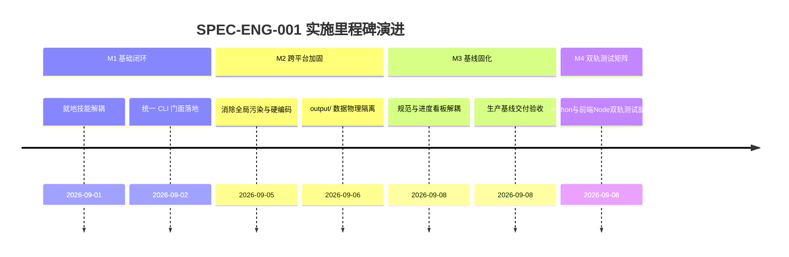

# 项目工程结构与工作区架构实施看板 (Project Structure & Workspace Execution Spec)

- **规范分类**：项目工程结构 (Engineering)
- **规范编号**：SPEC-ENG-001
- **文档版本**：v1.2
- **实施状态**：实施中 | 原“正式基线 100% 已交付”声明待整改验收
- **创建日期**：2026-09-07（修订日期：2026-09-08）
- **适用范围**：A-Stock Agents 代码库物理组织、环境编排、智能体工作区契约与跨平台发行底座
- **权威设计指南**：[`docs/guidelines/project-structure-specification.md`](../../guidelines/project-structure-specification.md)

> 🔗 **权威规范与架构定义直达**：  
> 本文件为**工程实施落地与任务执行跟踪看板**。关于零全局污染原则、单一真理来源 (SSOT)、目录详细拓扑、跨平台路径规范等完整定义，请查阅权威指南：  
> 👉 [**《项目工程结构与智能体工作区架构规范》(project-structure-specification.md)**](../../guidelines/project-structure-specification.md)

---

## 一、 规范简要名称与核心要点

- **规范名称**：项目工程结构与智能体工作区架构规范
- **核心定位**：保障系统跨平台自洽运行、零全局环境污染与多智能体就地调度的基础工程标准。
- **关键设计要点**：
  1. [零全局污染原则](../../guidelines/project-structure-specification.md#1-零全局污染原则-zero-global-pollution)：全部 17 项技能就地自包含运行，严禁向系统全局目录写入资产；
  2. [SSOT 与动态根路径探测](../../guidelines/project-structure-specification.md#2-单一真理来源-single-source-of-truth-ssot-与物理路径解耦)：通过 `Path(__file__).resolve().parents[...]` 根除硬编码路径与软链接；
  3. [用户隐私数据物理隔离](../../guidelines/project-structure-specification.md#3-用户敏感数据强制物理隔离-output)：持仓档案、自选股池与交易流水严格限定在 `output/` 并排除于版本控制之外；
  4. [统一跨平台 CLI 门面](../../guidelines/project-structure-specification.md#4-统一跨平台命令行门面-unified-cli-facade)：Linux/macOS、Windows CMD/PowerShell 具备一致命令行语义。

---

## 二、 任务实施与执行进度矩阵 (Task Implementation Matrix)

| 实施任务项 | 负责模块 / 代码映射路径 | 交付状态 | 验收说明与测试基准 | 验收日期 |
|:---|:---|:---:|:---|:---:|
| **17项技能就地物理迁移** | `.agents/skills/` | ✅ 100% | 验证 Antigravity、Hermes 等工具就地调用正常，无全局路径依赖 | 2026-09-07 |
| **全平台 CLI 启动器构建** | `bin/astock`, `bin/astock.cmd`, `scripts/core/cli.py` | ✅ 100% | Linux/macOS 与 Windows 统一转发至统一 CLI 入口并通过 `--json` 测试 | 2026-09-07 |
| **路径动态解析改造** | `scripts/core/config.py`, `scripts/core/data/` | ✅ 100% | 消除全库硬编码 `/Users/handy` 与软链接，使用 `pathlib.Path` 自适应 | 2026-09-07 |
| **用户私有数据隔离** | `output/` (`pools/`, `positions/`, `reports/`) | ✅ 100% | `.gitignore` 严格忽略用户私有数据，`bin/pack.py` 纯净打包排除 | 2026-09-07 |
| **自动化测试与就绪性自检** | `tests/test_commands_suite.py`, `tests/test_at_operator.js`, `verify.py` | ✅ 100% | Python 命令调度回归与 Node 前端 DOM 交互回归 100% 绿灯通过 | 2026-09-08 |

---

## 三、 里程碑推进情况 (Milestone Progress)



---

## 四、 质量验收与验证证据 (Verification Evidence)

1. **统一跨平台 CLI 验收**：
   ```powershell
   python scripts/core/cli.py --help
   # 验证输出包含 data, evaluate, screen, quant, action, trade, debate 等核心子命令
   ```
2. **自动化测试套件执行**：
   ```powershell
   python -m pytest tests/test_commands_suite.py
   # 结果：PASSED (100% 通过)

   node tests/test_at_operator.js
   # 结果：100% PASS (40项断言全部通过)
   ```

---

## 五、 执行变更日志 (Execution Changelog)

- **2026-09-08 (v1.2)**：校准自动化测试映射路径至 `tests/test_commands_suite.py` 并收录前端交互回归套件 `tests/test_at_operator.js`。
- **2026-09-08 (v1.1)**：按规范治理要求重构，将技术规格定义抽离至 `docs/guidelines/project-structure-specification.md`，本文件重塑为实施与任务执行跟踪看板。
- **2026-09-07 (v1.0)**：初始创建，确立工程目录拓扑、零全局污染与统一 CLI 架构基线。
