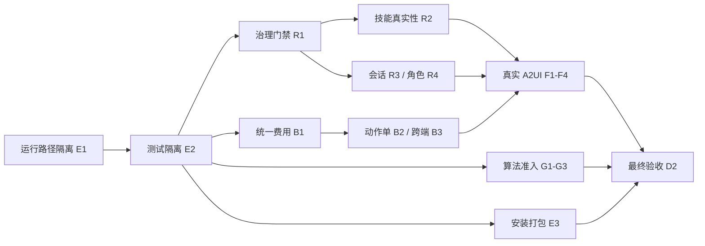

# 审查整改实施总计划

> **For agentic workers:** 使用 `executing-plans` 按任务执行；仅在获得并行执行授权后使用 `subagent-driven-development`。执行前读取对应技能。步骤以 `- [ ]` 跟踪，本文件与子计划均是待执行计划，不是完成记录。

**Goal:** 修复审查报告中影响真实性、执行控制、资金计算与交付可靠性的缺陷，为 10 项已宣称完成的 specs 建立可复现的验收证据。

**Architecture:** 保留 scripts/core、scripts/server、web 的现有分层；统一运行路径、技能执行入口、费用/动作单契约和事件驱动渲染。修复生产链路，复用现有算法、CLI、数据桥及前端 API 加载器，不新增平行量化引擎。

**Tech Stack:** Python、pytest、FastAPI、Pydantic、SQLite、原生 JavaScript、Node.js、PowerShell/Bash；浏览器验收使用仓库运行环境可用的受控浏览器。

---

制定日期：2026-09-09。审查基准：`88f1f71`。状态：待执行。源报告：[项目代码结构与规范审查](C:/Users/cvdnn/coding/a_stock_agents/output/audit-review/project-specs-review.md)。

本计划按项目 `docs/specs/` 六领域组织规则存放，覆盖审查的 18 个发现编号。先建立测试隔离，再封堵错误成功路径，随后完成业务接线，最后重新验收。所有时间为单名熟悉 Python/JS 的工程师有效工作量估算，不是日历承诺。

## 范围与设计决策

| 方案 | 优点 | 代价 | 决策 |
|---|---|---|---|
| 按风险分批整改并保留现有分层 | 每批可测试、可回滚，最快消除虚构结果和治理绕过 | 需要维护短期兼容适配 | **采用** |
| 全面重写 CLI、ReAct 与前端 | 结构自由度高 | 回归面过大，既有能力重新验证成本高 | 本轮不采用 |
| 只校正文档和完成状态 | 快速让看板准确 | 运行缺陷仍在 | 仅作为起始校准步骤，不作为整改终点 |

1. 本轮不实现 SPEC-ARCH-003 Token 安全网关，其 Backlog 状态与事实一致。新增脱敏网关应另立设计与验收计划。
2. 正式业务失败时返回结构化错误或 unavailable；MOCK 仅允许测试/显式演示模式，事件与页面都标识 synthetic，禁止静默回退成真实分析。
3. 延续 `/api/chat/completions/stream` 与现有事件名；新增 `a2ui_render` 作为增量契约。文档更新到真实受测契约，避免为了旧文字破坏已有客户端。
4. 费用与最低保本价由 Python 核心统一计算，前端显示后端结果。滑块通过无行情依赖的试算接口请求，不再维护 JS 计费算法。
5. 算法“解析用于研究”与“获准生产执行”分开；保留研究/回测能力，禁止 retired 算法通过生产入口执行。不能通过给全部内置算法补一个 production 常量绕过验收。
6. A2UI 已有 3 个明确组件。本轮按这 3 个真实组件建立自省契约，修订无组件清单依据的“6 个”文字，并记录规格变更理由；不创建空组件凑数量。若后续提出另外 3 个独立业务组件，另列需求和验收。
7. 不因工程收敛删除用户目录、持仓或数据库。解除 Git 跟踪保留工作区文件；不改写 Git 历史。旧路径读取/迁移必须显式启用。
8. 已有 [前端接入计划](C:/Users/cvdnn/coding/a_stock_agents/docs/audits/frontend-api-integration-plan.md) 的已完成加载器保留，以契约测试复验；其中“离线自动生成分析模板”由本计划的显式演示规则替代。

## 子计划与执行顺序

| 里程碑 | 任务 | 子计划 | 主要交付 | 估算 |
|---|---|---|---|---|
| M0 测试和看板可相信 | E1、E2、D1 | [工程与验证](C:/Users/cvdnn/coding/a_stock_agents/docs/specs/engineering/eng-runtime-and-test-remediation-plan.md) | 测试输出/配置/DB隔离、默认无网络、真实状态台账 | 2–3 人日 |
| M1 先阻断错误成功 | R1、R2a、F1 | [运行时](C:/Users/cvdnn/coding/a_stock_agents/docs/specs/architecture/arch-agent-runtime-remediation-plan.md)、[A2UI](C:/Users/cvdnn/coding/a_stock_agents/docs/specs/a2ui/a2ui-runtime-remediation-plan.md) | 统一治理、未实现返回错误、生产演示路径停用 | 2–3 人日 |
| M2 核心业务契约成立 | R3、R4、B1–B3 | [运行时](C:/Users/cvdnn/coding/a_stock_agents/docs/specs/architecture/arch-agent-runtime-remediation-plan.md)、[费用与风控](C:/Users/cvdnn/coding/a_stock_agents/docs/specs/business/biz-fees-and-risk-remediation-plan.md) | 多轮历史、角色接线、统一费用和完整动作单 | 4–6 人日 |
| M3 可见交付闭环 | R2b、F2–F4、E3 | [A2UI](C:/Users/cvdnn/coding/a_stock_agents/docs/specs/a2ui/a2ui-runtime-remediation-plan.md)、[工程与验证](C:/Users/cvdnn/coding/a_stock_agents/docs/specs/engineering/eng-runtime-and-test-remediation-plan.md) | 真实技能产物、SSE渲染、正确投射、安装发布包 | 4–6 人日 |
| M4 算法准入与退役生效 | G1–G3 | [算法治理](C:/Users/cvdnn/coding/a_stock_agents/docs/specs/algorithm/algo-governance-remediation-plan.md) | 持久化门禁证据、受控晋级、真实运行熔断 | 3–5 人日 |
| M5 重新验收与基线恢复 | E4、D2 | [工程与验证](C:/Users/cvdnn/coding/a_stock_agents/docs/specs/engineering/eng-runtime-and-test-remediation-plan.md) | 跨平台证据、清洁发布包、逐条规格验收记录 | 1–2 人日 |

合计预估 **16–25 人日**。外部模型样本外验证、真实行情可用性和算法 G3 所需观察时长不包含在上述代码工作量内；这些依赖未满足时，对应子任务保持待验证，不以 Mock 测试代替生产证据。

F1 的“移除生产假成功”可在 M1 先交付 unavailable 页面；F2–F4 才恢复完整动态体验。R2a 只修正错误语义，R2b 才算功能接通，两者不得混为完成。

## 文件责任边界

| 工作包 | 主要修改范围 | 新建边界 |
|---|---|---|
| E | core/config.py、server/config.py、tests/conftest.py、pyproject.toml、install.*、tools/pack.py、verify.py | tests/test_workspace_suite.py；不新建第二套配置中心 |
| R | server/agent、server/llm/factory.py、server/db.py、server/api/chat.py、core/governance | server/agent/tool_execution.py、server/agent/context.py；适配器由 server 装配，core 不反向导入 server |
| B | core/strategy/execution_action_engine.py、paper_trading/engine.py、commands、reporting | core/strategy/trading_costs.py、core/strategy/action_contract.py、server/api/trading_costs.py |
| F | web/js/app.js、api.js、ui_engine.js、components/astock.js、server/agent/events.py | web/js/a2ui_client.js、tests/test_a2ui_suite.js；不进行 UI 视觉重设计 |
| G | core/models/registry.py、quality_gates.py、monitor_governance.py、实际生产调用方 | core/models/governance_store.py；治理记录位于统一 output/cache |
| D | guidelines、specs、docs/audits | docs/specs/engineering/eng-remediation-acceptance.md；历史报告保留来源 |

同一文件只由一个任务同时修改。获准并行实施时，R 与 F 对 events/models 的变更先冻结协议，B3 与 F3 对 astock.js 交接，E1 完成后再动所有依赖输出路径的模块。

## 审查发现覆盖矩阵

| 发现 | 执行任务 | 关闭证据 |
|---|---|---|
| A1 | R1 | Chat→Registry 的禁用/确认/非法参数/超时/审计集成测试 |
| A2 | R2a、R2b | 17 项能力台账、真实产物存在、异常无成功结论 |
| A3、A4 | R3 | 第二轮工具消息配对、31+消息与超窗完整轮次 |
| A5 | R4 | 每个已实现角色使用目标 provider/model，修改后下次调用生效 |
| U1 | F1、F2、R2 | 双股票数据不同、无数据无结论、演示明确标识 |
| U2 | F3 | 全名、冲突、逆序、按需加载、自省 Schema 与实际数量 |
| U3 | F4 | 两报告切换内容独立、资源回收、浏览器布局偏移记录 |
| B1、B2 | B1、B3 | 同配置多市场计费、CLI/API/HTML/UI相同结果 |
| B3 | B2、B3 | T0/T1/T2、三场景、持仓限制端到端一致 |
| G1 | G1、G2、G3 | 无证据不能晋级，退役/熔断阻止下一次生产执行 |
| E1、E2 | E3 | 新检出安装成功/失败正确返回、ZIP存在且可运行 |
| E3 | E1、E4 | 默认路径就地、用户文件未删、跟踪/打包检查通过 |
| T1 | E2 | 默认pytest无网络和共享DB，顺序变化不影响结果 |
| D1、D2 | D1、D2 | 映射文件存在、现行契约与测试一致、历史文档可追溯 |

## 执行与验收规则

- [ ] 每项任务先增加稳定领域测试并观察失败，再做最小修改，最后运行指定测试；测试源码保留在领域套件，不永久堆积临时探针。
- [ ] 测试使用显式合成数据，不调用用户正式服务、外部行情或付费模型。联调需专用模式并独立统计。
- [ ] 每个可独立交付任务一个提交；提交前按项目要求执行默认完整离线回归与相关 Node 套件。不做自动 push、部署或用户数据迁移。
- [ ] 任一任务退出时记录：提交号、测试命令、计数、失败/跳过原因、产物路径。不能只写“100% PASS”。
- [ ] 未实施能力返回 unavailable 只关闭“虚构成功”缺陷，不能据此把相应业务 spec 标完成。
- [ ] 有旧行为兼容需要时增加适配测试，不能通过删除断言或放宽预期掩盖原缺陷。
- [ ] 已通过测试后，只有新改动或未解决问题才扩大/重复测试；避免无依据的全量重复运行。

最终恢复某项 Production Baseline 的条件是：该 spec 每个必验任务都有真实代码路径、契约断言和运行证据；无未关闭阻断项；依赖的联调/浏览器/观察期已完成。10 项分别判定，不能以一个套件通过整体盖章。

## 状态校准与后续范围

D1 在实施开始时将失实的 10 项基线声明调整为“实施中”，保留历史验收记录；本次编制计划不直接改写既有状态。D2 按新证据逐项恢复。

SPEC-ARCH-003、尚无真实执行后端的外部 ML 模型验证以及新增视觉组件，不在风险修复阶段强行扩大实现。R2b 逐项标明缺失依赖和下一步；这些能力未落地时 ARCH-001/ALGO 等关联规格仍不得全量验收。
