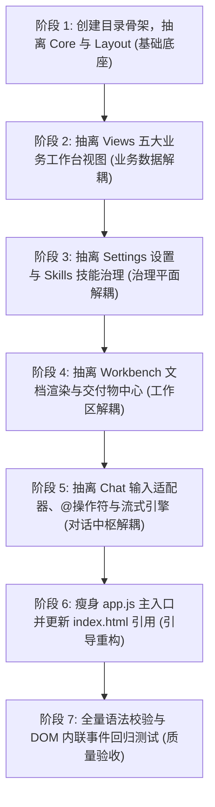

# app.js 模块化重构实施看板

> 规范编号：`SPEC-UI-002`
> 权威定义 (SSOT)：[`app-js-modularization-guide.md`](../../guidelines/ui/app-js-modularization-guide.md)
> **实施状态**：实施中

## 一、 规范核心定位摘要

- **权威定义出处**：`web/js/app.js`（9,340 行巨石单体）的模块划分字典、命名空间门面、状态流转事件总线与单向无环脚本加载拓扑，一律以 [`app-js-modularization-guide.md`](../../guidelines/ui/app-js-modularization-guide.md) 为唯一真理来源 (SSOT)，本看板不复述定义正文。
- **实施范围**：按 `core/` → `layout/` → `views/` → `settings/` → `skills/` → `workbench/` → `chat/` 依赖拓扑渐进拆分，主入口收敛为纯生命周期引导器。
- **进度载体**：本看板承载 7 个阶段的实施演进路线图与各阶段验收标准。

---

## 二、 分阶段实施演进路线图 (Phase-by-Phase Roadmap)

为确保系统在拆分过程中的持续可用性，推荐遵循以下 7 个阶段逐步演进实施：

### 阶段 1：创建目录骨架，抽离 Core 与 Layout
* **目标**：建立 `web/js/core/` 与 `web/js/layout/`。
* **动作**：
  1. 提取 `AppState` 到 `core/state.js`，注入发布订阅事件总线；
  2. 提取 `HistoricalSessions`、`SessionStore`、会话列表渲染与删除重命名到 `core/session_store.js`；
  3. 提取侧边栏导航、单双栏切换及 `showToast` 到 `layout/navigation.js`；
  4. 提取多 Tab 路由与窗口投射到 `layout/workbench_tabs.js`。
* **验收标准**：刷新页面，左侧会话历史可正常显示、删除与点击切换。

### 阶段 2：抽离 Views 五大业务工作台视图
* **目标**：建立 `web/js/views/` 目录，彻底隔离四大业务 Tab 渲染逻辑。
* **动作**：
  1. 将测算器与向上进位逻辑独立至 `views/projected_action.js`；
  2. 拆解盘面、行情全景、自选股列表、收益分析至各自独立文件；
  3. 建立 `views/common_views.js`，统一收敛 `loadAllBackendData()` 与 `renderTabCharts()`。
* **验收标准**：切换顶部四大 Tab，各面板数据加载与 Canvas 走势图重绘丝滑流畅。

### 阶段 3：抽离 Settings 设置与 Skills 技能治理
* **目标**：建立 `web/js/settings/` 与 `web/js/skills/` 目录。
* **动作**：
  1. 剥离 18 项量化技能 Manifest 静态配置字典至 `skills/skills_manifest.js`（彻底精简 350 行静态数据）；
  2. 提取技能卡片渲染与启闭逻辑至 `skills/skills_governance.js`，沙箱执行至 `skills/skills_debugger.js`；
  3. 提取服务商管理与测试至 `settings/providers_manager.js`，角色矩阵映射至 `settings/model_roles.js`。
* **验收标准**：打开模型设置与技能治理弹窗，连接测试与沙箱执行结果正常返回。

### 阶段 4：抽离 Workbench 文档渲染与交付物中心
* **目标**：建立 `web/js/workbench/` 目录。
* **动作**：
  1. 将 500 行用户指南与双模渲染器抽离至 `workbench/doc_renderer.js`；
  2. 将交付物本地持久化、独立窗口导出与下载抽离至 `workbench/deliverable_sync.js`。
* **验收标准**：投研助手主工作区 Markdown 操作手册与目录树导航渲染正常，交付物导出无异常。

### 阶段 5：抽离 Chat 输入适配器、@操作符与流式引擎
* **目标**：建立 `web/js/chat/` 目录。
* **动作**：
  1. 提取输入框兼容层与退格原子删除至 `chat/input_adapter.js`；
  2. 提取 `@操作符` 注册中心与浮窗至 `chat/at_operator.js`，`#模型` 弹窗至 `chat/model_popup.js`；
  3. 提取任务执行树抽屉与二次确认拦截至 `chat/task_timeline.js`；
  4. 提取意图解析与 SSE 打字机流式输出至 `chat/chat_engine.js`。
* **验收标准**：输入框键入 `@` 或 `#` 浮窗精准定位，发送提问后打字机流式输出与任务折叠卡片正常展开。

### 阶段 6：瘦身 app.js 主入口并更新 index.html 引用
* **目标**：将 `app.js` 从 9,340 行精简至 84 行纯生命周期引导器。
* **动作**：
  1. 在 `app.js` 中仅保留 `DOMContentLoaded` 启动顺序编排与 Resize 防抖监听；
  2. 按照第四节的单向无环加载拓扑次序更新 `web/index.html` 的 `<script>` 标签列表。
* **验收标准**：控制台无任何加载错误或时序竞态警告。

### 阶段 7：全量语法校验与 DOM 内联事件回归测试
* **目标**：全方位质量验收与风险防范。
* **动作**：
  1. 执行 `node -c web/js/**/*.js` 静态语法检查；
  2. 运行自动化扫描脚本，核验 `index.html` 中 215 处内联调用符号的 100% 绑定率；
  3. 将原版单体文件备份保存至 `web/backup/app.js.bak`。

---

## 变更日志

| 日期 | 变更摘要 |
|:---|:---|
| 2026-09-20 | 由 `docs/guidelines/ui/app-js-modularization-guide.md` §五 迁入实施阶段与验收标准内容 |