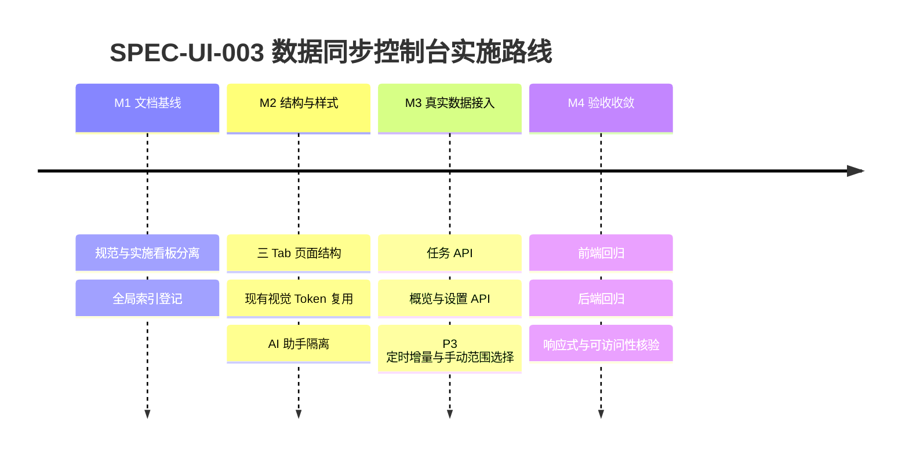

# 行情数据同步控制台实施计划与验收看板

> 规范编号：`SPEC-UI-003`
> 权威定义 (SSOT)：[`market-data-sync-control-console-specification.md`](../../guidelines/ui/market-data-sync-control-console-specification.md)
> **实施状态**：规划中 (RFC)

## 一、规范核心定位摘要

- 将【数据同步】收敛为与现有系统一致的一级菜单三页控制台。
- 运行控制、任务追溯与高级设置均使用确定性接口，不加载 AI 助手。
- P3 全市场同步采用“交易日定时增量 + 控制台手动选择”模式，并服从 P0/P1 优先级与单任务互斥约束。
- 具体视觉、交互、接口与可访问性契约以权威定义为准，本看板只追踪落地与验收。

## 二、实施任务矩阵

| 任务 | 关联代码路径 | 状态 |
|:---|:---|:---:|
| 建立三 Tab 语义结构与无 AI 全宽工作区 | `web/index.html` | ⬜ 未开始 |
| 落地运行控制页、任务记录页和高级设置页样式 | `web/css/style.css` | ⬜ 未开始 |
| 接入任务创建、列表、详情、取消与重试 | `web/js/api.js`、`web/js/app.js` | ⬜ 未开始 |
| 在运行控制页增加 P3 全市场进度、自动状态和手动范围选择 | `web/index.html`、`web/js/app.js`、`web/css/style.css` | ⬜ 未开始 |
| 删除数据同步随机测速、延迟成功和静态成功数据 | `web/js/app.js` | ⬜ 未开始 |
| 新增数据同步概览与设置接口 | `scripts/server/api/data_sync.py`、`scripts/server/app.py` | ⬜ 未开始 |
| 将设置安全持久化至 `local/settings/data_sync.json` | `scripts/server/services/data_sync_settings.py` | ⬜ 未开始 |
| 统一新任务类型为 `data_sync`，读取历史任务时兼容 `sync` | `scripts/server/tasks/task_manager.py`、`scripts/server/api/data_sync.py` | ⬜ 未开始 |
| 定时守护读取有效设置并遵守 P0/P1/P3 启停、时间与优先级 | `scripts/core/data/sync_daemon.py`、`scripts/server/app.py` | ⬜ 未开始 |
| 实现 P3 单任务互斥、批次进度和 P0/P1 优先资源仲裁 | `scripts/core/data/sync_daemon.py`、`scripts/server/api/data_sync.py` | ⬜ 未开始 |
| 将外部行情源优先级与本地 SQLite 数据层配置分离 | `scripts/server/services/data_sync_settings.py`、`web/index.html` | ⬜ 未开始 |
| 建立前端结构、交互、无 AI 与失败恢复测试 | `tests/frontend/` | ⬜ 未开始 |
| 建立设置校验、概览真实性、P3 调度与互斥测试 | `tests/server/`、`tests/core/` | ⬜ 未开始 |
| 更新 UI 权威规范、实施矩阵和项目总索引 | `docs/guidelines/`、`docs/specs/`、`docs/index.md` | 🟨 进行中 |

## 三、里程碑推进

## 四、验收与验证证据

| 断言 | 测试路径 | 当前结果 |
|:---|:---|:---:|
| 数据同步保持一级菜单并具备三个可访问 Tab | `tests/frontend/` | ⬜ 待验证 |
| 数据同步页面不显示 AI 助手且不触发模型调用 | `tests/frontend/` | ⬜ 待验证 |
| 页面不存在随机测速、模拟进度和伪造成功结果 | `tests/frontend/`、代码扫描 | ⬜ 待验证 |
| 手动同步创建真实 `data_sync` 任务并可跟踪 | `tests/frontend/`、`tests/server/` | ⬜ 待验证 |
| 活动任务可取消，失败任务可重试 | `tests/frontend/`、`tests/server/` | ⬜ 待验证 |
| 设置字段经过白名单和范围校验 | `tests/server/` | ⬜ 待验证 |
| 设置落盘路径位于 `local/` 且不进入版本控制 | `tests/server/`、`.gitignore` | ⬜ 待验证 |
| P3 仅在交易日按设定时间自动执行增量同步 | `tests/server/`、`tests/core/` | ⬜ 待验证 |
| P3 手动任务支持市场/代码范围选择，全量模式必须二次确认 | `tests/frontend/`、`tests/server/` | ⬜ 待验证 |
| P3 单任务互斥且不得抢占 P0/P1 任务 | `tests/server/`、`tests/core/` | ⬜ 待验证 |
| 新任务统一创建为 `data_sync`，历史 `sync` 记录仍可读取 | `tests/server/` | ⬜ 待验证 |
| 外部行情源与本地 SQLite 数据层在设置模型中相互独立 | `tests/frontend/`、`tests/server/` | ⬜ 待验证 |
| 窄屏无页面级横向滚动，键盘可切换 Tab | 浏览器核验、`tests/frontend/` | ⬜ 待验证 |
| 前端与后端相关回归测试通过 | `tests/frontend/`、`tests/server/` | ⬜ 待验证 |

## 五、变更日志

| 日期 | 变更摘要 |
|:---|:---|
| 2026-09-24 | 建立 `SPEC-UI-003`，将三页控制台权威定义与实施看板按项目双范式拆分归档 |
| 2026-09-24 | 归入“行情数据同步系统”功能系列，新增 P3 定时增量、手动范围选择、资源仲裁与配置分层契约 |
