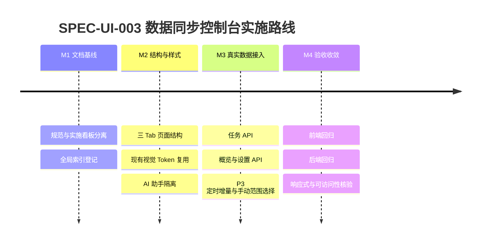

# 行情数据同步控制台实施计划与验收看板

> 规范编号：`SPEC-UI-003`
> 权威定义 (SSOT)：[`market-data-sync-control-console-specification.md`](../../guidelines/ui/market-data-sync-control-console-specification.md)
> **实施状态**：实施中（矩阵 1–10、12 已完成；剩余：外部源排序接入取数执行层、浏览器人工核验）

## 一、规范核心定位摘要

- 将【数据同步】收敛为与现有系统一致的一级菜单三页控制台。
- 运行控制、任务追溯与高级设置均使用确定性接口，不加载 AI 助手。
- P3 全市场同步采用“交易日定时增量 + 控制台手动选择”模式，并服从 P0/P1 优先级与单任务互斥约束。
- 具体视觉、交互、接口与可访问性契约以权威定义为准，本看板只追踪落地与验收。

## 二、实施任务矩阵

| 任务 | 关联代码路径 | 状态 |
|:---|:---|:---:|
| 建立三 Tab 语义结构与无 AI 全宽工作区 | `web/index.html` | ✅ 已完成 |
| 落地运行控制页、任务记录页和高级设置页样式 | `web/css/style.css` | ✅ 已完成 |
| 接入任务创建、列表、详情、取消与重试 | `web/js/api.js`、`web/js/app.js` | ✅ 已完成 |
| 在运行控制页增加 P3 全市场进度、自动状态和手动范围选择 | `web/index.html`、`web/js/app.js`、`web/css/style.css` | ✅ 已完成 |
| 删除数据同步随机测速、延迟成功和静态成功数据 | `web/js/app.js` | ✅ 已完成 |
| 新增数据同步概览与设置接口（实际落于 `GET/PUT /api/data-sync/*`） | `scripts/server/api/data_sync.py`、`scripts/server/app.py` | ✅ 已完成 |
| 将设置安全持久化至 `local/settings/data_sync.json`（白名单+范围校验、0600 原子写、回读刷新） | `scripts/server/services/data_sync_settings.py` | ✅ 已完成 |
| 统一新任务类型为 `data_sync`，读取历史任务时兼容 `sync` | `scripts/server/tasks/task_manager.py`、`scripts/server/api/tasks.py` | ✅ 已完成 |
| 定时守护每轮读取有效设置并遵守 P0/P1/P3 启停、时间与优先级 | `scripts/core/data/sync_daemon.py`、`scripts/server/app.py` | ✅ 已完成 |
| 实现 P3 单任务互斥、批次进度和 P0/P1 优先资源仲裁（SYNC_ARBITER + 创建前 409 预检；执行器共享、让路式仲裁） | `scripts/core/data/sync_daemon.py`、`scripts/server/tasks/task_manager.py` | ✅ 已完成 |
| 将外部行情源优先级与本地 SQLite 数据层配置分离（设置模型已独立并校验；排序接入取数执行层为后续项） | `scripts/server/services/data_sync_settings.py`、`web/index.html` | 🟨 部分完成 |
| 建立前端结构、交互、无 AI 与失败恢复测试 | `tests/frontend/` | ✅ 已完成（Node v24.21.0 实测 29/29 通过） |
| 建立设置校验、概览真实性、P3 调度与互斥测试（23 项） | `tests/server/test_data_sync_settings.py` | ✅ 已完成 |
| 更新 UI 权威规范、实施矩阵和项目总索引 | `docs/guidelines/`、`docs/specs/`、`docs/index.md` | 🟨 进行中 |

## 三、里程碑推进

```mermaid
timeline
    title SPEC-UI-003 数据同步控制台实施路线
    M1 文档基线 : 规范与实施看板分离 : 全局索引登记
    M2 结构与样式 : 三 Tab 页面结构 : 现有视觉 Token 复用 : AI 助手隔离
    M3 真实数据接入 : 任务 API : 概览与设置 API : P3 定时增量与手动范围选择
    M4 验收收敛 : 前端回归 : 后端回归 : 响应式与可访问性核验
```

## 四、验收与验证证据

| 断言 | 测试路径 | 当前结果 |
|:---|:---|:---:|
| 数据同步保持一级菜单并具备三个可访问 Tab | `tests/frontend/` | ✅ 已验证 |
| 数据同步页面不显示 AI 助手且不触发模型调用 | `tests/frontend/` | ✅ 已验证 |
| 页面不存在随机测速、模拟进度和伪造成功结果 | `tests/frontend/`、代码扫描 | ✅ 已验证 |
| 手动同步创建真实 `data_sync` 任务并可跟踪 | `tests/frontend/`、`tests/server/` | ✅ 已验证 |
| 活动任务可取消，失败任务可重试 | `tests/frontend/`、`tests/server/` | ✅ 已验证 |
| 设置字段经过白名单和范围校验（拒绝而非静默夹紧，未知字段/越界/HH:MM/排序完整性/P0≤P1） | `tests/server/test_data_sync_settings.py` | ✅ 已验证 |
| 设置落盘路径位于 `local/` 且文件 0600、不进入版本控制、损坏回退默认并如实标注 | `tests/server/`、`.gitignore` | ✅ 已验证 |
| P3 仅在交易日按有效设置时间（默认 16:00）自动执行增量同步；开关与时间可配置 | `tests/server/`（判定纯函数）、`server/app.py` 协程 | ✅ 自动化已验证（实盘 16:00 自然触发待观察期） |
| P3 手动任务支持市场/代码范围选择，全量模式必须二次确认；市场级范围仅增量、北交所 fail-closed | `tests/frontend/`、`tests/server/` | 🟨 后端已验证（bj/审计组合拒绝），前端断言待 Node 环境执行 |
| P3 单任务互斥且不得抢占 P0/P1 任务（SYNC_ARBITER + 创建前 409） | `tests/server/` | ✅ 已验证 |
| 新任务统一创建为 `data_sync`，历史 `sync` 记录仍可读取 | `tests/frontend/`、`tests/server/` | ✅ 已验证 |
| 外部行情源与本地 SQLite 数据层在设置模型中相互独立 | `tests/frontend/`、`tests/server/` | ✅ 已验证（`external_sources.order` / `enabled.*` 经 `core/data/sync_settings.resolve_provider_order()` 驱动 `data_bridge` 降级链，失败日志带 `chain_source`；`Ashare` 保留为不参与排序的末端兜底） |
| 窄屏无页面级横向滚动，键盘可切换 Tab | 浏览器核验、`tests/frontend/` | 🟨 自动化已验证，浏览器受认证遮罩阻断 |
| 前端与后端相关回归测试通过 | `tests/frontend/`、`tests/server/`、`tests/governance/` | ✅ 前端 29/29 通过（Node v24.21.0）；后端 `tests/core+server+governance` 337 passed / 29 failed，与 HEAD 基线 A/B（`git stash -u` 前后同环境对比）**新增失败为空**、另修复 3 项。29 项存量失败为鉴权 401 与历史遗留（`TEMP_DIR` 未定义、分钟时间戳归一化等），与本次改造无关。 ⚠️ 原记录「唯一失败为 `astock.js` 既有伪造大盘数据」归因失真：伪造载体实为 `web/js/app.js`（`MarketFallbackData` 等），已于 2026-10-07 清除 |

## 五、变更日志

| 日期 | 变更摘要 |
|:---|:---|
| 2026-09-24 | 建立 `SPEC-UI-003`，将三页控制台权威定义与实施看板按项目双范式拆分归档 |
| 2026-09-24 | 归入“行情数据同步系统”功能系列，新增 P3 定时增量、手动范围选择、资源仲裁与配置分层契约 |
| 2026-09-24 | 完成实施矩阵 1–5：三 Tab 无 AI 控制台、真实任务 API 交互、P3 手动控制与伪成功清理；新增前端回归测试 |
| 2026-10-04 | 审查发现看板滞后于代码：概览/设置接口、`data_sync` 任务统一与守护开关实为已实现（接口落于 `/api/market_data/*`），矩阵按实况回写 |
| 2026-10-04 | 落地设置白名单校验与 `local/settings/data_sync.json` 0600 原子持久化（`server/services/data_sync_settings.py`），守护启停与并发设置写穿、重启不回跳；新增 `GET/PUT /api/data-sync/settings` 与 `GET /api/data-sync/overview` |
| 2026-10-04 | 落地 P3 全市场/沪深增量枚举（新浪权威清单源，北交所无源拒绝）、交易日定时增量（默认 16:00 可配置）、SYNC_ARBITER 单任务互斥与不抢占 P0/P1、创建前 409 预检、分批进度与 degraded 如实上报；前端解除市场级范围封禁并接入有效设置回显 |
| 2026-10-04 | 清理 `/api/monitor/stream` 最后一片硬编码假数据（示例事件/恒真监控/伪造 12ms 延迟），对齐既有 `not_running` 契约；新增后端回归 23 项（`tests/server/test_data_sync_settings.py`），同步域 45/45 通过 |
| 2026-10-07 | 审查修复：CLI 守护进程 `DataSyncDaemon` 定盘时刻不再写死 15:35/15:40，改由 `resolve_daemon_schedule()` 读取持久化设置 `daemon.p0_time/p1_time`（core 层只读 JSON，不反向依赖 `server.services`），逐项回退默认并在 `--once` 输出与日志中如实披露来源；§5.1 数据集窗口同步解耦，不再被调晚的 P0 时刻推迟。`daemon.enabled` 仍仅门控服务内巡检，两个运行主体保持独立 |
| 2026-10-07 | 审查修复：清除设置弹窗 `#sec-datafeed` 伪造降级面板（静态「● 运行中 (延迟 85ms)」「备用就绪」及并不存在的 Baostock/DuckDB 两级链路），改为四槽位真实探测，延迟一律取自 `GET /api/market_data/ping`，未测速前显示「○ 未检测」，展示顺序对齐 `data_bridge` 真实降级链（腾讯→新浪→东财→本地 SQLite）；新增治理回归 `test_datafeed_fallback_panel_is_probe_driven_not_static` 防止复现 |
| 2026-10-07 | 验收证据更正：本环境实为 Node v24.21.0 可用，前端 `tests/frontend/` 全量 29/29 通过（原记录「本环境无 Node 未执行」失真）；后端同步域 99/100 通过 |
| 2026-10-07 | 死配置接线：`external_sources.order` / `external_sources.enabled.*` 由仅持久化转为真实驱动取数执行层——新增 core 层只读设置访问器 `scripts/core/data/sync_settings.py`（core 不反向依赖 `server.services`），`data_bridge.fetch_remote_kline_strictly` / `get_kline_robust` 与新增 `eastmoney_kline` 按解析出的降级链遍历，失败日志携带 `chain_source`；`base.timeout_seconds` 接入任务创建、`cooperation.tdx_target_pool` 接入通达信导入。其余 10 项仅持久化设置由 `EXECUTION_WIRING` 常量逐项归类（`wired` / `persist_only`）并经 `GET /api/data-sync/settings` 的 `execution_wiring` 键如实披露，杜绝静默死配置。回归：`test_every_setting_is_classified_as_wired_or_persist_only`、`test_settings_summary_exposes_execution_wiring` |
| 2026-10-07 | 零虚假数据修复（后端）：`/api/market/sentiment`、`/api/market/ranks`、`/api/portfolio/analysis` 三端点此前整块返回写死数值（78 分情绪、1.28 万亿成交、伪造涨跌榜、28.56% 收益）却谎称来自 `market_sentiment_engine` / `market_ranks_engine` / `quant_engine`，现统一走 `_unavailable()` fail-closed（503 `CAPABILITY_NOT_IMPLEMENTED`）；同时删除 `get_kline_robust` 的 `quote` 死参数（凭实时快照合成 K 线的入口）。回归：`test_unconnected_sentiment_and_ranks_never_fabricate_a_market_engine`、`test_market_kline_is_implemented_and_never_synthesizes`、`test_get_kline_robust_never_synthesizes_from_quote` |
| 2026-10-07 | 零虚假数据修复（前端）：`web/js/app.js` 删除 `MarketFallbackData` / `WatchlistFallbackData` / `ReturnsFallbackData` / `generateKlines` / `defaultSpark` / `defaultNews`，以及目标 DOM id 已全不存在的 `initDashboardCharts` + `loadDashboardData`（227 行死代码，仍白发 5 个后端请求）；新增 `renderReturnsUnavailable` / `renderWatchHeroUnavailable` / `markMarketIndicesUnavailable` / `markMarketKlineUnavailable` 四组诚实空态与真实 `renderMarketKline`。`web/index.html` 清除静态指数点位、自选 Hero（宁德时代/300750）、事件时间轴、收益结论与北向比率等 17 处写死值，改骨架屏或 `datasync-detail-placeholder` 占位。治理回归：`test_workbench_panes_have_no_fabricated_fallback_data`、`test_index_html_has_no_static_fabricated_market_values`、`test_unconnected_market_endpoints_fail_closed_in_source`；`tests/frontend/test_market_adaptive_layout.js` 中原「强制要求伪造数据存在」的断言语义已反转 |