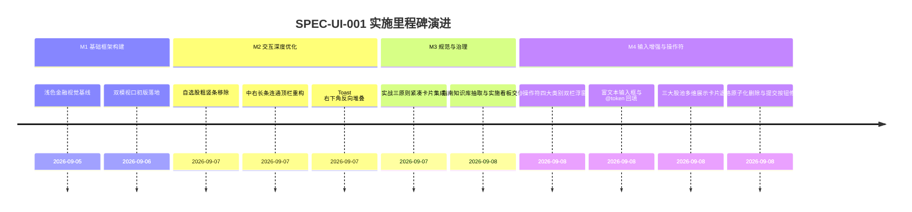

# Web UI 界面设计与交互实施看板 (Web UI Design & Interaction Execution Spec)

- **规范分类**：UI设计 (UI/UX)
- **规范编号**：SPEC-UI-001
- **文档版本**：v1.4
- **实施状态**：实施中 | 原“正式基线 100% 已交付”声明待整改验收
- **创建日期**：2026-09-06（修订日期：2026-09-08）
- **适用范围**：A-Stock Agents 独立 Web 投研前端、Desktop 客户端（Tauri/Electron）及跨端界面系统
- **权威设计指南**：[`docs/guidelines/ui-design-guide.md`](../../guidelines/ui-design-guide.md)

> 🔗 **权威规范与交互指南直达**：  
> 本文件为 **UI 设计实施落地与前端交互执行跟踪看板**。关于浅色金融风格、红涨绿跌色值系统、双模动态视口布局、AIChatUI 组件设计规范等完整细节，请查阅权威指南：  
> 👉 [**《Web UI 界面设计与交互指南》(ui-design-guide.md)**](../../guidelines/ui-design-guide.md)

---

## 一、 规范简要名称与核心要点

- **规范名称**：Web UI 界面设计与交互规范
- **核心定位**：专为 A 股量化投资者与专业投研打造的现代浅色金融风格工作台与多模交互标准。
- **关键设计要点**：
  1. [浅色金融与红涨绿跌色系](../../guidelines/ui-design-guide.md#2-涨跌色彩铁律-a-stock-red-upgreen-down-standard)：严格遵循 A 股红涨绿跌标准（`#F5222D` / `#52C41A`），亚光冷白背景（`#F8FAFD`）；
  2. [边框轻量化与零竖条原则](../../guidelines/ui-design-guide.md#4-边框轻量化与卡片视觉一致性-subtle-border--zero-stripe-principle)：全面剔除生硬彩色粗竖条，统一 1px 浅色金融微边框；
  3. [意图驱动的双模动态视口](../../guidelines/ui-design-guide.md#二-工作区整体架构双模动态视口规范-adaptive-dual-mode-layout)：投研助手模式（40% 对话 + 60% 工作台，长条连通顶栏）与业务工作区模式（主屏看板 + 390px 伴随式 Copilot）；
  4. [Toast 右下角反向向上堆叠](../../guidelines/ui-design-guide.md#2-toast-全局消息浮层规范)：提示浮层移至右下角，避免遮挡顶部操作核心区；
  5. [@操作符浮窗与富文本输入框](../../guidelines/ui-design-guide.md#五-操作符浮窗交互规范-at-operator-popup-interaction-specification)：四大操作符类别（股票/引用/技能/算法）双栏浮窗、contenteditable 富文本输入框、@token 高亮回填与原子化退格删除。

---

## 二、 任务实施与执行进度矩阵 (Task Implementation Matrix)

| 界面交互模块 | 代码映射路径 | 实施状态 | 验收说明与测试基准 | 交付日期 |
|:---|:---|:---:|:---|:---:|
| **浅色金融调色盘与全局 CSS** | `web/css/style.css` | ✅ 100% | 验证 CSS 变量 `--primary`, `--color-up`, `--color-down`, Tabular-nums 对齐 | 2026-09-06 |
| **自选股与卡片竖条清理** | `web/css/style.css`, `web/js/app.js` | ✅ 100% | 彻底移除自选列表项与引用卡片左侧 3px 竖条，改为浅蓝底色高亮与 1px 微边框 | 2026-09-07 |
| **连通长顶部栏与标题重构** | `web/index.html`, `web/css/style.css` | ✅ 100% | 投研助手模式下横贯中右长条顶栏，消除垂直中切分割线与独立工作台标题 | 2026-09-07 |
| **双模视口自适应切换** | `web/js/app.js` | ✅ 100% | 投研助手（40/60 弹性折叠全宽）与市场行情业务模式（大屏+390px AI助手）平滑切换 | 2026-09-07 |
| **工作台默认六大功能板块** | `web/index.html`, `web/js/app.js` | ✅ 100% | 盘面、快捷操作、自选异动、策略回测、模拟资产、实战风控核算 6 板块装载就绪 | 2026-09-07 |
| **实战三原则紧凑卡片重塑** | `web/js/components/astock.js` | ✅ 100% | 快捷操作矩阵重构为三原则紧凑卡片，去除冗余文案，精简数值展示 | 2026-09-07 |
| **Toast 右下角反向堆叠** | `web/css/style.css`, `web/js/app.js` | ✅ 100% | 调整通知出现于右下角 `bottom: 24px; right: 24px;`，多条自动向上堆叠 | 2026-09-07 |
| **@操作符浮窗交互系统** | `web/index.html`, `web/js/app.js`, `web/css/style.css` | ✅ 100% | 四大类别双栏浮窗、左侧菜单栏+右侧内容区、键盘导航(↑↓←→Enter/Esc)、鼠标点选、股票搜索过滤、@token 回填 | 2026-09-08 |
| **富文本输入框改造与提交按钮修复** | `web/index.html`, `web/js/app.js`, `web/css/style.css` | ✅ 100% | textarea → contenteditable div，@token 高亮加粗内嵌、退格原子化删除、提交按钮 brightness hover 消除闪动 | 2026-09-08 |
| **三大股池多维展示卡片** | `web/js/app.js`, `web/css/style.css` | ✅ 100% | 三行式股票卡片(标题+价格+描述)、股池胶囊徽章(持仓/自选/关注)、红涨绿跌涨幅标签、AtOperatorRegistry 数据注册 | 2026-09-08 |

---

## 三、 里程碑推进情况 (Milestone Progress)

---

## 四、 质量验收与验证证据 (Verification Evidence)

1. **界面视口锁定与响应式验证**：
   - 验证 `calc(100vh - 50px)` 视口锁定机制，Body 标签 `overflow: hidden`，内部子视口独立平滑滚动；
   - 验证右侧工作台折叠后，中间 AIChat 对话区弹性扩展至 100% 宽度，点击 `[📊 工作台 ◀]` 平滑还原 40%/60% 布局并触发图表重绘。
2. **多端浏览器渲染一致性验证**：
   - 在 Chrome / Edge / Firefox 及本地文件协议 `file:///` 下测试，所有样式无破损白屏。
3. **@操作符浮窗交互验证**：
   - 验证输入框键入 `@` 或点击 `[@] 操作符` 按钮均能正确弹出浮窗，定位对齐输入框上方；
   - 验证四大类别（股票/引用/技能/算法）切换正常，键盘导航（↑↓←→ Enter Esc Backspace）全链路响应正确；
   - 验证 Enter 确认选中后 @token 正确回填至输入框光标处，标签不可部分编辑；
   - 验证 Backspace 退格时 @token 原子化整体删除（含前置空格），光标归位正确。
4. **股池卡片与搜索验证**：
   - 验证三大股池（持仓/自选/关注）标的以优先级顺序排列，股池胶囊徽章配色正确；
   - 验证搜索框按名称/代码/拼音缩写实时过滤正常，清空搜索框恢复全部标的展示。

---

## 五、 执行变更日志 (Execution Changelog)

- **2026-09-08 (v1.4)**：新增 @操作符四大类别双栏浮窗交互系统；输入框从 textarea 重构为 contenteditable 富文本，支持 @token 高亮加粗标签内嵌与原子化退格删除；三大股池多维展示卡片（三行式排版、股池胶囊徽章、红涨绿跌涨幅标签）；修复提交按钮 hover 闪动问题（改用 `filter: brightness`）。
- **2026-09-08 (v1.3)**：按规范治理要求重构，将 UI 界面与交互设计定义抽离至 `docs/guidelines/ui-design-guide.md`，本文件重塑为实施与任务执行跟踪看板。
- **2026-09-07 (v1.2)**：完成自选股卡片无竖条优化、长条连通顶栏重构、三原则紧凑卡片与 Toast 右下角优化。
- **2026-09-06 (v1.0)**：初始创建，确立双模视口与浅色金融风格。
