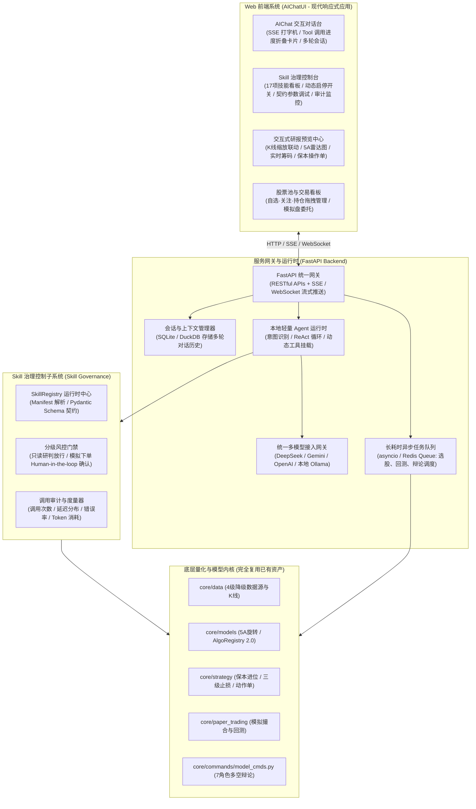
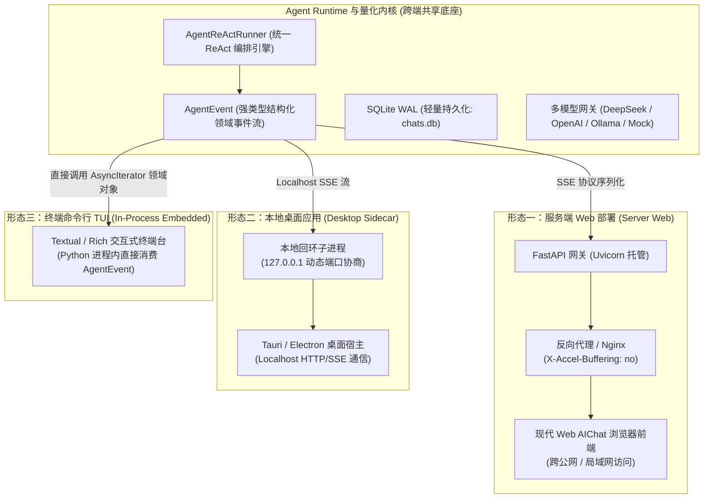
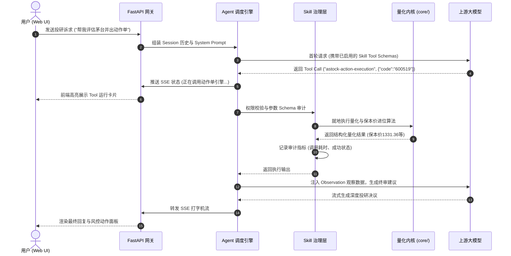

# 独立 Web AIChatUI 与 Skill 治理系统 —— 架构设计与实施路线图

- **文档版本**：v1.1
- **创建日期**：2026-09-05（更新于 2026-09-06）
- **当前状态**：技术方案锁定 / 第一阶段落地完成 / 第二阶段治理子系统落地完成 / 双模兼容架构确立
- **适用场景**：脱离第三方 AI 终端宿主（Antigravity / Hermes / Codex 等），自建独立 Web 界面系统并原生兼容本地客户端（Desktop / TUI）的 A股全流程量化投研交互中枢

---

## 0. 架构设计目的与核心诉求

### 0.1 现状与背景
在当前架构中，A-Stock Agents 作为一个高内聚的 **Skill 集合与量化引擎底座**，主要依赖外部第三方宿主工具（如 Google Antigravity、Hermes Agent、OpenAI Codex 等）提供 LLM 对话上下文、ReAct 思考循环以及终端展示交互，项目自身主要提供“执行双手（CLI Tools & SDK）”。

### 0.2 核心目标
下一阶段的目标是**脱离第三方终端工具**，为项目构建完全自闭环、开箱即用的**独立 Web AIChatUI 界面系统**，实现：
1. **自带智能体大脑 (Native Agent Runtime)**：内置轻量 Agent 编排引擎与统一多模型网关，无需第三方工具即可进行多轮量化投研对话；
2. **Skill 治理体系 (Skill Governance)**：对 17 大量化技能提供运行时元数据管理、动态启停、输入输出 Schema 校验、调用审计度量与分级权限风控；
3. **沉浸式交互与研报预览 (Interactive Visualization)**：支持打字机流式输出（SSE）、Tool 调用折叠卡片、交互式 K 线图表渲染（Lightweight-Charts / ECharts）与买卖反应动作单直观呈现。

---

## 1. 总体架构全景 (System Architecture)

系统采用前后端解耦的现代反应式架构，分为**前端展现层**、**服务网关与 Agent 运行时**、**Skill 治理层**与**量化投研内核基座**四层：



---

## 1.2 多端部署拓扑与双模兼容架构 (Dual-Mode Deployment Architecture)

系统不仅支持中心化云端 Web 服务部署，还原生兼容本地独立客户端（Desktop 桌面端与终端 TUI），支持以下三种部署与接入形态：



### 1.2.1 三大部署接入形态规范

| 部署形态 | 典型适用场景 | 进程模型 | 通信介质与协议 | 存储与数据库位置 | 外部环境依赖 |
| :--- | :--- | :--- | :--- | :--- | :--- |
| **① 服务端 Web** | 团队投研云平台、私有化服务器、远程访问 | 独立后台常驻进程 (`uvicorn server.app:app`) | HTTP REST + SSE 流 (`text/event-stream`) | 服务器端 `output/cache/chats.db` | 仅需 Python 3.10+，Nginx可选 |
| **② 本地 Desktop** | 个人电脑独立桌面客户端 (Tauri/Electron) | 桌面应用主进程 + 后台 Local Sidecar 子进程 | 本地回环 Localhost / HTTP IPC | 用户本地 `output/cache/chats.db` | 零外部依赖，开箱即用 |
| **③ 本地 TUI** | 极客终端、低功耗 VPS、无桌面快捷盯盘 | 单进程纯内嵌 (`In-Process` 导入直接运行) | Python 内存对象流 (`AsyncIterator[AgentEvent]`) | 工作区就地 `output/cache/chats.db` | 零端口占用，零网络开销 |

### 1.2.2 核心事件层与传输层解耦规范
为保障 Agent 编排核心在 Web 与本地客户端（Desktop/TUI）的双模通用性，系统实施严格的**事件模型与传输协议分层隔离**：
1. **领域事件内核 (`AgentEvent`)**：`AgentReActRunner` 统一产出强类型领域事件模型，包含：
   - `ThoughtEvent`：大模型内部思考与链式推理（COT）；
   - `ToolCallStartEvent` / `ToolCallCompleteEvent`：工具调用生命周期状态与摘要；
   - `RiskCardEvent`：严格符合实战三原则的风控动作单与保本价结构化数据；
   - `ContentDeltaEvent`：打字机内容文本增量；
   - `DoneEvent` / `ErrorEvent`：完成度量与异常事件。
2. **多协议适配器 (Protocol Adapters)**：
   - **Web / Desktop 适配器**：位于 `server.api.chat`，负责将 `AgentEvent` 序列化为标准的 SSE `event: <type>\ndata: <json>\n\n` 文本流；
   - **TUI 适配器**：位于终端客户端模块，直接在异步循环中获取 `AgentEvent` 实例，驱动 Rich Console 或 Textual 控件实时折叠/高亮渲染，无需经过二次 JSON 反序列化。

### 1.2.3 关键演进约束与兼容指标
1. **端口动态发现与协商 (Port Hunting)**：本地 Sidecar 模式下，启动命令支持 `--port 0` 自动绑定系统空闲端口，并将分配的端口写入本地运行时锁定文件（`.server.port`），杜绝 8000 端口冲突导致桌面应用初始化失败。
2. **零外部强依赖 (Zero Global Pollution)**：全链路默认采用标准库 `sqlite3` (WAL 模式)，禁止引入强制依赖 Redis/PostgreSQL 等外部服务中间件的硬编码逻辑，确保全平台单一命令即可就地运行。
3. **多租户隔离扩展性储备**：`sessions` 与 `messages` 持久化表结构预留 `user_id` 逻辑字段（单机默认 `default_user`），确保未来升级至公网多用户 SaaS 模式时，可通过统一中间件注入 JWT 鉴权无缝平滑迁移。

---

## 2. 服务与网关层设计 (Server & API Gateway)

### 2.1 技术选型
* **API 框架**：FastAPI（高性能异步异步框架，原生支持 OpenAPI 规范与 Pydantic 契约）。
* **流式通信**：Server-Sent Events (SSE)，用于大模型打字机流式吐字及 Tool Call 进度事件推送。
* **任务调度**：轻量模式采用 Python 原生 `asyncio.create_task` + 内存状态机；生产可无缝切换至 Celery / Redis。
* **会话持久化**：SQLite（WAL 模式）存储 `sessions` 与 `messages`，数据统一落盘在 `output/cache/chats.db`，确保用户数据隔离原则。

### 2.2 核心通信协议契约 (SSE Event Stream)
在 AIChat 对话过程中，网关向前端推送结构化事件流：
```
event: conversation_start
data: {"session_id": "sess_20260905_001", "model": "deepseek-v3"}

event: thought
data: {"content": "正在理解用户意图：查询贵州茅台的行情与技术形态..."}

event: tool_call_start
data: {"skill_id": "astock-data-feed", "action": "quote", "args": {"code": "600519"}}

event: tool_call_complete
data: {"skill_id": "astock-data-feed", "status": "success", "summary": "现价 1330.00 (+2.40%)"}

event: content_delta
data: {"text": "【贵州茅台 (600519) 诊断】当前现价为 1330.00 元..."}

event: risk_card
data: {"breakeven_price": 1331.36, "stop_t0": 1290.1, "stop_t1": 1263.5, "stop_t2": 1223.6}

event: done
data: {"total_tokens": 1280, "elapsed_ms": 1420}
```

---

## 3. 本地轻量 Agent 运行时与 LLM 适配

脱离第三方工具后，项目需要自主持有智能体调度循环：



---

## 4. Skill 治理系统详细设计 (Skill Governance Subsystem)

### 4.1 核心数据结构 (`SkillDefinition`)
每个技能不仅是一个目录，而且在治理层拥有显式的 Python 契约定义：

```python
from pydantic import BaseModel, Field
from typing import List, Dict, Any, Optional
from enum import Enum

class SkillRiskLevel(str, Enum):
    READONLY = "readonly"       # 只读研判 (行情/选股/评分)
    SIMULATION = "simulation"   # 模拟交易 (模拟盘下单/调仓)
    DESTRUCTIVE = "destructive" # 高危变更 (清空数据/策略参数重置)

class SkillMeta(BaseModel):
    id: str = Field(..., description="技能唯一标识")
    name: str
    title: str
    category: str
    description: str
    risk_level: SkillRiskLevel = SkillRiskLevel.READONLY
    enabled: bool = True
    triggers: List[str] = []
    parameters_schema: Dict[str, Any] = {}
    timeout_seconds: int = 30
    require_confirmation: bool = False  # 是否需要用户在UI点击二次确认
```

### 4.2 治理四大核心能力
1. **动态热插拔与开关控制**：
   - 允许用户在 Web 页面上一键关闭某些技能（例如临时禁用长耗时辩论或模拟下单），动态调整注入给当前会话的 Tool 列表。
2. **运行时调用审计与指标监控**：
   - 自动统计并展示：各 Skill 调用总频次、今日调用量、P95 延迟、失败异常率及 Token 消耗曲线。
3. **分级安全门禁 (Human-in-the-Loop)**：
   - 当大模型尝试调用 `risk_level == "simulation"` 或需要二次确认的技能时，网关暂停流式推理，在 Web UI 弹出确认对话框（如“确认以 1330.00 元模拟买入 100 股茅台？”），用户点击允许后继续。
4. **参数 Schema 强校验**：
   - 杜绝因大模型幻觉传入非法股票代码或畸形参数，进入内核前先通过 Pydantic 自动拦截。

---

## 5. Web 界面系统与交互设计规范 (UI/UX Specification)

> 详见完整独立设计规范文档：[ui-design-specification.md](file:///Users/handy/workon/a_stock_agents/docs/specs/ui-design-specification.md)

### 5.1 三栏式 40% / 60% 弹性工作区规范
- **栅格比例**：全局采用 `grid-template-columns: 240px 4fr 6fr;`（左侧菜单栏固定 `240px`，中间投研助手占 **40%**，右侧详细内容展示区占 **60%**）；
- **视口管理**：高度严格锁定在 `calc(100vh - 50px); overflow: hidden;`，彻底收敛全局外层滚动，保障专业金融看盘与交易稳定性；
- **一键收起/展开投研助手**：中间投研助手标题右侧提供 `[◀ 收起]` 按钮，点击平滑折叠为 42px 侧边条，右侧内容区自然扩充至 **100% 全宽**，并自动重绘 Canvas 金融图表自适应分辨率。

### 5.2 菜单栏三段式纵向架构
1. **功能区 (Top)**：投研助手（综合盘面）、市场行情（四大指数/情绪表/日K线/北向资金）、自选个股（K线量能/主力控盘/资金流向）、收益分析（资产净值走势图/月度胜负柱状图/夏普与胜率/持仓归因）；
2. **会话记录区 (Middle)**：倒序排列最近历史投研会话，初始加载 10 条，监听列表触底（`scrollTop + clientHeight >= scrollHeight - 15`）自动无限滚动加载更早会话；附带 `[＋ 新建]` 对话按钮；
3. **系统设置区 (Bottom)**：底部固定认证实盘账户概览与 `⚙️ 系统设置` 入口，唤出大模型网关、4级数据源降级、实战三原则税费止损参数与 Skill 治理弹窗。

### 5.3 独立双向垂直滑动
- 中间列 `#chatMessages` 与右侧列 `#rightContentScroll` 均设立独立的 `overflow-y: auto; flex: 1; min-height: 0;`，聊天记录翻动与右侧研报图表滚动互不干扰。

### 5.4 双向深度交互与从左向右弹出动效
1. **针对右侧信息提问与修改**：右侧常驻 `[💬 针对此内容提问 AIChat]` 与标的行级 `💬 提问`，一键注入上下文 Prompt 自动聚焦；右侧支持 `[✏️ 修改右侧参数]`，AI 回复附带 `[⚡ 应用修改到右侧]` 响应式回写参数；
2. **卡片放大投射与多标签保留**：点击 AIChat 内实战动作单、研报或 5A 选股卡片上的 `[⛶ 放大投射到右侧工作台]` 时，右侧标签栏动态追加新标签（如 `[🛡️ 实战动作单·宁德时代 ✕]`），**完整保留已有全部标签与滚动状态**；
3. **硬件加速从左向右弹出动效**：投射时右侧视口自动触发 `@keyframes popupSlideFromLeft`（配合 `cubic-bezier(0.16, 1, 0.3, 1)`），呈现内容从智能体大脑向右侧工作台流畅跃迁的沉浸体验；动作单内置动态滑块试算器，强制以 `math.ceil` 向上进位至分精算最低保本卖出价。

### 5.5 数据呈现双轨制
* **在线交互模式**：
  - 后端直接提供 `/api/reports/{id}/data` 吐出结构化 JSON；
  - 前端使用原生高分辨率 Retina Canvas 引擎（`FinancialCharts`）与轻量图表渲染交互式 K 线（支持分时、日K缩放）、资产净值走势图（对比沪深300）及月度盈亏柱状图。
* **离线归档模式**：
  - 保留单文件自包含 HTML 导出能力，支持一键下载或在本地浏览器独立离线查看。

---

## 6. 实施路线图与阶段里程碑 (Roadmap)

本项目采用循序渐进的交付策略，分为三个明确阶段：

### 📌 第一阶段：服务底座与 Agent 编排核心 (Backend & Runtime Foundation)
- [x] 在项目根目录下建立 `scripts/server/` 独立工程模块；
- [x] 集成 FastAPI 基础服务架构，提供健康检查与配置读取；
- [x] 实现轻量级 LLM Provider 统一适配层（支持 OpenAI 规范接口、DeepSeek、Gemini、Claude、本地 Ollama 与离线 Mock）；
- [x] 实现支持 SSE 流式打字机与 Tool Calling 调度的 Agent ReAct 运行时；
- [x] 实现基于 SQLite (WAL 模式) 的本地会话历史与多轮对话状态存储；
- [x] 验证通过 Web 模式与本地客户端（Desktop/TUI）双模架构兼容性基线测试。

### 📌 第二阶段：Skill 治理控制子系统 (Skill Governance Implementation)
- [x] 基于 `config/skills_manifest.json` 建立 `core/governance/skill_registry.py`；
- [x] 将 17 项技能抽象为统一注册实例，生成标准的 JSON Schema / Function Calling 规范；
- [x] 重构事件流抽象：确立通用的 `AgentEvent` 领域模型，将 SSE 传输层与内核事件彻底解耦；
- [x] 实现 REST API：技能列表检索、启用/停用切换、参数测试与调用审计日志；
- [x] 集成安全门禁：实现长耗时任务异步 Worker（选股与回测队列）与超时熔断控制；
- [x] 本地客户端适配：实现 `--port 0` 动态端口探测与本地锁定文件机制。

### 📌 第三阶段：现代 Web 前端与跨端客户端构建 (Frontend UI & Multi-Client)
- [x] 初始化现代 Web 前端（原生 HTML5 + Vanilla CSS3 浅色金融主题 + Canvas 极速金融图表引擎）；
- [x] 构建 **AIChat 投研对话台**：支持流式打字机、一体化内嵌卡片头（头像+标题+摘要）、Tool Call 状态、快捷意图气泡与实战三原则动作单；
- [x] 构建 **交互式研报与股票池看板**：整体盘面走势、四大指数卡片、市场情绪仪表盘、个股多周期 K 线均线系统、资金流向与主力控盘追踪；
- [ ] 构建 **Skill 治理仪表盘**：17 项技能可视化卡片、开关状态切换、调用监控与参数调试器；
- [ ] **跨端打包与 CLI 交互支持**：
  - 支持将 Web 前端打包为本地 Desktop 桌面客户端（Tauri / Electron）；
  - 在主 CLI 中新增 `astock chat` 交互子命令，提供开箱即用的轻量终端 TUI 对话体验。

---

## 7. 附录：核心 REST API 契约草案

| 模块 | 请求方法 | 路由路径 | 说明 |
| :--- | :--- | :--- | :--- |
| **会话** | `POST` | `/api/chat/sessions` | 创建新对话会话 |
| **会话** | `GET` | `/api/chat/sessions` | 获取会话历史列表 |
| **对话** | `POST` | `/api/chat/completions/stream` | 发送问题并建立 SSE 流式对话 |
| **治理** | `GET` | `/api/skills` | 获取 17 项技能清单与状态 |
| **治理** | `PATCH` | `/api/skills/{skill_id}` | 动态启用/停用技能或修改配置 |
| **治理** | `GET` | `/api/skills/audit/stats` | 获取技能调用频次、耗时与审计度量 |
| **研报** | `GET` | `/api/reports` | 获取历史已生成的研报列表 |
| **研报** | `GET` | `/api/reports/{id}/data` | 获取研报结构化图表渲染数据 |
| **研报** | `GET` | `/api/reports/{id}/html` | 导出/预览单文件自包含 HTML |
| **任务** | `GET` | `/api/tasks/{task_id}` | 查询长耗时回测/选股异步任务进度 |
